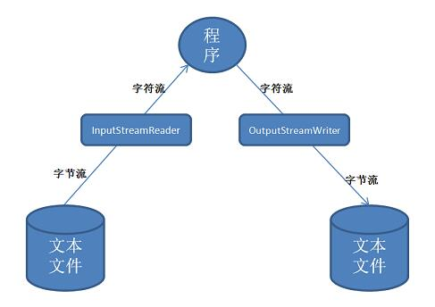

# 文件流

- 输入:`FileInputStream/FileReader`
- 输出：`FileOutputStream/FileWriter`

InputStream和Reader都是抽象类，本身不能创建实例，但它们分别有一个用于读取文件的输入流：FileInputStream和FileReader.它们都是节点流(会直接和指定文件关联

<!--more-->

## 使用FileInputStream和FileOutputStream读取/写入文件

```java
 private static void streamTest() {

        InputStream fis = null;
        OutputStream fos = null;
        try {
            fis = new FileInputStream("D:/javaTest/test1.txt");
            //该方法如果文件不存在会自动创建文件
            fos = new FileOutputStream("D:/javaTest/test2.txt");
            byte[] bytes = new byte[1024];
            int len = 0;
            while ((len = fis.read(bytes)) != -1){
                System.out.println(new String(bytes,0,len));
                fos.write(bytes,0,len);
            }
        }catch (IOException e) {
            e.printStackTrace();
        }finally {
            try {
                fis.close();
            } catch (IOException e) {
                e.printStackTrace();
            }
            //关闭前回flush
            try {
                fos.close();
            } catch (IOException e) {
                e.printStackTrace();
            }
        }
    }
```

## FileReader 和FilerWriter 读取数据输出到文件

```java
   /**
     * 字符集操作
     */
    private static void readAndWrite() {
        Reader reader = null;
        Writer wt = null;
        try {
            reader = new FileReader("D:/javaTest/test1.txt");
            wt = new FileWriter("D:/javaTest/test2.txt");
            char[] ch = new char[1024];
            int len = 0;
            while ((len = reader.read(ch)) != -1){
                System.out.println( new String(ch,0,len));
                wt.write(ch,0,len);
            }

        } catch (FileNotFoundException e) {
            e.printStackTrace();
        } catch (IOException e) {
            e.printStackTrace();
        }finally {
            try {
                reader.close();
                wt.close();
            } catch (IOException e) {
                e.printStackTrace();
            }
        }
    }
```


# 缓冲流

- 输入：`BufferedInputStream/BufferedReader`
- 输出：`BufferedOutputStream/BufferedWriter`

缓冲流是处理流的一种, 它依赖于原始的输入输出流, 它令输入输出流具有1个缓冲区, 显著减少与外部设备的IO次数, 而且提供一些额外的方法.

实际上很多常用的程序都有用到缓冲流的技术, 例如迅雷下载, 有缓冲区设置, 下载一定量的数据到内存, 然后一次过写入到硬盘, 就大大减少了写硬盘的次数.

还有在线视频的缓冲, 都是差不多的机制.

字节缓存流的用法（字符缓存流的用法和字节缓存流一致就不介绍了):

```java
 public static void main(String[] args) {
        FileInputStream fis = null;
        FileOutputStream fos = null;
        BufferedInputStream bis = null;
        BufferedOutputStream bos = null;
        try {
            fis = new FileInputStream("D:/javaTest/test1.txt");
            bis = new BufferedInputStream(fis);
            fos = new FileOutputStream("D:/javaTest/buffTest3.txt");
            bos = new BufferedOutputStream(fos);
            byte[] bytes = new byte[1024];
            int len = 0;
            while ((len= bis.read(bytes)) !=-1) {
                System.out.println(new String(bytes,0,len));
                bos.write(bytes,0,len);
            }
        } catch (IOException e) {
            e.printStackTrace();
        }finally {
            try {
                //如果有缓冲流，我们只需要关闭缓冲流即可。
                //fis.close();
                bis.close();
                //fos.close();
                bos.close();
            } catch (IOException e) {
                e.printStackTrace();
            }
        }
    }
}
```

上面代码中我们使用了缓存流和文件流，但是我们只关闭了缓存流。这个需要注意一下，当我们使用处理流套接到节点流上的使用的时候，只需要关闭最上层的处理就可以了。java会自动帮我们关闭下层的节点流。

# 转换流

- InputStreamReader :字节数组转换成字符串。
- OutputStreamWriter:字符串转换成字节数组

## 转换流的特点：

- 其是字符流和字节流之间的桥梁
- 可对读取到的字节数据经过指定编码转换成字符
- 可对读取到的字符数据经过指定编码转换成字节




- **解码：** 字节数组转字符串

- **编码：**字符串转换成字节数组

- 字符流和字节流的区别是什么？

  - 字符流=字节流+编码集，
  - 在实际读取的时候其实字符流还是按照字节来读取，但是会根据编码集进行查找编码集字典解析相应的字节，使得一次读取出一个字符。
  - **InputStreamReader** 继承自**Reader** ，它本质上是一个字符流，所以可以作为转换流的参数来提高传输效率。

  ```java
  java.lang.Object
    java.io.Reader
        java.io.InputStreamReader
  ```

  ## 实例

  - 下面以获取键盘输入为例来介绍转换流的用法。
  - java使用System.in代表输入。即键盘输入，但这个标准输入流是InputStream类的实例，使用不太方便，而且键盘输入内容都是文本内容，所以可以使用InputStreamReader将其包装成BufferedReader,利用BufferedReader的readLine()方法可以一次读取一行内容，如下代码所示:

  ```java
      public static void main(String[] args) throws IOException {
          InputStreamReader reader = null;
          BufferedReader bis = null;
          //System.in 标准输入流是InputStream类的实例,所以需要将其转换为 字节流
          reader = new InputStreamReader(System.in);
          bis = new BufferedReader(reader);

          //输出流
          BufferedWriter buffWriter = null;
          OutputStreamWriter writer = new OutputStreamWriter(System.out);
          buffWriter = new BufferedWriter(writer);

          String str;
          try {
              while ((str = bis.readLine()) != null){
                  if(StringUtils.equals(str,"exit")){
                      System.exit(1);
                  }
                  System.out.println("输出内容为：" + str);
                  buffWriter.write(str);
                  buffWriter.flush();
              }
          }catch (IOException e){
              e.printStackTrace();
          }finally {

          }
  ```

  上面程序将System.in包装成BufferedReader,BufferedReader流具有缓存功能，它可以一次读取一行文本——以换行符为标志，如果它没有读到换行符，则程序堵塞。等到读到换行符为止。运行上面程序可以发现这个特征，当我们在控制台执行输入时，只有按下回车键，程序才会打印出刚刚输入的内容。

# 对象流

##  ObjectInputStream/ObjectOutputStream

- 为了让对象持久化（将对象序列化到本地）。可以使用java的对象流处理对象，把对象的内容写到本地存储的文件中，也可以从本地文件中读取出来。也就是常说的**序列化**和**反序列化**。
- 使用对象流处理对象进行持久化的顺序是，先创建目标路径，然后创建流通道，之后调用对象流。

```java
 /**
     * 序列化:把对象的内容写到本地存储的文件中
     */
    public static void serialization(){
        FileOutputStream fos = null;
        BufferedOutputStream bfs = null;
        ObjectOutputStream oos = null;
        try {
            fos = new FileOutputStream("D:/javaTest/objectTest.txt");
            bfs = new BufferedOutputStream(fos);
            oos = new ObjectOutputStream(bfs);
            oos.writeObject(new Person("张三",23));
        } catch (IOException e) {
            e.printStackTrace();
        }finally {
            try {
                oos.close();
            } catch (IOException e) {
                e.printStackTrace();
            }
        }

    }
/**
     * 反序列化:从本地文件中读取对象
     */
    public static void deSerialization(){
        FileInputStream fis = null;
        BufferedInputStream bfs = null;
        ObjectInputStream ois = null;
        try {
            fis = new FileInputStream("D:/javaTest/objectTest.txt");
            bfs = new BufferedInputStream(fis);
            ois = new ObjectInputStream(bfs);
            Object object = ois.readObject();
            if(object instanceof Person){
                System.out.println(JSON.toJSONString(object));
            }
        } catch (IOException | ClassNotFoundException e) {
            e.printStackTrace();
        }finally{
            try {
                ois.close();
            } catch (IOException e) {
                e.printStackTrace();
            }
        }
    }
```

说明：

本地的文件中的数据（出现乱码），它不是简单的把对象属性值写入IO流中，而是按照一定的数据格式写入的。而这种格式，不是记事本、写字板、Word等文本编辑器能够识别的，因为，这些数据，压根就不是文本数据。只有使用相同版本的Java的ObjectInputStream来进行读取操作

注意：在使用流的时候，注意要清空缓冲区，还有就是最后要关闭流，如果你不想将某些信息存入到磁盘 就可以同过transient关键字修饰成员变量，想要序列化必须要实现Serializable接口，这个接口中没有任何方法，只是标记告诉虚拟机这个类要序列化。
