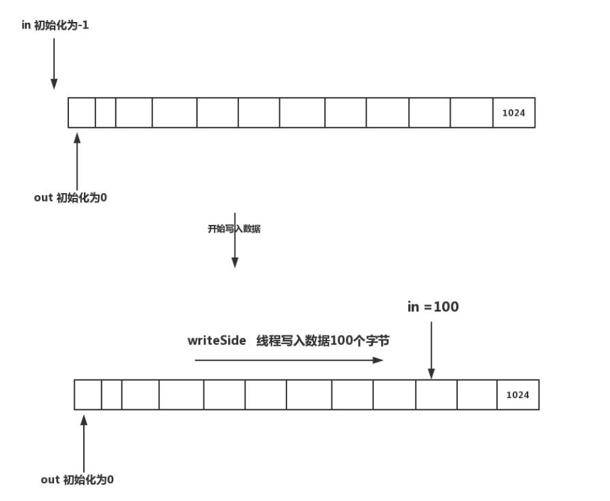
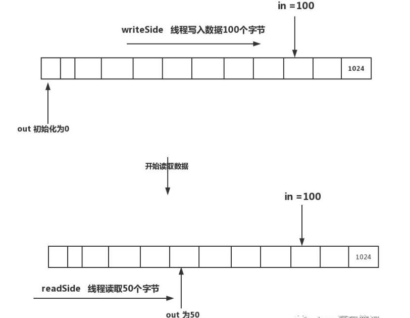
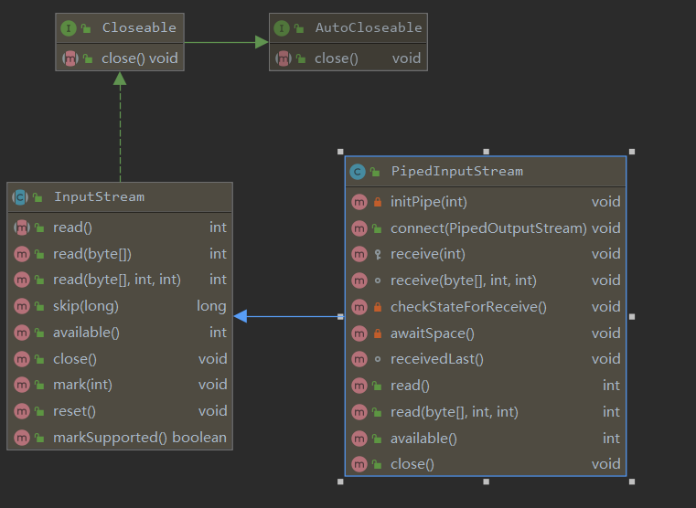
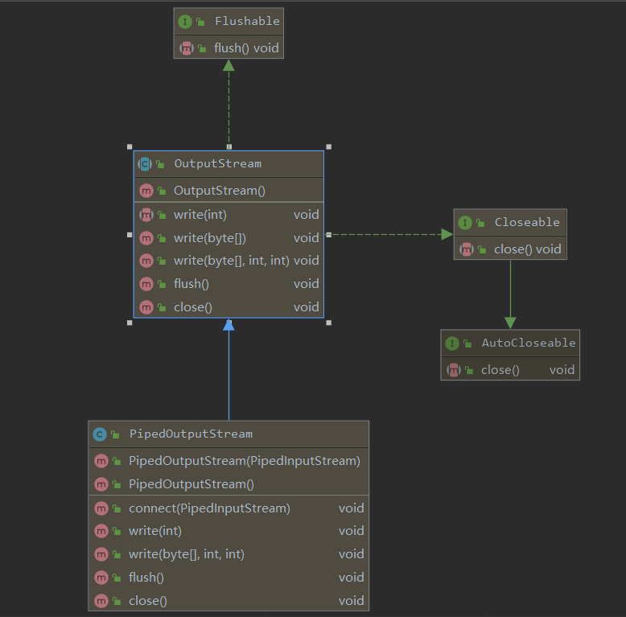
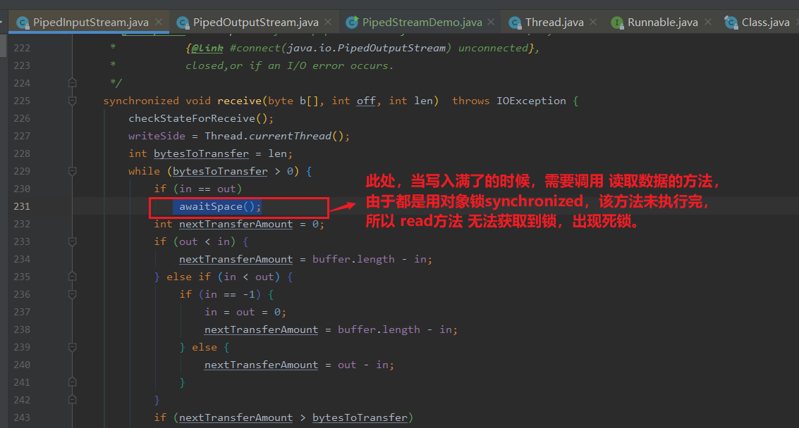

# PipedInputStream和PipedOutputStream

管道输入输出流也是一对内存操作可循环读写的数组的输入输出流，基本上读写的方法都是放在 `PipedInputStream` 这个对象中，在做读写操作的时候需要把输入输出流进行关联，否则不能做对应的读写操作。

<!--more-->

## 管道流缓冲区模型图：

- 开始写入



- 开始读取

  

# PipedInputStream

jdk官方的解释：一个管道输入流应连接到管道输出流; 管道输入流提供写入管道输出流的任何数据字节。通常情况下，数据是通过一个线程从一个 `PipedInputStream` 对象读取的，而其他线程将数据写入相应的 `PipedOutputStream`。不建议尝试从单个线程使用这两个对象，因为它可能会使线程死锁。管道输入流包含一个缓冲区，在读写操作的范围内解耦读取操作。如果向连接的管道输出流提供数据字节的线程不再有效，那么这个管道也就可以认为是“broken“ 坏了.

对于这个死锁，因为下面的读写都是**synchronized** 同步，锁的是该对象。所以如果读写都处于同一个对象，当写的时候发现已经满了，然后就等待，但是唤醒不了其他的线程，循环进入等待，释放，然后又是循环，就进入了死锁状态，也消费不了，也写不了。后面会在代码里讲到。


## PipedInputStream UML 图



### PipedInputStream 成员变量

```java
boolean closedByWriter = false;   //管道是否被写线程关闭
volatile boolean closedByReader = false;   //管道是否被读线程关闭
boolean connected = false;   //是否与输出流连接
Thread readSide;   //读线程
Thread writeSide;  //写线程
private static final int DEFAULT_PIPE_SIZE = 1024; //默认的管道流字节数组的长度 为1024
protected static final int PIPE_SIZE = DEFAULT_PIPE_SIZE ; //管道流字节数组的长度
protected byte buffer[];  //管道流字节数组
/**
* 管道输出流接收到数据的下一个字节在循环缓冲区中位置的索引。初始化时该值为-1。
* 比如第一次写入100个字节，此时in =100。
* 为0时则代表改数组为空，read线程阻塞。
* 当in=out 时，表示该数组已满，此时写线程阻塞
*/
protected int in = -1;
protected int out = 0;  //管道输入流读取的写一个字节在循环缓冲区中位置的索引。初始化时改值为0。比如第一次读取10个字节，此时out =10
```

### PipedInputStream  构造函数

```java
//构造方法只初始化一个数组，并不连接管道输出流。
public PipedInputStream() {
   initPipe(DEFAULT_PIPE_SIZE);
}
public PipedInputStream(int pipeSize) {
   initPipe(pipeSize);
}
//初始化缓冲数组
private void initPipe(int pipeSize) {
    if (pipeSize <= 0) {
       throw new IllegalArgumentException("Pipe Size <= 0");
    }
    buffer = new byte[pipeSize];
}

// 下面这两个构造方法初始化数组并传入需要连接的管道输出流。
public PipedInputStream(PipedOutputStream src) throws IOException {
   this(src, DEFAULT_PIPE_SIZE);
}
public PipedInputStream(PipedOutputStream src, int pipeSize) throws IOException {
    initPipe(pipeSize);
    connect(src); // 连接管道输出流。调用的输出流的connect()
}
public void connect(PipedOutputStream src) throws IOException {
   src.connect(this);
}
```

## 关联管道流的方式

#### 方式1

```java
PipedOutputStream pous = new PipedOutputStream ();
PipedInputStream pins = new PipedInputStream(pous);
```

#### 方式2

```java
PipedInputStream pins = new PipedInputStream();
PipedOutputStream pous = new PipedOutputStream (pins);
```

以上的方式最终调用的还是PipedOutputStream 的connect()这个方法。

##### connect方法

```java
public synchronized void connect(PipedInputStream snk) throws IOException {
   if (snk == null) {
       throw new NullPointerException();
   } else if (sink != null || snk.connected) {  // 如果已经关联了输入流对象 或者connected 为true则抛异常
       throw new IOException("Already connected");
   }
   sink = snk;  //关联的管道输入流对象
   snk.in = -1;  //初始化in
   snk.out = 0; //初始化out
   snk.connected = true;
}
```

## 数据读取

### 单字节读取

```java
public synchronized int read()  throws IOException {
   if (!connected) {
       throw new IOException("Pipe not connected");
   } else if (closedByReader) {
       throw new IOException("Pipe closed");
   } else if (writeSide != null && !writeSide.isAlive()
              && !closedByWriter && (in < 0)) {    //如果写线程不为空，但是却不可用，并且写入管道状态处于未关闭，并且 in<0(初始状态，没有写入过数据) 。则该写线程已经挂掉了。
       throw new IOException("Write end dead");
   }
   readSide = Thread.currentThread();  //读为当前线程
   int trials = 2;  //
   while (in < 0) {   //如果没有数据
       if (closedByWriter) {  
           /* closed by writer, return EOF */
           return -1;  //如果写操作线程已关闭，直接返回-1
       }
       if ((writeSide != null) && (!writeSide.isAlive()) && (--trials < 0)) { //尝试了3次之后 写线程不为空，但是却不可用 抛出管道已坏异常
           throw new IOException("Pipe broken");
       }
       /* might be a writer waiting */
       notifyAll(); //唤醒其他的线程，这里有可能唤醒了写线程，开始写入数据。
        // 注意：如果这里读写是同一个线程，那么这里并不能唤醒其他线程，因为这里是对象锁，然后，等该线程等待了一秒钟之后，又会获取到锁，此时，in依然是-1.没有数据,依然进入循环，造成死锁。
       // 下面的写操作 receive() 也会造成死锁。
       try {
           wait(1000);  // 当前 等待一秒。释放锁资源
       } catch (InterruptedException ex) {
           throw new java.io.InterruptedIOException();
       }
   }
   int ret = buffer[out++] & 0xFF;  //获取下一个读出的字节 当前索引为out，下一个为out+1
   if (out >= buffer.length) { // 如果读取后，out元素的索引已经达到了数组的最大限制，则out =0 下次从头开始读。
       out = 0;
   }
   if (in == out) {//如果当前in=out 则此时代表数组已经消费完了，为空，则in =-1，下次需要写线程从头开始写。
       /* now empty */
       in = -1;
   }
   return ret;  //返回读取到的字节。
}
```

#### 将缓冲区的数据读到byte数组

```java
//原文解释：从缓冲区读取len长度的数据到一个字节数组中。如果读到末尾了，或者 len超过了缓冲区可读的长度，   则读取长度小于len。如果 len为0，则不可以读到任何字节，将该方法返回0。此外  这个方法也是阻塞的，直到至少有一个字节可以读，或者 检测到缓冲区已经到达末尾，或者出现异常了，否则都会阻塞。方法返回的是读取到的字节数。如果达到末尾，则返回-1
public synchronized int read(byte b[], int off, int len)  throws IOException {
   if (b == null) {
       throw new NullPointerException();
   } else if (off < 0 || len < 0 || len > b.length - off) {
       throw new IndexOutOfBoundsException();
   } else if (len == 0) {
       return 0;
   }
   /* possibly wait on the first character */
   int c = read();   //  调用read 去读取下一个可读字节。 可能是第一个字节
   if (c < 0) {   //如果返回的是 -1，则证明已经达到缓冲区末尾了。返回-1
       return -1;
   }
   b[off] = (byte) c;  // 将当前读到的c放入off 索引下。
   int rlen = 1;   // 定义 读取到的返回字节数。当前已经读取到一个，次数设置为1
   while ((in >= 0) && (len > 1)) {  // 如果 in>=0 证明还有可读数据  
       int available;  // 剩余可读数
       if (in > out) {  //如果 in>out 则 可读的长度设置的为(in - out)
           available = Math.min((buffer.length - out), (in - out));
       } else {  //如果 in< out 则 可读设置为buffer.length - out;  这里不会出现in=out 因为如果有in= out，则数组为空。进到这里肯定是数组不为空！
           available = buffer.length - out;
       }
       // A byte is read beforehand outside the loop
       if (available > (len - 1)) { //如果可读长度大于len-1 ,因为刚已经读取了一个字节。
           available = len - 1;  //则设置可读为len-1 ,因为一次性读不完。
       }
       System.arraycopy(buffer, out, b, off + rlen, available); //将数组内容复制。
       out += available; // 当前out值增加available长度。
       rlen += available; //  读取到的字节数加上available
       len -= available; //l下一次要读的长度减掉available ，如果len 已经<=0 则 不进入循环了。
       if (out >= buffer.length) { // 如果当前的out 索引已经达到了数组的最大长度，则将out回归0 ，下次重新读。
           out = 0;  
       }
       if (in == out) { //如果此时in = out 则说明数组已经没有可读内容。 in 置为-1。 下次不再循环读。
           /* now empty */
           in = -1;
       }
   }
   return rlen;
}
```

#### 写操作receive()方法

```java
//接收（写入）一个字节。这个方法会一直阻塞，如果一直没有输入流可用
//如果管道已经坏了，未连接的话，抛出异常
protected synchronized void receive(int b) throws IOException {
   checkStateForReceive(); //校验管道状态
   writeSide = Thread.currentThread();   //设置写线程为当前线程
   if (in == out)  //如果数组已经满了 则阻塞 ，唤醒读线程
       awaitSpace();
   if (in < 0) {  //如果缓冲区为空 ，则设置in 和out为0
       in = 0;  
       out = 0;
   }
   buffer[in++] = (byte)(b & 0xFF);
   if (in >= buffer.length) { // 如果写到了数组的末尾，则重新写
       in = 0;
   }
}
//校验管道和读线程
private void checkStateForReceive() throws IOException {
   if (!connected) {
       throw new IOException("Pipe not connected");
   } else if (closedByWriter || closedByReader) {
       throw new IOException("Pipe closed");
   } else if (readSide != null && !readSide.isAlive()) {
       throw new IOException("Read end dead");
   }
}
//等待并唤醒读线程
private void awaitSpace() throws IOException {
   while (in == out) {
       checkStateForReceive(); //校验管道和读线程
       /* full: kick any waiting readers */
       notifyAll(); //唤醒读线程
       try {
           wait(1000); //锁等待，释放资源。
       } catch (InterruptedException ex) {
           throw new java.io.InterruptedIOException();
       }
   }
}

//接收数据到字节数组（缓冲区），这个方法是阻塞的，直到有输入流（读线程）是可用的。
synchronized void receive(byte b[], int off, int len)  throws IOException {
   checkStateForReceive(); //校验管道和读线程
   writeSide = Thread.currentThread();   //设置writeSide 为当前线程
   int bytesToTransfer = len; //定义本次期望写的字节的长度
   while (bytesToTransfer > 0) {
       if (in == out)  //如果发现缓冲区已经满了。阻塞，等待读线程读取（消费）数据。
           awaitSpace();  
       int nextTransferAmount = 0;    //设置最多可以写的长度
       if (out < in) { // 如果当前写入的索引大于当前读取的索引，则最大可写的长度buffer.length - in。
           nextTransferAmount = buffer.length - in;  
       } else if (in < out) {//如果当前写入的索引小于当前读取的索引 ，如果数组为空，则数组读写都从头开始。不为空，则可写的空间为out - in。
           if (in == -1) {
               in = out = 0;
               nextTransferAmount = buffer.length - in;
           } else {
               nextTransferAmount = out - in;
           }
       }
       if (nextTransferAmount > bytesToTransfer)
           nextTransferAmount = bytesToTransfer; //比较当前最大可写的长度，和期望写入的长度，最终可写的长度为最小的为准。
       assert(nextTransferAmount > 0);
       System.arraycopy(b, off, buffer, in, nextTransferAmount);
       bytesToTransfer -= nextTransferAmount;  // 期望的值减去已经写入的字节数。
       off += nextTransferAmount;  
       in += nextTransferAmount;  //当前写入的索引后移本次写入长度个位置
       if (in >= buffer.length) { //如果写到了末尾，则从开头写入。设置为0。
           in = 0;
       }
   }
}
```

#### 关闭 closed()

````java
public void close()  throws IOException {
   closedByReader = true; //设置读关闭。
   synchronized (this) {
       in = -1;
   }
}
````

# **PipedOutputStream**

**PipedOutputStream，管道流的操作基本都在PipedInputStream类实现的。PipedOutputStream的操作很少。所以基本上没什么可说的，我们来看下PipedOutputStreamuml图**



输入流中主要的就是写操作,但是真实的操作还是在PipedInputStream类中实现的receive()。 我们来看下源码。

```java
public void write(int b)  throws IOException {
   if (sink == null) {
       throw new IOException("Pipe not connected");
   }
   sink.receive(b); //调用PipedInputStream.receive(int b)
}

public void write(byte b[], int off, int len) throws IOException {
   if (sink == null) {
       throw new IOException("Pipe not connected");
   } else if (b == null) {
       throw new NullPointerException();
   } else if ((off < 0) || (off > b.length) || (len < 0) ||
              ((off + len) > b.length) || ((off + len) < 0)) {
       throw new IndexOutOfBoundsException();
   } else if (len == 0) {
       return;
   }
   sink.receive(b, off, len);  //调用PipedInputStream.receive(byte b[], int off, int len)
}

public synchronized void flush() throws IOException {
   if (sink != null) {
       synchronized (sink) { // 关联的PipedInpuStream 实例对象锁
           sink.notifyAll();   // 通知任何等待在管道缓冲区的读线程  
       }
   }
}
```

### 关闭流方法，关联输入流 closed()

```java
public void close()  throws IOException {
   if (sink != null) {
       sink.receivedLast(); //写入最后未完成的写操作
   }
}
synchronized void receivedLast() {
   closedByWriter = true;
   notifyAll();  //唤醒所有等待的线程，告知最后一次写入已经完成了。
}
```

## 为什么读写都要放在PipedInputStream中，为什么要这样设计呢？

管道流对缓冲区的读写的线程是需要做到读写阻塞的，那如果要达到阻塞怎么样控制到读和写的同步呢，我们看到在PipedInpuStream 和`PipedOutpuStream`都是用**synchronized**来进行线程同步的，这是一个互斥锁，并且在`PipedInpuStream` 中和 `PipedOutpuStream` 类中**synchronized** 锁对象都是this 是类的实例。读写都在 `PipedInpuStream` 中可以很好的控制读写的互斥。如果分开在`PipedInpuStream `中和 `PipedOutpuStream` 中实现的话，不能做到读写互斥。

### 同一个线程出现死锁

```java
// 由于 读取和写入都是使用 PipedInputStream 对象锁，所以回出现死锁现象
    private static void singleThreadDemo() throws IOException {
        PipedOutputStream pos = new PipedOutputStream();
        PipedInputStream pis = new PipedInputStream(pos);
        //读取字节
        byte[] r = new byte[30];
        //写
        byte[] w = new byte[1024];

        Thread thread = new Thread(() -> {
            try {
                int i = 1;
                while (i<200){
                    Arrays.fill(w,(byte)1);
                    pos.write(w,0,1000);
                    System.out.println("第"+i+"次写入"+1000+"个字节,可读:"+pis.available());
                    int j =0;
                    j= pis.read(r,0,30);
                    System.out.println("第"+i+"次读到："+j+"个字节");
                    i++;
                    Thread.sleep(new Random().nextInt(100));
                }
            } catch (IOException e) {
                e.printStackTrace();
            } catch (InterruptedException e) {
                e.printStackTrace();
            }
        });
        thread.start();
    }
```




### 多线成 非死锁

```java
   private static void multiThread() throws IOException {

        PipedOutputStream pos = new PipedOutputStream();
        PipedInputStream pis = new PipedInputStream(pos);
        //读取字节
        byte[] r = new byte[30];
        //写
        byte[] w = new byte[1024];
        //读取
        executor.execute(()->{
            try {
                int i = 1;
                while (i<200){
                    int j =0;
                    j= pis.read(r,0,30);
                    System.out.println("第"+i+"次读到："+j+"个字节");
                    i++;
                    Thread.sleep(new Random().nextInt(100));
                }
            } catch (IOException | InterruptedException e) {
                e.printStackTrace();
            }
        });
        //写入
        executor.execute(() ->{
            try {
                int i = 1;
                while (i<200){
                    Arrays.fill(w,(byte)1);
                    pos.write(w,0,1000);
                    System.out.println("第"+i+"次写入"+1000+"个字节,可读:"+pis.available());
                    Thread.sleep(new Random().nextInt(100));
                }
            } catch (IOException e) {
                e.printStackTrace();
            } catch (InterruptedException e) {
                e.printStackTrace();
            }finally {
                try {
                    pos.close();
                } catch (IOException e) {
                    e.printStackTrace();
                }
            }
        });

        executor.shutdown();
    }
```

完美执行。
