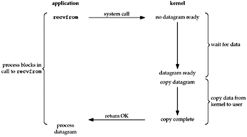
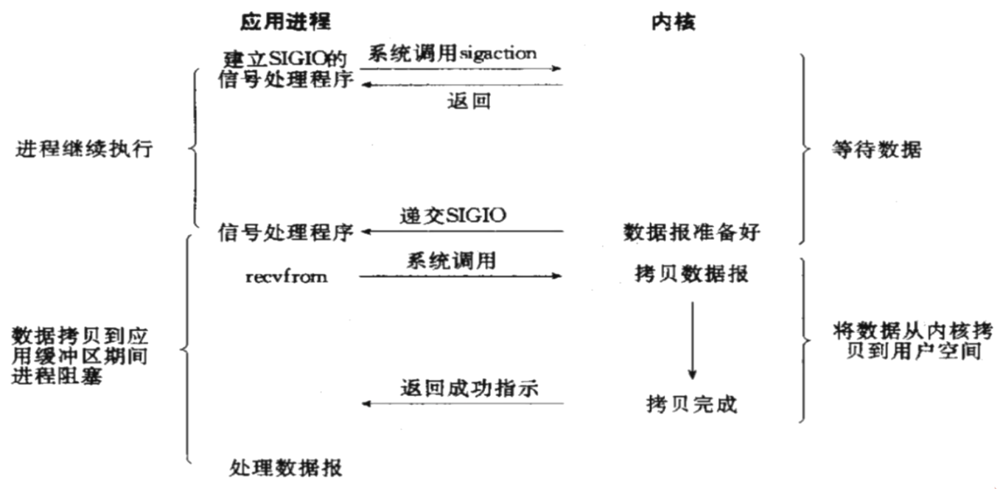

# 同步与异步

## 同步

一个任务的完成需要依赖另外一个任务时，只有等待被依赖的任务完成后，依赖的任务才能算完成。

## 异步

指不需要等待被依赖的任务完成，只是通知被依赖的任务要完成什么工作。然后继续执行下面代码逻辑，只要自己完成了整个任务就算完成了（异步一般使用状态、通知和回调）

## 项目使用

- 同步架构：一般都是和钱相关的需求，需要实时返回的业务
- 异步架构：更多是对写要求比较高时的场景（同步变异步）
  - 读一般都是实时返回，代码一般都是`await xxx()`
- 场景设定
  - 异步：现在用户写了篇文章，可以异步操作，就算没真正写到数据库也可以返回：发表成功（大不了失败提示一下）
  - 同步：用户获取订单信息，你如果异步就会这样了：提示下获取成功，然后一片空白...用户不卸载就怪了...

# 阻塞与非阻塞

- 阻塞：是指调用结果返回之前，当前线程会被挂起，一直处于等待消息通知，不能够执行其他业务（大部分代码都是这样的）
- 非阻塞：是指在不能立刻得到结果之前，该函数不会阻塞当前线程，而会立刻返回（继续执行下面代码，或者重试机制走起）

### 项目里面重试机制为啥一般都是3次？

1. 第一次重试，两台PC挂了也是有可能的
2. 第二次重试，负载均衡分配的三台机器同时挂的可能性不是很大，这时候就有可能是网络有点拥堵了
3. 最后一次重试，再失败就没意义了，日记写起来，再重试网络负担就加大了，得不偿失了

# 五种 IO 模型

对于一次IO访问，数据会先被拷贝到内核的缓冲区中，然后才会从内核的缓冲区拷贝到应用程序的地址空间。需要经历两个阶段：

1. 准备数据
2. 将数据从内核缓冲区拷贝到进程地址空间

由于存在这两个阶段，Linux产生了下面五种IO模型（`以socket为例`）

## 阻塞式IO：

要从你常用的IO操作谈起，比如read和write，通常IO操作都是阻塞I/O的，也就是说当你调用read时，如果没有数据收到，那么线程或者进程就会被挂起，直到收到数据。阻塞的意思，就是一直等着。阻塞I/O就是等着数据过来，进行读写操作。应用的函数进行调用，但是内核一直没有返回，就一直等着。应用的函数长时间处于等待结果的状态，我们就称为阻塞I/O。每个应用都得等着，每个应用都在等着，浪费啊！很像现实中的情况。大家都不干活，等着数据过来，过来工作一下，没有的话继续等着。

- 当用户进程调用了`recvfrom`等阻塞方法时，内核进入IO的第1个阶段：准备数据（内核需要等待足够的数据再拷贝）这个过程需要等待，用户进程会被阻塞，等内核将数据准备好，然后拷贝到用户地址空间，内核返回结果，用户进程才从阻塞态进入就绪态
- Linux中默认情况下所有的socket都是阻塞的

## 非阻塞式IO

通过fcntl（POSIX）或ioctl（Unix）设为非阻塞模式，这时，当你调用read时，如果有数据收到，就返回数据，如果没有数据收到，就立刻返回一个错误，如EWOULDBLOCK。这样是不会阻塞线程了，但是你还是要不断的轮询来读取或写入。相当于你去查看有没有数据，告诉你没有，过一会再来吧！应用过一会再来问，有没有数据？没有数据，会有一个返回。

- 当用户进程发出read操作时，如果`kernel`中的数据还没有准备好，那么它并不会`block`用户进程，而是立刻返回一个`error`
- 用户进程判断结果是一个`error`时，它就知道数据还没有准备好，于是它可以再次发送read操作
- 旦`kernel`中的数据准备好了，并且又再次收到了用户进程的`system call`，那么它马上就将数据拷贝到了用户内存，然后返回
- 非阻塞IO模式下用户进程需要不断地询问内核的数据准备好了没有

**非阻塞IO只是应用到等待数据上,当真正有数据到达执行的时候,还是同步阻塞IO来的,从途中的 copy data from kernel to user 可以看出**

##  IO多路复用

多路复用是指使用一个线程来检查多个文件描述符（Socket）的就绪状态，比如调用select和poll函数，传入多个文件描述符（FileDescription，简称FD），如果有一个文件描述符（FileDescription）就绪，则返回，否则阻塞直到超时。得到就绪状态后进行真正的操作可以在同一个线程里执行，也可以启动线程执行（比如使用线程池）。

通俗解释：

就是派一个代表，同时监听多个文件描述符是否有数据到来。等着等着，如有有数据，就告诉某某你的数据来啦！赶紧来处理吧。

IOmultiplexing就是我们说的select, poll, epoll, 有些地方这种IO方式为event driven IO.

select/epoll的好处就在于单个process就可以同时处理多个网络连接的IO. 它的基本原理就是select,pollepoll这个function会不断的轮训所负责的所有socket,当某个socket有数据到达了,就通知用户进程.

**用select的优势在于它可以同时处理多个connection.**

- 通过一种机制，一个进程可以监视多个文件描述符（套接字描述符）一旦某个文件描述符就绪（一般是读就绪或者写就绪），能够通知程序进行相应的读写操作（这样就不需要每个用户进程不断的询问内核数据准备好了没）
- 常用的IO多路复用方式有`select`、`poll`和`epoll`

**note:**

- 用户可以注册多个socket，然后不断地调用select读取被激活的socket，即可达到在同一个线程内同时处理多个IO请求的目的。而在同步阻塞模型中，必须通过多线程的方式才能达到这个目的。
- 允许单线程内处理多个IO请求，但是每个IO请求的过程还是阻塞的（在select函数上阻塞）
- 每一个socket,一般都设置成为non-blocking,因为只有设置成non-blocking才能使用单个线程/进程不被则色(或者说锁住),可以继续处理其它socket
- I/O多路服用的特点是通过一种机制一个进程能同事等待多个文件描述符,而这些文件描述符(套接字描述符)其中的任意一个进入就读就绪状态,select()函数就可以返回.
- 所以,IO多路服用,本质上不会有并发的功能,因为任何时候还是只有一个进程或者线程在进行工作,它之所以能提高效率是因为select/epoll把进来的socket放到它们’监视’的列表里面,当任何socket有可读可写数据立马处理.select/epoll手里同事检测着很多socket,一有动静马上返回给进程处理,总比一个一个socket过来,阻塞等待,处理的效率高
- 当然也可以多线程/多进程方式,一个连接过来开一个进程/线程处理,这样消耗的内存和进程切换会耗掉更多的系统资源.所以,我们可以结合IO多路复用和多进程/多线程来提高性能并发,IO复用负责提高接受socket的通知效率,收到请求后,交给进程池/线程池来处理逻辑

## 信号驱动IO

- 内核文件描述符就绪后，通过信号通知用户进程，用户进程再通过系统调用读取数据。
- 此方式属于同步IO（实际读取数据到用户进程缓存的工作仍然是由用户进程自己负责的）

## **异步IO**（`POSIX`的`aio_`系列函数）

用户进程发起read操作后,立即就可以开始去做其它的事. 而另一方面,从kernel的角度,当它收到一个asynchronous read之后,首先它会立即返回,所以不会对用户进程产生任何block. 然后,kernel会等待数据准备完成,然后将数据拷贝到用户内存,当这一切都完成之后,kernel会给用户进程发一个signal,告诉它read操作完成了.

- 用户进程发起read操作之后，立刻就可以开始去做其它的事。内核收到一个异步`IO read`之后，会立刻返回，不会阻塞用户进程。
- 内核会等待数据准备完成，然后将数据拷贝到用户内存，当这一切都完成之后，内核会给用户进程发送一个`signal`告诉它read操作完成了

# 参考

- https://www.cnblogs.com/charm-j/p/10384196.html
- https://blog.csdn.net/yijie__shusheng/article/details/89536604
- https://www.cnblogs.com/skiler/p/6852493.html