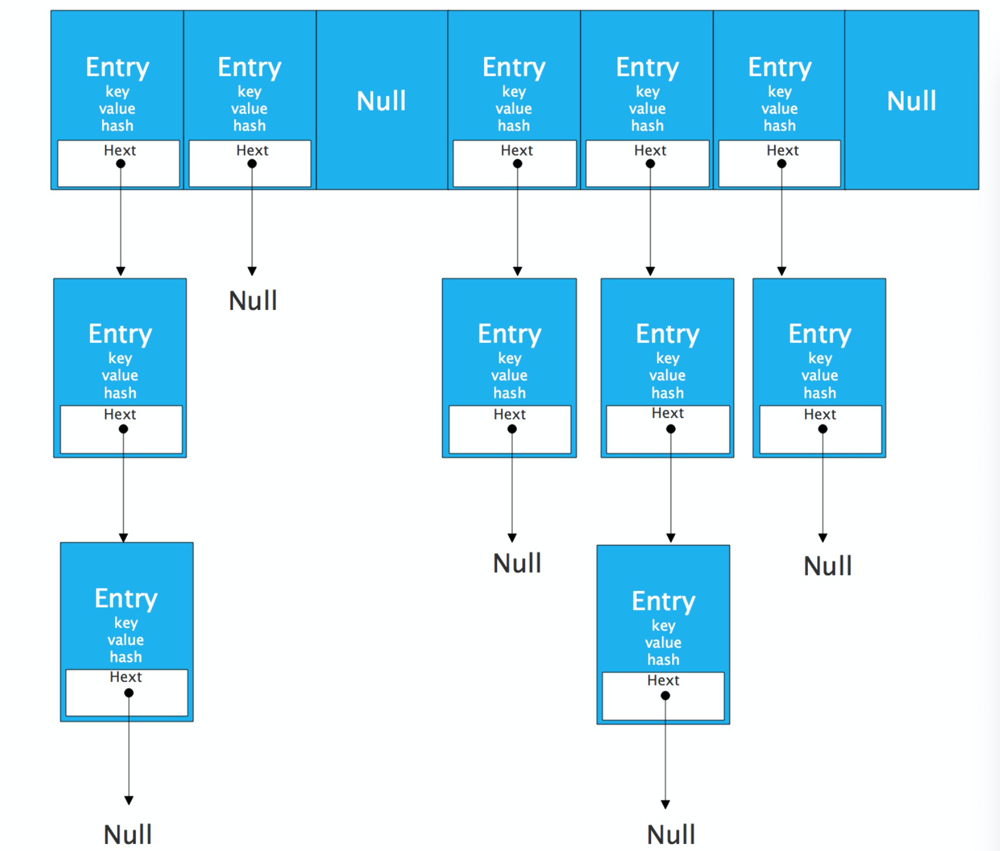
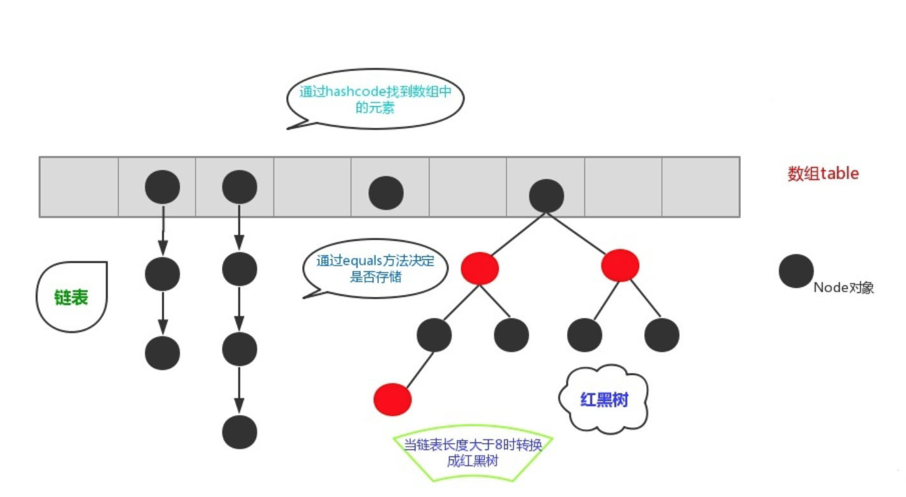
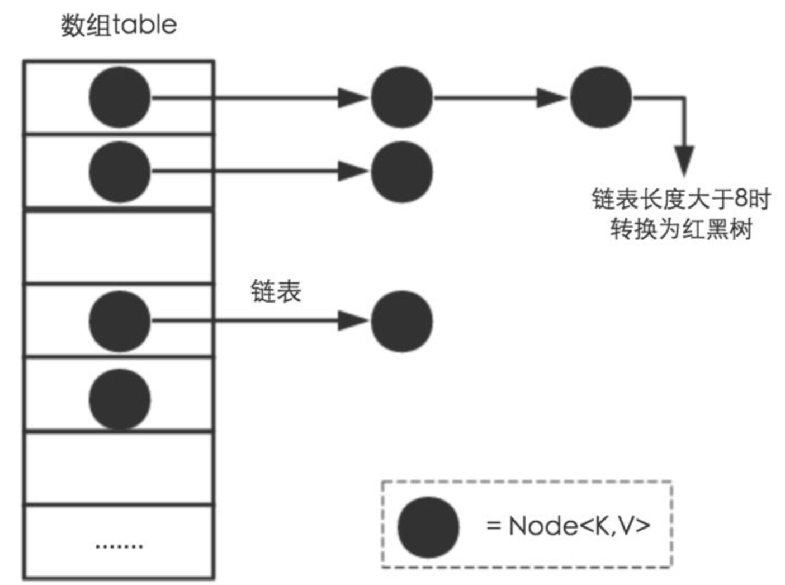
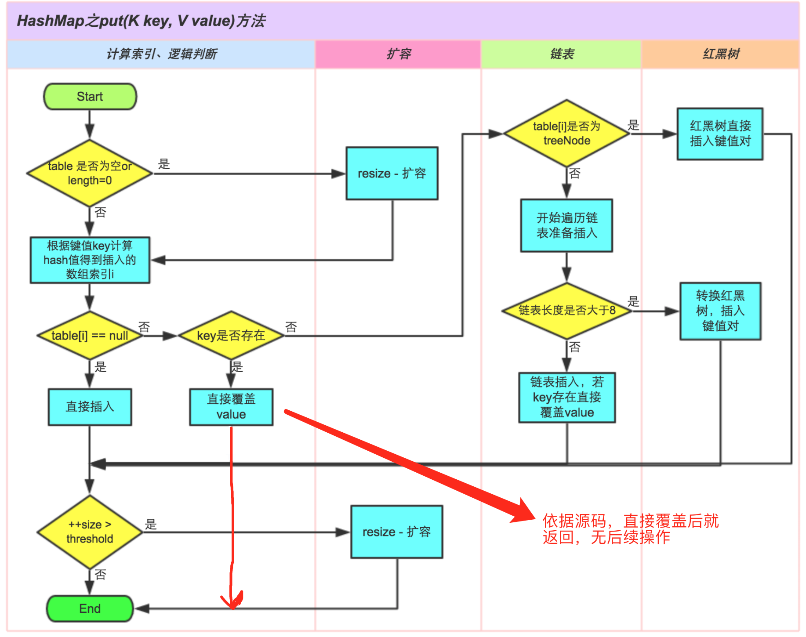

# hashMap 的前世今生

# 简介

hashMap 依据 hashCode 值存储数据。如果通过hashcode 可以直接定位到数据的值，访问的复杂度则为常数，但遍历的顺序则是无序的。

HashMap最多只允许一个key为null，允许多个key的value值为null。

HashMap非线程安全，即任一时刻可以有多个线程同时写HashMap，可能会导致数据的不一致。jdk 1.7 之前的版本有可能在多线程下导致死锁。

如果需要满足线程安全，可以使用ConcurrentHashMap。

hashMap 由数组+ 链表组成。数组是HashMap的主体，链表是为了结局Hash冲突而存在的（拉链法）。

## jdk1.8之后

在jdk1.8 之后，在解决hash冲突时，做了调整，当拉链长度大于阈值8 时，将链表调整为红黑树。以减少搜索时间。

将链表转换为红黑树之前会做判断，如果当前的数组长度小于64，那么会优先选择数组扩容，而不是转换为红黑树。源码中的方法为`treeifyBin`

# 底层数据结构概述

## hash表

散列表是由我们的数组和链表组成的，集成了两种数据结构的优点，我们先简单介绍一下这两种数据结构：



哈希表**为每个对象计算出一个整数，称为哈希码**。**根据**这些计算出来的**整数(哈希码)保存在对应的位置上**！如果遇到了哈希冲突，也就是同一个坑遇到了被占用的情况下，那么我们就会以链表的形式添加在后面。

### 数组

数组的存储区间，占用内存严重，故空间复杂度较大，但是查找速度很快，为常数级O(1)。(二分查找法更快)

**数组的特点：** 查找速度快，插入和删除速率低（数据拷贝，位移）

### 链表

存储区间离散，占用内存比较宽松，故空间复杂度很小。但查找时间复杂度表大，需要循环整个链表O(n)，

**链表特点:**查找速度慢，插入和删除速率高。 

### 红黑树



Jdk1.8 之后，当链表长度大于阈值（默认为8）时，将链表转化为红黑树，以减少搜索时间。

关于红黑树：https://www.jianshu.com/p/e136ec79235c

# 底层数据结构分析

## jdk 1.8 之前

JDK1.8 之前 HashMap 底层是 **数组和链表** 结合在一起使用也就是 **链表散列**。**HashMap 通过 key 的 hashCode 经过扰动函数处理过后得到 hash 值，然后通过 `(n - 1) & hash` 判断当前元素存放的位置（这里的 n 指的是数组的长度），如果当前位置存在元素的话，就判断该元素与要存入的元素的 hash 值以及 key 是否相同，如果相同的话，直接覆盖，不相同就通过拉链法解决冲突。**

**扰动函数**：就是 HashMap 的 hash 方法。使用 hash 方法也就是扰动函数是为了防止一些实现比较差的 hashCode() 方法 换句话说使用扰动函数之后可以减少碰撞。

## hash方法

- jdk1.7 的HashMap 的hash 方法源码

```java
static int hash(int h) {
    // This function ensures that hashCodes that differ only by
    // constant multiples at each bit position have a bounded
    // number of collisions (approximately 8 at default load factor).

    h ^= (h >>> 20) ^ (h >>> 12);
    return h ^ (h >>> 7) ^ (h >>> 4);
}
```


- jdk1.8 的HashMap的hash方法源码

```java
static final int hash(Object key) {
      int h;
      // key.hashCode()：返回散列值也就是hashcode
      // ^ ：按位异或
      // >>>:无符号右移，忽略符号位，空位都以0补齐
  		// h = key.hashCode() 为第一步 取hashCode值
     // h ^ (h >>> 16)  为第二步 高位参与运算
  		// 如果key为null，hash值为0，否则，为key的hashCode ^ 它的hashCode右移16位
      return (key == null) ? 0 : (h = key.hashCode()) ^ (h >>> 16);
  }
```

Jdk1.8 的性能比jdk1.7的性能稍微好点，因为jdk17 扰动了4次，而jdk18 只扰动了1次。

## 拉链法

将链表和数组相结合。也就是说创建一个链表数组，数组中每一格就是一个链表。若遇到哈希冲突，则将冲突的值加到链表中即可。

图如：hash表中实例。

## jdk 1.8之后

相比于之前的版本，jdk1.8在解决哈希冲突时有了较大的变化，当链表长度大于阈值（默认为8）时，将链表转化为红黑树，以减少搜索时间。



# 源码

## 类的属性

```java
public class HashMap<K,V> extends AbstractMap<K,V> implements Map<K,V>, Cloneable, Serializable {
    // 序列号
    private static final long serialVersionUID = 362498820763181265L;    
    // 默认的初始容量是16
    static final int DEFAULT_INITIAL_CAPACITY = 1 << 4;   
    // 最大容量
    static final int MAXIMUM_CAPACITY = 1 << 30; 
    // 默认的填充因子
    static final float DEFAULT_LOAD_FACTOR = 0.75f;
    // 当桶(bucket)上的结点数大于这个值时会转成红黑树
    static final int TREEIFY_THRESHOLD = 8; 
    // 当桶(bucket)上的结点数小于这个值时树转链表
    static final int UNTREEIFY_THRESHOLD = 6;
    // 桶中结构转化为红黑树对应的table的最小大小
    static final int MIN_TREEIFY_CAPACITY = 64;
    // 存储元素的数组，总是2的幂次倍
    transient Node<k,v>[] table; 
    // 存放具体元素的集
    transient Set<map.entry<k,v>> entrySet;
    // 存放元素的个数，注意这个不等于数组的长度。
    transient int size;
    // 每次扩容和更改map结构的计数器
    transient int modCount;   
    // 临界值 当实际大小(容量*填充因子)超过临界值时，会进行扩容
    int threshold;
    // 加载因子
    final float loadFactor;
}
```

### loadFactor 加载因子

loadFactor加载因子是控制数组存放数据的疏密程度，loadFactor越趋近于1，那么 数组中存放的数据(entry)也就越多，也就越密，也就是会让链表的长度增加，loadFactor越小，也就是趋近于0，数组中存放的数据(entry)也就越少，也就越稀疏。

**loadFactor太大导致查找元素效率低，太小导致数组的利用率低，存放的数据会很分散。loadFactor的默认值为0.75f是官方给出的一个比较好的临界值**。

给定的默认容量为 16，负载因子为 0.75。Map 在使用过程中不断的往里面存放数据，当数量达到了 16 * 0.75 = 12 就需要将当前 16 的容量进行扩容，而扩容这个过程涉及到 rehash、复制数据等操作，所以非常消耗性能。

### threshold 阈值

**衡量数组是否需要扩增的一个标准**：**threshold = capacity \* loadFactor**，**当Size>=threshold**的时候，那么就要考虑对数组的扩增了。

## Node 节点

```java
// 继承自 Map.Entry<K,V>
static class Node<K,V> implements Map.Entry<K,V> {
       final int hash;// 哈希值，存放元素到hashmap中时用来与其他元素hash值比较
       final K key;//键
       V value;//值
       // 指向下一个节点
       Node<K,V> next;
       Node(int hash, K key, V value, Node<K,V> next) {
            this.hash = hash;
            this.key = key;
            this.value = value;
            this.next = next;
        }
        public final K getKey()        { return key; }
        public final V getValue()      { return value; }
        public final String toString() { return key + "=" + value; }
        // 重写hashCode()方法
        public final int hashCode() {
            return Objects.hashCode(key) ^ Objects.hashCode(value);
        }

        public final V setValue(V newValue) {
            V oldValue = value;
            value = newValue;
            return oldValue;
        }
        // 重写 equals() 方法
        public final boolean equals(Object o) {
            if (o == this)
                return true;
            if (o instanceof Map.Entry) {
                Map.Entry<?,?> e = (Map.Entry<?,?>)o;
                if (Objects.equals(key, e.getKey()) &&
                    Objects.equals(value, e.getValue()))
                    return true;
            }
            return false;
        }
}
```

## TreeNode 树节点

```java
static final class TreeNode<K,V> extends LinkedHashMap.Entry<K,V> {
        TreeNode<K,V> parent;  // 父
        TreeNode<K,V> left;    // 左
        TreeNode<K,V> right;   // 右
        TreeNode<K,V> prev;    // needed to unlink next upon deletion
        boolean red;           // 判断颜色
        TreeNode(int hash, K key, V val, Node<K,V> next) {
            super(hash, key, val, next);
        }
        // 返回根节点
        final TreeNode<K,V> root() {
            for (TreeNode<K,V> r = this, p;;) {
                if ((p = r.parent) == null)
                    return r;
                r = p;
       }
```

## 源码分析

### 构造方法

HashMap 中有四个构造方法，它们分别如下：

```java
// 默认构造函数。
    public HashMap() {
        this.loadFactor = DEFAULT_LOAD_FACTOR; // all   other fields defaulted
     }
     
     // 包含另一个“Map”的构造函数
     public HashMap(Map<? extends K, ? extends V> m) {
         this.loadFactor = DEFAULT_LOAD_FACTOR;
         putMapEntries(m, false);//下面会分析到这个方法
     }
     
     // 指定“容量大小”的构造函数
     public HashMap(int initialCapacity) {
         this(initialCapacity, DEFAULT_LOAD_FACTOR);
     }
     
     // 指定“容量大小”和“加载因子”的构造函数
     public HashMap(int initialCapacity, float loadFactor) {
         if (initialCapacity < 0)
             throw new IllegalArgumentException("Illegal initial capacity: " + initialCapacity);
         if (initialCapacity > MAXIMUM_CAPACITY)
             initialCapacity = MAXIMUM_CAPACITY;
         if (loadFactor <= 0 || Float.isNaN(loadFactor))
             throw new IllegalArgumentException("Illegal load factor: " + loadFactor);
         this.loadFactor = loadFactor;
         this.threshold = tableSizeFor(initialCapacity);
     }
```

### putMapEntries 方法

```java
final void putMapEntries(Map<? extends K, ? extends V> m, boolean evict) {
    int s = m.size();
    if (s > 0) {
        // 判断table是否已经初始化
        if (table == null) { // pre-size
            // 未初始化，s为m的实际元素个数
            float ft = ((float)s / loadFactor) + 1.0F;
            int t = ((ft < (float)MAXIMUM_CAPACITY) ?
                    (int)ft : MAXIMUM_CAPACITY);
            // 计算得到的t大于阈值，则初始化阈值
            if (t > threshold)
                threshold = tableSizeFor(t);
        }
        // 已初始化，并且m元素个数大于阈值，进行扩容处理
        else if (s > threshold)
            resize();
        // 将m中的所有元素添加至HashMap中
        for (Map.Entry<? extends K, ? extends V> e : m.entrySet()) {
            K key = e.getKey();
            V value = e.getValue();
            putVal(hash(key), key, value, false, evict);
        }
    }
}
```

### put 方法

HashMap只提供了put用于添加元素，putVal方法只是给put方法调用的一个方法，并没有提供给用户使用。

```java
public V put(K key, V value) {
    return putVal(hash(key), key, value, false, true);
}
```


**对putVal方法添加元素的分析如下：**

- 如果定位到的数组位置没有元素 就直接插入。
- 如果定位到的数组位置有元素就和要插入的key比较，如果key相同就直接覆盖，如果key不相同，就判断p是否是一个树节点，如果是就调用`e = ((TreeNode<K,V>)p).putTreeVal(this, tab, hash, key, value)`将元素添加进入。如果不是就遍历链表插入(插入的是链表尾部)。

**具体流程图：**



**note**：直接覆盖之后应该就会 return，不会有后续操作。参考 JDK8 HashMap.java 658 行。

- 过程分析

①.判断键值对数组table[i]是否为空或为null，否则执行resize()进行扩容；

②.根据键值key计算hash值得到插入的数组索引i，如果table[i]==null，直接新建节点添加，转向⑥，如果table[i]不为空，转向③；

③.判断table[i]的首个元素是否和key一样，如果相同直接覆盖value，否则转向④，这里的相同指的是hashCode以及equals；

④.判断table[i] 是否为treeNode，即table[i] 是否是红黑树，如果是红黑树，则直接在树中插入键值对，否则转向⑤；

⑤.遍历table[i]，判断链表长度是否大于8，大于8的话把链表转换为红黑树，在红黑树中执行插入操作，否则进行链表的插入操作；遍历过程中若发现key已经存在直接覆盖value即可；

⑥.插入成功后，判断实际存在的键值对数量size是否超多了最大容量threshold，如果超过，进行扩容。


```java
final V putVal(int hash, K key, V value, boolean onlyIfAbsent,
                   boolean evict) {
    Node<K,V>[] tab; Node<K,V> p; int n, i;
    // table未初始化或者长度为0，进行扩容
    if ((tab = table) == null || (n = tab.length) == 0)
        n = (tab = resize()).length;
    // (n - 1) & hash 确定元素存放在哪个桶中，桶为空，新生成结点放入桶中(此时，这个结点是放在数组中)
    if ((p = tab[i = (n - 1) & hash]) == null)
        tab[i] = newNode(hash, key, value, null);
    // 桶中已经存在元素
    else {
        Node<K,V> e; K k;
        // 比较桶中第一个元素(数组中的结点)的hash值相等，key相等
        if (p.hash == hash &&
            ((k = p.key) == key || (key != null && key.equals(k))))
                // 将第一个元素赋值给e，用e来记录
                e = p;
        // hash值不相等，即key不相等；为红黑树结点
        else if (p instanceof TreeNode)
            // 放入树中
            e = ((TreeNode<K,V>)p).putTreeVal(this, tab, hash, key, value);
        // 为链表结点
        else {
            // 在链表最末插入结点
            for (int binCount = 0; ; ++binCount) {
                // 到达链表的尾部
                if ((e = p.next) == null) {
                    // 在尾部插入新结点
                    p.next = newNode(hash, key, value, null);
                    // 结点数量达到阈值，转化为红黑树
                    if (binCount >= TREEIFY_THRESHOLD - 1) // -1 for 1st
                        treeifyBin(tab, hash);
                    // 跳出循环
                    break;
                }
                // 判断链表中结点的key值与插入的元素的key值是否相等
                if (e.hash == hash &&
                    ((k = e.key) == key || (key != null && key.equals(k))))
                    // 相等，跳出循环
                    break;
                // 用于遍历桶中的链表，与前面的e = p.next组合，可以遍历链表
                p = e;
            }
        }
        // 表示在桶中找到key值、hash值与插入元素相等的结点
        if (e != null) { 
            // 记录e的value
            V oldValue = e.value;
            // onlyIfAbsent为false或者旧值为null
            if (!onlyIfAbsent || oldValue == null)
                //用新值替换旧值
                e.value = value;
            // 访问后回调
            afterNodeAccess(e);
            // 返回旧值
            return oldValue;
        }
    }
    // 结构性修改
    ++modCount;
    // 实际大小大于阈值则扩容
    if (++size > threshold)
        resize();
    // 插入后回调
    afterNodeInsertion(evict);
    return null;
} 
```

### get 方法

```java
public V get(Object key) {
    Node<K,V> e;
    return (e = getNode(hash(key), key)) == null ? null : e.value;
}

final Node<K,V> getNode(int hash, Object key) {
    Node<K,V>[] tab; Node<K,V> first, e; int n; K k;
    if ((tab = table) != null && (n = tab.length) > 0 &&
        (first = tab[(n - 1) & hash]) != null) {
        // 数组元素相等
        if (first.hash == hash && // always check first node
            ((k = first.key) == key || (key != null && key.equals(k))))
            return first;
        // 桶中不止一个节点
        if ((e = first.next) != null) {
            // 在树中get
            if (first instanceof TreeNode)
                return ((TreeNode<K,V>)first).getTreeNode(hash, key);
            // 在链表中get
            do {
                if (e.hash == hash &&
                    ((k = e.key) == key || (key != null && key.equals(k))))
                    return e;
            } while ((e = e.next) != null);
        }
    }
    return null;
}
```

### resize 方法

进行扩容，会伴随着一次重新hash分配，并且会遍历hash表中所有的元素，是非常耗时的。在编写程序中，要尽量避免resize。

```java
final Node<K,V>[] resize() {
    Node<K,V>[] oldTab = table;
    int oldCap = (oldTab == null) ? 0 : oldTab.length;
    int oldThr = threshold;
    int newCap, newThr = 0;
    if (oldCap > 0) {
        // 超过最大值就不再扩充了，就只好随你碰撞去吧
        if (oldCap >= MAXIMUM_CAPACITY) {
            threshold = Integer.MAX_VALUE;
            return oldTab;
        }
        // 没超过最大值，就扩充为原来的2倍
        else if ((newCap = oldCap << 1) < MAXIMUM_CAPACITY && oldCap >= DEFAULT_INITIAL_CAPACITY)
            newThr = oldThr << 1; // double threshold
    }
    else if (oldThr > 0) // initial capacity was placed in threshold
        newCap = oldThr;
    else { 
        // signifies using defaults
        newCap = DEFAULT_INITIAL_CAPACITY;
        newThr = (int)(DEFAULT_LOAD_FACTOR * DEFAULT_INITIAL_CAPACITY);
    }
    // 计算新的resize上限
    if (newThr == 0) {
        float ft = (float)newCap * loadFactor;
        newThr = (newCap < MAXIMUM_CAPACITY && ft < (float)MAXIMUM_CAPACITY ? (int)ft : Integer.MAX_VALUE);
    }
    threshold = newThr;
    @SuppressWarnings({"rawtypes","unchecked"})
        Node<K,V>[] newTab = (Node<K,V>[])new Node[newCap];
    table = newTab;
    if (oldTab != null) {
        // 把每个bucket都移动到新的buckets中
        for (int j = 0; j < oldCap; ++j) {
            Node<K,V> e;
            if ((e = oldTab[j]) != null) {
                oldTab[j] = null;
                if (e.next == null)
                    newTab[e.hash & (newCap - 1)] = e;
                else if (e instanceof TreeNode)
                    ((TreeNode<K,V>)e).split(this, newTab, j, oldCap);
                else { 
                    Node<K,V> loHead = null, loTail = null;
                    Node<K,V> hiHead = null, hiTail = null;
                    Node<K,V> next;
                    do {
                        next = e.next;
                        // 原索引
                        if ((e.hash & oldCap) == 0) {
                            if (loTail == null)
                                loHead = e;
                            else
                                loTail.next = e;
                            loTail = e;
                        }
                        // 原索引+oldCap
                        else {
                            if (hiTail == null)
                                hiHead = e;
                            else
                                hiTail.next = e;
                            hiTail = e;
                        }
                    } while ((e = next) != null);
                    // 原索引放到bucket里
                    if (loTail != null) {
                        loTail.next = null;
                        newTab[j] = loHead;
                    }
                    // 原索引+oldCap放到bucket里
                    if (hiTail != null) {
                        hiTail.next = null;
                        newTab[j + oldCap] = hiHead;
                    }
                }
            }
        }
    }
    return newTab;
}
```

# 问题：

## HashMap中hash函数是如何实现的？

 i.  高16bit不变，低16bit和高16bit做了一个异或 得到hash

 ii.  (n-1) & hash —>得到下标

## 抛开HashMap，hash冲突有哪些解决办法？

- 开放地址法，链地址法

## 针对HashMap中某个Entry链太长，查找的时间复杂度可能达到O(n)，怎么优化

- 将链表转为红黑树，JDK1.8已经实现了，查找复杂度为log(n)

## hashMap 的初始化容量为什么时2 的n次方？

```java
// 默认的初始容量是16
static final int DEFAULT_INITIAL_CAPACITY = 1 << 4;  
```

归宿到元素在 数组中的位置算法，及hash方法

```java
//1. 算出hash，
//2. hash 值与数组的长度的安位与
int 元素的位置（数组下标）=(length-1)&hash;
```

- hash值的大小是一个32位的二进制数，怎么样才能转换成数组的下标呢？

- 思考，怎样将 一个整数的数值转换成 0～n-1的数值呢？

我们首先想到：取模（求余）：i%n

但是存在问题：

1. 负数首先要变成正数，才能求余（负数求余还是负数）
2. 求余运算比位移运算要慢


2的n次方转换为2进制：

- 2^n:

```shell
2^1-->10

2^2--->100

2^3--->1000

2^n---->100000...
```


- 2^n-1

```shell
2^1-1-->1

2^2-1--->11

2^3-1--->111

2^n-1---->111111...
```

- hash 值为一个32位的二进制数据
- `(length-1)&hash`    操作后：

```shell
length-1：     111111
hash：			1010100010
----------------------
           		1000010   ---> 数组下标
```

**数组的初始容量是2^n的目标是：为了保证 得到的二进制的数值都是1组成的，如果不是2^n,则转换为2进制后，部分位置不都是都是1（如：11011），则不管是任何hash值和 它按位与，则会导致为0的那一位，永远都是0，最终，会导致 获取到的数组的下标不均匀，有些位置永远会空着。**

10000...

只有长度为2的N次方时，我们

- 创建 hashMap 使用 有参构造时，指定容量不是 2 的n次方时，默认会调整为 2的n次方。

```java
public HashMap(int initialCapacity, float loadFactor) {
        if (initialCapacity < 0)
            throw new IllegalArgumentException("Illegal initial capacity: " +
                                               initialCapacity);
        if (initialCapacity > MAXIMUM_CAPACITY)
            initialCapacity = MAXIMUM_CAPACITY;
        if (loadFactor <= 0 || Float.isNaN(loadFactor))
            throw new IllegalArgumentException("Illegal load factor: " +
                                               loadFactor);
        this.loadFactor = loadFactor;
        this.threshold = tableSizeFor(initialCapacity);
    }
//对于给定的大小，返回两倍大小的的min
static final int tableSizeFor(int cap) {
        int n = cap - 1;
        n |= n >>> 1;
        n |= n >>> 2;
        n |= n >>> 4;
        n |= n >>> 8;
        n |= n >>> 16;
        return (n < 0) ? 1 : (n >= MAXIMUM_CAPACITY) ? MAXIMUM_CAPACITY : n + 1;
    }
```

所以，当我门初始化HashMap 时，指定容量不是2的n次方。HashMap 底层还是会转换为2的n次方。


## jdk1.7 HashMap 在多线程情况下出现死锁问题：

陈浩：https://coolshell.cn/articles/9606.html

## java 8 比java 7 的改进

| java8                        | java7                          |
| ---------------------------- | ------------------------------ |
| 数组+ 链表/红黑树            | 数组+链表                      |
| 扩容时，插入方法改进为尾插法 | 头插法插入数据（多线程死循环） |
| lamda 表达式                 | 无                             |

## 为什么每个桶链表的长度超过8 之后才转换为红黑树


泊松分布：每个桶中的数据超高8 的概率特别小，大约为 0.00000006。less than 1 in ten million

源码位置：188line


## hash

知识点：**异或：不进位的加法**


# 参考

- https://juejin.im/post/6844903863942643720
- https://coolshell.cn/?s=hashmap
- https://github.com/Snailclimb/JavaGuide/blob/master/docs/java/collection/HashMap.md

