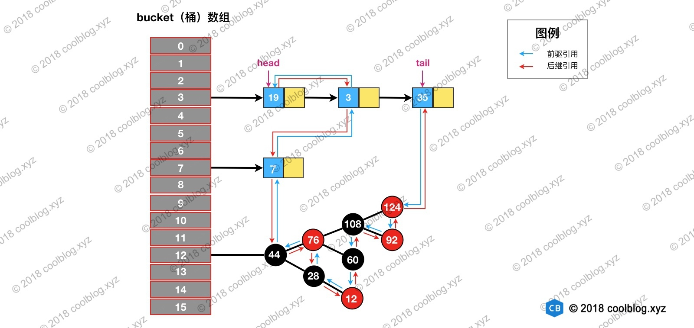
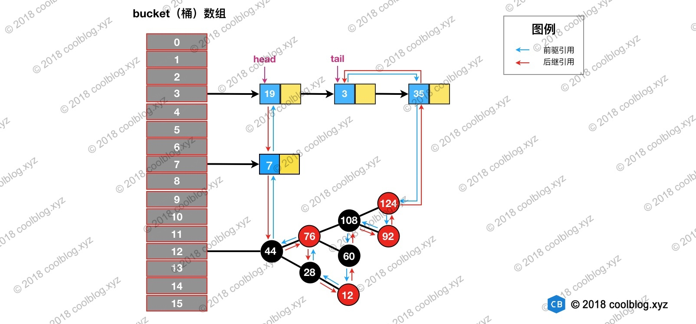
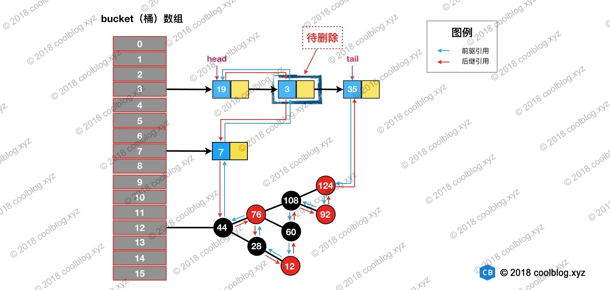

# 总体介绍

*LinkedHashSet*和*LinkedHashMap*在Java里也有着相同的实现，前者仅仅是对后者做了一层包装，也就是说**`LinkedHashSet`里面有一个`LinkedHashMap`（适配器模式）**。因此本文将重点分析`LinkedHashMap`。

*LinkedHashMap*实现了*Map*接口，即允许放入`key`为`null`的元素，也允许插入`value`为`null`的元素。从名字上可以看出该容器是*linked list*和*HashMap*的混合体，也就是说它同时满足*HashMap*和*linked list*的某些特性。**可将`LinkedHashMap`看作采用`linkedlist`增强的`HashMap`。**


事实上*LinkedHashMap*是*HashMap*的直接子类，**二者唯一的区别是\*LinkedHashMap\*在\*HashMap\*的基础上，采用双向链表（doubly-linked list）的形式将所有`entry`连接起来，这样是为保证元素的迭代顺序跟插入顺序相同**

上图给出了*LinkedHashMap*的结构图，主体部分跟*HashMap*完全一样，多了`header`指向双向链表的头部（是一个哑元），**该双向链表的迭代顺序就是`entry`的插入顺序**。

除了可以保迭代历顺序，这种结构还有一个好处：**迭代\*LinkedHashMap\*时不需要像\*HashMap\*那样遍历整个`table`，而只需要直接遍历`header`指向的双向链表即可**，也就是说*LinkedHashMap*的迭代时间就只跟`entry`的个数相关，而跟`table`的大小无关。

有两个参数可以影响*LinkedHashMap*的性能：初始容量（inital capacity）和负载系数（load factor）。初始容量指定了初始`table`的大小，负载系数用来指定自动扩容的临界值。当`entry`的数量超过`capacity*load_factor`时，容器将自动扩容并重新哈希。对于插入元素较多的场景，将初始容量设大可以减少重新哈希的次数。

将对象放入到*LinkedHashMap*或*LinkedHashSet*中时，有两个方法需要特别关心：`hashCode()`和`equals()`。**`hashCode()`方法决定了对象会被放到哪个`bucket`里，当多个对象的哈希值冲突时，`equals()`方法决定了这些对象是否是“同一个对象”**。所以，如果要将自定义的对象放入到`LinkedHashMap`或`LinkedHashSet`中，需要*@Override*`hashCode()`和`equals()`方法。

通过如下方式可以得到一个跟源*Map* **迭代顺序**一样的*LinkedHashMap*：

```java
void foo(Map m) {
    Map copy = new LinkedHashMap(m);
    ...
}
```

出于性能原因，*LinkedHashMap*是非同步的（not synchronized），如果需要在多线程环境使用，需要程序员手动同步；或者通过如下方式将*LinkedHashMap*包装成（wrapped）同步的：

```java
Map m = Collections.synchronizedMap(new LinkedHashMap(...));
```

# 源码分析

## Entry 的继承关系


HashMap 的内部类 TreeNode 不继承它的了一个内部类 Node，却继承自 Node 的子类 LinkedHashMap 内部类 Entry。这里这样做是有一定原因的。LinkedHashMap 内部类 Entry 继承自 HashMap 内部类 Node，并新增了两个引用，分别是 before 和 after。这两个引用的用途不难理解，也就是用于维护双向链表。同时，TreeNode 继承 LinkedHashMap 的内部类 Entry 后，就具备了和其他 Entry 一起组成链表的能力。但是这里需要大家考虑一个问题。当我们使用 HashMap 时，TreeNode 并不需要具备组成链表能力。

## get()

LinkedHashMap 重写了get() 方法，在`afterNodeAccess()`函数中，**会将当前被访问到的节点e，移动至内部的双向链表的尾部。**

```java
public V get(Object key) {
        Node<K,V> e;
        if ((e = getNode(hash(key), key)) == null)
            return null;
        if (accessOrder)
            afterNodeAccess(e);
        return e.value;
    }
```

### 访问顺序的维护过程

LinkedHashMap 是按插入顺序维护链表。不过**我们可以在初始化 LinkedHashMap，指定 accessOrder 参数为 true，即可让它按访问顺序维护链表**。当我们调用`get/getOrDefault/replace`等方法时，只需要将这些方法访问的节点移动到链表的尾部即可.

```java
// LinkedHashMap 中覆写
public V get(Object key) {
    Node<K,V> e;
    if ((e = getNode(hash(key), key)) == null)
        return null;
    // 如果 accessOrder 为 true，则调用 afterNodeAccess 将被访问节点移动到链表最后
    if (accessOrder)
        afterNodeAccess(e);
    return e.value;
}

// LinkedHashMap 中覆写
void afterNodeAccess(Node<K,V> e) { // move node to last
    LinkedHashMap.Entry<K,V> last;
    if (accessOrder && (last = tail) != e) {
        LinkedHashMap.Entry<K,V> p =
            (LinkedHashMap.Entry<K,V>)e, b = p.before, a = p.after;
        p.after = null;
        // 如果 b 为 null，表明 p 为头节点
        if (b == null)
            head = a;
        else
            b.after = a;
            
        if (a != null)
            a.before = b;
        /*
         * 这里存疑，父条件分支已经确保节点 e 不会是尾节点，
         * 那么 e.after 必然不会为 null，不知道 else 分支有什么作用
         */
        else
            last = b;
    
        if (last == null)
            head = p;
        else {
            // 将 p 接在链表的最后
            p.before = last;
            last.after = p;
        }
        tail = p;
        ++modCount;
    }
}
```

下面举例演示一下，帮助大家理解。假设我们访问下图键值为3的节点	



访问后，键值为3的节点将会被移动到双向链表的最后位置，其前驱和后继也会跟着更新。访问后的结构如下：



## put()

LinkedHashMap并没有重写任何put方法。但是其重写了构建新节点的newNode()方法。

newNode()会在HashMap的putVal()方法里被调用，HashMap 的 put()方法会调用putVal() 方法。 实现的逻辑： **根据hash值找到散列位置i，先判断table[i]是否存在node ，如果不存在，则调用newNode()并赋值给table[i]，如果存在，则插入到单链表或红黑树的后面**。

```java
//在构建新节点时，构建的是LinkedHashMap.Entry不再是Node.
Node<K,V> newNode(int hash, K key, V value, Node<K,V> e) {
    LinkedHashMap.Entry<K,V> p =
        new LinkedHashMap.Entry<K,V>(hash, key, value, e);
    linkNodeLast(p);
    return p;
}
```

重新后的newnode 只添加了一条逻辑， 把节点添加到双链表的尾部。

在HashMap 的putVal() 中有一个空方法就是为LinkedHashMap 预留的 ：afterNodeAccess （） 在HashMap 中它是一个空方法， 而在LinkedHashMap 中我们可以看到其实现：

```java
//回调函数，新节点插入之后回调 ， 根据evict 和   判断是否需要删除最老插入的节点。如果实现LruCache会用到这个方法。
void afterNodeInsertion(boolean evict) { // possibly remove eldest
    LinkedHashMap.Entry<K,V> first;
    //LinkedHashMap 默认返回false 则不删除节点
    if (evict && (first = head) != null && removeEldestEntry(first)) {
        K key = first.key;
        removeNode(hash(key), key, null, false, true); }
    }
//LinkedHashMap 默认返回false 则不删除节点。 返回true 代表要删除最早的节点。通常构建一个LruCache会在达到Cache的上限是返回true
protected boolean removeEldestEntry(Map.Entry<K,V> eldest) {
    return false; 
}
```

如果我们要根据LinkedHashMap 实现一个LruCashed ， 我们只需要继承LinkedHashMap ，重写removeEldestEntry， 当当前长度> 缓存长度， 返回true 即可。

注意，这里的**插入有两重含义**：

1. 从`table`的角度看，新的`entry`需要插入到对应的`bucket`里，当有哈希冲突时，采用头插法将新的`entry`插入到冲突链表的头部。
2. 从`header`的角度看，新的`entry`需要插入到双向链表的尾部。

## remove（）

与插入操作一样，LinkedHashMap 删除操作相关的代码也是直接用父类的实现。在删除节点时，父类的删除逻辑并不会修复 LinkedHashMap 所维护的双向链表。在删除及节点后，回调方法 `afterNodeRemoval` 会被调用。LinkedHashMap 覆写该方法，并在该方法中完成了移除被删除节点的操作。

```java
// HashMap 中实现
public V remove(Object key) {
    Node<K,V> e;
    return (e = removeNode(hash(key), key, null, false, true)) == null ?
        null : e.value;
}

// HashMap 中实现
final Node<K,V> removeNode(int hash, Object key, Object value,
                           boolean matchValue, boolean movable) {
    Node<K,V>[] tab; Node<K,V> p; int n, index;
    if ((tab = table) != null && (n = tab.length) > 0 &&
        (p = tab[index = (n - 1) & hash]) != null) {
        Node<K,V> node = null, e; K k; V v;
        if (p.hash == hash &&
            ((k = p.key) == key || (key != null && key.equals(k))))
            node = p;
        else if ((e = p.next) != null) {
            if (p instanceof TreeNode) {...}
            else {
                // 遍历单链表，寻找要删除的节点，并赋值给 node 变量
                do {
                    if (e.hash == hash &&
                        ((k = e.key) == key ||
                         (key != null && key.equals(k)))) {
                        node = e;
                        break;
                    }
                    p = e;
                } while ((e = e.next) != null);
            }
        }
        if (node != null && (!matchValue || (v = node.value) == value ||
                             (value != null && value.equals(v)))) {
            if (node instanceof TreeNode) {...}
            // 将要删除的节点从单链表中移除
            else if (node == p)
                tab[index] = node.next;
            else
                p.next = node.next;
            ++modCount;
            --size;
            afterNodeRemoval(node);    // 调用删除回调方法进行后续操作
            return node;
        }
    }
    return null;
}

// LinkedHashMap 中覆写
void afterNodeRemoval(Node<K,V> e) { // unlink
    LinkedHashMap.Entry<K,V> p =
        (LinkedHashMap.Entry<K,V>)e, b = p.before, a = p.after;
    // 将 p 节点的前驱后后继引用置空
    p.before = p.after = null;
    // b 为 null，表明 p 是头节点
    if (b == null)
        head = a;
    else
        b.after = a;
    // a 为 null，表明 p 是尾节点
    if (a == null)
        tail = b;
    else
        a.before = b;
}
```

删除的过程并不复杂，上面这么多代码其实就做了三件事：

1. 根据 hash 定位到桶位置
2. 遍历链表或调用红黑树相关的删除方法
3. 从 LinkedHashMap 维护的双链表中移除要删除的节点

举个例子说明一下，假如我们要删除下图键值为 3 的节点。



根据 hash 定位到该节点属于3号桶，然后在对3号桶保存的单链表进行遍历。找到要删除的节点后，先从单链表中移除该节点。如下：


然后再双向链表中移除该节点：


# 基于 LinkedHashMap 实现缓存

通过继承 LinkedHashMap 实现了一个简单的 LRU 策略的缓存。

当我们基于 LinkedHashMap 实现缓存时，通过覆写`removeEldestEntry`方法可以实现自定义策略的 LRU 缓存。比如我们可以根据节点数量判断是否移除最近最少被访问的节点，或者根据节点的存活时间判断是否移除该节点等。本节所实现的缓存是基于判断节点数量是否超限的策略。在构造缓存对象时，传入最大节点数。当插入的节点数超过最大节点数时，移除最近最少被访问的节点。实现代码如下：

```java
public class SimpleCache<K, V> extends LinkedHashMap<K, V> {

    private static final int MAX_NODE_NUM = 100;

    private int limit;

    public SimpleCache() {
        this(MAX_NODE_NUM);
    }

    public SimpleCache(int limit) {
        super(limit, 0.75f, true);
        this.limit = limit;
    }

    public V save(K key, V val) {
        return put(key, val);
    }

    public V getOne(K key) {
        return get(key);
    }

    public boolean exists(K key) {
        return containsKey(key);
    }
    
    /**
     * 判断节点数是否超限
     * @param eldest
     * @return 超限返回 true，否则返回 false
     */
    @Override
    protected boolean removeEldestEntry(Map.Entry<K, V> eldest) {
        return size() > limit;
    }
}
```

测试代码

```java
public class SimpleCacheTest {

    @Test
    public void test() throws Exception {
        SimpleCache<Integer, Integer> cache = new SimpleCache<>(3);

        for (int i = 0; i < 10; i++) {
            cache.save(i, i * i);
        }

        System.out.println("插入10个键值对后，缓存内容：");
        System.out.println(cache + "\n");

        System.out.println("访问键值为7的节点后，缓存内容：");
        cache.getOne(7);
        System.out.println(cache + "\n");

        System.out.println("插入键值为1的键值对后，缓存内容：");
        cache.save(1, 1);
        System.out.println(cache);
    }
}
```

在测试代码中，设定缓存大小为3。在向缓存中插入10个键值对后，只有最后3个被保存下来了，其他的都被移除了。然后通过访问键值为7的节点，使得该节点被移到双向链表的最后位置。当我们再次插入一个键值对时，键值为7的节点就不会被移除。