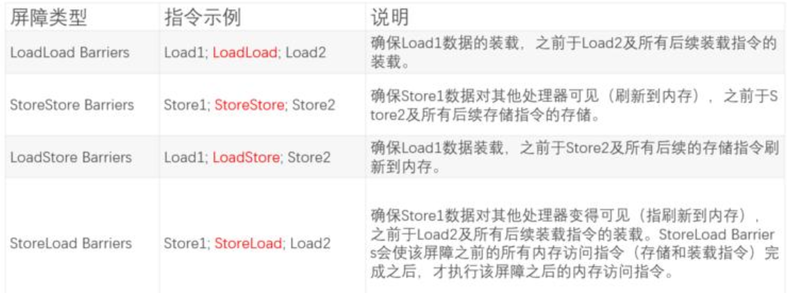
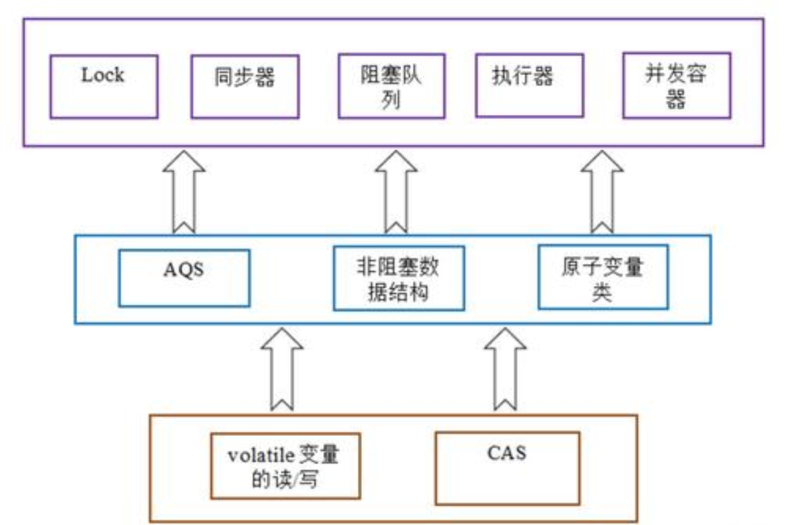

# java 内存模型

## java 内存模型的基础

### 并发编程的两个问题：  

 - 线程间的通讯机制模型： __共享内存__ ,__消息传递__

 - 线程之间如何通讯  
    - 共享内存(隐式通讯)： 在共享内存的并发模型里，线程之间共享程序的公共状态，通过读-写 内存中的公共状态进行通讯
    - 消息传递（显示通讯）：线程之间没用公共状态， 只能通过显式发布消息。
<!--more-->
- 线程之间如何同步：
  - 同步：程序中用于控制不同线程间操作发生相对顺序的机制。
  - 共享内存（显式同步）：必须显式指定某个方法或者某段代码必须要在线程间互斥执行
  - 消息传递（隐式）：消息的发送必须在消息的接受之前，因此是隐式的
  - JAVA 的并发采用的是 **共享内存** 模型.所以通讯是隐式的，

### java 内存模型的抽象结构

  - 共享变量（堆内存中）：实例域、静态域、数组元素
  - 私有变量： 局部变量、方法定义参数、异常处理参数
  - java的内存模型（JMM）结构  


  >内存说明： 在主内存（Main memory）： 线程之间共享变量的存储内存 
  本地内存（Local Memory：JMM 的一个抽象概念，本身不存在）：每个线程都有一个私有的memory，本地内存中存储了该线程读-写 共享变量的副本 。  

  涵盖：缓存，缓冲区、寄存器、其他的硬件和编译器优化

  - JMM通过控制主内存 和 每个线程的本地内存的交互，来提供内存可见性保证

### 指令重排序：

为了提高性能，编译器和处理器常常会对指令做重排序。分为三种

  - 编译器优化的重排序（在不改变单线程的程序语义的前提条件下，可以重新安排语句的执行顺序）
  - 指令并行执行的重排序（如果不存在数据依赖，处理器可以改变语句对应机器指令的执行顺序）
  - 内存系统的重排序（处理器使用缓存和读、写缓冲区，使得加载和存储操作可能存在乱序执行）
  - _重排序_：
    - 数据依赖性：两个操作中，有一个为写操作，则存在数据依赖性
    - as-if-serial 语义：不管怎么重排序，单线程程序的执行结果不能改变。  
    __注：__ 编译器、runtime、处理器 都必须遵守 as-if-serial 规则不能被改变
    - 程序顺序规则：在不改变程序结果的，尽可能提高并行度
  - 重排序对多线程的影响：存在控制依赖性的重排序会影响程序的执行结果


 - java：

```shell
    源代码 --> 编译器优化重排序 -> 指令级并行重排序 -> 内存系统重排序 -> 最终待执行序列
```

 - 重排序可能导致许多内存可见性问题。
 - JMM 通过禁止特定类型的编译器重排序和处理器重排序来提供一致的内存可见性保证

## 并发编程的模型的分类

    - StoreLoad Barriers（JMM 内存屏障）
    
    

## happens-before 简介 

   如果一个操作执行结果要对另一个操作可见，那么这两个操作之间存在着happens-before 规则（同一个线程或者不同线程 都适用）。
  - __规则:__
    1. 程序顺序规则：一个线程中的每个操作，happens-pefore 该线程的后续任意操作
    
    2. 监视器规则：一个锁的解锁，happens-before 对于后续堆这个锁的加锁
    
    3. volatile 变量规则：对于任意一个volatile域的写，happens-before 对于任意后续对这个volatile变量的读。
    
    4. 传递性：如果A happens- before B 且B happens-before C， 则A happens- before C。
    
       
# 重排序

编译器和执行器为了优化程序的执行性能而对指令系列进行重新排序的一种手段。

## 数据依赖性

- 如果两个线程访问同一个变量，且这两个操作中有一个为写操作，此时，这两个操作之间存在数据依赖性。
- 编译器和处理器不会改变存在数据依赖性的两个操作的执行顺序（单线程或者单个处理器中执行的指令序列）。

## as-if-serial 语义

不管怎么重排序，（单线程）程序的执行效果不能被改变。

## 程序顺序规则

A happens B：JMM 仅要求前一个操作A的操作结果对后一个操作B可见，且前一个操作A按顺序排在后一个操作B之前。并不要求前一个操作A必须在后一个操作B之前执行。

## 重排序对多线程的影响

在单线程程序中，存在控制依赖的操作重排序，不会改变执行结果。但是在多线程中，存在控制依赖的操作重排序，可能会改变程序的执行结果。

# 顺序一致性
## 数据竞争与顺序一致性

  - 程序未正确同步时，就可能存在数据竞争。
  - java内存模型规范对数据竞争的定义：一个线程中写一个变量，另一个线程读取同一个变量。且读和写没有通过同步来排序。
  - JMM 对正确同步的多线程程序做了如下保证：
    1. 正确同步的程序，程序的执行将具有顺序一致性。
    2. 正确同步包括synhronized、vilatile、final 的正确使用
## 顺序一致性内存模型

**JMM 非顺序一致性内存模型，所以顺序一致性内存模型的相关特效，对JMM并不适用。**

顺序一致性模型的特性：

 1. 一个线程中的所有操作必须按照程序的顺序来执行
 2. 不管程序同步与否，所有的线程只能看到一个单一的执行顺序
 3. 每个操作都必须原子执行，且立刻对所有线程可见

# volatile 的内存语义

## volatile 特性

1. volatile 特性： 可见性、原子性
  - 可见性：对于一个volatile变量的读，总是能看到任意线程读第这个volatile变量的最后写入。
  - 原子性：对任意单个volatile变量的读写都具有原子性。但volatile++ 操作不具有原子性。
## volatile 写-读 建立的appens-before关系

2. volatile 写-读 建立的appens-before关系（（volatile）写-（锁）释放 ；(volatile) 读- （锁） 获取）
  - volatile 的写和锁的释放有相同语义。
  - volatile 的读和锁的获取有相同语义。
  - volatile 写- 读 _**内存语义**_  
  > 当写入一个volatile变量时，JMM 会把该线程对应的本地内存中的共享变量值（所有的值）刷新到主内存
  当读取volatile变量时，JMM 会把该线程对应的本地内存设置未无效。线程接下来会从主内存中获取共享变量
  线程A 写一个volatile变量，实质上是线程A通过主内存向线程B发送消息。

## 内存语义的实现 

### volatile 重排序规则

|是否能重排序 | 第二个操作| ~| ~|
|-------------|-------------------|-------------|--------------|
|第一个操作    | 普通读/写        |volatile 读|  volatile 写           |
|普通读写      |     |      | NO |
|volatile 读   | NO | NO | NO |
|volatile写    |    | NO | NO |

- 第三行的最后一个意思是:在程序中,当第一个操作为普通变量的读写时,第二个操作为volatile 的写,则编译器不能重排序这两个操作.
- 说明:
  1. 当第二个操作是 volatile 写时，不管第一个是什么操作，都不能重排序。（确保volatile 写之前的操作不会重排序到volatile 写之后）
  2. 当第一个操作是volatile 读时，不管第二个是什么操作，都不能重排序。（确保volatile 读操作不会重排序到volatile 读之前）
  3. 第一个操作是volatile写，第二个操作是volatile 读，则不能重排序。
- 为了实现volatile 内存语义,编译器在生成字节码时,会在指令序列中插入内存屏障,来禁止特定类型的处理器重排序.
- volatile 内存屏障(保守):
  1. 在每个volatile写操作的前面插入一个storeStore 屏障
  2. 在每个volatile的写操作后面插入一个storeLoad 屏障
  3. 在每个 volatile 的读操作后面插入一个loadLoad 屏障
  4. 在每个volatile 的读后面会插入一个loadStore 屏障

  - JSR-133 增强了volatile 的内存语义 
      严格限制编译器和处理器对volatile 变量与普通变量的重排序,确保volatile的写-读 和 锁的 释放- 获取有相同的语义.

# 锁的内存语义 #
## 锁的释放-获取 建立的happens-before 关系

锁的释放 happens-before 于锁的获取。

## 锁的释放和获取的内存语义

- 锁的释放：JMM 会把该线程对应的本地内存中的共享变量刷新到主内存中。
- 锁的获取：JMM 会把本地内存设置为无效。从而使得被监视器保护的临界区代码必须从主内存中读取共享变量。

锁的 释放 和 volatile 的写有相同内存语义,锁的 获取和volatile 的读有相同的内存语义:

  - 线程A释放一个锁,实质上是线程A向获取这个锁的某个线程发出的（线程A对共享变量修改的）信息.
  - 线程B 获取一个锁，实质上是线程B 接受到了之前某个线程发出的（在释放这个锁之前对共享变量作出修改的）消息。
  - 线程A 释放锁，随后线程B获取这个锁，这个过程实质上是线程A通过主内存向线程B发送消息。


## 锁的内存语义实现

借助于ReentrantLock 来分析锁的内存语义实现。

ReentrantLock 的实现依赖于Java 同步器框架AbstractQueueSynchronizer （AQS），AQS 内部使用一个整形的volatile 变量（state）来维护状态。

### 公平锁和非公平锁的内存语义：

  - 公平锁和非公平锁释放时，最后都要写一个volatile 变量state；
  - 公平锁获取时，会首先读volatile变量
  - 非公平锁获取时，首先会用CAS 更新volatile变量，这个操作同时具有volatile读和写的内存语义。
#### 锁的内存释放-获取内存语义的实现：

  - 利用volatile变量的写-读所具有的内存语义。
  - 利用CAS 所附带的volatile读和volatile写的内存语义

## concurrent 包的实现：

  - java CAS同时具有volatile读和volatile 写的内存语义。
  - 线程通讯方式：
    1. A 线程写volatile变量，随后B线程读这个Volatile变量
    2. A 线程写volatile变量，随后B线程用CAS更新这个volatile变量。
    3. A线程用CAS更新一个volatile变量，随后B线程用CAS更新这个Volatile变量。
    4. A线程用CAS 更新一个volatile变量,随后B线程读这个volatile变量。
  - volatile 变量的读写 和 CAS 操作是 concurrent 包实现的基石。
  - 通用实现：
    1. 声明变量为volatile
    2. 使用CAS原子条件更新来实现线程之间的同步。
    3. 配合volatile 的读/写和CAS 所具有volatile读和写的内存语义来实现线程之间的通信。

### concurrent 实现示意图




# final 的内存语义

## final 域的重排序规则

  - 在构造函数内,对一个final域的写入,与随后把这个被构造对象的引用赋值给一个引用变量,这两个操作之间不能重排序.
  - 初次读一个包含final 域对象的引用,与随后初次读这个final域,两个操作之间不能重排序.

## 写final 域的重排序规则

  - JMM 禁止编译器把final域的写重排序到构造函数之外.
  - 编译器会在final域的写入之后,构造函数return 之前,插入一个StoreStore屏障.这个屏障禁止处理器把final域的写重排序到构造函数之外.   
  - 编译器会在读final域操作的前面插入一个LoadLoad屏障。（JMM处理器会禁止这两个操作的重排序。）

  __注:__ 写final 域的重排序规则可以保证:在对象引用为任意线程可见之前,对象的final 域已经被初始化过了.而普通域没有这个保障.

## 读final域的重排序规则.   

在读对象的final 域之前，一定会限度包含这个final域的引用。即：如果对象的引用读取对象不为null，这这个对象的final域已经被初始化了。

## final 域为引用类型

  - 对于引用类型，写final域的重排序规则对处理器和编译器做了如下约束：在构造器内对final 引用的对象的成员域的写入（引用对象的创建和将该对象赋值给final域），与随后在构造函数外把这个被构造对象的引用赋值给一个引用变量，这两个操作之间不能重排序。

## 为什么final引用不能从构造函数“溢出”：

  - 对象引用不能在构造函数中 "溢出"：在构造函数的内部，不能让这个被构造对象的引用为其他线程所见。（对象在构造过程中（构造函数返回之前）不能对外可见。）。即：对象引用不能再构造函数中“逸出”。
## final 语义在处理器中的实现：

- 略（说明了x86 处理器的特殊之处）

## JSR-133 为什么要增强final 的语义：

- 为开发人员提供初始化安全保证：只要对象是正确构造（对象没有在构造过程中溢出），那么不需要使用同步，就可以保证任意线程都能看到这个final域在对象构造函数中被初始化的值。

# happens-before (as-if-serial)
## JSR-33 定义 happens-before:

1. 如果一个操作happens-before 另一个操作,那么第一个操作的结果对第二个操作可见.且第一个的操作顺序排在第二个操作之前.(__JMM 对程序员的承诺__)
2. 两个操作之间存在happens-before 关系,并不意味着java平台的具体操作按照happens-before 关系来指定顺序执行.如果重排序后的执行结果与按照happens-before 关系来执行的结果一致.那么这种重排序是合法的.(JVM 允许 happens-before 规则重排序)(__JMM对编译器和处理期重排序规则的约束__)

## happens-before 和as-if-serial 关系

- happens-before 本质上和 as-if-serial 语义时一回事
- As-if-serial 语义保证单线程内程序的执行结果不被改变。happens-before 关系保证同步的多线程程序执行结果不被改变。

## happens-before 规则(JSR-133):

 1. 程序顺序规则:一个线程中的每个操作,happens-before 于该线程的任意后续操作.
 2. 监视器锁规则: 对一个锁的解锁,happens-before 于对该线程的加锁.
 3. volatile 变量规则:对任意一个volatile变量的写,happens-before 对该变量的读.
 4. 传递性:如果 A happens-before B,且 B happens-before C , 则 A happens-before C.
 5. start() 规则: 如果 线程 A 执行操作 ThreadB.start()(启动线程B),那么A线程的ThreadB.start() happens-before B线程的任意操作.
 6. join 规则: 如果A 线程执行 操作 ThreadB.join()并成功返回.那么B线程的任意操作happens-before 于线程 A 从 ThreadB.jion() 操作成功返回.

# 双重检查锁定于延迟初始化:
双重检查锁定是常见的延迟初始化技术.

在java 多线程中，有时候需要采用延迟初始化来降低初始化类和创建对象的开销。双重检查锁定 时常见的初始化技术。

## 典型示例: 单例模式

  - 可能错误: 单例对象的操作非原子性.多线程操作是,虽然判断对象不为空.但是对象并未初始化完成.
  - 错误原因:对象的创建分为三步:
     > 1. 分配对象内存空间 memory = allocate()
     > 2. 初始化对象 ctorInstance(memory)
     > 3. 设置instance 指向刚分配的内存

       __2 和 3 可以重排序.导致问题出现.__

  - 解决方案:
    1. (基于Volatile 的解决方案)将单例对象设置为 volatile 域（2和3 的重排序会被禁止）
    2. 基于类初始化的解决方案.
    > JVM 在类的初始化阶段(在class 被加载后,且被线程使用之前),回执行类的初始化. 在执行类的初始化期间,JVM 会获取一个锁.这个锁可以同步 多个线程对一个类的初始化.

## 类的初始化（JVM 保证线程安全）  

(遇到 new、getstatic、putstatic或invokestatic这 4 条字节码指令时，如果类未进行过初始化，那么需首先触发类的初始化) 
JVM 在类的初始化阶段(在class 被加载后,且被线程使用之前),会执行类的初始化. 在执行类的初始化期间,JVM 会获取一个锁.这个锁可以同步 多个线程对一个类的初始化.      
Java 编译器把所有的类变量初始化语句和类型的静态初始化器通通收集到 `<clinit> `方法内，该方法只能被 Jvm 调用，专门承担初始化工作

### 触发类初始化的条件:

 * T 是一个类,而且T声明的静态方法被调用.(_调用一个类的静态方法时_)
 * T 是一个类,而且一个T类型的实例被创建.(_使用 new 关键字实例化对象时_)
 * T 中申明的一个静态字段被赋值(_设置类的静态变量时_)
 * T 中声明的一个静态字段被使用,而且这个字段不是一个常量字段(_读取类的静态变量时（被 final修饰，已在编译期把结果放入常量池的静态字段除外）_)
 * T 是一个顶级类(Top Level Class),而且而且一个断言语句嵌套在T内部执行.

### 类不会初始化（clinit）的条件

* 该类没有声明任何变量，也没有初始化语句
* 该类声明了类变量，但没有明确使用变量初始化语句或者静态初始化语句
* 该类仅包含静态 final 变量的类变量初始化语句，并且类变量初始化语句是编译时常量表达式。

# java 内存模型综述  
## 处理器的内存模型 

__分类__:

  1. 放松程序中写-读操作顺序.(Total Store Ordering (TSO 内存模型))
  2. 在1 的基础上继续放松写-写 和读-读操作顺序.(Partial Store Order(PSO) 内存模型)
  3. 在 1,2 的基础上继续放松 读-写 和读-读的操作顺序.(Relaxed Memory serial(RMO) 内存模型 和 PowerPC 内存模型)
2. 各种内存模型之间的关系(由弱到强/由难到易)   
   
   > 处理器内存模型  \ 语言内存模型 \  顺序一致性内存模型 
3. JMM 内存可见性保证
  - 单线程
  - 正确同步的多线程程序
  - 未同步\ 未正确同步的多线程程序  

  __注意__: 最小安全性保障 和 64 位数据的非原子性同步
    - 最小安全性发生在被对象的任意线程使用之前.
    - 64 位数据的非原子性写 发生在对象被多个线程使用的过程中(写共享变量).
    - 最小安全性读到的值要么是之前某个线程写入的值,要么是默认值(0,null, false ..),才会被线程使用
    - 64 位数据非原子性的写入 是某个线程读取到了另一个线程未完全写入的值(写了一半).
