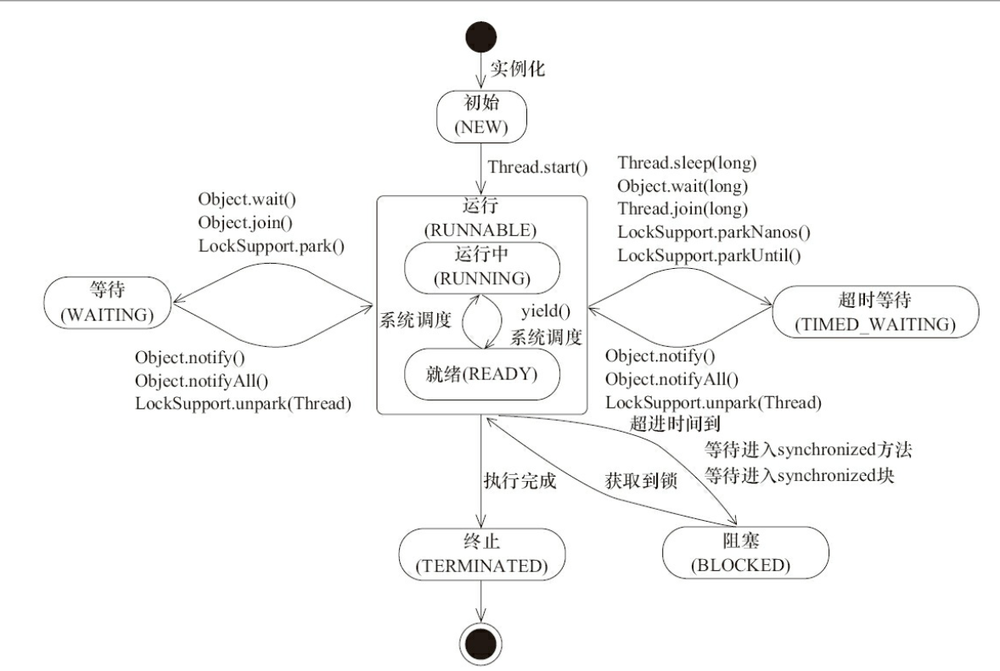
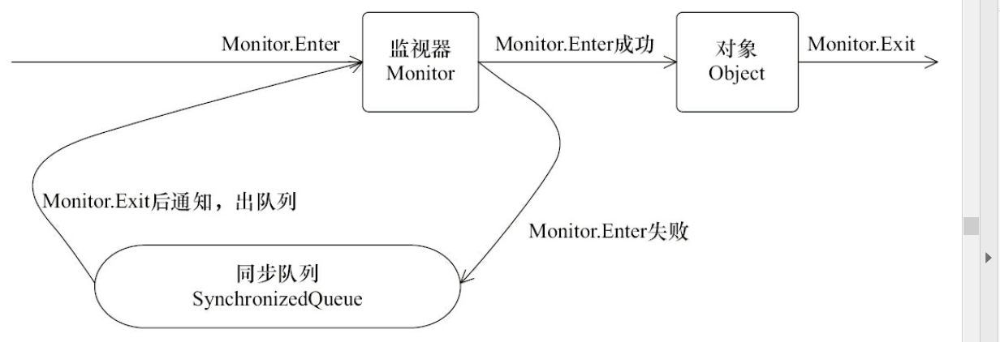
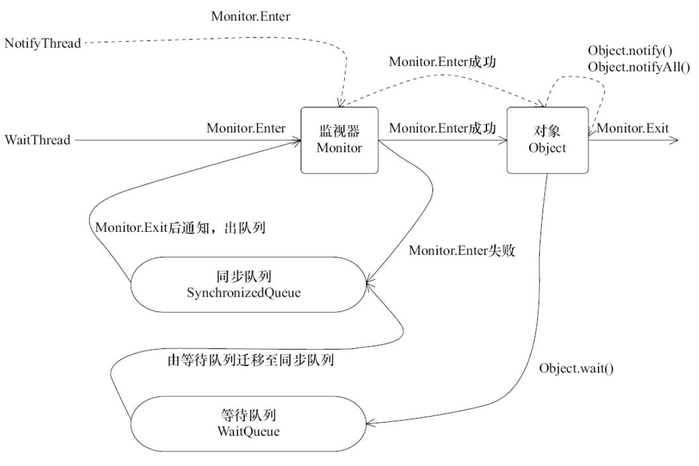

### 并发编程基础

#### 线程简介
1. 什么是线程 （现代操作系统调度的最小单元）
2. 为什么要使用线程
  - 更多的处理器核心
  - 更快的响应时间
  - 更好的编程模型
3. 线程优先级 （priority）
 - 默认级别是 5，优先级的范围是 1-10
 - 优先级高的线程分配的时间碎片多于优先级低的线程。
 - 操作系统不同，线程的优先级可能表现出不同的效果
 - 线程优先级具有继承特性比如A线程启动B线程，则B线程的优先级和A是一样的。

 - 线程优先级设置：
  1. 对于频繁阻塞（休眠或者IO操作）的线程设置较高的优先级（分配较多的时间碎片），（避免线程频繁切换）
  2. 对于偏重计算（需要较多cpu时间或者偏运算）的线程，则设置较低的优先级，保证处理器不会被独占。
4. 线程状态
  - new 初始状态（还没有调用start 方法）
  - runnable 就绪和运行状态
  - blocked 阻塞于锁的状态
  - waiting 等待
  - time wating 超时等待
  - terminaled 终止状态
  
5. daemon 守护线程  
 - 用 thread.setDaemon(true) 将线程设置为守护线程
 - 守护线程的设置必须在线程启动前,不能再线程启动后设置
 - 在构建daemon 线程时，不能依靠finally 中的语句块来确保关闭或者清理资源的逻辑。
#### 线程的启动和终止
-  线程启动，调用start 方法
  - 启动一个线程前，最好为这个线程设置线程名称，因为这样在使用jstack分析程序或者进行问题排查时，就会给开发人员提供一些提示，自定义的线程最好能够起个名字。
- 中断
    - 中断是线程的一个标识属性，表示一个运行中的线程是否被其他线程进行了中断操作。（其他线程给该线程打了个招呼）
    - 许多声明抛出InterruptedException的方法（例如Thread.sleep(long millis)方法）这些方法在抛出InterruptedException之前，Java虚拟机会先将该线程的中断标识位清除，然后抛出InterruptedException，此时调用isInterrupted()方法将会返回false
    - 线程通过检查自身是否被中断来进行响应，线程通过方法isInterrupted()来进行判断是否被中断，也可以调用静态方法Thread.interrupted()对当前线程的中断标识位进行复位.线程自身可以通过isInterrupted 方法来判断是否被中断。
    - 如果该线程已经处于终结状态，即使该线程被中断过，在调用该线程对象的isInterrupted()时依旧会返
回false。
- 过期的 ~~suspend~~（暂停），~~resume~~（恢复），~~stop~~（停止）  
 以上操作导致不能有效的释放资源，或者导致死锁问题
  - 原因:
    1. 以suspend()方法为例，在调用后，线程不会释放已经占有的资源（比如锁），而是占有着资源进入睡眠状态，这样容易引发死锁问题。
    2. stop()方法在终结一个线程时不会保证线程的资源正常释放，通常是没有给予线程完成资源释放工作的机会，因此会导致程序可能工作在不确定状态下。

- 安全的终止线程  
 使用标志位来停止线程。（interrupted 方式）
#### 线程通讯

##### volatile 和 synchronized 关键字
  - volatile可以用来修饰字段（成员变量），就是告知程序任何对该变量的访问均需要从共享内存中获取，而对它的改变必须同步刷新回共享内存，它能保证所有线程对变量访问的可见性
  - synchronized 关键字可以修饰方法或者同步代码块的方式来使用,他主要确保多线程在同一时刻,只有一个线程处于方法或者同步代码块中,他保证了线程对变量访问的排他性和可见性.

> 任意一个对象都拥有自己的监视器，当这个对象由同步块或者这个对象的同步方法调用时，执行方法的线程必须先获取到该对象的监视器才能进入同步块或者同步方法，而没有获取到监视器（执行该方法）的线程将会被阻塞在同步块和同步方法的入口处，进入BLOCKED状态

##### 等待/通知机制
- 方法说明:

调用wait()、notify()以及notifyAll()时需要注意的细:
  1. 使用wait()、notify()和notifyAll()时需要先对调用对象加锁。
  2. 调用wait()方法后，线程状态由RUNNING变为WAITING，并将当前线程放置到对象的等待队列。
  3. notify()或notifyAll()方法调用后，等待线程依旧不会从wait()返回，需要调用notify()或notifAll()的线程释放锁之后，等待线程才有机会从wait()返回。
  4. notify()方法将等待队列中的一个等待线程从等待队列中移到同步队列中，而notifyAll()方法则是将等待队列中所有的线程全部移到同步队列，被移动的线程状态由WAITING变为BLOCKED。
  4. 从wait()方法返回的前提是获得了调用对象的锁。

> 等待/通知机制依托于同步机制，其目的就是确保等待线程从wait()方法返回时能够感知到通知线程对变量做出的修改

说明:
1. WaitThread首先获取了对象的锁，然后调用对象的wait()方法，从而放弃了锁并进入了对象的等待队列WaitQueue中，进入等待状态
2. 由于WaitThread释放了对象的锁，NotifyThread随后获取了对象的锁，并调用对象的notify()方法，将WaitThread从WaitQueue移到SynchronizedQueue中，此时WaitThread的状态变为阻塞状态
3. NotifyThread释放了锁之后，WaitThread再次获取到锁并从wait()方法返回继续执行。

### 管道输入/输出流  
管道输入/输出流和普通的文件输入/输出流或者网络输入/输出流不同之处在于，它主要
__用于线程之间的数据传输__ ，而传输的媒介为 __内存__

- 分类
 - 面向字节
   - PipedOutputStream
   - PipedInputStream
 - 面向字符
   - PipedReader
   - PipedWriter
  - 对于Piped类型的流，必须先要进行绑定，也就是调用connect()方法，如果没有将输入/输
出流绑定起来，对于该流的访问将会抛出异常。

### Thread.join()的使用
- 作用: 如果一个线程A执行了thread.join()语句，其含义是：当前线程A等待thread线程终止之后才从thread.join()返回.
- 分类
 - join()
 - join(long millis)
 - join(long millis,int nanos)

> 当线程终止时，会调用线程自身的notifyAll()方法，会通知所有等待在该线程对象上的线
程。可以看到join()方法的逻辑结构与4.3.3节中描述的等待/通知经典范式一致，即加锁、循环
和处理逻辑3个步骤

### ThreadLocal的使用
> ThreadLocal，即线程变量，是一个以ThreadLocal对象为键、任意对象为值的存储结构。这
个结构被附带在线程上，也就是说一个线程可以根据一个ThreadLocal对象查询到绑定在这个
线程上的一个值
