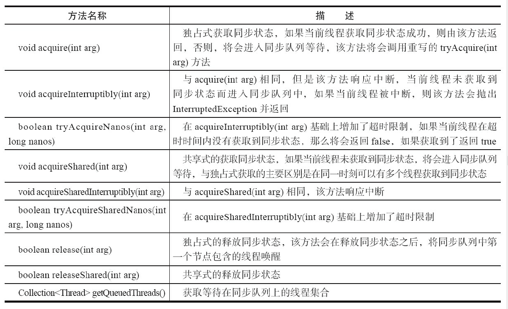
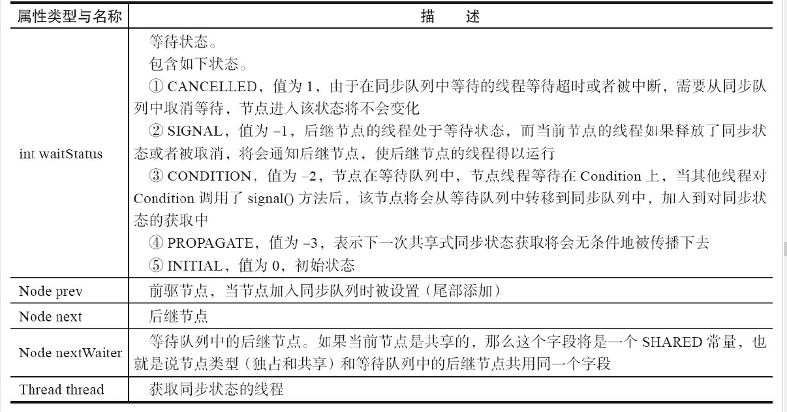
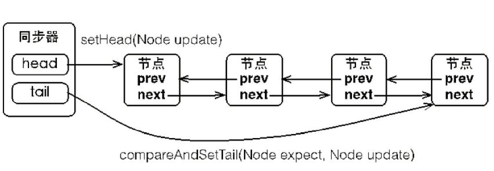
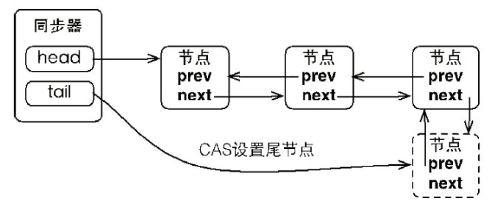
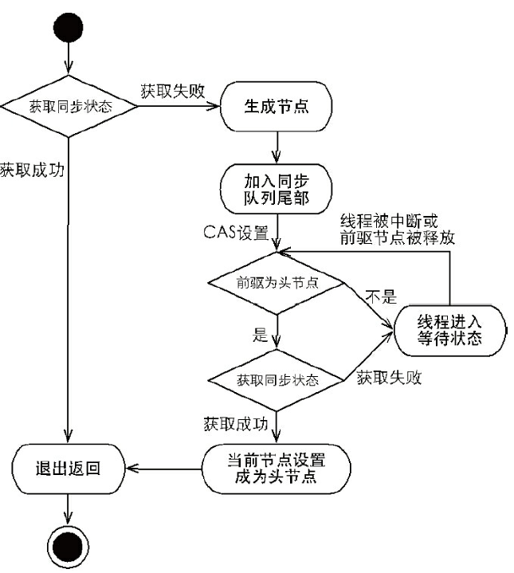
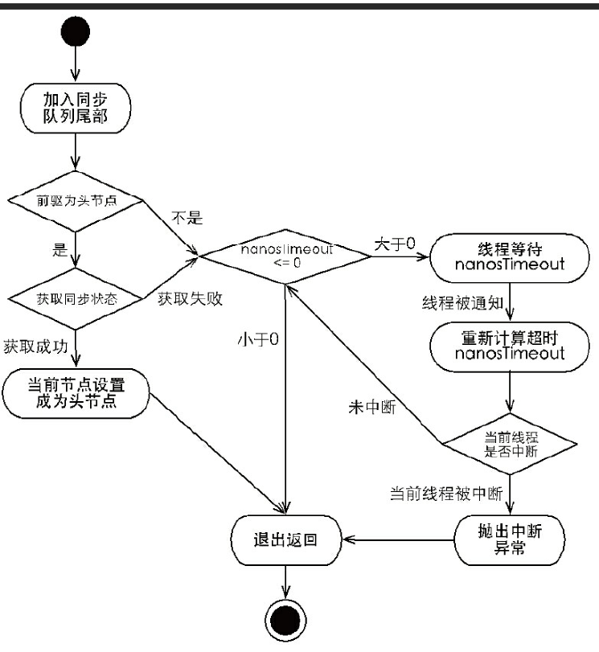
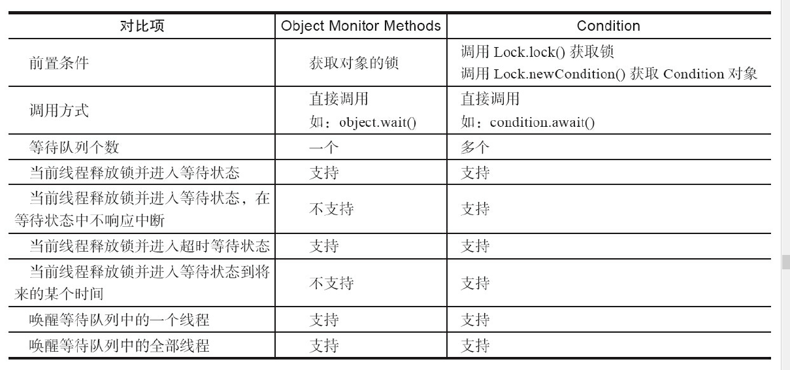
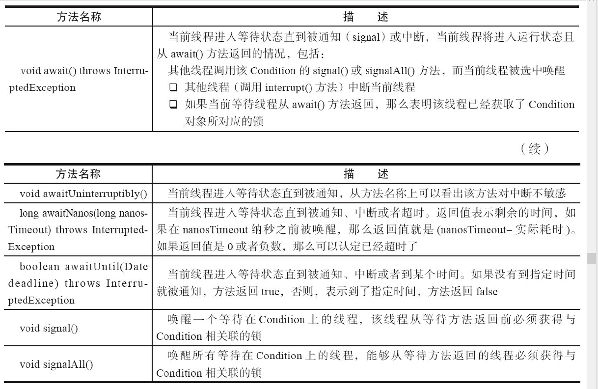
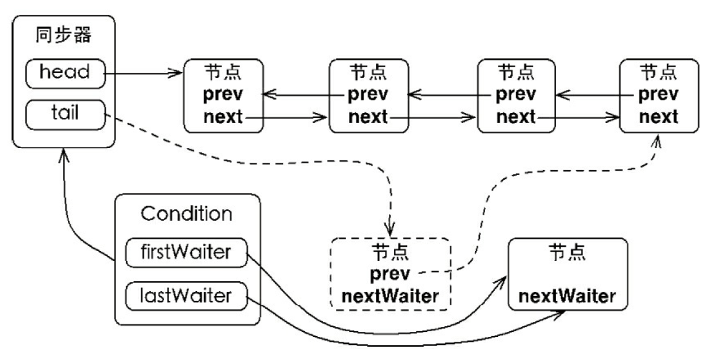

# Lock 接口
> 锁是用来控制多个线程访问共享资源的一种方式。

# 锁的使用
```Java
Lock lock = new ReentrantLock();
lock.lock();
try{
}finally{
  lock.unlock();
}
```

<!--more-->

## Lock 锁拥有的synchronized 不具备的特性
|特性|描述|
|----|----|
|尝试非阻塞性的获取锁|当前线程尝试获取锁，如果这一时刻锁没有被其他线程获取到，则成功获取并持有锁|
|能被中断地获取锁| 可以中断地获取锁，和lock()方法的不同之处是该方法可以响应中断，即在锁获取中可以中断当前线程|
|超时获取锁|在指定时间之前获取到锁，如果戒指时间到了，仍然获取不到锁，则返回|

#### Lock 接口api
| 方法名称 |方法描述       |
|----------|--------------|
|`void lock()`|获取锁，调用该方法，当前线程会获取锁，当锁获取后，该方法返回|
|`void lockInterruptibly() throw interruptedException`| 可以中断地获取锁，与lock()的不同之处是该方法会响应中断，即锁在获取当中可以中断当前线程|
|`boolean tryLock(long time, TimeUint unit) throw InterruptedException` | 超时获取锁，三种情况会返回：1.当前线程在超时之前获取到了锁；2，当前线程在超时时间内被打断 3. 超时时间结束，返回false |
|`void unlock()`| 释放锁|
|`Condition newCondition()`|获取等待通知组件，该组件和当前的锁绑定，只有当前线程获得了锁，才能调用该组件的wait() 方法，而调用后，当前线程释放锁|

# 队列同步器 AbstractQueuedSynchronizer
- 用来构建锁或者其他同步组件的基础框架，他使用了一个int 成员变量（state）表示同步状态， 通过内置的FIFO 队列来完成资源获取线程的排队工作。
- `abstractQueuedSynchronizer `(AQS) 主要的使用方式是继承，子类主要通过继承并实现其抽象方法来实现同步状态，抽象方法的实现过程中，避免不了要对同步状态的修改这就需要同步器提供三个方法:
  1. `getState()`
  2. `setState(int newState)`
  3. `compareAndSetSetState(int expect, int update)`
- 以上三个方法保证状态的改变是安全的.
- 子类被推荐为自定义同步组件的静态内部类。
- AQS 自身没有实现任何同步接口，他仅仅是定义了若干同步状态的获取和释放的方法来供自定义同步组件来使用
- AQS 支持两种获取同步状态的方式：独占式，共享式。这样可以方便不同类型的同步组件（ReentrantLock 和 ReentrantReadWriteLock 和 CountDownLatch）

> AQS 和锁 之间的关系，AQS 是实现锁（也可以是任意同步组件）的关键，在锁的实现中聚合 AQS，利用AQS 实现锁的语义。
1. 锁是面向使用者的，他定义了使用者与锁交互的接口。隐藏了锁的实现细节
2. AQS 是面向 锁的实现者的，AQS 简化了锁的实现方式，
3. AQS 为锁的实现提供了 ：a.同步状态的管理 b. 线程排队， c. 等待与唤醒的底层操作。
4. 锁和 AQS 很好的隔离了使用者和实现者各自所关注的不同领域。

## 同步器接口
AQS的设计是基于模板方法的。所以，使用者只需要继承AQS并重写指定的方法，随后将AQS 组合在自定义同步组件的实现中，并调用同步器提供的模板方法， 而这些模板方法将会调用使用者重写的方法。

- 同步状态的管理：(不可重写)
  1. `getState()`获取当前同步状态
  2. `setSTate(int newState)` 设置当前同步状态
  3. `compareAndSetSeate(int expect, int update) `使用cas 设置当前同步状态，该方法保证设置的原子性

- 同步器可重写的方法
|方法名|                                     描述|
|-------------------------|---------------------------------------|
|`protected boolean tryAcquire(int arg)` | 独占式获取同步状态，该方法需要查询当前的同步状态是否否和预期，然后再进行cas 设置同步状态|
|`protected boolean tryRelease(int arg)`| 独占式释放同步状态，等待获取同步状态的线程将有机会获取同步状态|
|`protected int tryAcquireShared(int arg)`| 共享式获取同步状态，返回值大于0，表示获取成功，反之获取失败|
|`protected boolean tryReleaseShared(int arg)`|共享式释放同步状态|
|`protected boolean isHeldExclusively()`|当前同步器是否在独占模式下被线程占用，一般该方法表示是否被当前线程占用|

- 实现自定义组件 时， 将会调用同步器提供的模板方法，这些（部分）模板方法与描述如下：


AQS 模板方法分为三类：
1. 独占式获取与释放同步状态
2. 共享式获取与释放同步状态
3. 查询同步队列中的等待线程情况

## 队列同步器的实现分析
- 队列同步器式如何实现线程同步的，主要包括一下数据结构与模板方法：
  1. 同步队列、
  2. 独占式同步状态获取与释放
  3. 共享式同步状态获取与释放
  4. 超时获取同步状态等

### 同步队列
同步器依赖与内部的一个同步队列（FIFO双向队列）来完成同步状态的管理：
  - 当前线程获取同步状态失败时：同步器会将当前线程以及同步状态构建成一个NODE 节点，并且将其加入到同步队列，同时阻塞当前线程。
  - 当同步状态释放时：会把首节点中的线程唤醒，使其再次尝试获取同步状态。

- 同步队列中的节点（NODE） 的作用：
  - 保存获取同步状态失败线程的引用
  - 等待状态
  - 前驱节点
  - 后继节点
  - 节点的属性类型
  - 名称以及描述



#### 节点是构成同步队列

节点是构成同步队列的基础，同步器拥有首节点（head）和尾节点（tail），没有成功获取同步状态的线程将会成为节点加入该队列的尾部。



- 同步器包含了两个节点类型的引用，一个指向头节点，而另一个指向尾节点
- 同步器提供了一个基于CAS的设置尾节点的方法：`compareAndSetTail(Node expect,Node update)` 来保证线程安全。

**同步器将节点加入到同步队列的过程**



**首节点的切换过程**

同步队列遵循FIFO，首节点是获取同步状态成功的节点，首节点的线程在释放同步状态时，将会唤醒后继节点，而后继节点将会在获取同步状态成功时将自己设置为首节点，


设置首节点是通过获取同步状态成功的线程来完成的，由于只有一个线程能够成功获取到同步状态，因此设置头节点的方法并不需要使用CAS来保证，它只需要将首节点设置成为原首节点的后继节点并断开原首节点的next引用即可。

## 独占式同步状态获取与释放

获取同步状态时, AQS 会维护一个同步队列，获取状态失败的线程会加入到 同步队列中，并在队列中进行自弦。 移除队列或者停止自弦的条件是前驱节点为头节点且成功获取到了同步状态。 释放同步状态时，同步器（tryRelease(int arg)）方法释放同步状态，然后唤醒头节点的后继节点。



## 共享式锁的同步状态获取与释放
- 共享式获取与独占式获取最主要的区别在于同一时刻能否有多个线程同时获取到同步状态
- 共享式访问资源时，其他共享式的访问均被允许，而独占式访问被阻塞，
- 独占式访问资源时，同一时刻其他访问均被阻塞。

>对于能够支持多个线程同时访问的并发组件（比如Semaphore），它和独占式主要区别在于tryReleaseShared(int arg)方法必须确保同步状态（或者资源数）线程安全释放，一般是通过循环和CAS来保证的，因为释放同步状态的操作会同时来自多个线程。

## 独占式超时获取同步状态
>独占式超时获取同步状态doAcquireNanos(int arg,long nanosTimeout)
>和独占式获取同步状态acquire(int args)在流程上非常相似，其 __主要区别在于未获取到同步状态时的处理逻辑__。acquire(int args)在未获取到同步状态时，将会使当前线程一直处于等待态，而doAcquireNanos(int arg,long nanosTimeout)会使当前线程等待nanosTimeout纳秒，如果当前线程在nanosTimeout纳秒内没有获取到同步状态，将会从等待逻辑中自动返回。
>
>

# 重入锁

> 重入锁ReentrantLock，顾名思义，就是支持重进入的锁，它表示该锁能够支持一个线程对资源的重复加锁。除此之外，该锁的还支持获取锁时的公平和非公平性选择。

- synchronized关键字隐式的支持重进入，比如一个synchronized修饰的递归方
法，在方法执行时，执行线程在获取了锁之后仍能连续多次地获得该锁
- ReentrantLock虽然没能像synchronized关键字一样支持隐式的重进入，但是在调用lock()方法时，已经获取到锁的线程，能够再次调用lock()方法获取锁而不被阻塞。
- 锁获取的公平性问题
  - 如果在绝对时间上，先对锁进行获取的请求一定先被满足，那么这个锁是公平的，反之，是不公平的
  - 公平的获取锁，也就是等待时间最长的线程最优先获取锁，也可以说锁获取是顺序的
- 公平的锁机制往往没有非公平的效率高，但是，并不是任何场景都是以TPS作为
唯一的指标，公平锁能够减少“饥饿”发生的概率，等待越久的请求越是能够得到优先满足。

### 实现重进入
- 重进入是指任意线程在获取到锁之后能够再次获取该锁而不会被锁所阻塞，该特性的实现需要解决以下两个问题。
  - __线程再次获取锁__ .锁需要去识别获取锁的线程是否为当前占据锁的线程，如果是，则再次成功获取。
  - __锁的最终释放__。线程重复n次获取了锁，随后在第n次释放该锁后，其他线程能够获取到该锁。
  - 锁的最终释放要求锁对于获取进行计数自增，计数表示当前锁被重复获取的次数，而锁被释放时，计数自减，当计数等于0时表示锁已经成功释放。

### 公平与非公平获取锁的区别
> 公平性与否是针对获取锁而言的，如果一个锁是公平的，那么锁的获取顺序就应该符合请求的绝对时间顺序，也就是FIFO。

- `nonfairTryAcquire` 和 `tryAcquire` 方法的唯一区别是，判断条件多了
`hasQueuedPredecessors()`方法，即加入了同步队列中当前节点是否有前驱节点的判断，如果该方法返回true，则表示有线程比当前线程更早地请求获取锁，因此需要等待前驱线程获取并释放锁之后才能继续获取锁。
- 测试发现：公平性锁保证了锁的获取按照FIFO原则，而代价是进行大量的线程切换。非公平性锁虽然可能造成线程“饥饿”，但极少的线程切换，保证了其更大的吞吐量。

# 读写锁 （ReentrantReadWriteLock）
> 之前提到锁（如Mutex和ReentrantLock）基本都是排他锁，这些锁在同一时刻只允许一个线程进行访问，而读写锁在同一时刻可以允许多个读线程访9问，但是在写线程访问时，所有的读线程和其他写线程均被阻塞。读写锁维护了一对锁，一个读锁和一个写锁，通过分离读锁和写锁，使得并发性相比一般的排他锁有了很大提升。


## 读写锁的接口
>ReadWriteLock仅定义了获取读锁和写锁的两个方法，即readLock()方法和writeLock()方法，而其实现——ReentrantReadWriteLock，除了接口方法之外，还提供了一些便于外界监控其内部工作状态的方法

展示内部工作状态的方法：


## 读写锁的实现分析
>接下来分析ReentrantReadWriteLock的实现，主要包括：读写状态的设计、写锁的获取与释放、读锁的获取与释放以及锁降级（以下没有特别说明读写锁均可认为是ReentrantReadWriteLock）。

### 读写状态的设计

读写锁的自定义同步器需要在同步状态（一个整型变量）上维护多个读线程和一个写线程的状态，使得该状态的设计成为读写锁实现的关键。

如果在一个整型变量上维护多种状态，就一定需要“按位切割使用”这个变量，读写锁将变量切分成了两个部分，高16位表示读，低16位表示写，划分方式如图：


### 写锁的获取与释放

- 如果存在读锁，则写锁不能被获取，原因在于：读写锁要确保写锁的操作对读锁可见，如果允许读锁在已被获取的情况下对写锁的获取，那么正在运行的其他读线程就无法感知到当前写线程的操作。因此，只有等待其他读线程都释放了读锁，写锁才能被当前线程获取，而写锁一旦被获取，则其他读写线程的后续访问均被阻塞。
- 写锁的释放与ReentrantLock的释放过程基本类似，每次释放均减少写状态，当写状态为0时表示写锁已被释放，从而等待的读写线程能够继续访问读写锁，同时前次写线程的修改对后续读写线程可见。

### 读锁的获取与释放

- 读锁是一个支持重进入的共享锁，它能够被多个线程同时获取，在没有其他写线程访问（或者写状态为0）时，读锁总会被成功地获取，而所做的也只是（线程安全的）增加读状态.如果当前线程已经获取了读锁，则增加读状态。如果当前线程在获取读锁时，写锁已被其他线程获取，则进入等待状态。

- ### 锁降级
>锁降级指的是写锁降级成为读锁。如果当前线程拥有写锁，然后将其释放，最后再获取读锁，这种分段完成的过程不能称之为锁降级。锁降级是指 __把持住（当前拥有的）写锁，再获取到读锁，随后释放（先前拥有的）写锁的过程__

  - 接下来看一个锁降级的示例。因为数据不常变化，所以多个线程可以并发地进行数据处理，当数据变更后，如果当前线程感知到数据变化，则进行数据的准备工作，同时其他处理线程被阻塞，直到当前线程完成数据的准备工作，
  ```Java
  public void processData() {
      readLock.lock();
      if (!update) {
          // 必须先释放读锁
          readLock.unlock();
          // 锁降级从写锁获取到开始
          writeLock.lock();
          try {
              if (!update) {
                  // 准备数据的流程（略）
                  update = true;
              }
              readLock.lock();
          } finally {
              writeLock.unlock();
          }
      // 锁降级完成，写锁降级为读锁
      }
      try {
      // 使用数据的流程（略）
      } finally {
      readLock.unlock();
      }
}
  ```
  > 当数据发生变更后，update变量（布尔类型且volatile修饰）被设置为false，此时所有访问processData()方法的线程都能够感知到变化，但只有一个线程能够获取到写锁，其他线程会被阻塞在读锁和写锁的lock()方法上。当前线程获取写锁完成数据准备之后，再获取 读锁，随后释放写锁，完成锁降级。

  > 锁降级中读锁的获取是否必要呢？答案是必要的。主要是为了保证数据的可见性，如果当前线程不获取读锁而是直接释放写锁，假设此刻另一个线程（记作线程T）获取了写锁并修改了数据，那么当前线程无法感知线程T的数据更新。如果当前线程获取读锁，即遵循锁降级的步骤，则线程T将会被阻塞，直到当前线程使用数据并释放读锁之后，线程T才能获取写锁进行数据更新。

  >RentrantReadWriteLock不支持锁升级（把持读锁、获取写锁，最后释放读锁的过程）。目的也是保证数据可见性，如果读锁已被多个线程获取，其中任意线程成功获取了写锁并更新了数据，则其更新对其他获取到读锁的线程是不可见的。

# LockSupport工具
>当需要阻塞或唤醒一个线程的时候，都会使用LockSupport工具类来完成相应
工作。LockSupport定义了一组的公共静态方法，这些方法提供了最基本的线程阻塞和唤醒功能，

而LockSupport也成为构建同步组件的基础工具。LockSupport定义了一组以park开头的方法用来阻塞当前线程，以及unpark(Thread thread)
方法来唤醒一个被阻塞的线程。Park有停车的意思，假设线程为车辆，那么park方法代表着停车，而unpark方法则是指车辆启动离开，


在Java 6中，LockSupport增加了park(Object blocker)、parkNanos(Object blocker,long nanos)和parkUntil(Object blocker,long deadline)3个方法，用于实现阻塞当前线程的功能，其中参数blocker是用来标识当前线程在等待的对象（以下称为阻塞对象），该对象主要用于问题排查和系统监控。在线程dump时，能看到 阻塞的对象（bloker） 信息。方便排查问题。

# Condition接口
> 任意一个Java对象，都拥有一组监视器方法（定义在java.lang.Object上），主要包括wait()、wait(long timeout)、notify()以及notifyAll()方法，这些方法与synchronized同步关键字配合，可以实现等待/通知模式。

>Condition接口也提供了类似Object的监视器方法，与Lock配合可以实现等待/通知模式，但是这两者在使用方式以及功能特性上还是有差别的。

- Object的监视器方法和Condition接口对比：


- Condition接口
> Condition定义了等待/通知两种类型的方法，当前线程调用这些方法时，需要提前获取到Condition对象关联的锁。Condition对象是由Lock对象（调用Lock对象的newCondition()方法）创建出来的，换句话说，Condition是依赖Lock对象的。

Condition定义的（部分）方法以及描述:


## Condition的实现分析
> ConditionObject是同步器AbstractQueuedSynchronizer的内部类，因为Condition的操作需要获取相关联的锁，所以作为同步器的内部类也较为合理。每个Condition对象都包含着一个队列（以下称为等待队列），该队列是Condition对象实现等待/通知功能的关键。

> 下面将分析Condition的实现，主要包括：等待队列、等待和通知，下面提到的Condition如果不加说明均指的是ConditionObject。

### 等待队列
>等待队列是一个FIFO的队列，在队列中的每个节点都包含了一个线程引用.该线程就是在Condition对象上等待的线程.换句话，如果一个线程调用了Condition.await()方法，那么该线程将会释放锁、构造成节点加入等待队列并进入等待状态

- 同步队列和等待队列中节点类型都是同步器的静态内部类AbstractQueuedSynchronizer.Node。
- 一个Condition包含一个等待队列，Condition拥有首节点（firstWaiter）和尾节点（lastWaiter）
- 当前线程调用Condition.await()方法，将会以当前线程构造节点，并将节点从尾部加入等待队列。

#### 等待队列的构造


*note：*Condition拥有首尾节点的引用，而新增节点只需要将原有的尾节点nextWaiter指向它，并且更新尾节点即可。上述节点引用更新的过程并没有使用CAS保证，原因在于调用await()方法的线程必定是获取了锁的线程，也就是说该过程是由锁来保证线程安全的。

- 在Object的监视器模型上，一个对象拥有一个同步队列和等待队列。
- 而并发包中的Lock（更确切地说是同步器）拥有一个同步队列和多个等待队列。等待队列和同步队列的关系如下：


Condition的实现是同步器的内部类，因此每个Condition实例都能够访问同步器提供的方法，相当于每个Condition都拥有所属同步器的引用。

### 等待
调用Condition的await()方法（或者以await开头的方法），会使当前线程进入等待队列并释放锁，同时线程状态变为等待状态。当从await()方法返回时，当前线程一定获取了Condition相关联的锁。  

如果从队列（同步队列和等待队列）的角度看await()方法，当调用await()方法时，相当于同步队列的首节点（获取了锁的节点）移动到Condition的等待队列中。


### 通知
调用Condition的signal()方法，将会唤醒在等待队列中等待时间最长的节点（首节点），在唤醒节点之前，会将节点移到同步队列中。



Condition的signalAll()方法，相当于对等待队列中的每个节点均执行一次signal()方法，效果就是将等待队列中所有节点全部移动到同步队列中，并唤醒每个节点的线程。

