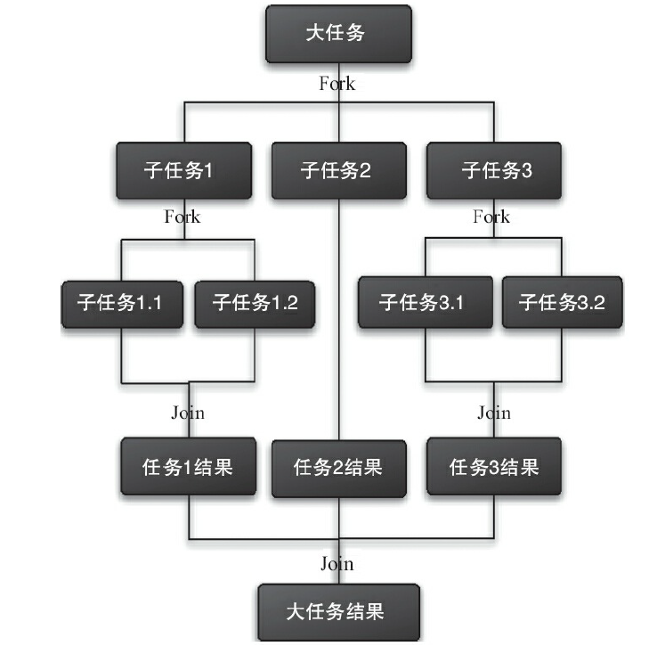
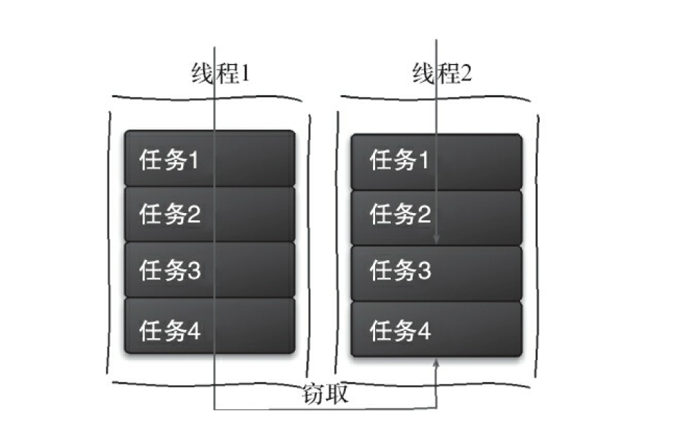

### ConcurrrentHashMap
线程安全且高效的hashMap
#### 为什么要使用 ConcurrentHashMap
> 并发编程中，HashMap 不是线程安全的，而且容易造成 死循环， 而 HashTable 效率又特别低下，由此，并发编程中穿线了 `ConcurrentHashMap`

<!--more-->

- 线程不安全的ConcurrentHashMap
  - HashMap 在并发执行put 操作时，会引起死循环。因为多线程会导致HashMap 中的Entry 链表形成环形数据结构，Entry 的next 节点永远不为空，就会产生死循环获取Entry
- 效率低下的 HashTable
  - hashTable 使用synchronized 来保证线程安全，但是在线程竞争激烈的情况下，HashTable 的效率特别低下。因为当一个线程访问hashTable 的同步方法，其他的线程也访问HashTable 的方法时，会进入阻塞轮询状态。如线程1使用put进行元素添加，线程2不但不能使用put方法添加元素，也不能使用get方法来获取元素，所以竞争越激烈效率越低。
- ConcurrentHashMap 的锁分段技术有效提升并发访问效率
>HashTable容器在竞争激烈的并发环境下表现出效率低下的原因是所有访问HashTable的线程都必须竞争同一把锁，假如容器里有多把锁，每一把锁用于锁容器其中一部分数据，那么当多线程访问容器里不同数据段的数据时，线程间就不会存在锁竞争，从而可以有效提高并发访问效率，这就是ConcurrentHashMap所使用的锁分段技术。首先将数据分成一段一段地存储，然后给每一段数据配一把锁，当一个线程占用锁访问其中一个段数据的时候，其他段的数据也能被其他线程访问。

#### ConcurrentHashMap的结构
- segments 数组
- hashEntry

#### ConcurrentHashMap 初始化
> ConcurrentHashMap初始化方法是通过initialCapacity、loadFactor和concurrencyLevel等几个参数来初始化segment数组、段偏移量segmentShift、段掩码segmentMask和每个segment里的HashEntry数组来实现的

1. 初始化segments数组
2. 初始化segmentShift和segmentMask
3. 初始化每个segment

#### ConcurrentHashMap 的操作

1. get 操作
2. put操作
3. size操作

### ConcurrentLinkedQueue 线程安全的队列
> ConcurrentLinkedQueue是一个基于链接节点的无界线程安全队列，它采用先进先出的规则对节点进行排序，当我们添加一个元素的时候，它会添加到队列的尾部；当我们获取一个元素时，它会返回队列头部的元素

#### 入队列
> 入队主要做两件事情：第一是将入队节点设置成当前队列尾节点的下一个节点；第二是更新tail节点，如果tail节点的next节点不为空，则将入队节点设置成tail节点，如果tail节点的next节点为空，则将入队节点设置成tail的next节点，所以tail节点不总是尾节点（理解这一点对于我们研究源码会非常有帮助）

- 入队列的过程
  - 入队列就是将入队节点添加到队列的尾部。
- 入队方法永远返回true，所以不要通过返回值判断入队是否成功。

#### 出队列
>首先获取头节点的元素，然后判断头节点元素是否为空，如果为空，表示另外一个线程已经进行了一次出队操作将该节点的元素取走，如果不为空，则使用CAS的方式将头节点的引用设置成null，如果CAS成功，则直接返回头节点的元素，如果不成功，表示另外一个线程已经进行了一次出队操作更新了head节点，导致元素发生了变化，需要重新获取头节点。


### Java中的阻塞队列 （BlockingQueue）

#### 什么是阻塞队列
- 支持两个附加操作的队列
  1. 支持阻塞的插入方法：队列会阻塞插入元素的线程，直到队列不满。
  2. 支持阻塞的移除方法：意思是在队列为空时，获取元素的线程会等待队列变为非空。
- 使用场景
  - 生产者和消费者模式：产者是向队列里添加元素的线程，消费者是从队列里取元素的线程。阻塞队列就是生产者用来存放元素、消费者用来获取元素的容器。

- 在阻塞队列不可用时，这两个附加操作提供了4种处理方式：
|方法/处理方式|抛出异常           |返回特殊值          |一直阻塞          |超时退出            |
|------------|-------------------|-------------------|------------------|-------------------|
|插入方法    |   add(e)           |offer(e)           | put(e)           |offer(e,time,unit) |
|移除方法     |   remove()       |poll()          |take()                |poll(time,unit)    |
|检查方法    | element()        |peek()           |不可用                 | 不可用            |

-  抛出异常：当队列满时，如果再往队列里插入元素，会抛出IllegalStateException（"Queue full"）异常。当队列空时，从队列里获取元素会抛出NoSuchElementException异常。
- ·返回特殊值：当往队列插入元素时，会返回元素是否插入成功，成功返回true。如果是移除方法，则是从队列里取出一个元素，如果没有则返回null。
- 一直阻塞：当阻塞队列满时，如果生产者线程往队列里put元素，队列会一直阻塞生产者线程，直到队列可用或者响应中断退出。当队列空时，如果消费者线程从队列里take元素，队列会阻塞住消费者线程，直到队列不为空。
- ·超时退出：当阻塞队列满时，如果生产者线程往队列里插入元素，队列会阻塞生产者线程一段时间，如果超过了指定的时间，生产者线程就会退出。
这

- __注意__：如果是无界阻塞队列，队列不可能会出现满的情况，所以使用put或offer方法永远不会被阻塞，而且使用offer方法时，该方法永远返回true。

#### Java里的阻塞队列
- ArrayBlockingQueue：一个由数组结构组成的有界阻塞队列。
- LinkedBlockingQueue：一个由链表结构组成的有界阻塞队列。
- PriorityBlockingQueue：一个支持优先级排序的无界阻塞队列。
- DelayQueue：一个使用优先级队列实现的无界阻塞队列。
- SynchronousQueue：一个不存储元素的阻塞队列。
- LinkedTransferQueue：一个由链表结构组成的无界阻塞队列。
- LinkedBlockingDeque：一个由链表结构组成的双向阻塞队列。

##### ArrayBlockingQueue
> 一个用数组实现的有界阻塞队列。此队列按照先进先出（FIFO）的原则对元素进行排序。

- 默认情况下不保证线程公平的访问队列.
  - 公平访问队列:指阻塞的线程，可以按照阻塞的先后顺序访问队列，即先阻塞线程先访问队列
  - 非公平性:当队列可用时，阻塞的线程都可以争夺访问队列的资格，有可能先阻塞的线程最后才访问
队列

- 公平队列创建方式 `ArrayBlockingQueue fairQueue = new ArrayBlockingQueue(1000,true);`

##### LinkedBlockingQueue
> LinkedBlockingQueue是一个用链表实现的有界阻塞队列。此队列的默认和最大长度为Integer.MAX_VALUE。此队列按照先进先出的原则对元素进行排序。

##### PriorityBlockingQueue
> PriorityBlockingQueue是一个支持优先级的无界阻塞队列。默认情况下元素采取自然顺序
升序排列。也可以自定义类实现compareTo()方法来指定元素排序规则，或者初始化PriorityBlockingQueue时，指定构造参数Comparator来对元素进行排序。 __需要注意的是不能保证
同优先级元素的顺序__。

##### DelayQueue
> DelayQueue是一个支持延时获取元素的无界阻塞队列。队列使用PriorityQueue来实现。队列中的元素必须实现Delayed接口，在创建元素时可以指定多久才能从队列中获取当前元素。只有在延迟期满时才能从队列中提取元素。

- 使用场景
  - ·缓存系统的设计：可以用DelayQueue保存缓存元素的有效期，使用一个线程循环查询DelayQueue，一旦能从DelayQueue中获取元素时，表示缓存有效期到了。
  - 定时任务调度：使用DelayQueue保存当天将会执行的任务和执行时间，一旦从DelayQueue中获取到任务就开始执行，比如TimerQueue就是使用DelayQueue实现的。

- 如何实现Delayed接口
>DelayQueue队列的元素必须实现Delayed接口。我们可以参考ScheduledThreadPoolExecutor
里ScheduledFutureTask类的实现，一共有三步。

  1. 在对象创建的时候，初始化基本数据。使用time记录当前对象延迟到什么时候可以使用，使用sequenceNumber来标识元素在队列中的先后顺序。
  ```Java
  private static final AtomicLong sequencer = new AtomicLong(0);
  ScheduledFutureTask(Runnable r, V result, long ns, long period) {
    super(r, result);
    this.time = ns;
    this.period = period;
    this.sequenceNumber = sequencer.getAndIncrement();
  }
  ```
  2. 实现getDelay方法，该方法返回当前元素还需要延时多长时间，单位是纳秒，
  ```Java
  public long getDelay(TimeUnit unit) {
    return unit.convert(time - now(), TimeUnit.NANOSECONDS);
  }
  ```
  >通过构造函数可以看出延迟时间参数ns的单位是纳秒，自己设计的时候最好使用纳秒，因为实现getDelay()方法时可以指定任意单位，一旦以秒或分作为单位，而延时时间又精确不到纳秒就麻烦了。使用时请注意当time小于当前时间时，getDelay会返回负数。

  3. 实现compareTo方法来指定元素的顺序。例如，让延时时间最长的放在队列的末尾
  ```Java
  public int compareTo(Delayed other) {
    if (other == this)　　// compare zero ONLY if same object
      return 0;
    if (other instanceof ScheduledFutureTask) {
      ScheduledFutureTask<> x = (ScheduledFutureTask<>)other;
      long diff = time - x.time;
      if (diff < 0)
        return -1;
      else if (diff > 0)
        return 1;
      else if (sequenceNumber < x.sequenceNumber)
        return -1;
      else
        return 1;
    }
    long d = (getDelay(TimeUnit.NANOSECONDS) -
    other.getDelay(TimeUnit.NANOSECONDS));
    return (d == 0) 0 : ((d < 0) -1 : 1);
  }
  ```

- 如何实现延时阻塞队列
  > 延时阻塞队列的实现很简单，当消费者从队列里获取元素时，如果元素没有达到延时时间，就阻塞当前线程

  ```Java
  //代码中的变量leader是一个等待获取队列头部元素的线程。如果leader不等于空，表示已经有线程
  //在等待获取队列的头元素。所以，使用await()方法让当前线程等待信号。如果leader等于空，则把
  //当前线程设置成leader，并使用awaitNanos()方法让当前线程等待接收信号或等待delay时间
  long delay = first.getDelay(TimeUnit.NANOSECONDS);
  if (delay <= 0)
    return q.poll();
  else if (leader != null)
    available.await();
  else {
    Thread thisThread = Thread.currentThread();
    leader = thisThread;
    try {
      available.awaitNanos(delay);
    } finally {
      if (leader == thisThread)
      leader = null;
    }
  }
  ```

##### SynchronousQueue
> SynchronousQueue是一个不存储元素的阻塞队列。每一个put操作必须等待一个take操作，否则不能继续添加元素。

>它支持公平访问队列。默认情况下线程采用非公平性策略访问队列。使用以下构造方法可以创建公平性访问的SynchronousQueue，如果设置为true，则等待的线程会采用先进先出的顺序访问队列。
```Java
public SynchronousQueue(boolean fair) {
  transferer = fair new TransferQueue() : new TransferStack();
}
```
SynchronousQueue可以看成是一个传球手，负责把生产者线程处理的数据直接传递给消费者线程。队列本身并不存储任何元素，非常适合传递性场景。SynchronousQueue的吞吐量高于LinkedBlockingQueue和ArrayBlockingQueue。

##### LinkedTransferQueue
>LinkedTransferQueue是一个由链表结构组成的无界阻塞TransferQueue队列。相对于其他阻塞队列，LinkedTransferQueue多了tryTransfer和transfer方法。

- transfer方法
  - 如果当前有消费者正在等待接收元素（消费者使用take()方法或带时间限制的poll()方法时），transfer方法可以把生产者传入的元素立刻transfer（传输）给消费者。如果没有消费者在等待接收元素，transfer方法会将元素存放在队列的tail节点，并等到该元素被消费者消费了才返回

- tryTransfer方法
  > 用来试探生产者传入的元素是否能直接传给消费者。如果没有消费者等待接收元素，则返回false。和transfer方法的区别是tryTransfer方法无论消费者是否接收，方法立即返回，而transfer方法是必须等到消费者消费了才返回。

  >对于带有时间限制的tryTransfer（E e，long timeout，TimeUnit unit）方法，试图把生产者传入的元素直接传给消费者，但是如果没有消费者消费该元素则等待指定的时间再返回，如果超时还没消费元素，则返回false，如果在超时时间内消费了元素，则返回true。

##### LinkedBlockingDeque
> LinkedBlockingDeque是一个由链表结构组成的双向阻塞队列。所谓双向队列指的是可以从队列的两端插入和移出元素。双向队列因为多了一个操作队列的入口，在多线程同时入队时，也就减少了一半的竞争。相比其他的阻塞队列，LinkedBlockingDeque多了addFirst、addLast、offerFirst、offerLast、peekFirst和peekLast等方法，以First单词结尾的方法，表示插入、获取（peek）或移除双端队列的第一个元素。以Last单词结尾的方法，表示插入、获取或移除双端队列的最后一个元素。另外，插入方法add等同于addLast，移除方法remove等效于removeFirst。但是take方法却等同于takeFirst，不知道是不是JDK的bug，使用时还是用带有First和Last后缀的方法更清楚。

>在初始化LinkedBlockingDeque时可以设置容量防止其过度膨胀。另外，双向阻塞队列可以运用在“工作窃取”模式中。

#### 阻塞队列的实现原理
略

### Fork/Join框架

#### 什么是Fork/Join 框架
> Fork/Join框架是Java 7提供的一个用于并行执行任务的框架，是一个把大任务分割成若干个小任务，最终汇总每个小任务结果后得到大任务结果的框架。

- fork:Fork就是把一个大任务切分为若干子任务并行的执行，
- Join: Join就是合并这些子任务的执行结果，最后得到这个大任务的结果。


#### 工作窃取算法(work-stealing)

- 工作窃取（work-stealing）算法是指某个线程从其他队列里窃取任务来执行

-  把一个大任务分割成若干的小任务，为了减少线程间的竞争，把这些子任务分别放到不同的队列里，并为每个队列创建一个单独的线程来执行队列里的任务。有的线程会先把自己队列里的任务干完，而其他线程对应的队列里还有任务等待处理。 这时，完成任务的线程需要从其他未完成任务的线程的队列里来 __窃取__ 一个任务来执行.而在这时它们会访问同一个队列，所以为了减少窃取任务线程和被窃取任务线程之间的竞争，通常会使用双端队列，被窃取任务线程永远从双端队列的头部拿任务执行，而窃取任务的线程永远从双端队列的尾部拿任务执行。

- 窃取工作流

  - 工作窃取算法的优点：充分利用线程进行并行计算，减少了线程间的竞争
  - 工作窃取算法的缺点：在某些情况下还是存在竞争，比如双端队列里只有一个任务时。并且该算法会消耗了更多的系统资源，比如创建多个线程和多个双端队列。

#### Fork/Join框架的设计
- fork/Join 架构设计思路
  - 分割任务：fork 类把大任务切割成子任务，若子任务还是很大，则需要不停的切割，直到分出的子任务足够小。
  - 执行任务并合并结果：分割的子任务分别放在双端队列里，然后几个启动线程分别从双端队列里获取任务执行。子任务执行完的结果都统一放在一个队列里，启动一个线程从队列里拿数据，然后合并这些数据。

- Fork/Join使用两个类来完成以上两件事情。
  1. ForkJoinTask：要使用ForkJoin框架，必须首先创建一个ForkJoin任务。它提供在任务中执行fork()和join()操作的机制。通常情况下，我们不需要直接继承ForkJoinTask类，只需要继承它的子类，Fork/Join框架提供了以下两个子类。
    - RecursiveAction: 用于没有返回结果的任务。
    - RecursiveTask:用于有返回结果的任务。
  2. ②ForkJoinPool：ForkJoinTask需要通过ForkJoinPool来执行.
    >任务分割出的子任务会添加到当前工作线程所维护的双端队列中，进入队列的头部。当一个工作线程的队列里暂时没有任务时，它会随机从其他工作线程的队列的尾部获取一个任务。

#### 使用Fork/Join框架
- 查看 `ForkJoinDemon` 示例
#### Fork/Join框架的异常处理
> `ForkJoinTask`在执行的时候可能会抛出异常，但是我们没办法在主线程里直接捕获异常，所以`ForkJoinTask`提供了`isCompletedAbnormally()`方法来检查任务是否已经抛出异常或已经被取消了，并且可以通过`ForkJoinTask`的`getException`方法获取异常。使用如下代码
```java
if(task.isCompletedAbnormally()){
    //getException方法返回Throwable对象，如果任务被取消了则返回CancellationException。
    //如果任务没有完成或者没有抛出异常则返回null。
    System.out.println(task.getException());
}
```

#### Fork/Join框架的实现原理
- ForkJoinPool 组成
  - ForkJoinTask数组：负责将存放程序提交给ForkJoinPool的任务
  - ForkJoinWorkerThread数组：ForkJoinWorkerThread数组负责执行这些任务
- ForkJoinTask的fork方法实现原理
  - 调用 fork 方法时，程序会调用ForkJoinWorkerThread的pushTask方法异步地执行这个任务，然后立即返回结果
  ```java
  public final ForkJoinTask<V> fork() {
    ((ForkJoinWorkerThread) Thread.currentThread()).pushTask(this);
    return this;
  }
  ```
  - pushTask方法把当前任务存放在ForkJoinTask数组队列里。然后再调用ForkJoinPool的signalWork()方法唤醒或创建一个工作线程来执行任务
  ```java
  final void pushTask(ForkJoinTask<> t) {
    ForkJoinTask<>[] q; int s, m;
    if ((q = queue) != null) {　　　　// ignore if queue removed
      long u = (((s = queueTop) & (m = q.length - 1)) << ASHIFT) + ABASE;
    UNSAFE.putOrderedObject(q, u, t);
    queueTop = s + 1;　　　　　　// or use putOrderedInt
    if ((s -= queueBase) <= 2)
      pool.signalWork();
    else if (s == m)
      growQueue();
    }
  }
  ```
- ForkJoinTask的join方法实现原理
  - Join方法的主要作用是阻塞当前线程并等待获取结果。让我们一起看看ForkJoinTask的join方法的实现
  ```java
  public final V join() {
    if (doJoin() != NORMAL)
      return reportResult();
    else
      return getRawResult();
  }
  private V reportResult() {
    int s; Throwable ex;
    if ((s = status) == CANCELLED)
      throw new CancellationException();
    if (s == EXCEPTIONAL && (ex = getThrowableException()) != null)
      UNSAFE.throwException(ex);
    return getRawResult();
  }
  ```
  - doJoin()方法返回四种状态
    1. 已完成（NORMAL）:如果任务状态是已完成，则直接返回任务结果。
    2. 被取消（CANCELLED）:如果任务状态是被取消，则直接抛出CancellationException。
    3. 信号（SIGNAL）
    4. 出现异常（EXCEPTIONAL）:如果任务状态是抛出异常，则直接抛出对应的异常。

```Java
private int doJoin() {
  Thread t; ForkJoinWorkerThread w; int s; boolean completed;
if ((t = Thread.currentThread()) instanceof ForkJoinWorkerThread) {
  if ((s = status) < 0)
    return s;
  if ((w = (ForkJoinWorkerThread)t).unpushTask(this)) {
    try {
    completed = exec();
    } catch (Throwable rex) {
      return setExceptionalCompletion(rex);
    }
    if (completed)
      return setCompletion(NORMAL);
  }
  return w.joinTask(this);
} else
  return externalAwaitDone();
}
```
>在doJoin()方法里，首先通过查看任务的状态，看任务是否已经执行完成，如果执行完成，则直接返回任务状态；如果没有执行完，则从任务数组里取出任务并执行。如果任务顺利执行完成，则设置任务状态为NORMAL，如果出现异常，则记录异常，并将任务状态设置为EXCEPTIONAL。
