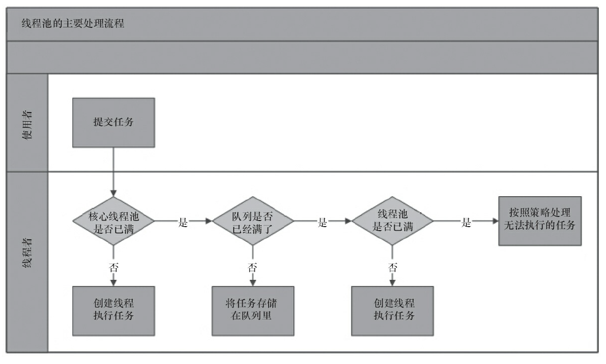
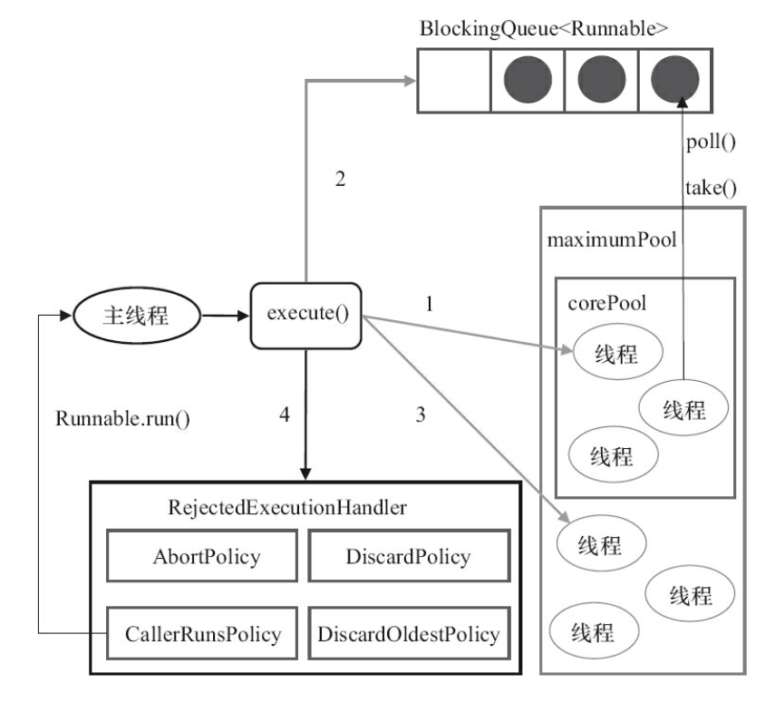

线程池是java 应用场景最广的java 并发框架。几乎所有的异步或者并发任务的程序都可以使用线程池。在开发中，合理的使用线程池可以带来三种好处：
1. 降低资源消耗：通过合理的重复使用已创建的线程，降低线程创建和销毁对资源的消耗
2. 提高响应速度：当任务到达时，任务可以不需要等到线程创建就能立即执行。
3. 提高线程的可管性：线程是稀缺资源，如果无限制的创建，不仅会降低系统资源，而且会降低系统的稳定性。使用线程池可以进行统一分配、调优和监控。

<!--more-->

# 线程池的使用

```java
public class ThreadPoolExecutorDemo {

    privatestaticfinalint CORE_POOL_SIZE = 5;
    privatestaticfinalint MAX_POOL_SIZE = 10;
    privatestaticfinalint QUEUE_CAPACITY = 100;
    privatestaticfinal Long KEEP_ALIVE_TIME = 1L;
    public static void main(String[] args) {

        //使用阿里巴巴推荐的创建线程池的方式
        //通过ThreadPoolExecutor构造函数自定义参数创建
        ThreadPoolExecutor executor = new ThreadPoolExecutor(
                CORE_POOL_SIZE,
                MAX_POOL_SIZE,
                KEEP_ALIVE_TIME,
                TimeUnit.SECONDS,
                new ArrayBlockingQueue<>(QUEUE_CAPACITY),
                new ThreadPoolExecutor.CallerRunsPolicy());

        for (int i = 0; i < 10; i++) {
            //创建WorkerThread对象（WorkerThread类实现了Runnable 接口）
            Runnable worker = new MyRunnable("" + i);
            //执行Runnable
            executor.execute(worker);
        }
        //终止线程池
        executor.shutdown();
        while (!executor.isTerminated()) {
        }
        System.out.println("Finished all threads");
    }
}
```

说明：

1. `corePoolSize`: 核心线程数为 5。
2. `maximumPoolSize` ：最大线程数 10
3. `keepAliveTime` : 等待时间为 1L。
4. `unit`: 等待时间的单位为 `TimeUnit.SECONDS`。
5. `workQueue`：任务队列为 `ArrayBlockingQueue`，并且容量为 100;
6. `handler`:饱和策略为 `CallerRunsPolicy`。

# 线程池的实现原理
当提交一个任务到线程池时，线程池的处理流程如下：
1. 线程池判断核心线程池里的线程是否都在执行任务。如果不是，则创建一个新的工作线程来执行任务。如果核心线程池里的线程都在执行任务，则进入下个流程。
2. 线程池判断工作队列是否已经满。如果工作队列没有满，则将新提交的任务存储在这个工作队列里。如果工作队列满了，则进入下个流程。
3. 线程池判断线程池的线程是否都处于工作状态。如果没有，则创建一个新的工作线程来执行任务。如果已经满了，则交给饱和策略来处理这个任务。

## ThreadPoolExcutor执行excute() 的流程： 
```java
 //存放线程池的运行状态 (runState) 和线程池内有效线程的数量 (workerCount)
   privatefinal AtomicInteger ctl = new AtomicInteger(ctlOf(RUNNING, 0));

    private static int workerCountOf(int c) {
        return c & CAPACITY;
    }

    privatefinal BlockingQueue<Runnable> workQueue;

    public void execute(Runnable command) {
        // 如果任务为null，则抛出异常。
        if (command == null)
            thrownew NullPointerException();
        // ctl 中保存的线程池当前的一些状态信息
        int c = ctl.get();

        //  下面会涉及到 3 步 操作
        // 1.首先判断当前线程池中之行的任务数量是否小于 corePoolSize
        // 如果小于的话，通过addWorker(command, true)新建一个线程，并将任务(command)添加到该线程中；然后，启动该线程从而执行任务。
        if (workerCountOf(c) < corePoolSize) {
            if (addWorker(command, true))
                return;
            c = ctl.get();
        }
        // 2.如果当前之行的任务数量大于等于 corePoolSize 的时候就会走到这里
        // 通过 isRunning 方法判断线程池状态，线程池处于 RUNNING 状态才会被并且队列可以加入任务，该任务才会被加入进去
        if (isRunning(c) && workQueue.offer(command)) {
            int recheck = ctl.get();
            // 再次获取线程池状态，如果线程池状态不是 RUNNING 状态就需要从任务队列中移除任务，并尝试判断线程是否全部执行完毕。同时执行拒绝策略。
            if (!isRunning(recheck) && remove(command))
                reject(command);
                // 如果当前线程池为空就新创建一个线程并执行。
            elseif (workerCountOf(recheck) == 0)
                addWorker(null, false);
        }
        //3. 通过addWorker(command, false)新建一个线程，并将任务(command)添加到该线程中；然后，启动该线程从而执行任务。
        //如果addWorker(command, false)执行失败，则通过reject()执行相应的拒绝策略的内容。
        elseif (!addWorker(command, false))
            reject(command);
    }
```
通过下图可以更好的对上面这 3 步做一个展示。



如：我们在代码中模拟了 10 个任务，我们配置的核心线程数为 5 、等待队列容量为 100 ，所以每次只可能存在 5 个任务同时执行，剩下的 5 个任务会被放到等待队列中去。当前的 5 个任务之行完成后，才会之行剩下的 5 个任务。

#### ThreadPoolExecutor执行示意图:


说明：
1. 如果当前运行的线程少于corePoolSize，则创建新线程来执行任务（注意，执行这一步骤需要获取全局锁）。
2. 如果运行的线程等于或多于corePoolSize，则将任务加入BlockingQueue。
3. 如果无法将任务加入BlockingQueue（队列已满），则创建新的线程来处理任务（注意，执行这一步骤需要获取全局锁）。
4. 如果创建新线程将使当前运行的线程超出maximumPoolSize，任务将被拒绝，并调用RejectedExecutionHandler.rejectedExecution()方法。

>ThreadPoolExecutor采取上述步骤的总体设计思路，是为了在执行execute()方法时，尽可能地避免获取全局锁（那将会是一个严重的可伸缩瓶颈）。在ThreadPoolExecutor完成预热之后（当前运行的线程大于等于corePoolSize），几乎所有的execute()方法调用都是执行步骤2，而步骤2不需要获取全局锁。


## 工作线程：
线程池创建线程时，会将线程封装成工作线程Worker，Worker在执行完任务后，还会循环获取工作队列里的任务来执行。我们可以从Worker类的run()方法里看到这点。

```java
public void run() {
    try {
        Runnable task = firstTask;
        firstTask = null;
        while (task != null || (task = getTask()) != null) {
            runTask(task);
            task = null;
        }
    } finally {
        workerDone(this);
    }
}
```


# 线程池的创建
- 通过ThreadPoolExecutor来创建一个线程池 `new ThreadPoolExecutor(corePoolSize,maximumPoolSize, keepAliveTime,milliseconds,runnableTaskQueue, handler);`
## 参数说明：
###  __corePoolSize（线程池的基本大小）__ ：
当提交一个任务到线程池时，线程池会创建一个线程来执行任务，即使其他空闲的基本线程能够执行新任务也会创建线程，等到需要执行的任务数大于线程池基本大小时就不再创建。如果调用了线程池的 `prestartAllCoreThreads()`方法，线程池会提前创建并启动所有基本线程。
###  __runnableTaskQueue（任务队列）__：
用于保存等待执行的任务的阻塞队列。可以选择以下几个阻塞队列。

- `ArrayBlockingQueue`：是一个基于数组结构的有界阻塞队列，此队列按FIFO（先进先出）原则对元素进行排序。
- `LinkedBlockingQueue`：一个基于链表结构的阻塞队列，此队列按FIFO排序元素，吞吐量通常要高于ArrayBlockingQueue。静态工厂方法Executors.newFixedThreadPool()使用了这个队列。
- `SynchronousQueue`：一个不存储元素的阻塞队列。每个插入操作必须等到另一个线程调用移除操作，否则插入操作一直处于阻塞状态，吞吐量通常要高于Linked-BlockingQueue，静态工厂方法 `Executors.newCachedThreadPool` 使用了这个队列。
- `PriorityBlockingQueue`:一个具有优先级的无限阻塞队列。

### `maximumPoolSize（线程池最大数量）`：
线程池允许创建的最大线程数。如果队列满了，并且已创建的线程数小于最大线程数，则线程池会再创建新的线程执行任务。值得注意的是，如果使用了无界的任务队列这个参数就没什么效果。
### `ThreadFactory`:
用于设置创建线程的工厂，可以通过线程工厂给每个创建出来的线程设置更有意义的名字。使用开源框架guava提供的ThreadFactoryBuilder可以快速给线程池里的线程设置有意义的名字，代码如:`new ThreadFactoryBuilder().setNameFormat("XX-task-%d").build();`。

### `RejectedExecutionHandler`（饱和策略）:
当队列和线程池都满了，说明线程池处于饱和状态，那么必须采取一种策略处理提交的新任务。这个策略默认情况下是AbortPolicy，表示无法处理新任务时抛出异常。在JDK 1.5中Java线程池框架提供了以下4种策略:

- `ThreadPoolExecutor.AbortPolicy`：直接抛出异常。抛出 `RejectedExecutionException`来拒绝新任务的处理。
- `ThreadPoolExecutor.CallerRunsPolicy`：只用调用者所在线程来运行任务。不会任务请求。但是这种策略会降低对于新任务提交速度，影响程序的整体性能。另外，这个策略喜欢增加队列容量。如果应用程序可以承受此延迟并且你不能任务丢弃任何一个任务请求的话，可以选择这个策略。
- `ThreadPoolExecutor.DiscardOldestPolicy`：此策略将丢弃最早的未处理的任务请求，并执行当前任务。
- `ThreadPoolExecutor.DiscardPolicy`：不处理新任务，直接丢弃掉。
- 也可以根据应用场景需要来实现 `RejectedExecutionHandler`接口自定义策略。如记录日志或持久化存储不能处理的任务。
### `keepAliveTime`（线程活动保持时间）：
线程池的工作线程空闲后，保持存活的时间。所以，如果任务很多，并且每个任务执行的时间比较短，可以调大时间，提高线程的利用率。
### `TimeUnit`（线程活动保持时间的单位）：
可选的单位有天（DAYS）、小时（HOURS）、分钟
（MINUTES）、毫秒（MILLISECONDS）、微秒（MICROSECONDS，千分之一毫秒）和纳秒（NANOSECONDS，千分之一微秒）。

# 向线程池提交任务
> 可以使用两个方法向线程池提交任务，分别为execute()和submit()方法。

## execute()方法用于提交不需要返回值的任务
- 通过以下代码可知execute()方法输入的任务是一个Runnable类的实例。
```java
threadsPool.execute(new Runnable() {
    @Override
    public void run() {
    // TODO Auto-generated method stub
    }
});
```
## submit()方法用于提交需要返回值的任务

> 线程池会返回一个future类型的对象，通过这个future对象可以判断任务是否执行成功，并且可以通过future的get()方法来获取返回值，get()方法会阻塞当前线程直到任务完成，而使用get（long timeout，TimeUnit unit）方法则会阻塞当前线程一段时间后立即返回，这时候有可能任务没有执行完。

```java
  Future<Object> future = executor.submit(harReturnValuetask);
  try {
      Object s = future.get();
  } catch (InterruptedException e) {
  // 处理中断异常
  } catch (ExecutionException e) {
  // 处理无法执行任务异常
  } finally {
  // 关闭线程池
  executor.shutdown();
  }
```
# 关闭线程池

> 可以通过调用线程池的shutdown或shutdownNow方法来关闭线程池。它们的原理是遍历线
程池中的工作线程，然后逐个调用线程的interrupt方法来中断线程，所以无法响应中断的任务
可能永远无法终止。

## shutdown 和shutdownNow 的区别：
1. shutdownNow首先将线程池的状态设置成STOP，然后尝试 __停止所有的正在执行或暂停任务__的线程，并返回等待执行任务的列表
2. shutdown只是将线程池的状态设置成SHUTDOWN状态，然后中断所有__没有正在执行任务__的线程。
    - 只要调用了这两个关闭方法中的任意一个，isShutdown方法就会返回true。
    - 当所有的任务都已关闭后，才表示线程池关闭成功，这时调用isTerminated方法会返回true。

# 合理地配置线程池
 要想合理地配置线程池，就必须首先分析任务特性，可以从以下几个角度来分析。  
- 任务的性质：CPU密集型任务、IO密集型任务和混合型任务。
- 任务的优先级：高、中和低。
- 任务的执行时间：长、中和短。
- 任务的依赖性：是否依赖其他系统资源，如数据库连接。

处理技巧：
- __CPU密集型任务__ 应配置尽可能小的线程，如配置Ncpu+1个线程的线程池
    - 计算密集型任务虽然也可以用多任务完成，但是任务越多，花在任务切换的时间就越多，CPU执行任务的效率就越低，所以，要最高效地利用CPU，计算密集型任务同时进行的数量应当等于CPU的核心数。
- 由于 __IO密集型任务__ 线程并不是一直在执行任务，则应配置尽可能多的线程，如2*Ncpu
    - IO密集型，涉及到网络、磁盘IO的任务都是IO密集型任务，这类任务的特点是CPU消耗很少，任务的大部分时间都在等待IO操作完成（因为IO的速度远远低于CPU和内存的速度）。对于IO密集型任务，任务越多，CPU效率越高，但也有一个限度。常见的大部分任务都是IO密集型任务，比如Web应用。
- __混合型的任务__ ，如果可以拆分，将其拆分成一个CPU密集型任务和一个IO密集型任务，只要这两个任务执行的时间相差不是太大，那么分解后执行的吞吐量将高于串行执行的吞吐量。如果这两个任务执行时间相差太大，则没必要进行分解。可以通过 `Runtime.getRuntime().availableProcessors()`方法获得当前设备的CPU个数。
- 优先级不同的任务可以使用优先级队列PriorityBlockingQueue来处理。它可以让优先级高的任务先执行。
    __注意__： 如果一直有优先级高的任务提交到队列里，那么优先级低的任务可能永远不能执行。
- 执行时间不同的任务可以交给不同规模的线程池来处理，或者可以使用优先级队列，让执行时间短的任务先执行。
- 依赖数据库连接池的任务，因为线程提交SQL后需要等待数据库返回结果，等待的时间越长，则CPU空闲时间就越长，那么线程数应该设置得越大，这样才能更好地利用CPU
- __建议使用有界队列__. 有界队列能增加系统的稳定性和预警能力，可以根据需要设大一点儿，比如几千

# 线程池的监控

如果在系统中大量使用线程池，则有必要对线程池进行监控，方便在出现问题时，可以根据线程池的使用状况快速定位问题。可以通过线程池提供的参数进行监控，在监控线程池的时候可以使用以下属性。
- taskCount：线程池需要执行的任务数量
- completedTaskCount：线程池在运行过程中已完成的任务数量，小于或等于taskCount。
- largestPoolSize：线程池里曾经创建过的最大线程数量。通过这个数据可以知道线程池是否曾经满过。如该数值等于线程池的最大大小，则表示线程池曾经满过。
- getPoolSize：线程池的线程数量。如果线程池不销毁的话，线程池里的线程不会自动销毁，所以这个大小只增不减。
- getActiveCount：获取活动的线程数。

>通过扩展线程池进行监控。可以通过继承线程池来自定义线程池，重写线程池的beforeExecute、afterExecute和terminated方法，也可以在任务执行前、执行后和线程池关闭前执行一些代码来进行监控。例如，监控任务的平均执行时间、最大执行时间和最小执行时间等。这几个方法在线程池里是空方法。
`protected void beforeExecute(Thread t, Runnable r) { }`

# Executors 创建线程池存在的问题

- `FixedThreadPool 和 SingleThreadExecutor` ：允许请求的队列长度为 Integer.MAX_VALUE ，可能堆积大量的请求，从而导致OOM。
- `CachedThreadPool 和 ScheduledThreadPool` ：允许创建的线程数量为 Integer.MAX_VALUE ，可能会创建大量线程，从而导致OOM

### 通过Executor 框架的工具类Executors来实现 我们可以创建三种类型的ThreadPoolExecutor：

- **FixedThreadPool** ：该方法返回一个固定线程数量的线程池。该线程池中的线程数量始终不变。当有一个新的任务提交时，线程池中若有空闲线程，则立即执行。若没有，则新的任务会被暂存在一个任务队列中，待有线程空闲时，便处理在任务队列中的任务。
- **SingleThreadExecutor：** 方法返回一个只有一个线程的线程池。若多余一个任务被提交到该线程池，任务会被保存在一个任务队列中，待线程空闲，按先入先出的顺序执行队列中的任务。
- **CachedThreadPool：** 该方法返回一个可根据实际情况调整线程数量的线程池。线程池的线程数量不确定，但若有空闲线程可以复用，则会优先使用可复用的线程。若所有线程均在工作，又有新的任务提交，则会创建新的线程处理任务。所有线程在当前任务执行完毕后，将返回线程池进行复用。