Java的线程既是工作单元，也是执行机制。从JDK 5开始，把工作单元与执行机制分离开来。工作单元包括Runnable和Callable，而执行机制由Executor框架提供。

<!--more-->

### Executor框架
#### Executor框架的两级调度模型
> Executor框架的两级调度模型在HotSpot VM的线程模型中，Java线程（java.lang.Thread）被一对一映射为 __本地操作系统线程__。Java线程启动时会创建一个本地操作系统线程；当该Java线程终止时，这个操作系统线程也会被回收。操作系统会调度所有线程并将它们分配给可用的CPU。

- 在上层，Java多线程程序通常把应用分解为若干个任务，然后使用用户级的调度器(Executor框架）将这些任务映射为固定数量的线程
- 在底层，操作系统内核将这些线程映射到硬件处理器上

两级任务调度模型：
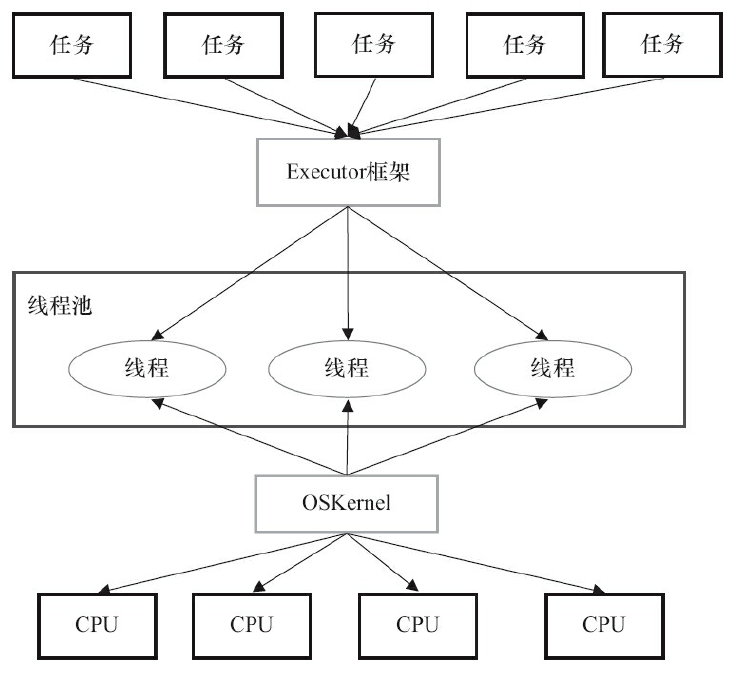
>应用程序通过Executor框架控制上层的调度；而下层的调度由操作系统内核控制，下层的调度不受应用程序的控制。

#### Executor框架的结构与成员
- Executor框架的结构（三部分）
  - ·任务。包括被执行任务需要实现的接口：Runnable接口或Callable接口。
  - ·任务的执行。包括任务执行机制的核心接口Executor，以及继承自Executor的ExecutorService接口。Executor框架有两个关键类实现了ExecutorService接口（ThreadPoolExecutor和ScheduledThreadPoolExecutor）。
  - ·异步计算的结果。包括接口Future和实现Future接口的FutureTask类。

  Executor框架包含的主要的类与接口
  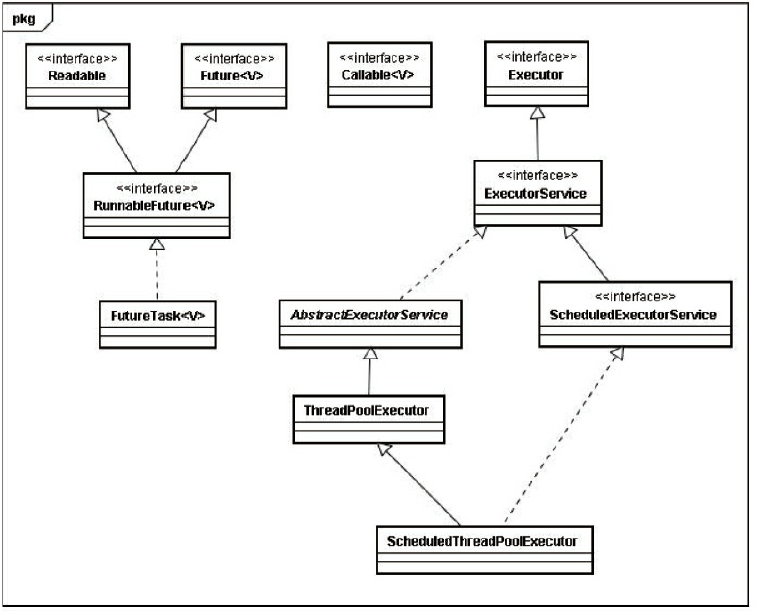

  - ·Executor是一个接口，它是Executor框架的基础，它将任务的提交与任务的执行分离开
  - ·ThreadPoolExecutor是线程池的核心实现类，用来执行被提交的任务。
  - ·ScheduledThreadPoolExecutor是一个实现类，可以在给定的延迟后运行命令，或者定期执行命令。ScheduledThreadPoolExecutor比Timer更灵活，功能更强大。
  - Future接口和实现Future接口的FutureTask类，代表异步计算的结果。
  - Runnable接口和Callable接口的实现类，都可以被ThreadPoolExecutor或Scheduled-ThreadPoolExecutor执行。

Executor框架的使用示意图
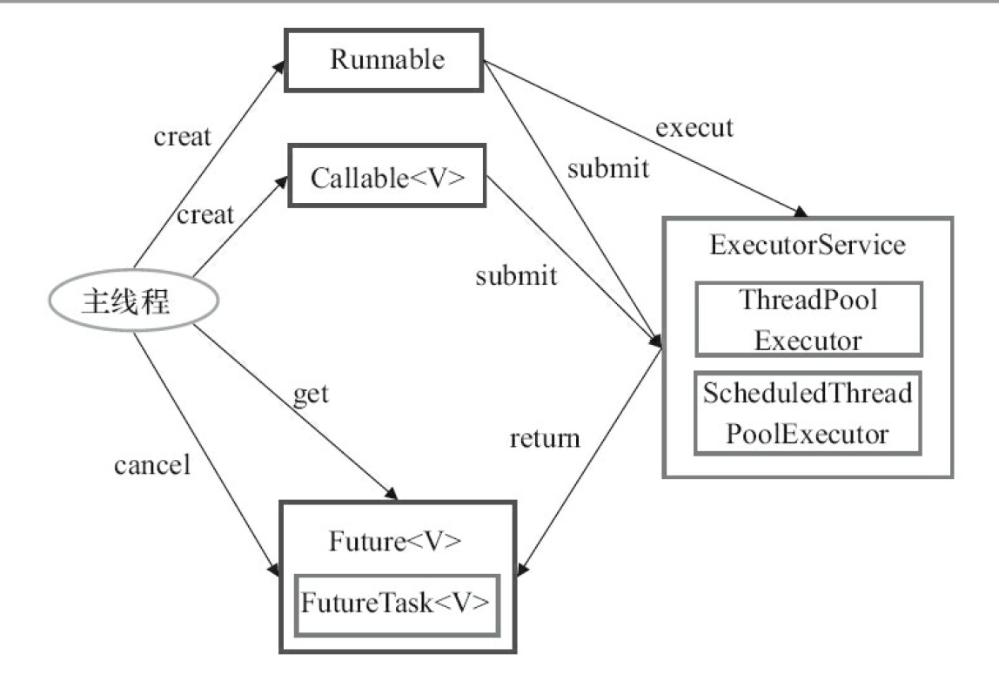

- 创建实现Runnable或者Callable接口的任务对象。工具类Executors可以把一个Runnable对象封装为一个Callable对象（Executors.callable（Runnable task）或Executors.callable（Runnable task，Object resule））。
- 然后可以把Runnable对象直接交给ExecutorService执行（ExecutorService.execute（Runnablecommand））；或者也可以把Runnable对象或Callable对象提交给ExecutorService执行（Executor-Service.submit（Runnable task）或ExecutorService.submit（Callable<T>task））。
- 如果执行ExecutorService.submit（…），ExecutorService将返回一个实现Future接口的对象（到目前为止的JDK中，返回的是FutureTask对象）。由于FutureTask实现了Runnable，程序员也可以创建FutureTask，然后直接交给ExecutorService执行。
- 最后，主线程可以执行FutureTask.get()方法来等待任务执行完成。主线程也可以执行FutureTask.cancel（boolean mayInterruptIfRunning）来取消此任务的执行。

#### Executor框架的成员
##### ThreadPoolExecutor
- ThreadPoolExecutor通常使用工厂类Executors来创建。Executors可以创建3种类型的ThreadPoolExecutor：
  - SingleThreadExecutor、
  - FixedThreadPool
  - CachedThreadPool。

- FixedThreadPool 固定线程数的线程池
```java
public static ExecutorService newFixedThreadPool(int nThreads)
public static ExecutorService newFixedThreadPool(int nThreads, ThreadFactorythreadFactory)
```
>FixedThreadPool适用于为了满足资源管理的需求，而需要限制当前线程数量的应用场景，它适用于负载比较重的服务器。

- SingleThreadExecutor。单个线程的线程池
```java
public static ExecutorService newSingleThreadExecutor()
public static ExecutorService newSingleThreadExecutor(ThreadFactory threadFactory)
```
>SingleThreadExecutor适用于需要保证顺序地执行各个任务；并且在任意时间点，不会有多个线程是活动的应用场景。

- CachedThreadPool（大小无界的线程池）
```java
public static ExecutorService newCachedThreadPool()
public static ExecutorService newCachedThreadPool(ThreadFactory threadFactory)
```
>CachedThreadPool是大小无界的线程池，适用于执行很多的短期异步任务的小程序，或者是负载较轻的服务器。

##### ScheduledThreadPoolExecutor
> ScheduledThreadPoolExecutor通常使用工厂类Executors来创建。Executors可以创建2种类型的ScheduledThreadPoolExecutor

- ScheduledThreadPoolExecutor。包含若干个线程的ScheduledThreadPoolExecutor。
- SingleThreadScheduledExecutor。只包含一个线程的ScheduledThreadPoolExecutor。

- ScheduledThreadPoolExecutor

```java
public static ScheduledExecutorService newScheduledThreadPool(int corePoolSize)
public static ScheduledExecutorService newScheduledThreadPool(int corePoolSize,ThreadFactory)
```
> ScheduledThreadPoolExecutor适用于需要多个后台线程执行周期任务，同时为了满足资源管理的需求而需要限制后台线程的数量的应用场景。

- SingleThreadScheduledExecuto
```Java
public static ScheduledExecutorService newSingleThreadScheduledExecutor()
public static ScheduledExecutorService newSingleThreadScheduledExecutor(ThreadFactory threadFactory)
```
>SingleThreadScheduledExecutor适用于需要单个后台线程执行周期任务，同时需要保证顺序地执行各个任务的应用场景。

#### Future接口
> Future接口和实现Future接口的FutureTask类用来表示异步计算的结果。当我们把Runnable接口或Callable接口的实现类提交（submit）给ThreadPoolExecutor或ScheduledThreadPoolExecutor时，ThreadPoolExecutor或ScheduledThreadPoolExecutor会向我们返回一个FutureTask对象

```java
<T> Future<T> submit(Callable<T> task)
<T> Future<T> submit(Runnable task, T result)
Future<> submit(Runnable task)
```
> 到目前最新的JDK 8为止，Java通过上述API返回的是一个FutureTask对象。但从API可以看到，Java仅仅保证返回的是一个实现了Future接口的对象。在将来的JDK实现中，返回的可能不一定是FutureTask。

#### Runnable接口和Callable接口
> Runnable接口和Callable接口的实现类，都可以被ThreadPoolExecutor或Scheduled-ThreadPoolExecutor执行。它们之间的区别是Runnable不会返回结果，而Callable可以返回结果。

> 除了可以自己创建实现Callable接口的对象外，还可以使用工厂类Executors来把一个Runnable包装成一个Callable。

- 把一个Runnable包装成一个Callable的API
```java
public static Callable<Object> callable(Runnable task) // 假设返回对象Callable1
```
- 把一个Runnable和一个待返回的结果包装成一个Callable的API
```java
public static <T> Callable<T> callable(Runnable task, T result) // 假设返回对象Callable2
```

>当我们把一个Callable对象（比如上面的Callable1或Callable2）提交给
ThreadPoolExecutor或ScheduledThreadPoolExecutor执行时，submit（…）会向我们返回一个FutureTask对象。我们可以执行FutureTask.get()方法来等待任务执行完成。当任务成功完成后FutureTask.get()将返回该任务的结果。，如果提交的是对象Callable1，FutureTask.get()方法将返回null；如果提交的是对象Callable2，FutureTask.get()方法将返回result对象。

### ThreadPoolExecutor详解
> Executor框架最核心的类是ThreadPoolExecutor，它是线程池的实现类

- 组成：
  - corePool：核心线程池的大小。
  - maximumPool：最大线程池的大小。
  - BlockingQueue：用来暂时保存任务的工作队列。
  - ·RejectedExecutionHandler：当ThreadPoolExecutor已经关闭或ThreadPoolExecutor已经饱和时（达到了最大线程池大小且工作队列已满），execute()方法将要调用的Handler。

- 通过Executor框架的工具类Executors，可以创建3种类型的ThreadPoolExecutor
  - FixedThreadPool。
  - SingleThreadExecutor。
  - CachedThreadPool

#### FixedThreadPool
FixedThreadPool被称为可重用固定线程数的线程池
```java
public static ExecutorService newFixedThreadPool(int nThreads) {
    return new ThreadPoolExecutor(nThreads, nThreads,0L, TimeUnit.MILLISECONDS,new LinkedBlockingQueue<Runnable>());
}
```
- FixedThreadPool的corePoolSize和maximumPoolSize都被设置为创建FixedThreadPool时指定的参数nThreads。
- 当线程池中的线程数大于corePoolSize时，keepAliveTime为多余的空闲线程等待新任务的最长时间
- 超过这个时间后多余的线程将被终止。这里把keepAliveTime设置为0L，意味着多余的空闲线程会被立即终止。

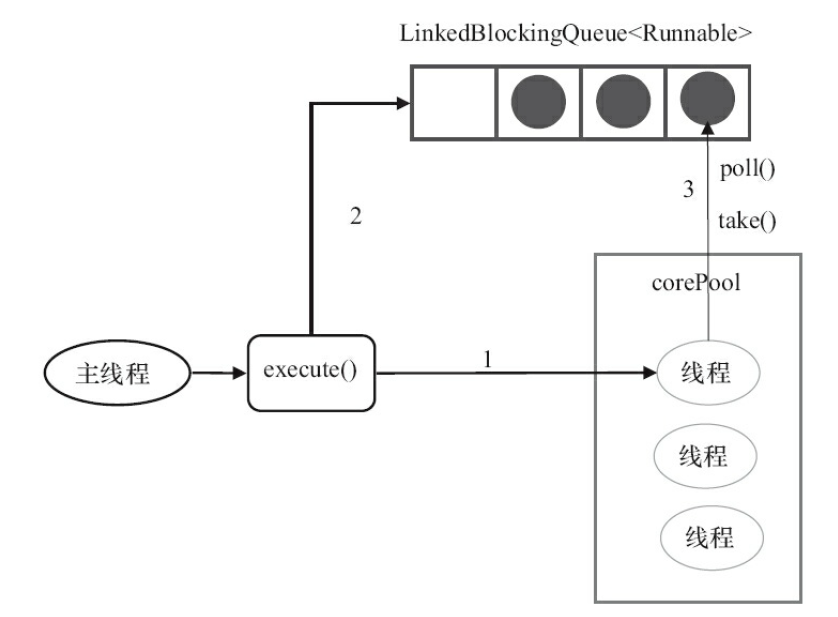
- 如果当前运行的线程数少于corePoolSize，则创建新线程来执行任务。
- 在线程池完成预热之后（当前运行的线程数等于corePoolSize），将任务加入LinkedBlockingQueue。
- 线程执行完1中的任务后，会在循环中反复从LinkedBlockingQueue获取任务来执行。
- FixedThreadPool使用无界队列LinkedBlockingQueue作为线程池的工作队列（队列的容量为Integer.MAX_VALUE）。
  - 使用无界队列作为工作队列会对线程池带来如下影响：
    1. 当线程池中的线程数达到corePoolSize后，新任务将在无界队列中等待，因此线程池中的线程数不会超过corePoolSize。
    2. 由于1，使用无界队列时maximumPoolSize将是一个无效参数。
    3. 由于1和2，使用无界队列时keepAliveTime将是一个无效参数。
    4. 由于使用无界队列，运行中的FixedThreadPool（未执行方法shutdown()或shutdownNow()）不会拒绝任务（不会调用RejectedExecutionHandler.rejectedExecution方法）。

#### SingleThreadExecutor
SingleThreadExecutor是使用单个worker线程的Executor
```java
public static ExecutorService newSingleThreadExecutor() {
      return new FinalizableDelegatedExecutorService(new ThreadPoolExecutor(1, 1,0L, TimeUnit.MILLISECONDS,new LinkedBlockingQueue<Runnable>()));
}
```
- SingleThreadExecutor的corePoolSize和maximumPoolSize被设置为1。其他参数与FixedThreadPool相同
- SingleThreadExecutor使用无界队列LinkedBlockingQueue作为线程池的工作队列（队列的容量为Integer.MAX_VALUE）。
- ingleThreadExecutor使用无界队列作为工作队列对线程池带来的影响与FixedThreadPool相同

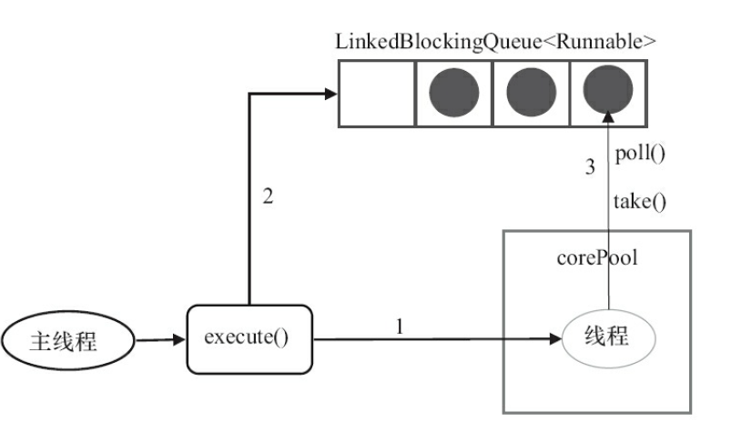

- 如果当前运行的线程数少于corePoolSize（即线程池中无运行的线程），则创建一个新线程来执行任务。
- 在线程池完成预热之后（当前线程池中有一个运行的线程），将任务加入Linked-BlockingQueue。
- 线程执行完1中的任务后，会在一个无限循环中反复从LinkedBlockingQueue获取任务来执行。

#### CachedThreadPool
CachedThreadPool是一个会根据需要创建新线程的线程池
```java
public static ExecutorService newCachedThreadPool() {
    return new ThreadPoolExecutor(0, Integer.MAX_VALUE,60L, TimeUnit.SECONDS,new SynchronousQueue<Runnable>());
}
```
- CachedThreadPool的corePoolSize被设置为0，即corePool为空
- maximumPoolSize被设置为Integer.MAX_VALUE，即maximumPool是无界的
- 把keepAliveTime设置为60L，意味着CachedThreadPool中的空闲线程等待新任务的最长时间为60秒，空闲线程超过60秒后将会被终止
- CachedThreadPool使用没有容量的SynchronousQueue作为线程池的工作队列，但CachedThreadPool的maximumPool是无界的。如果主线程提交任务的速度高于maximumPool中线程处理任务的速度时，CachedThreadPool会不断创建新线程。极端情况下，CachedThreadPool会因为创建过多线程而耗尽CPU和内存资源。

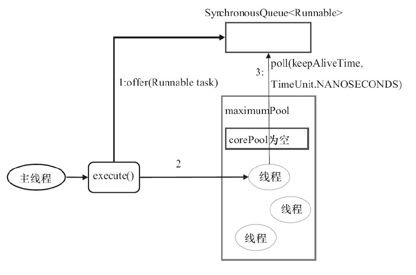
- 首先执行SynchronousQueue.offer（Runnable task）.如果当前maximumPool中有空闲线程正在执行SynchronousQueue.poll（keepAliveTime，TimeUnit.NANOSECONDS），那么主线程执行offer操作与空闲线程执行的poll操作配对成功，主线程把任务交给空闲线程执行，execute()方法执行完成；否则执行下面的步骤2
- 当初始maximumPool为空，或者maximumPool中当前没有空闲线程时，将没有线程执行SynchronousQueue.poll（keepAliveTime，TimeUnit.NANOSECONDS）。这种情况下，步骤1）将失败。此时CachedThreadPool会创建一个新线程执行任务，execute()方法执行完成
- 在步骤2）中新创建的线程将任务执行完后，会执行SynchronousQueue.poll（keepAliveTime，TimeUnit.NANOSECONDS）。这个poll操作会让空闲线程最多在SynchronousQueue中等待60秒钟。如果60秒钟内主线程提交了一个新任务（主线程执行步骤1）），那么这个空闲线程将执行主线程提交的新任务；否则，这个空闲线程将终止.由于空闲60秒的空闲线程会被终止，因此长时间保持空闲的CachedThreadPool不会使用任何资源

SynchronousQueue是一个没有容量的阻塞队列。每个插入操作必须等待另一个线程的对应移除操作，反之亦然。CachedThreadPool使用SynchronousQueue，把主线程提交的任务传递给空闲线程执行。CachedThreadPool中任务传递的示意图
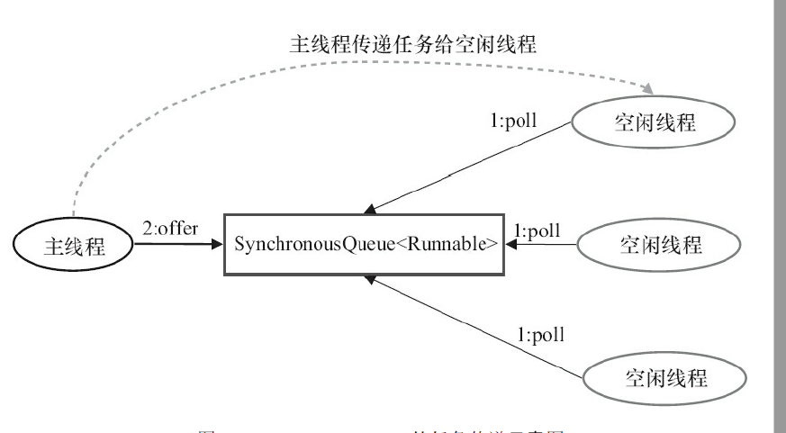

### ScheduledThreadPoolExecutor详解
> ScheduledThreadPoolExecutor继承自ThreadPoolExecutor。它主要用来在给定的延迟之后运行任务，或者定期执行任务。ScheduledThreadPoolExecutor的功能与Timer类似，但ScheduledThreadPoolExecutor功能更强大、更灵活。Timer对应的是单个后台线程，而ScheduledThreadPoolExecutor可以在构造函数中指定多个对应的后台线程数。

#### ScheduledThreadPoolExecutor的运行机制
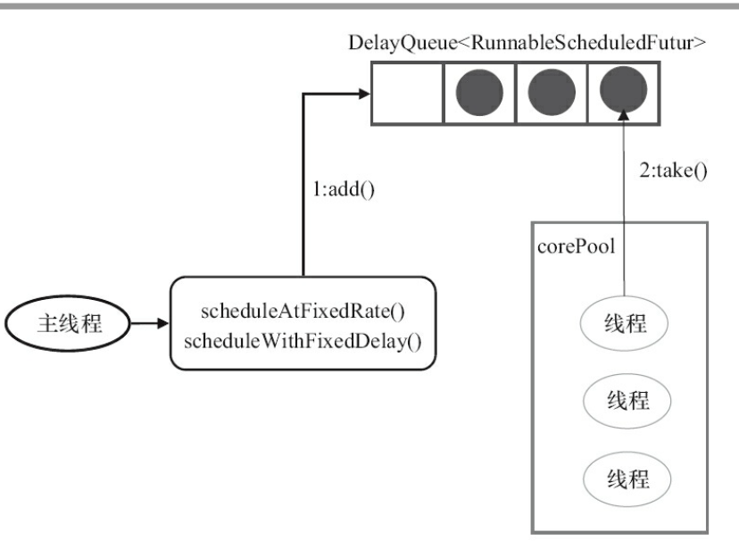

- DelayQueue是一个无界队列，所以ThreadPoolExecutor的maximumPoolSize在Scheduled-ThreadPoolExecutor中没有什么意义（设置maximumPoolSize的大小没有什么效果）。
- ScheduledThreadPoolExecutor的执行主要分为两大部分。
  - 当调用ScheduledThreadPoolExecutor的scheduleAtFixedRate()方法或者scheduleWith-FixedDelay()方法时,会向ScheduledThreadPoolExecutor的DelayQueue添加一个实现了RunnableScheduledFutur接口的ScheduledFutureTask。
  - 线程池中的线程从DelayQueue中获取ScheduledFutureTask，然后执行任务。

- ScheduledThreadPoolExecutor为了实现周期性的执行任务，对ThreadPoolExecutor做了如下的修改。
  - 使用DelayQueue作为任务队列。
  - 获取任务的方式不同（后文会说明）。
  - 执行周期任务后，增加了额外的处理（后文会说明）。

#### ScheduledThreadPoolExecutor的实现
- ScheduledThreadPoolExecutor会把待调度的任务（ScheduledFutureTask）放到一个DelayQueue中。
- cheduledFutureTask主要包含3个成员变量:
  - long型成员变量time，表示这个任务将要被执行的具体时间。
  - long型成员变量sequenceNumber，表示这个任务被添加到ScheduledThreadPoolExecutor中的序号。
  - long型成员变量period，表示任务执行的间隔周期。
- DelayQueue封装了一个PriorityQueue，这个PriorityQueue会对队列中的Scheduled-FutureTask进行排序
  - 排序时，time小的排在前面（时间早的任务将被先执行）。如果两个ScheduledFutureTask的time相同，就比较sequenceNumber，sequenceNumber小的排在前面（也就是说，如果两个任务的执行时间相同，那么先提交的任务将被先执行）。

- ScheduledThreadPoolExecutor中的线程执行周期任务的过程
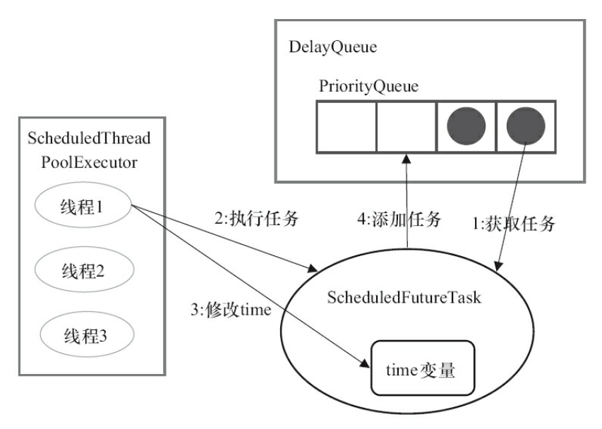
- 线程1从DelayQueue中获取已到期的ScheduledFutureTask（DelayQueue.take()）。到期任务是指ScheduledFutureTask的time大于等于当前时间
- 线程1执行这个ScheduledFutureTask
- 线程1修改ScheduledFutureTask的time变量为下次将要被执行的时间。
- 线程1把这个修改time之后的ScheduledFutureTask放回DelayQueue中（Delay-Queue.add()）。

DelayQueue.take()方法的源代码
```java
public E take() throws InterruptedException {
      final ReentrantLock lock = this.lock;
      lock.lockInterruptibly();　　　　　　　　　　　　 // 1
      try {
          for (;;) {
              E first = q.peek();
              if (first == null) {
                  available.await();　　　　　　　　　　 // 2.1
              } else {
                  long delay = first.getDelay(TimeUnit.NANOSECONDS);
                  if (delay > 0) {
                      long tl = available.awaitNanos(delay);　　 // 2.2
                  } else {
                      E x = q.poll();　　　　　　　　　　 // 2.3.1
                      assert x != null;
                      if (q.size() != 0)
                          available.signalAll();　　　　　　　　 // 2.3.2
                      return x;
                  }
              }
          }
      } finally {
          lock.unlock();　　　　　　　　　　　　　　 // 3
      }
}
```
DelayQueue.take()的执行示意图
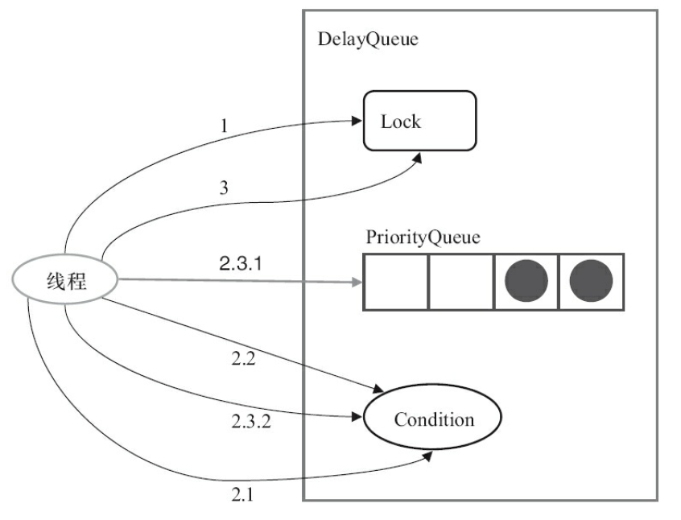
- 上述步骤说明：
  - 获取Lock。
  - 获取周期任务。
  - 如果PriorityQueue为空，当前线程到Condition中等待；否则执行下面的2.2。
  - 如果PriorityQueue的头元素的time时间比当前时间大，到Condition中等待到time时间；否则执行下面的2.3。
  - 获取PriorityQueue的头元素（2.3.1）；如果PriorityQueue不为空，则唤醒在Condition中等待的所有线程（2.3.2）。
  - 释放Lock。

* ScheduledThreadPoolExecutor在一个循环中执行步骤2，直到线程从PriorityQueue获取到一
个元素之后（执行2.3.1之后），才会退出无限循环（结束步骤2）。


- ScheduledThreadPoolExecutor中的线程执行任务的步骤4，把ScheduledFutureTask放入DelayQueue中的过程

源码：
```java
public boolean offer(E e) {
    final ReentrantLock lock = this.lock;
    lock.lock();　　　　　　　　　　 // 1
    try {
        E first = q.peek();
        q.offer(e);　　　　　　　　 // 2.1
        if (first == null || e.compareTo(first) < 0)
            available.signalAll();　　　 // 2.2
        return true;
    } finally {
        lock.unlock();　　　　　　　　 // 3
    }
}
```
是DelayQueue.add()的执行示意图；
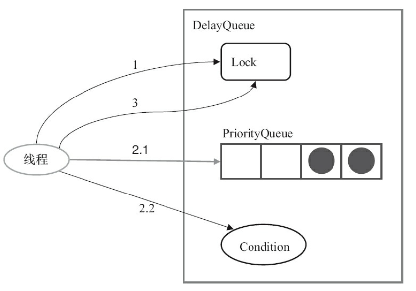
- 说明：
  - 获取Lock。
  - 添加任务。
    - 向PriorityQueue添加任务。
    - 如果在上面2.1中添加的任务是PriorityQueue的头元素，唤醒在Condition中等待的所有线程。
  - 释放Lock。

### FutureTask
Future接口和实现Future接口的FutureTask类，代表异步计算的结果。

#### FutureTask简介
- FutureTask除了实现Future接口外，还实现了Runnable接口。因此，FutureTask可以交给Executor执行，也可以由调用线程直接执行（FutureTask.run()）

FutureTask的状态迁移
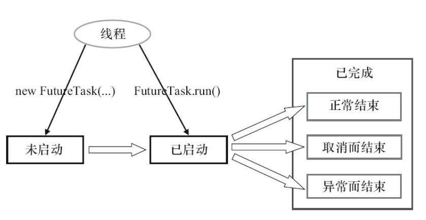
- 根据FutureTask.run()方法被执行的时机，FutureTask可以处于下面3种状态
  - 未启动。FutureTask.run()方法还没有被执行之前，FutureTask处于未启动状态。
  - 已启动。FutureTask.run()方法被执行的过程中，FutureTask处于已启动状态。
  - 已完成。FutureTask.run()方法执行完后正常结束，或被取消（FutureTask.cancel（…）），或执行FutureTask.run()方法时抛出异常而异常结束，FutureTask处于已完成状态。

FutureTask的get和cancel的执行示意:
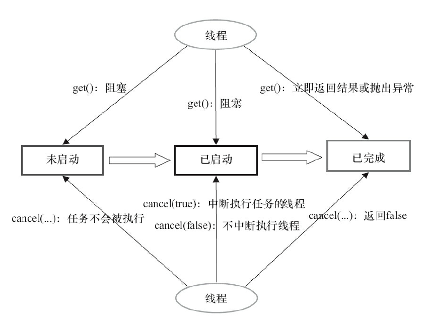
- 当FutureTask处于未启动或已启动状态时，执行FutureTask.get()方法将导致调用线程阻塞；
- 当FutureTask处于已完成状态时，执行FutureTask.get()方法将导致调用线程立即返回结果或抛出异常。
- 当FutureTask处于未启动状态时，执行FutureTask.cancel()方法将导致此任务永远不会被执行；
- 当FutureTask处于已启动状态时，执行FutureTask.cancel（true）方法将以中断执行此任务线程的方式来试图停止任务；
- ；当FutureTask处于已启动状态时，执行FutureTask.cancel（false）方法将不会对正在执行此任务的线程产生影响（让正在执行的任务运行完成）；
- 当FutureTask处于已完成状态时，执行FutureTask.cancel（…）方法将返回false。

#### FutureTask的使用
> 可以把FutureTask交给Executor执行；也可以通过ExecutorService.submit（…）方法返回一个FutureTask，然后执行FutureTask.get()方法或FutureTask.cancel（…）方法。除此以外，还可以单独使用FutureTask

场景：
- 当一个线程需要等待另一个线程把某个任务执行完后它才能继续执行，此时可以使用FutureTask
- 假设有多个线程执行若干任务，每个任务最多只能被执行一次。当多个线程试图同时执行同一个任务时，只允许一个线程执行任务，其他线程需要等待这个任务执行完后才能继续执行。
```java
private final ConcurrentMap<Object, Future<String>> taskCache =new ConcurrentHashMap<Object, Future<String>>();
private String executionTask(final String taskName)
throws ExecutionException, InterruptedException {
    while (true) {
        Future<String> future = taskCache.get(taskName);　　 // 1.1,2.1
        if (future == null) {
            Callable<String> task = new Callable<String>() {
                public String call() throws InterruptedException {
                    return taskName;
                }
            };
            FutureTask<String> futureTask = new FutureTask<String>(task);
            future = taskCache.putIfAbsent(taskName, futureTask);　 // 1.3
            if (future == null) {
                future = futureTask;
                futureTask.run();　　　　　　　　 // 1.4执行任务
            }
        }
        try {
            return future.get();　　　　　　 // 1.5,2.2} catch (CancellationException e) {
            taskCache.remove(taskName, future);
        }
    }
}
```

代码执行示意图：
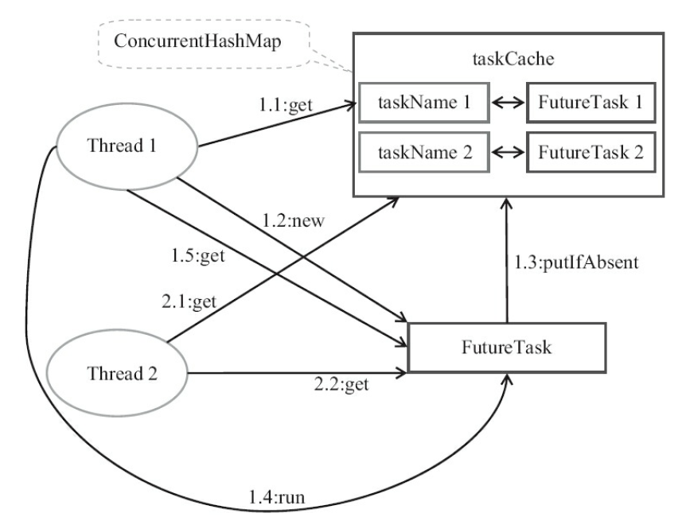
>当两个线程试图同时执行同一个任务时，如果Thread 1执行1.3后Thread 2执行2.1，那么接下来Thread 2将在2.2等待，直到Thread 1执行完1.4后Thread 2才能从2.2（FutureTask.get()）返回

#### FutureTask的实现
- FutureTask的实现基于AbstractQueuedSynchronizer（以下简称为AQS）
- 基于AQS实现的同步器包括：ReentrantLock、Semaphore、ReentrantReadWriteLock、CountDownLatch和FutureTask。

- FutureTask的acquire操作为get()/get（long timeout，TimeUnit unit）方法调用 （调用 AQS acquire操作。这个操作阻塞调用线程，除非/直到AQS的状态允许这个线程继续执行。）。

- FutureTask的release操作包括run()方法和cancel（…）方法 (调用 AQS release操作。这个操作改变AQS的状态，改变后的状态可允许一个或多个阻塞
线程被解除阻塞。)。

- 基于“复合优先于继承”的原则，FutureTask声明了一个内部私有的继承于AQS的子类Sync，对FutureTask所有公有方法的调用都会委托给这个内部子类。

FutureTask的设计示意图
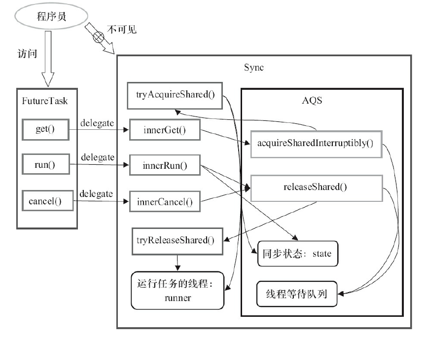
- Sync是FutureTask的内部私有类，它继承自AQS。创建FutureTask时会创建内部私有的成员对象Sync，FutureTask所有的的公有方法都直接委托给了内部私有的Sync。
- FutureTask.get()方法会调用AQS.acquireSharedInterruptibly（int arg）方法，这个方法的执行过程如下。
  - 1）调用AQS.acquireSharedInterruptibly（int arg）方法，这个方法首先会回调在子类Sync中实现的tryAcquireShared()方法来判断acquire操作是否可以成功。acquire操作可以成功的条件为：state为执行完成状态RAN或已取消状态CANCELLED，且runner不为null。
  - 如果成功则get()方法立即返回。如果失败则到线程等待队列中去等待其他线程执行release操作。
  - 当其他线程执行release操作（比如FutureTask.run()或FutureTask.cancel（…））唤醒当前线程后，当前线程再次执行tryAcquireShared()将返回正值1，当前线程将离开线程等待队列并唤醒它的后继线程（这里会产生级联唤醒的效果，后面会介绍）。
  - 最后返回计算的结果或抛出异常。
- FutureTask.run()的执行过程如下
  - 1）执行在构造函数中指定的任务（Callable.call()）。
  - 2）以原子方式来更新同步状态（调用AQS.compareAndSetState（int expect，int update），设置state为执行完成状态RAN）。如果这个原子操作成功，就设置代表计算结果的变量result的值为Callable.call()的返回值，然后调用AQS.releaseShared（int arg）。
  - 3）AQS.releaseShared（int arg）首先会回调在子类Sync中实现的tryReleaseShared（arg）来执行release操作（设置运行任务的线程runner为null，然后返回true）；AQS.releaseShared（int arg），然后唤醒线程等待队列中的第一个线程。
  - 4）调用FutureTask.done()。

__Feature级联唤醒__  
当执行FutureTask.get()方法时，如果FutureTask不是处于执行完成状态RAN或已取消状态CANCELLED，当前执行线程将到AQS的线程等待队列中等待（见下图的线程A、B、C和D）。当某个线程执行FutureTask.run()方或FutureTask.cancel（...）方法时，会唤醒线程等待队列的第一个线程（下图线程E唤醒线程A）
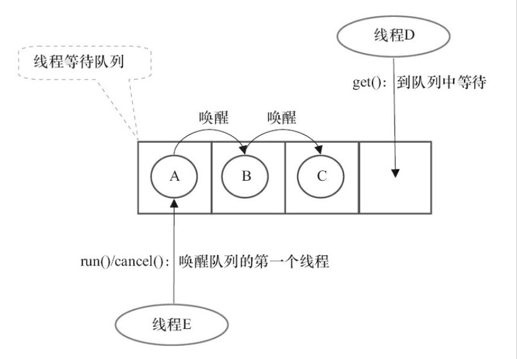
- 假设开始时FutureTask处于未启动状态或已启动状态，等待队列中已经有3个线程（A、B和C）在等待。此时，线程D执行get()方法将导致线程D也到等待队列中去等待。
- 当线程E执行run()方法时，会唤醒队列中的第一个线程A.线程A被唤醒后，首先把自己从队列中删除，然后唤醒它的后继线程B，最后线程A从get()方法返回。线程B、C和D重复A线程的处理流程。最终，在队列中等待的所有线程都被级联唤醒并从get()方法返回。
