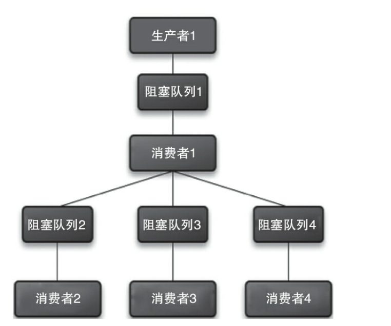

### 生产者和消费者模式

__纵观大多数设计模式，都会找一个第三者出来进行解耦__ ，如工厂模式的第三者是工厂类，模板模式的第三者是模板类。在学习一些
设计模式的过程中，先找到这个模式的第三者，能帮助我们快速熟悉一个设计模式。
- 什么是生产者和消费者模式
 - 生产者和消费者模式是通过一个容器来解决生产者和消费者的强耦合问题。生产者和消费者彼此之间不直接通信，而是通过阻塞队列来进行通信，所以生产者生产完数据之后不用等待消费者处理，直接扔给阻塞队列，消费者不找生产者要数据，而是直接从阻塞队列里取，阻塞队列就相当于一个缓冲区，平衡了生产者和消费者的处理能力。
 - 这个阻塞队列就是用来给生产者和消费者解耦的。
#### 生产者消费者模式实战

#### 多生产者和多消费者场景
在多核时代，多线程并发处理速度比单线程处理速度更快，所以可以使用多个线程来生产数据，同样可以使用多个消费线程来消费数据。而更复杂的情况是，消费者消费的数据，有可能需要继续处理，于是消费者处理完数据之后，它又要作为生产者把数据放在新的队列里，交给其他消费者继续处理，如图所示。

