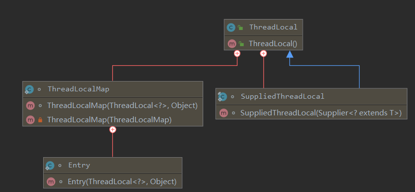

# ThreadLocal

- 用来存放每个线程专属的本地变量。存放每个线程私有的数据
- 可以使用 `get()` 和`set()` 方法来获取默认值或将其值更改为当前线程所存的副本的值，从而避免了线程安全问题。

## 使用实例

```java
public class ThreadLocalDemo implements Runnable {

    private static final ThreadLocal<SimpleDateFormat>  formatter = ThreadLocal.withInitial(() -> new SimpleDateFormat("yyyyMMdd HHmm"));

    /**
     * 从输出中可以看出，Thread-0已经改变了formatter的值，但仍然是thread-2默认格式化程序与初始化值相同，其他线程也一样。
     * @param args
     * @throws InterruptedException
     */
    public static void main(String[] args) throws InterruptedException {
        ThreadLocalDemo obj = new ThreadLocalDemo();
        for (int i = 0; i < 10 ; i++) {
            Thread thread = new Thread(obj, " test" + i);
            Thread.sleep(new Random().nextInt(1000));
            thread.start();
        }
    }

    @Override
    public void run() {
        System.out.println("thread name = " + Thread.currentThread().getName() + "default formatter:" + formatter.get().toPattern());
        try {
            Thread.sleep(new Random().nextInt(1000));
        } catch (InterruptedException e) {
            e.printStackTrace();
        }
        //修改formatter 中的值
        formatter.set(new SimpleDateFormat());
        System.out.println("Thread Name= "+Thread.currentThread().getName()+" formatter = "+formatter.get().toPattern());
    }
}
```

## 原理分析

- thread 源码中存在两个特殊的变量

```java
public class Thread implements Runnable { 
	/* ThreadLocal values pertaining to this thread. This map is maintained
     * by the ThreadLocal class. */
    //与此线程有关的ThreadLocal值。由ThreadLocal类维护
    ThreadLocal.ThreadLocalMap threadLocals = null;

    /*
     * InheritableThreadLocal values pertaining to this thread. This map is
     * maintained by the InheritableThreadLocal class.
     */
    //与此线程有关的InheritableThreadLocal值。由InheritableThreadLocal类维护
    ThreadLocal.ThreadLocalMap inheritableThreadLocals = null;
}
```

thread 类中有 `threadLocals` 和  `inheritableThreadLocals` 两个变量， 他们的类型为  `ThreadLocalMap`. 通过源码我们发现 `ThreadLocalMap` 为`ThreadLocal` 类实现的map 数据结构。我们可以将其理解为`HashMap`。

默认情况下这两个变量都是null，只有当前线程调用 `ThreadLocal` 类的 `set`或`get`方法时才创建它们，实际上调用这两个方法的时候，我们调用的是`ThreadLocalMap`类对应的 `get()`、`set()`方法。

### threadLocal 的set 方法

```java
public void set(T value) {
    Thread t = Thread.currentThread();
    ThreadLocalMap map = getMap(t);
    if (map != null)
        map.set(this, value);
    else
        createMap(t, value);
}
ThreadLocalMap getMap(Thread t) {
    return t.threadLocals;
}
void createMap(Thread t, T firstValue) {
    //this 指的是当前的threadLocal对象
    t.threadLocals = new ThreadLocalMap(this, firstValue);
}
```

- 最终的变量是放在了当前线程的 `ThreadLocalMap` 中，并不是存在 `ThreadLocal` 上，`ThreadLocal` 可以理解为只是`ThreadLocalMap`的封装，传递了变量值.
- `ThrealLocal` 类中可以通过`Thread.currentThread()`获取到当前线程对象后，直接通过`getMap(Thread t)`可以访问到该线程的`ThreadLocalMap`对象.
- **每个`Thread`中都具备一个`ThreadLocalMap`，而`ThreadLocalMap`可以存储以`ThreadLocal`为key的键值对**
- 如果我们在同一个线程中声明了两个 `ThreadLocal` 对象的话，会使用 `Thread`内部都是使用仅有那个`ThreadLocalMap` 存放数据。两个 `threadLocal `互不干扰
- `ThreadLocalMap`的 key 就是 当前的`ThreadLocal`对象，value 就是 `ThreadLocal` 对象调用`set`方法设置的值
- `ThreadLocal` 是 map结构是为了让每个线程可以关联多个 `ThreadLocal`变量。这也就解释了 `ThreadLocal` 声明的变量为什么在每一个线程都有自己的专属本地变量



## threadLocal 内存泄漏问题

`ThreadLocalMap` 中使用的 key 为 `ThreadLocal` 的弱引用,而 value 是强引用。

`ThreadLocal` 没有被外部强引用的情况下，在垃圾回收的时候，key 会被清理掉，而 value 不会被清理掉。这样一来，`ThreadLocalMap` 中就会出现key为null的Entry。假如我们不做任何措施的话，value 永远无法被GC 回收，这个时候就可能会产生内存泄露。`ThreadLocalMap`实现中已经考虑了这种情况，在调用 `set()`、`get()`、`remove()` 方法的时候，会清理掉 key 为 null 的记录。使用完 `ThreadLocal`方法后 最好手动调用`remove()`方法

```java
staticclass Entry extends WeakReference<ThreadLocal<?>> {
    /** The value associated with this ThreadLocal. */
    Object value;

    Entry(ThreadLocal<?> k, Object v) {
        super(k);
        value = v;
    }
}
```

## 弱引用
弱引用与软引用的区别在于：只具有弱引用的对象拥有更短暂的生命周期。在垃圾回收器线程扫描它 所管辖的内存区域的过程中，一旦发现了只具有弱引用的对象，不管当前内存空间足够与否，都会回收它的内存。不过，由于垃圾回收器是一个优先级很低的线程， 因此不一定会很快发现那些只具有弱引用的对象。

弱引用可以和一个引用队列（ReferenceQueue）联合使用，如果弱引用所引用的对象被垃圾回收，Java虚拟机就会把这个弱引用加入到与之关联的引用队列中。