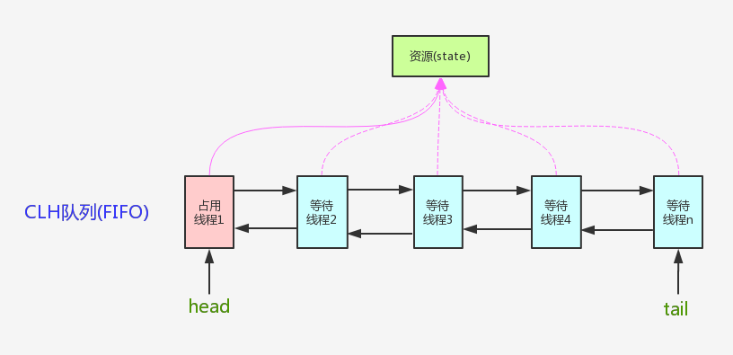
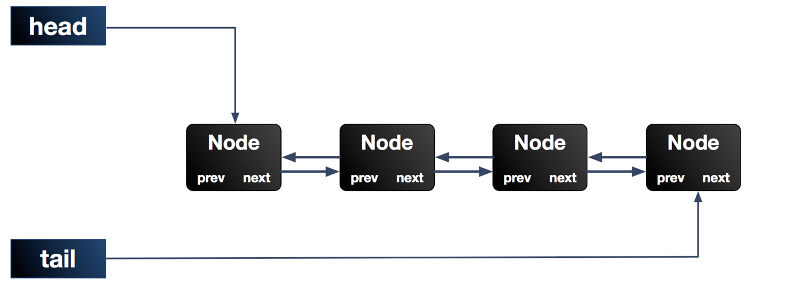

# AQS 简介

AQS全称为 AbstractQueuedSychronizer。该类属于 `java.util.concurrent.locks` 包。


AQS 是构建锁和同步器的基础框架，如：

1. ReentrantLock
2. ReentrantReadWriteLock
3. Semaphore
4. SynchronousQueue
5. FutureTask
6. 自定义同步组件
7. 。。。。

# AQS 原理

## 核心思想

如果被请求的共享资源空闲，则将当前请求线程设置为有效的工作线程，并且将共享资源设置为锁定状态。如果请求资源被占用，那么就要有一套线程阻塞等待以及被唤醒的机制。这个机制是 AQS 用 CLH队列锁实现的，即将获取不到锁的线程加入到队列中。

> CLH(Craig,Landin,and Hagersten)队列是一个虚拟的双向队列（虚拟的双向队列即不存在队列实例，仅存在结点之间的关联关系）。AQS是将每条请求共享资源的线程封装成一个CLH锁队列的一个结点（Node）来实现锁的分配。

## CLH锁

CLH锁其实是自旋锁的一种改良，与一般的自旋锁不同，一般的自旋锁会将并发所有的竞争集中在一个标志位里，而CLH锁将竞争资源的线程排成一个队列，每个线程只在前一个线程的标志位上进行自旋，当头节点释放锁时，将自己的标志位置为false，这样后继线程在自旋时发现标志位变为false后，便能获得锁进入临界区。

CLH队列大概看起来像下面这样：


AQS的原理是CLH锁的一个变种，具体怎么变种的后文再说，这里先说一下什么是CLH锁。

《The Art of Multiprocessor Programming》书的7.5.2节介绍了CLH锁的设计思想.以下为简单的摘抄。

CLH锁的这种设计思想叫做Local Spin，它能够最大化地减少CPU缓存的失效次数。现在的多核CPU一般每一个物理核都会有自己的缓存，假如是普通的自旋锁，所有CPU核都自旋在一个标志位上，因为这个标志位竞争非常激烈，所以标志位经常会变化，每当标志位变化时，所有CPU的缓存就会失效，这样显然无法最大程度上利用CPU的缓存，而在CLH锁的设计中，每个线程只需要在自己的前继的标志位上自旋即可，而前继的标志位仅仅在前继释放锁的时候会发生变化，这样每个CPU核就可以一直在自己的本地缓存上自旋（所以称之为Local Spin）而不会出现频繁的缓存失效，减少了缓存失效，锁算法效率自然就提高了。

CLH锁在大多数情况下表现都很优异，书中只给了一处例外，就是CLH锁不适合用在NUMA体系结构的计算机上，在NUMA体系结构的计算机上则应该使用另外一种同样是基于队列的锁方法–MCS锁，具体什么是MCS锁这里就不展开说，有兴趣的可以去看我推荐的那本书的7.5.3节。

什么是NUMA体系结构的计算机，可以看一看这篇文章http://www.cnblogs.com/yubo/archive/2010/04/23/1718810.html

## AQS 原理图



AQS 使用一个int 类型的同步变量来表示同步状态,通过 FIFO队列来完成获取资源线程的排队工作.AQS 使用 CAS 对该同步状态进行原子操作实现其值的修改.

```java
//共享变量，使用volatile修饰保证线程可见性
private volatile int state;
```

状态信息通过procted类型的getState，setState，compareAndSetState进行操作

```java
//返回同步状态的当前值
protected final int getState() {  
        return state;
}
 // 设置同步状态的值
protected final void setState(int newState) { 
        state = newState;
}
//原子地（CAS操作）将同步状态值设置为给定值update如果当前同步状态的值等于expect（期望值）
protected final boolean compareAndSetState(int expect, int update) {
        return unsafe.compareAndSwapInt(this, stateOffset, expect, update);
}
```

## AQS 对资源的共享方式

AQS 定义两种资源共享的方式:

### Exclusive 独占

只有一个线程能执行，如ReentrantLock。又可分为公平锁和非公平锁：

- 公平锁：按照线程在队列中的排队顺序，先到者先拿到锁
- 公平锁：按照线程在队列中的排队顺序，先到者先拿到锁

### Share 共享

多个线程可同时执行，如:

- Semaphore
- CountDownLatch、 
- CyclicBarrier、
- ReadWriteLock
- ReentrantReadWriteLock :可以看成是组合式，因为ReentrantReadWriteLock也就是读写锁允许多个线程同时对某一资源进行读。

### 说明

不同的自定义同步器争用共享资源的方式也不同。自定义同步器在实现时只需要实现共享资源 state 的获取与释放方式即可，至于具体线程等待队列的维护（如获取资源失败入队/唤醒出队等），AQS已经在上层已经帮我们实现好了。

## AQS 底层使用了模板方法模式

同步器的设计是基于模板方法模式的，如果需要自定义同步器一般的方式是这样：

1. 使用者继承AbstractQueuedSynchronizer并重写指定的方法。（这些重写方法很简单，无非是对于共享资源state的获取和释放）
2. 将AQS组合在自定义同步组件的实现中，并调用其模板方法，而这些模板方法会调用使用者重写的方法。

### 模板方法

> 模板方法模式是基于”继承“的，主要是为了在不改变模板结构的前提下在子类中重新定义模板中的内容以实现复用代码。举个很简单的例子假如我们要去一个地方的步骤是：购票`buyTicket()`->安检`securityCheck()`->乘坐某某工具回家`ride()`->到达目的地`arrive()`。我们可能乘坐不同的交通工具回家比如飞机或者火车，所以除了`ride()`方法，其他方法的实现几乎相同。我们可以定义一个包含了这些方法的抽象类，然后用户根据自己的需要继承该抽象类然后修改 `ride()`方法。

### 自定义同步器时，需要重写的 AQS 提供的模版方法

```java
//该线程是否正在独占资源。只有用到condition才需要去实现它。
isHeldExclusively()
//独占方式。尝试获取资源，成功则返回true，失败则返回false。
tryAcquire(int)
//独占方式。尝试释放资源，成功则返回true，失败则返回false。
tryRelease(int)
//共享方式。尝试获取资源。负数表示失败；0表示成功，但没有剩余可用资源；正数表示成功，且有剩余资源。
tryAcquireShared(int)
//共享方式。尝试释放资源，成功则返回true，失败则返回false。
tryReleaseShared(int)
```

默认情况下，每个方法都抛出 `UnsupportedOperationException`。 这些方法的实现必须是内部线程安全的，并且通常应该简短而不是阻塞。AQS类中的其他方法都是final ，所以无法被其他类使用，只有这几个方法可以被其他类使用。

# 源码解析

获取资源线程的排队工作的FIFO队列（"CLH"队列）。该队列由一个个node 节点组成。每个Node结点维护一个prev引用和next引用，分别指向自己的前驱和后继结点。AQS维护两个指针，分别指向队列头部head和尾部tail。



其实就是一个**双端双向列表**。

当线程获取资源失败（比如tryAcquire时试图设置state状态失败），会被构造成一个结点加入CLH队列中，同时当前线程会被阻塞在队列中（通过LockSupport.park实现，其实是等待态）。当持有同步状态的线程释放同步状态时，会唤醒后继结点，然后此结点线程继续加入到对同步状态的争夺中。

## NODE 节点

Node结点是AbstractQueuedSynchronizer中的一个静态内部类，捡Node的几个重要属性来说一下

```java
static final class Node {
        /** waitStatus值，表示线程已被取消（等待超时或者被中断）*/
        static final int CANCELLED =  1;
        /** waitStatus值，表示后继线程需要被唤醒（unpaking）*/
        static final int SIGNAL    = -1;
        /**waitStatus值，表示结点线程等待在condition上，当被signal后，会从等待队列转移到同步到队列中 */
        /** waitStatus value to indicate thread is waiting on condition */
        static final int CONDITION = -2;
       /** waitStatus值，表示下一次共享式同步状态会被无条件地传播下去*/
        static final int PROPAGATE = -3;
        /** 等待状态，初始为0 */
        volatile int waitStatus;
        /**当前结点的前驱结点 */
        volatile Node prev;
        /** 当前结点的后继结点 */
        volatile Node next;
        /** 与当前结点关联的排队中的线程 */
        volatile Thread thread;
        /** ...... */
    }
```

## waitStatus

变量waitStatus则表示当前Node结点的等待状态，共有5种取值CANCELLED、SIGNAL、CONDITION、PROPAGATE、0。

- **CANCELLED**(1)：表示当前结点已取消调度。当timeout或被中断（响应中断的情况下），会触发变更为此状态，进入该状态后的结点将不会再变化。
- **SIGNAL**(-1)：表示后继结点在等待当前结点唤醒。后继结点入队时，会将前继结点的状态更新为SIGNAL。
- **CONDITION**(-2)：表示结点等待在Condition上，当其他线程调用了Condition的signal()方法后，CONDITION状态的结点将**从等待队列转移到同步队列中**，等待获取同步锁。
- **PROPAGATE**(-3)：共享模式下，前继结点不仅会唤醒其后继结点，同时也可能会唤醒后继的后继结点。
- **0**：新结点入队时的默认状态。

**NOTE**:**负值表示结点处于有效等待状态，而正值表示结点已被取消。所以源码中很多地方用>0、<0来判断结点的状态是否正常**。

## acquire(int)

独占模式下线程获取共享资源的顶层入口。如果获取到资源，线程直接返回，否则进入等待队列，直到获取到资源为止，且整个过程忽略中断的影响。这也正是lock()的语义，当然不仅仅只限于lock()。获取到资源后，线程就可以去执行其临界区代码了。下面是acquire()的源码：

```java
public final void acquire(long arg) {
        if (!tryAcquire(arg) &&
            acquireQueued(addWaiter(Node.EXCLUSIVE), arg))
            selfInterrupt();
    }
```

说明：

1. tryAcquire()尝试直接去获取资源，如果成功则直接返回（这里体现了非公平锁，每个线程获取锁时会尝试直接抢占加塞一次，而CLH队列中可能还有别的线程在等待）；
2. addWaiter()将该线程加入等待队列的尾部，并标记为独占模式；
3. acquireQueued()使线程阻塞在等待队列中获取资源，一直获取到资源后才返回。如果在整个等待过程中被中断过，则返回true，否则返回false。
4. 如果线程在等待过程中被中断过，它是不响应的。只是获取资源后才再进行自我中断selfInterrupt()，将中断补上。

### tryAcquire(long arg)

此方法尝试去获取独占资源。如果获取成功，则直接返回true，否则直接返回false。这也正是tryLock()的语义，还是那句话，当然不仅仅只限于tryLock()。如下是tryAcquire()的源码：

```java
protected boolean tryAcquire(long arg) {
        throw new UnsupportedOperationException();
 }
```

**具体资源的获取/释放方式交由自定义同步器去实现**.AQS这里只定义了一个接口，具体资源的获取交由自定义同步器去实现了（通过state的get/set/CAS）。至于能不能重入，能不能加塞，那就看具体的自定义同步器怎么去设计了！！！当然，自定义同步器在进行资源访问时要考虑线程安全的影响

这里之所以没有定义成abstract，是因为独占模式下只用实现tryAcquire-tryRelease，而共享模式下只用实现tryAcquireShared-tryReleaseShared。如果都定义成abstract，那么每个模式也要去实现另一模式下的接口。说到底，Doug Lea还是站在咱们开发者的角度，尽量减少不必要的工作量。

### addWaiter(Node mode)

此方法用于将当前线程加入到等待队列的队尾，并返回当前线程所在的结点

```java
private Node addWaiter(Node mode) {
    //以给定模式构造结点。mode有两种：EXCLUSIVE（独占）和SHARED（共享）
    Node node = new Node(Thread.currentThread(), mode);

    //尝试快速方式直接放到队尾。
    Node pred = tail;
    if (pred != null) {
        node.prev = pred;
        if (compareAndSetTail(pred, node)) {
            pred.next = node;
            return node;
        }
    }

    //上一步失败则通过enq入队。
    enq(node);
    return node;
}
```

### enq(final Node node)

此方法用于将node加入队尾

```java
private Node enq(final Node node) {
    //CAS"自旋"，直到成功加入队尾
    for (;;) {
        Node t = tail;
        if (t == null) { // 队列为空，创建一个空的标志结点作为head结点，并将tail也指向它。
            if (compareAndSetHead(new Node()))
                tail = head;
        } else {//正常流程，放入队尾
            node.prev = t;
            if (compareAndSetTail(t, node)) {
                t.next = node;
                return t;
            }
        }
    }
}
```

**CAS自旋volatile变量**，是一种很经典的用法。

### acquireQueued(final Node node, long arg)

通过tryAcquire()和addWaiter()，该线程获取资源失败，已经被放入等待队列尾部了。该线程下一步应该：**进入等待状态休息，直到其他线程彻底释放资源后唤醒自己，自己再拿到资源，然后就可以去干自己想干的事了**

acquireQueued()就是干这件事：**在等待队列中排队拿号（中间没其它事干可以休息），直到拿到号后再返回**

```java
final boolean acquireQueued(final Node node, int arg) {
    boolean failed = true;//标记是否成功拿到资源
    try {
        boolean interrupted = false;//标记等待过程中是否被中断过

        //又是一个“自旋”！
        for (;;) {
            final Node p = node.predecessor();//拿到前驱
            //如果前驱是head，即该结点已成老二，那么便有资格去尝试获取资源（可能是老大释放完资源唤醒自己的，当然也可能被interrupt了）。
            if (p == head && tryAcquire(arg)) {
                setHead(node);//拿到资源后，将head指向该结点。所以head所指的标杆结点，就是当前获取到资源的那个结点或null。
                p.next = null; // setHead中node.prev已置为null，此处再将head.next置为null，就是为了方便GC回收以前的head结点。也就意味着之前拿完资源的结点出队了！
                failed = false; // 成功获取资源
                return interrupted;//返回等待过程中是否被中断过
            }

            //如果自己可以休息了，就通过park()进入waiting状态，直到被unpark()。如果不可中断的情况下被中断了，那么会从park()中醒过来，发现拿不到资源，从而继续进入park()等待。
            if (shouldParkAfterFailedAcquire(p, node) &&
                parkAndCheckInterrupt())
                interrupted = true;//如果等待过程中被中断过，哪怕只有那么一次，就将interrupted标记为true
        }
    } finally {
        if (failed) // 如果等待过程中没有成功获取资源（如timeout，或者可中断的情况下被中断了），那么取消结点在队列中的等待。
            cancelAcquire(node);
    }
}
```

先看看shouldParkAfterFailedAcquire()和parkAndCheckInterrupt()具体干些什么。

#### shouldParkAfterFailedAcquire(Node pred, Node node)

此方法主要用于检查状态，看看自己是否真的可以去休息了

```java
private static boolean shouldParkAfterFailedAcquire(Node pred, Node node) {
    int ws = pred.waitStatus;//拿到前驱的状态
    if (ws == Node.SIGNAL)
        //如果已经告诉前驱拿完号后通知自己一下，那就可以安心休息了
        return true;
    if (ws > 0) {
        /*
         * 如果前驱放弃了，那就一直往前找，直到找到最近一个正常等待的状态，并排在它的后边。
         * 注意：那些放弃的结点，由于被自己“加塞”到它们前边，它们相当于形成一个无引用链，稍后就会被保安大叔赶走了(GC回收)！
         */
        do {
            node.prev = pred = pred.prev;
        } while (pred.waitStatus > 0);
        pred.next = node;
    } else {
         //如果前驱正常，那就把前驱的状态设置成SIGNAL，告诉它拿完号后通知自己一下。有可能失败，人家说不定刚刚释放完呢！
        compareAndSetWaitStatus(pred, ws, Node.SIGNAL);
    }
    return false;
}
```

整个流程中，如果前驱结点的状态不是SIGNAL，那么自己就不能安心去休息，需要去找个安心的休息点，同时可以再尝试下看有没有机会轮到自己拿号。

#### parkAndCheckInterrupt()

如果线程找好安全休息点后，那就可以安心去休息了。此方法就是让线程去休息，真正进入等待状态。

```java
private final boolean parkAndCheckInterrupt() {
    LockSupport.park(this);//调用park()使线程进入waiting状态
    return Thread.interrupted();//如果被唤醒，查看自己是不是被中断的。
}
```

park()会让当前线程进入waiting状态。在此状态下，有两种途径可以唤醒该线程：1）被unpark()；2）被interrupt()

#### 小结

shouldParkAfterFailedAcquire()和parkAndCheckInterrupt()，现在让我们再回到acquireQueued()，总结下该函数的具体流程：

1. 结点进入队尾后，检查状态，找到安全休息点；
2. 调用park()进入waiting状态，等待unpark()或interrupt()唤醒自己；
3. 被唤醒后，看自己是不是有资格能拿到号。如果拿到，head指向当前结点，并返回从入队到拿到号的整个过程中是否被中断过；如果没拿到，继续流程1。

### acquire 小结

1. 调用自定义同步器的tryAcquire()尝试直接去获取资源，如果成功则直接返回
2. 没成功，则addWaiter()将该线程加入等待队列的尾部，并标记为独占模式；
3. acquireQueued()使线程在等待队列中休息，有机会时（轮到自己，会被unpark()）会去尝试获取资源。获取到资源后才返回。如果在整个等待过程中被中断过，则返回true，否则返回false。
4. 如果线程在等待过程中被中断过，它是不响应的。只是获取资源后才再进行自我中断selfInterrupt()，将中断补上

### 流程图


这也就是ReentrantLock.lock()的流程，整个函数就是一条acquire(1)


## release(int)

独占模式下线程释放共享资源的顶层入口。它会释放指定量的资源，如果彻底释放了（即state=0）,它会唤醒等待队列里的其他线程来获取资源。这也正是unlock()的语义，当然不仅仅只限于unlock()。下面是release()的源码：

```java
public final boolean release(int arg) {
    if (tryRelease(arg)) {
        Node h = head;//找到头结点
        if (h != null && h.waitStatus != 0)
            unparkSuccessor(h);//唤醒等待队列里的下一个线程
        return true;
    }
    return false;
}
```

逻辑并不复杂。它调用tryRelease()来释放资源。有一点需要注意的是，**它是根据tryRelease()的返回值来判断该线程是否已经完成释放掉资源了！所以自定义同步器在设计tryRelease()的时候要明确这一点！**

### tryRelease(long arg)

此方法尝试去释放指定量的资源

```java
protected boolean tryRelease(long arg) {
        throw new UnsupportedOperationException();
}
```

跟tryAcquire()一样，这个方法是需要独占模式的自定义同步器去实现的。正常来说，tryRelease()都会成功的，因为这是独占模式，该线程来释放资源，那么它肯定已经拿到独占资源了，直接减掉相应量的资源即可(state-=arg)，也不需要考虑线程安全的问题。但要注意它的返回值，上面已经提到了，**release()是根据tryRelease()的返回值来判断该线程是否已经完成释放掉资源了！**所以自义定同步器在实现时，如果已经彻底释放资源(state=0)，要返回true，否则返回false。

### unparkSuccessor(h);

此方法用于唤醒等待队列中下一个线程。

```java
private void unparkSuccessor(Node node) {
    //这里，node一般为当前线程所在的结点。
    int ws = node.waitStatus;
    if (ws < 0)//置零当前线程所在的结点状态，允许失败。
        compareAndSetWaitStatus(node, ws, 0);

    Node s = node.next;//找到下一个需要唤醒的结点s
    if (s == null || s.waitStatus > 0) {//如果为空或已取消
        s = null;
        for (Node t = tail; t != null && t != node; t = t.prev) // 从后向前找。
            if (t.waitStatus <= 0)//从这里可以看出，<=0的结点，都是还有效的结点。
                s = t;
    }
    if (s != null)
        LockSupport.unpark(s.thread);//唤醒
}
```

**用unpark()唤醒等待队列中最前边的那个未放弃线程**，这里我们也用s来表示吧。此时，再和acquireQueued()联系起来，s被唤醒后，进入if (p == head && tryAcquire(arg))的判断（即使p!=head也没关系，它会再进入shouldParkAfterFailedAcquire()寻找一个安全点。这里既然s已经是等待队列中最前边的那个未放弃线程了，那么通过shouldParkAfterFailedAcquire()的调整，s也必然会跑到head的next结点，下一次自旋p==head就成立啦），然后s把自己设置成head标杆结点，表示自己已经获取到资源了，acquire()也返回了

## 小结

elease()是独占模式下线程释放共享资源的顶层入口。它会释放指定量的资源，如果彻底释放了（即state=0）,它会唤醒等待队列里的其他线程来获取资源。


## acquireShared(long)

此方法是共享模式下线程获取共享资源的顶层入口。它会获取指定量的资源，获取成功则直接返回，获取失败则进入等待队列，直到获取到资源为止，整个过程忽略中断。下面是acquireShared()的源码：

```java
public final void acquireShared(long arg) {
    if (tryAcquireShared(arg) < 0)
        doAcquireShared(arg);
}
```

这里tryAcquireShared()依然需要自定义同步器去实现。但是AQS已经把其返回值的语义定义好了：负值代表获取失败；0代表获取成功，但没有剩余资源；正数表示获取成功，还有剩余资源，其他线程还可以去获取。所以这里acquireShared()的流程就是：

1. tryAcquireShared()尝试获取资源，成功则直接返回；
2. 失败则通过doAcquireShared()进入等待队列，直到获取到资源为止才返回。

### doAcquireShared(long arg)

此方法用于将当前线程加入等待队列尾部休息，直到其他线程释放资源唤醒自己，自己成功拿到相应量的资源后才返回。

```java
private void doAcquireShared(int arg) {
    final Node node = addWaiter(Node.SHARED);//加入队列尾部
    boolean failed = true;//是否成功标志
    try {
        boolean interrupted = false;//等待过程中是否被中断过的标志
        for (;;) {
            final Node p = node.predecessor();//前驱
            if (p == head) {//如果到head的下一个，因为head是拿到资源的线程，此时node被唤醒，很可能是head用完资源来唤醒自己的
                int r = tryAcquireShared(arg);//尝试获取资源
                if (r >= 0) {//成功
                    setHeadAndPropagate(node, r);//将head指向自己，还有剩余资源可以再唤醒之后的线程
                    p.next = null; // help GC
                    if (interrupted)//如果等待过程中被打断过，此时将中断补上。
                        selfInterrupt();
                    failed = false;
                    return;
                }
            }

            //判断状态，寻找安全点，进入waiting状态，等着被unpark()或interrupt()
            if (shouldParkAfterFailedAcquire(p, node) &&
                parkAndCheckInterrupt())
                interrupted = true;
        }
    } finally {
        if (failed)
            cancelAcquire(node);
    }
}
```

跟acquireQueued()很相似，只不过这里将补中断的selfInterrupt()放到doAcquireShared()里了，而独占模式是放到acquireQueued()之外

跟独占模式比，还有一点需要注意的是，这里只有线程是head.next时（“老二”），才会去尝试获取资源，有剩余的话还会唤醒之后的队友。那么问题就来了，假如老大用完后释放了5个资源，而老二需要6个，老三需要1个，老四需要2个。老大先唤醒老二，老二一看资源不够，他是把资源让给老三呢，还是不让？答案是否定的！老二会继续park()等待其他线程释放资源，也更不会去唤醒老三和老四了。独占模式，同一时刻只有一个线程去执行，这样做未尝不可；但共享模式下，多个线程是可以同时执行的，现在因为老二的资源需求量大，而把后面量小的老三和老四也都卡住了。当然，这并不是问题，只是AQS保证严格按照入队顺序唤醒罢了（保证公平，但降低了并发）


## setHeadAndPropagate(Node node, long propagate)

```java
private void setHeadAndPropagate(Node node, int propagate) {
    Node h = head;
    setHead(node);//head指向自己
     //如果还有剩余量，继续唤醒下一个邻居线程
    if (propagate > 0 || h == null || h.waitStatus < 0) {
        Node s = node.next;
        if (s == null || s.isShared())
            doReleaseShared();
    }
}
```

此方法在setHead()的基础上多了一步，就是自己苏醒的同时，如果条件符合（比如还有剩余资源），还会去唤醒后继结点，毕竟是共享模式！

## 小结

acquireShared()的流程

1. tryAcquireShared()尝试获取资源，成功则直接返回；
2. 失败则通过doAcquireShared()进入等待队列park()，直到被unpark()/interrupt()并成功获取到资源才返回。整个等待过程也是忽略中断的。

其实跟acquire()的流程大同小异，只不过多了个**自己拿到资源后，还会去唤醒后继队友的操作（这才是共享嘛）**。

## releaseShared(long arg)

此方法是共享模式下线程释放共享资源的顶层入口。它会释放指定量的资源，如果成功释放且允许唤醒等待线程，它会唤醒等待队列里的其他线程来获取资源。下面是releaseShared()的源码：

```java
public final boolean releaseShared(int arg) {
    if (tryReleaseShared(arg)) {//尝试释放资源
        doReleaseShared();//唤醒后继结点
        return true;
    }
    return false;
}
```

一句话：**释放掉资源后**，唤醒后继。跟独占模式下的release()相似，但有一点稍微需要注意：独占模式下的tryRelease()在完全释放掉资源（state=0）后，才会返回true去唤醒其他线程，这主要是基于独占下可重入的考量；而共享模式下的releaseShared()则没有这种要求，共享模式实质就是控制一定量的线程并发执行，那么拥有资源的线程在释放掉部分资源时就可以唤醒后继等待结点。

### doReleaseShared() 

此方法主要是唤醒后继节点。

```java
private void doReleaseShared() {
    for (;;) {
        Node h = head;
        if (h != null && h != tail) {
            int ws = h.waitStatus;
            if (ws == Node.SIGNAL) {
                if (!compareAndSetWaitStatus(h, Node.SIGNAL, 0))
                    continue;
                unparkSuccessor(h);//唤醒后继
            }
            else if (ws == 0 &&
                     !compareAndSetWaitStatus(h, 0, Node.PROPAGATE))
                continue;
        }
        if (h == head)// head发生变化
            break;
    }
}
```

### 小结

独占和共享两种模式下获取-释放资源(acquire-release、acquireShared-releaseShared)的源码

# 使用案例

## 自定义互斥锁-Mutex

```java
class Mutex implements Lock, java.io.Serializable {
    // 自定义同步器
    private static class Sync extends AbstractQueuedSynchronizer {
        // 判断是否锁定状态
        protected boolean isHeldExclusively() {
            return getState() == 1;
        }

        // 尝试获取资源，立即返回。成功则返回true，否则false。
        public boolean tryAcquire(int acquires) {
            assert acquires == 1; // 这里限定只能为1个量
            if (compareAndSetState(0, 1)) {//state为0才设置为1，不可重入！
                setExclusiveOwnerThread(Thread.currentThread());//设置为当前线程独占资源
                return true;
            }
            return false;
        }

        // 尝试释放资源，立即返回。成功则为true，否则false。
        protected boolean tryRelease(int releases) {
            assert releases == 1; // 限定为1个量
            if (getState() == 0)//既然来释放，那肯定就是已占有状态了。只是为了保险，多层判断！
                throw new IllegalMonitorStateException();
            setExclusiveOwnerThread(null);
            setState(0);//释放资源，放弃占有状态
            return true;
        }
    }

    // 真正同步类的实现都依赖继承于AQS的自定义同步器！
    private final Sync sync = new Sync();

    //lock<-->acquire。两者语义一样：获取资源，即便等待，直到成功才返回。
    public void lock() {
        sync.acquire(1);
    }

    //tryLock<-->tryAcquire。两者语义一样：尝试获取资源，要求立即返回。成功则为true，失败则为false。
    public boolean tryLock() {
        return sync.tryAcquire(1);
    }

    //unlock<-->release。两者语文一样：释放资源。
    public void unlock() {
        sync.release(1);
    }

    //锁是否占有状态
    public boolean isLocked() {
        return sync.isHeldExclusively();
    }
}
```


## ReentrantLock 

以ReentrantLock为例，state初始化为0，表示未锁定状态。A线程lock()时，会调用tryAcquire()独占该锁并将state+1。此后，其他线程再tryAcquire()时就会失败，直到A线程unlock()到state=0（即释放锁）为止，其它线程才有机会获取该锁。当然，释放锁之前，A线程自己是可以重复获取此锁的（state会累加），这就是可重入的概念。但要注意，获取多少次就要释放多么次，这样才能保证state是能回到零态的。

## Semaphore 信号量 - 允许多个线程同时访问

### 实例

**synchronized 和 ReentrantLock 都是一次只允许一个线程访问某个资源，Semaphore(信号量)可以指定多个线程同时访问某个资源**

```java
/**
 * 需要一次性拿一个许可的情况
 */
public class SemaphoreExample1 {
    // 请求的数量
    private static final int threadCount = 550;

    public static void main(String[] args) throws InterruptedException {
        // 创建一个具有固定线程数量的线程池对象（如果这里线程池的线程数量给太少的话你会发现执行的很慢）
        ExecutorService threadPool = Executors.newFixedThreadPool(300);
        // 一次只能允许执行的线程数量。
        final Semaphore semaphore = new Semaphore(20);

        for (int i = 0; i < threadCount; i++) {
            final int threadnum = i;
            threadPool.execute(() -> {// Lambda 表达式的运用
                try {
                    semaphore.acquire();// 获取一个许可，所以可运行线程数量为20/1=20
                    test(threadnum);
                    semaphore.release();// 释放一个许可
                } catch (InterruptedException e) {
                    // TODO Auto-generated catch block
                    e.printStackTrace();
                }

            });
        }
        threadPool.shutdown();
        System.out.println("finish");
    }

    public static void test(int threadnum) throws InterruptedException {
        Thread.sleep(1000);// 模拟请求的耗时操作
        System.out.println("threadnum:" + threadnum);
        Thread.sleep(1000);// 模拟请求的耗时操作
    }
}
```

执行 `acquire` 方法阻塞，直到有一个许可证可以获得然后拿走一个许可证；每个 `release` 方法增加一个许可证，这可能会释放一个阻塞的acquire方法。然而，其实并没有实际的许可证这个对象，Semaphore只是维持了一个可获得许可证的数量。 Semaphore经常用于限制获取某种资源的线程数量。

当然一次也可以一次拿取和释放多个许可，不过一般没有必要这样做：

```java
semaphore.acquire(5);// 获取5个许可，所以可运行线程数量为20/5=4
test(threadnum);
semaphore.release(5);// 获取5个许可，所以可运行线程数量为20/5=4
```

除了 `acquire`方法之外，另一个比较常用的与之对应的方法是`tryAcquire`方法，该方法如果获取不到许可就立即返回false。

Semaphore 有两种模式，公平模式和非公平模式。

### 公平模式

调用acquire的顺序就是获取许可证的顺序，遵循FIFO；

### 非公平模式

抢占式的。

### 构造方法

```java
public Semaphore(int permits) {
    sync = new NonfairSync(permits);
}
public Semaphore(int permits, boolean fair) {
    sync = fair ? new FairSync(permits) : new NonfairSync(permits);
}
```

**这两个构造方法，都必须提供许可的数量，第二个构造方法可以指定是公平模式还是非公平模式，默认非公平模式。**

参考：https://blog.csdn.net/qq_19431333/article/details/70212663

## CountDownLatch  倒计时器

CountDownLatch是一个同步工具类，用来协调多个线程之间的同步。这个工具通常用来控制线程等待，它可以让某一个线程等待直到倒计时结束，再开始执行。

再以CountDownLatch以例，任务分为N个子线程去执行，state也初始化为N（注意N要与线程个数一致）。这N个子线程是并行执行的，每个子线程执行完后countDown()一次，state会CAS(Compare and Swap)减1。等到所有子线程都执行完后(即state=0)，会unpark()主调用线程，然后主调用线程就会从await()函数返回，继续后余动作。

### 两种典型用法

- 某一线程在开始运行前等待n个线程执行完毕。将 CountDownLatch 的计数器初始化为n ：`new CountDownLatch(n)`，每当一个任务线程执行完毕，就将计数器减1 `countdownlatch.countDown()`，当计数器的值变为0时，在`CountDownLatch上 await()` 的线程就会被唤醒。一个典型应用场景就是启动一个服务时，主线程需要等待多个组件加载完毕，之后再继续执行。
- 实现多个线程开始执行任务的最大并行性。注意是并行性，不是并发，强调的是多个线程在某一时刻同时开始执行。类似于赛跑，将多个线程放到起点，等待发令枪响，然后同时开跑。做法是初始化一个共享的 `CountDownLatch` 对象，将其计数器初始化为 1 ：`new CountDownLatch(1)`，多个线程在开始执行任务前首先 `coundownlatch.await()`，当主线程调用 countDown() 时，计数器变为0，多个线程同时被唤醒。

### 使用实例

```java
public class CountDownLatchExample1 {
    // 请求的数量
    private static final int threadCount = 550;

    public static void main(String[] args) throws InterruptedException {
        // 创建一个具有固定线程数量的线程池对象（如果这里线程池的线程数量给太少的话你会发现执行的很慢）
        ExecutorService threadPool = Executors.newFixedThreadPool(300);
        final CountDownLatch countDownLatch = new CountDownLatch(threadCount);
        for (int i = 0; i < threadCount; i++) {
            final int threadnum = i;
            threadPool.execute(() -> {// Lambda 表达式的运用
                try {
                    test(threadnum);
                } catch (InterruptedException e) {
                    // TODO Auto-generated catch block
                    e.printStackTrace();
                } finally {
                    countDownLatch.countDown();// 表示一个请求已经被完成
                }

            });
        }
        countDownLatch.await();
        threadPool.shutdown();
        System.out.println("finish");
    }

    public static void test(int threadnum) throws InterruptedException {
        Thread.sleep(1000);// 模拟请求的耗时操作
        System.out.println("threadnum:" + threadnum);
        Thread.sleep(1000);// 模拟请求的耗时操作
    }
}
```

上面的代码中，我们定义了请求的数量为550，当这550个请求被处理完成之后，才会执行`System.out.println("finish");`。

### CountDownLatch 缺点

CountDownLatch是一次性的，计数器的值只能在构造方法中初始化一次，之后没有任何机制再次对其设置值，当CountDownLatch使用完毕后，它不能再次被使用。

## CyclicBarrier 循环栅栏

CyclicBarrier 和 CountDownLatch 非常类似，它也可以实现线程间的技术等待，但是它的功能比 CountDownLatch 更加复杂和强大。主要应用场景和 CountDownLatch 类似。

CyclicBarrier 的字面意思是可循环使用（Cyclic）的屏障（Barrier）。它要做的事情是，让一组线程到达一个屏障（也可以叫同步点）时被阻塞，直到最后一个线程到达屏障时，屏障才会开门，所有被屏障拦截的线程才会继续干活。CyclicBarrier默认的构造方法是 `CyclicBarrier(int parties)`，其参数表示屏障拦截的线程数量，每个线程调用`await`方法告诉 CyclicBarrier 我已经到达了屏障，然后当前线程被阻塞。

### CyclicBarrier 应用场景

CyclicBarrier 可以用于多线程计算数据，最后合并计算结果的应用场景。比如我们用一个Excel保存了用户所有银行流水，每个Sheet保存一个帐户近一年的每笔银行流水，现在需要统计用户的日均银行流水，先用多线程处理每个sheet里的银行流水，都执行完之后，得到每个sheet的日均银行流水，最后，再用barrierAction用这些线程的计算结果，计算出整个Excel的日均银行流水。

#### 实例

##### 实例1

```java
public class CyclicBarrierExample2 {
    // 请求的数量
    private static final int threadCount = 550;
    // 需要同步的线程数量
    private static final CyclicBarrier cyclicBarrier = new CyclicBarrier(5);

    public static void main(String[] args) throws InterruptedException {
        // 创建线程池
        ExecutorService threadPool = Executors.newFixedThreadPool(10);

        for (int i = 0; i < threadCount; i++) {
            final int threadNum = i;
            Thread.sleep(1000);
            threadPool.execute(() -> {
                try {
                    test(threadNum);
                } catch (InterruptedException e) {
                    // TODO Auto-generated catch block
                    e.printStackTrace();
                } catch (BrokenBarrierException e) {
                    // TODO Auto-generated catch block
                    e.printStackTrace();
                }
            });
        }
        threadPool.shutdown();
    }

    public static void test(int threadnum) throws InterruptedException, BrokenBarrierException {
        System.out.println("threadnum:" + threadnum + "is ready");
        try {
            cyclicBarrier.await(2000, TimeUnit.MILLISECONDS);
        } catch (Exception e) {
            System.out.println("-----CyclicBarrierException------");
        }
        System.out.println("threadnum:" + threadnum + "is finish");
    }

}
```

可以看到当线程数量也就是请求数量达到我们定义的 5 个的时候， `await`方法之后的方法才被执行。

##### 实例2

CyclicBarrier还提供一个更高级的构造函数`CyclicBarrier(int parties, Runnable barrierAction)`，用于在线程到达屏障时，优先执行`barrierAction`，方便处理更复杂的业务场景。示例代码如下：

```java
public class CyclicBarrierExample3 {
    // 请求的数量
    private static final int threadCount = 550;
    // 需要同步的线程数量
    private static final CyclicBarrier cyclicBarrier = new CyclicBarrier(5, () -> {
        System.out.println("------当线程数达到之后，优先执行------");
    });

    public static void main(String[] args) throws InterruptedException {
        // 创建线程池
        ExecutorService threadPool = Executors.newFixedThreadPool(10);

        for (int i = 0; i < threadCount; i++) {
            final int threadNum = i;
            Thread.sleep(1000);
            threadPool.execute(() -> {
                try {
                    test(threadNum);
                } catch (InterruptedException e) {
                    // TODO Auto-generated catch block
                    e.printStackTrace();
                } catch (BrokenBarrierException e) {
                    // TODO Auto-generated catch block
                    e.printStackTrace();
                }
            });
        }
        threadPool.shutdown();
    }

    public static void test(int threadnum) throws InterruptedException, BrokenBarrierException {
        System.out.println("threadnum:" + threadnum + "is ready");
        cyclicBarrier.await();
        System.out.println("threadnum:" + threadnum + "is finish");
    }

}
```

## CyclicBarrier 和 CountDownLatch 区别

CountDownLatch是计数器，只能使用一次，而CyclicBarrier的计数器提供reset功能，可以多次使用。但是我不那么认为它们之间的区别仅仅就是这么简单的一点。我们来从jdk作者设计的目的来看，javadoc是这么描述它们的：

> CountDownLatch: A synchronization aid that allows one or more threads to wait until a set of operations being performed in other threads completes.(CountDownLatch: 一个或者多个线程，等待其他多个线程完成某件事情之后才能执行；)
> CyclicBarrier : A synchronization aid that allows a set of threads to all wait for each other to reach a common barrier point.(CyclicBarrier : 多个线程互相等待，直到到达同一个同步点，再继续一起执行。)

对于CountDownLatch来说，重点是“一个线程（多个线程）等待”，而其他的N个线程在完成“某件事情”之后，可以终止，也可以等待。而对于CyclicBarrier，重点是多个线程，在任意一个线程没有完成，所有的线程都必须等待。

CountDownLatch是计数器，线程完成一个记录一个，只不过计数不是递增而是递减，而CyclicBarrier更像是一个阀门，需要所有线程都到达，阀门才能打开，然后继续执行。


## 说明

一般来说，自定义同步器要么是独占方法，要么是共享方式，他们也只需实现`tryAcquire-tryRelease`、`tryAcquireShared-tryReleaseShared`中的一种即可。但AQS也支持自定义同步器同时实现独占和共享两种方式，如`ReentrantReadWriteLock`。


# 参考

- http://www.cnblogs.com/waterystone/p/4920797.html
- https://www.cnblogs.com/chengxiao/archive/2017/07/24/7141160.html