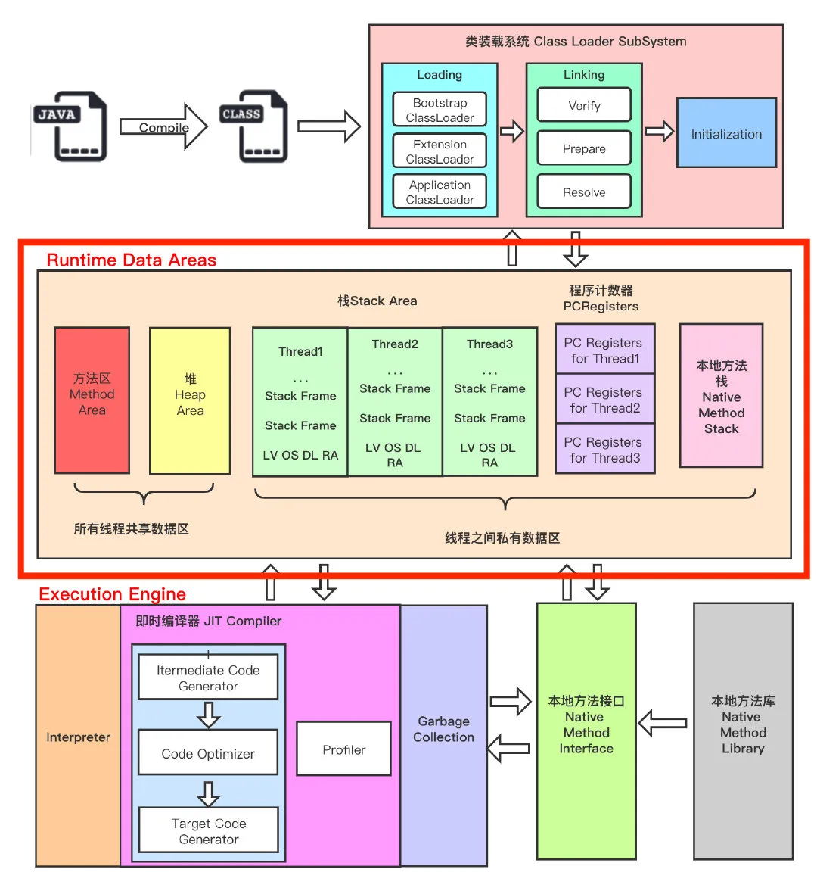
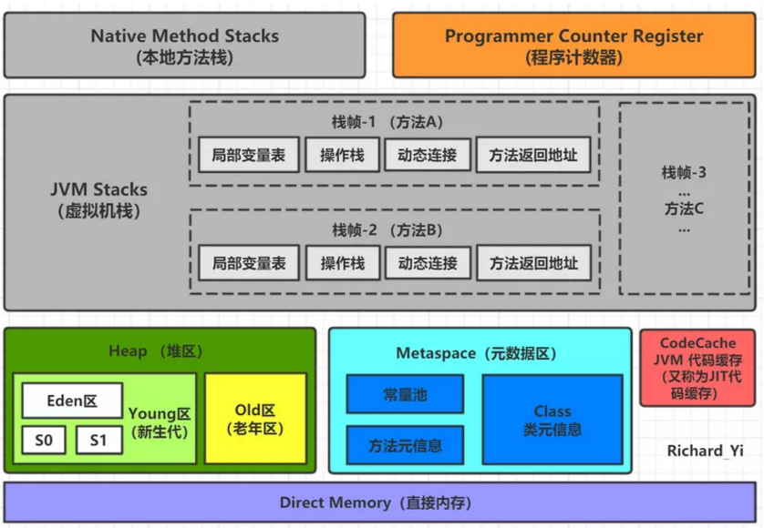
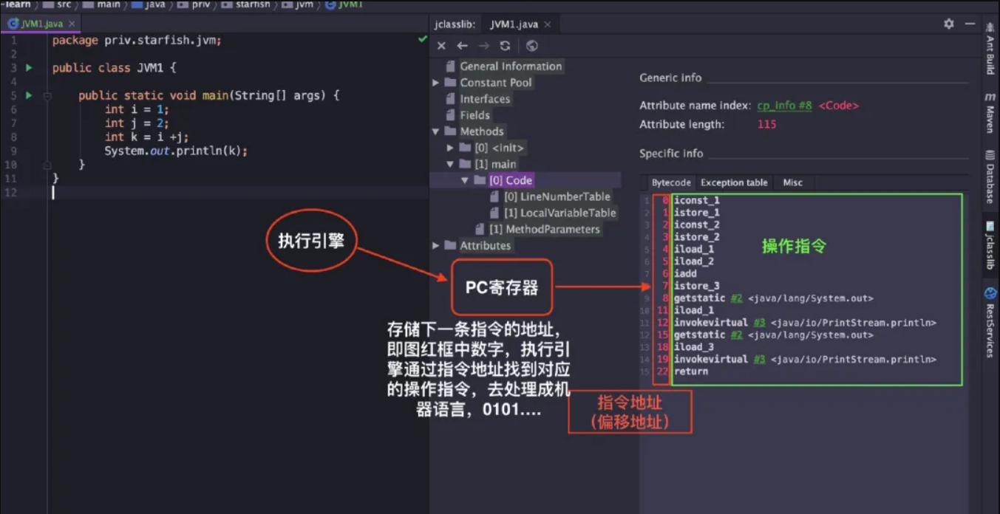
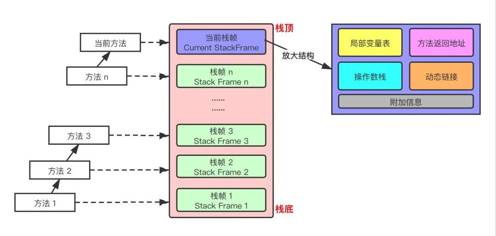
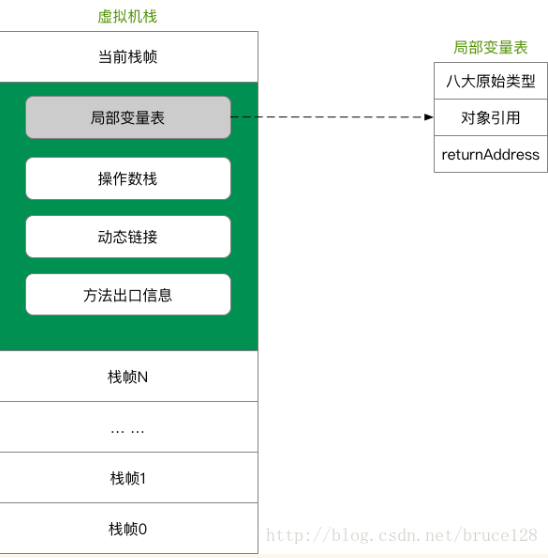
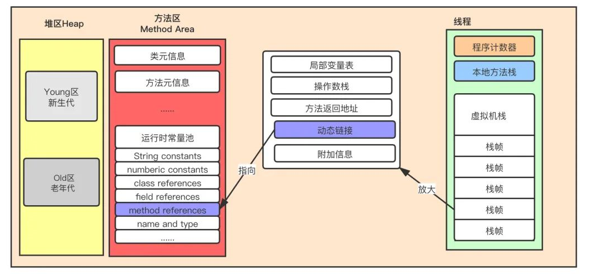
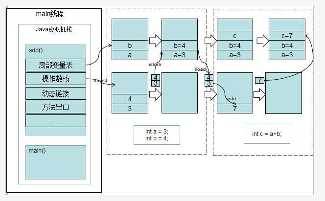
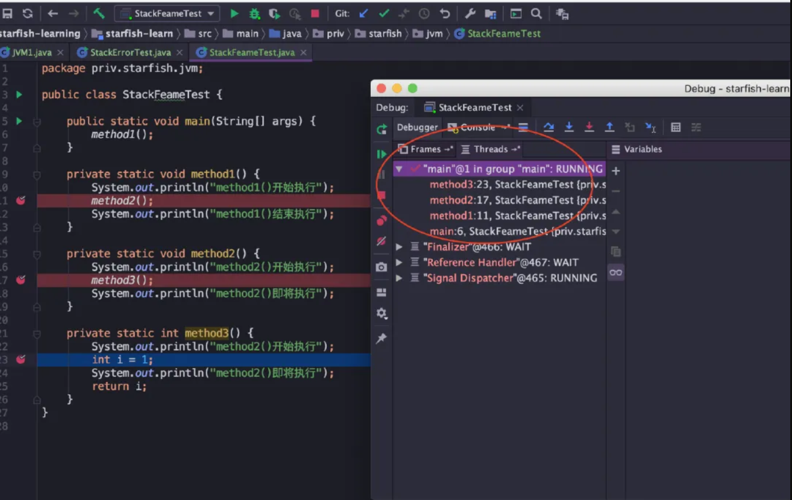
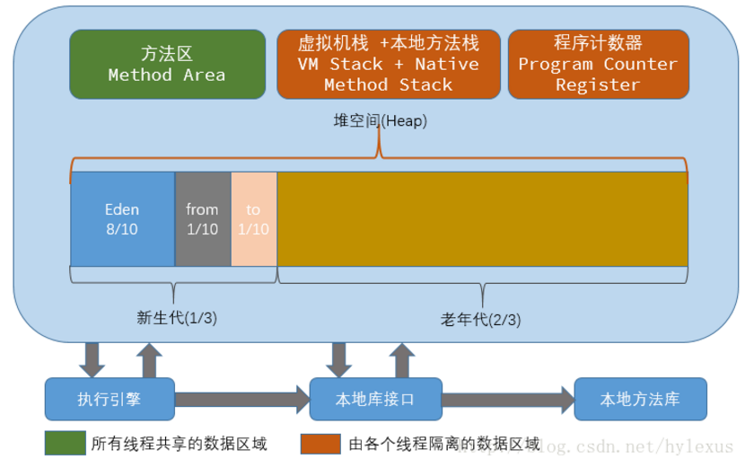
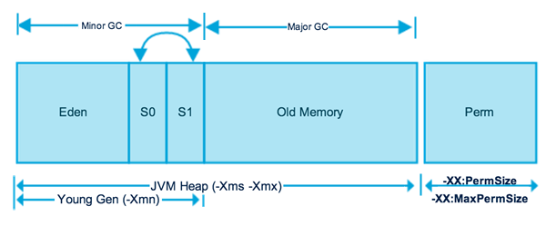

# JVM 内存区域



>  java内存区域

#  运行时数据区域 
	有些区域随着虚拟机的进程的启动而存在  
	有些区域随着用户线程的启动/结束来建立和销毁  

<!--more-->



## 线程私有

###  程序计数器（Program Counter Register）



- 标记:__线程私有__
- 是对物理pc 寄存器的一种模拟
- 一块较小的内存区域
- 唯一一个在java内存中没有规定OutOfMemoryError，**它的生命周期随着线程的创建而创建，随着线程的结束而死亡**
- 作用
  - 记录当前线程所执行的字节码的行号指示器
  - 记录线程的执行的位置。多线程切换时，每个线程能正确回到之前执行的位置。
  - 字节码解释工作通过改变这个计数器的值来选取下一条需要执行的指令。
  - 分支，循环，跳转，异常处理都要依赖这个计数器来处理。
  - **为了线程切换后能恢复到正确的执行位置，每条线程都需要有一个独立的程序计数器**
  - **各线程之间计数器互不影响，独立存储，我们称这类内存区域为“线程私有”的内存**
  - 作用
    1. 字节码解释器通过改变程序计数器来依次读取指令,从而实现代码的流程控制，如：顺序执行、选择、循环、异常处理。
    2. 在多线程的情况下，程序计数器用于记录当前线程执行的位置,从而当线程切换回来的时候，知道上一次执行到什么位置了。
  - 线程特点
  	- 如果执行java方法。记录的时虚拟机字节码指令的地址
  	- netive方法，则这个计数器则为空（Undefined）

#### java虚拟机栈(java virtual machine stacks)

- 桟的整体结构



- 当前桟的结构



- 标记: __线程私有__

- 生命周期与线程相同

- 每次方法调用的数据都是通过桟传递的

- 异常情况： **Java虚拟机栈的大小是动态的或者是固定不变的**
  - StackOverflowError
  	
  	- 线程请求栈的深度大于虚拟机所允许的深度
  - OutOfMemoryError
  	
  	- 如果虚拟机栈可以动态扩展，如果拓展时无法申请到足够的内存
#### 栈帧（Stack Frame）

##### 局部变量 local Variables
__数据类型__:
- 8种基本数据类型（`boolean,byte,char,short,int,float,long,double`） 
- 对象引用
> reference 类型,它不同于对象本身，可能是一个指向对象起始地址的引用指针，也可能是指向一个代表对象的句柄或其他与此对象相关的位置

-  returnAddress类型
> 指向了一条字节码指令的地址，已被异常表取代

_说明_：

- 由于局部变量表是建立在线程的栈上，是线程的私有数据，因此**不存在数据安全问题**
- 局部变量表所需要的容量大小是编译期确定下来的，并保存在方法的 Code 属性的maximum local variables 数据项中。在方法运行期间是不会改变局部变量表的大小的
- **局部变量表中的变量只在当前方法调用中有效**。
- 参数值的存放总是在局部变量数组的 index0 开始，到数组长度 -1 的索引结束

__局部变量的存储单位：__槽：slot

##### 操作数栈 open Stack
- 方法中的所有操作过程都是基于操作数栈来完成的
- 操作变量的内存模型。操作数栈的最大深度在编译的时候已经确定（写入方法区code属性的max_stacks项中）
- 操作数栈的的元素可以是任意Java类型，包括long和double，32位数据占用栈空间为1，64位数据占用2
- 方法刚开始执行的时候，栈是空的，当方法执行过程中，各种字节码指令往栈中存取数据
- 操作数栈，主要用于保存计算过程的中间结果，同时作为计算过程中变量临时的存储空间
- 如果被调用的方法带有返回值的话，其返回值将会被压入当前栈帧的操作数栈中
- **Java虚拟机的解释引擎是基于栈的执行引擎，其中的栈指的就是操作数栈**

#####  动态链接  Reference to runtime constant pool
- 每个栈帧中包含一个在常量池中对当前方法的引用， 目的是支持方法调用过程的动态连接。
- 动态链接是用来完成运行时绑定操作的。在栈帧中有一个指向常量池的当前类的一个引用。在class文件里一个方法要是调用其他方法或者其他成员变量，则需要通过符号引用来表示。
- 动态链接的作用就是将符号引用转换为直接引用。
- 类加载的过程中将要解析尚未被解析的符号引用，并且把对变量的访问转换为正确的偏移量。
- java 源文件被编译成字节码文件时，所有的变量和方法引用都作为符号引用（Symbolic Reference）存储在常量池中。那么__动态链接的作用就是为了将这些符号引用转换为调用方法的直接引用__



##### 方法出口 Return Address

- 如果有返回值的话，压入调用者栈帧中的操作数栈中，并且把PC的值指向 方法调用指令后面的一条指令地址。
- 容量大小的设置: `-Xxs128k`

##### 实例

```java
public int add(){
    int a = 3;
    int b = 4;
    int c = a+b;
    return c;
}
```

- 桟操作示意图



捡起add()栈帧的局部变量表和操作数栈就可以看到这样一个画面，在执行栗子中add()方法中的三行代码时，局部变量表和操作数栈的一个变化过程：首先，执行`int a = 3;`局部变量表中会分配出一个int区域，表示为a；同时iconst命令使得操作数栈中压入了常量3，然后再由istore命令将3弹出，赋值给局部变量表中a。同样，`int b = 4;` 这一行代码也是如此。然后，`int c = a + b;`从右往左开始，先执行`a + b`，也就是iload命令从局部变量中取出a、b对应的值，再将iadd后的值push进操作数栈中，剩下的便是`int c = 7`的操作了。

####  本地方法栈（native Method Stack）
标记: __线程私有__
- 虚拟机使用到的native方法服务
- 在 HotSpot 虚拟机中和 Java 虚拟机栈合二为一

### 扩展

- IDEA 在 debug 时候，可以在 debug 窗口看到 Frames 中各种方法的压栈和出栈情况



#### JVM 是如何执行方法调用的

一切方法调用在 Class文件里面存储的都是**符号引用**，而不是方法在实际运行时内存布局中的入口地址（**直接引用**）。也就是需要在类加载阶段，甚至到运行期才能确定目标方法的直接引用。

- 符号引用 和直接引用

  > 1. 符号引用：字符串，能根据这个字符串定位到指定的数据，比如java/lang/StringBuilder
  > 2. 直接引用：内存地址(可以被虚拟机直接使用的内存地址或者偏移量)

在 JVM 中，将符号引用转换为调用方法的直接引用与方法的绑定机制有关

- **静态链接**：当一个字节码文件被装载进 JVM 内部时，如果被调用的**目标方法在编译期可知**，且运行期保持不变时。这种情况下将调用方法的符号引用转换为直接引用的过程称之为静态链接
- **动态链接**：如果被调用的方法在编译期无法被确定下来，也就是说，只能在程序运行期将调用方法的符号引用转换为直接引用，由于这种引用转换过程具备动态性，因此也就被称之为动态链接

对应的方法的绑定机制为：早期绑定（Early Binding）和晚期绑定（Late Binding）.

- **绑定是一个字段、方法或者类在符号引用被替换为直接引用的过程，这仅仅发生一次**

- 早期绑定：**早期绑定就是指被调用的目标方法如果在编译期可知，且运行期保持不变时**，即可将这个方法与所属的类型进行绑定，这样一来，由于明确了被调用的目标方法究竟是哪一个，因此也就可以使用静态链接的方式将符号引用转换为直接引用。
- 晚期绑定：如果被调用的方法在编译器无法被确定下来，只能够在程序运行期根据实际的类型绑定相关的方法，这种绑定方式就被称为晚期绑定。

 #### 虚方法和非虚方法

- 如果方法在编译器就确定了具体的调用版本，这个版本在运行时是不可变的。这样的方法称为非虚方法，比如静态方法、私有方法、final方法、实例构造器、父类方法都是非虚方法
- 其他方法称为虚方法

##### 虚方法

在面向对象编程中，会频繁的使用到动态分派，如果每次动态分派都要重新在类的方法元数据中搜索合适的目标有可能会影响到执行效率。为了提高性能，JVM 采用在类的方法区建立一个虚方法表（virtual method table），使用索引表来代替查找。非虚方法不会出现在表中

每个类中都有一个虚方法表，表中存放着各个方法的实际入口。

虚方法表会在类加载的连接阶段被创建并开始初始化，类的变量初始值准备完成之后，JVM 会把该类的方法表也初始化完毕。

###  线程共享

####  java堆 （java Heap）

**Java世界中“几乎”所有的对象都在堆中分配，但是，随着JIT编译期的发展与逃逸分析技术逐渐成熟，栈上分配、标量替换优化技术将会导致一些微妙的变化,所有的对象都分配到堆上也渐渐变得不那么“绝对”了。从jdk 1.7开始已经默认开启逃逸分析，如果某些方法中的对象引用没有被返回或者未被外面使用（也就是未逃逸出去），那么对象可以直接在栈上分配内存。**

堆内存的划分在JVM里面的示意图:



- 标记: __线程共享__

- GC 堆

- 说明
	- java堆时垃圾收集管理的主要区域
	- 线程共享的区域。在虚拟机启动时创建
	- java内存可以物理上不连续，只要逻辑上连续即可
	
- 堆内存划分:

  jdk 1.8 之前

  

  jdk 1.8 之后

  

  jdk 1,8 之后多出了元空间

  - 对象分配说明：

    > 大部分情况，对象都会首先在 Eden 区域分配，在一次新生代垃圾回收后，如果对象还存活，则会进入 s0 或者 s1，并且对象的年龄还会加 1(Eden 区->Survivor 区后对象的初始年龄变为 1)，当它的年龄增加到一定程度（默认为 15 岁），就会被晋升到老年代中。对象晋升到老年代的年龄阈值，可以通过参数 `-XX:MaxTenuringThreshold` 来设置。
    >
    > Hotspot遍历所有对象时，按照年龄从小到大对其所占用的大小进行累积，当累积的某个年龄大小超过了survivor区的一半时，取这个年龄和MaxTenuringThreshold中更小的一个值，作为新的晋升年龄阈值

  - 堆这里最容易出现的就是 OutOfMemoryError 错误，并且出现这种错误之后的表现形式还会有几种，比如
    1. **`outOfMemoryError: GC Overhead Limit Exceeded`** : 当JVM花太多时间执行垃圾回收并且只能回收很少的堆空间时，就会发生此错误。
    2. **`java.lang.OutOfMemoryError: Java heap space`**: 假如在创建新的对象时, 堆内存中的空间不足以存放新创建的对象, 就会引发`java.lang.OutOfMemoryError: Java heap space` 错误。(和本机物理内存无关，和你配置的内存大小有关！)
    3. ....

- 分代收集算法

	1. 新年代(Young Generation)

		   1. 使用复制清除算法（Copinng算法）,原因是年轻代每次GC都要回收大部分对象
		   2. 新生代里面分成一份较大的Eden空间和两份较小的Survivor空间。每次只使用Eden和其中一块Survivor空间，然后垃圾回收的时候，把存活对象放到未使用的Survivor（划分出from、to）空间中，清空Eden和刚才使用过的Survivor空间
		   3. 内存不足时发生Minor GC
  	2. 老年代(Old Generation)

		   1. 采用标记-整理算法（mark-compact），原因是老年代每次GC只会回收少部分对象
	3. 永久代(Permanent Generation)

	      	1. Perm：用来存储类的元数据，也就是方法区。
	     	 	2. Perm的废除：在jdk1.8中，Perm被替换成MetaSpace，MetaSpace存放在本地内存中.原因是永久代经常内存不够用，或者发生内存泄漏
	4. MetaSpace（元空间）：元空间的本质和永久代类似，都是对JVM规范中方法区的实现。

		   1. 元空间与永久代之间最大的区别在于：元空间并不在虚拟机中，而是使用本地内存
	
- 细分
		
	1. Eden空间
	2. From Survivor
	3. To Survivor
	4. 老年代
	5. 永久代
	
- 内存分配角度
	
	- 线程共享的java堆中可能划分出多个线程私有的分配缓冲区 `TLAB(Thread Local Allocation Buffer)`
	
- 异常划分	
	
	- OutOfMemoryError
	
- 容量设置
    ```shell
    -Xms20m   堆的最小容量
    -Xmx20m  堆的最大容量
    -XX：+HeapDumpOnOutOfMemoryError  将异常时dump出当前的内存转储快照
    ```

#### 方法区（Method Area）

- 标记: __线程共享__
- 说明
	- java规范把方法区描述为堆的逻辑部分，但是它却有一个名字叫非堆（Non-Heap）
	- 存储
		1. 虚拟机加载的类信息
		2. 常量
		3. 静态变量
		4. 即时编译后的代码数据

	- 永久带（Permanent Generation）
		- 使用永久代来实现方法区
		- 垃圾回收：主要是针对常量池的回收和类型的卸载
		- 容量的设置
        ```
        -XX：PermSize=10M
        -XX:MaxPermSize=10M
        ```

#### 方法区和永久代的关系

__永久代是 HotSpot 的概念，方法区是 Java 虚拟机规范中的定义__，是一种规范，而永久代是一种实现，一个是标准一个是实现，其他的虚拟机实现并没有永久代这一说法。

永久代 是 hotSpot 虚拟机对方法区的一种实现。

- 方法区大小的调节
```java
-XX:PermSize=N //方法区 (永久代) 初始大小
-XX:MaxPermSize=N //方法区 (永久代) 最大大小,超过这个值将会抛出 OutOfMemoryError 异常:java.lang.OutOfMemoryError: PermGen
```
- 垃圾收集行为在这个区域是比较少出现的，但并非数据进入方法区后就“永久存在”了
- JDK 1.8 的时候，方法区（HotSpot 的永久代）被彻底移除了（JDK1.7 就已经开始了），取而代之是元空间，元空间使用的是直接内存。大小调节
```java
-XX:MetaspaceSize=N //设置 Metaspace 的初始（和最小大小）
-XX:MaxMetaspaceSize=N //设置 Metaspace 的最大大小
```
> 与永久代很大的不同就是，如果不指定大小的话，随着更多类的创建，虚拟机会耗尽所有可用的系统内存。

#### 为什么要将永久代 (PermGen) 替换为元空间 (MetaSpace) 呢?

> 整个永久代有一个 JVM 本身设置固定大小上限，无法进行调整，而元空间使用的是直接内存，受本机可用内存的限制，虽然元空间仍旧可能溢出，但是比原来出现的几率会更小。
>
> 当元空间溢出时会得到如下错误： `java.lang.OutOfMemoryError: MetaSpace`
>
> 可以使用 `-XX：MaxMetaspaceSize` 标志设置最大元空间大小，默认值为 unlimited，这意味着它只受系统内存的限制。`-XX：MetaspaceSize` 调整标志定义元空间的初始大小如果未指定此标志，则 Metaspace 将根据运行时的应用程序需求动态地重新调整大小。
>
> 元空间里面存放的是类的元数据，这样加载多少类的元数据就不由 `MaxPermSize` 控制了, 而由系统的实际可用空间来控制，这样能加载的类就更多了。

##### 运行时常量池（RunTime Constant Pool）

- 标记: __线程共享__
- 说明
	- 方法区的一部分
	- 动态特性
		- 运行时也可以将常量放入常量池中
		- eg：`String.intern()`
- 常量池（Constant Pool Table）
	- 编译期生成的各种字面常量和符号引用
	- 直接引用
- 运行时常量池是方法区的一部分,当常量池无法再申请到内存时会抛出 OutOfMemoryError 错误
- 运行时常量池的变更史
      1. JDK1.7之前运行时常量池逻辑包含字符串常量池存放在方法区, 此时hotspot虚拟机对方法区的实现为永久代
      2. JDK1.7 字符串常量池被从方法区拿到了堆中, 这里没有提到运行时常量池,也就是 __说字符串常量池被单独拿到堆__,运行时常量池剩下的东西还在方法区, 也就是hotspot中的永久代
      3.  JDK1.8 hotspot移除了永久代用元空间(Metaspace)取而代之, 这时候字符串常量池还在堆, 运行时常量池还在方法区, 只不过方法区的实现从永久代变成了元空间(Metaspace)

#### 直接内存(Direct  Memory)

**直接内存并不是虚拟机运行时数据区的一部分，也不是虚拟机规范中定义的内存区域，但是这部分内存也被频繁地使用。而且也可能导致 OutOfMemoryError 错误出现。**

本机直接内存的分配不会受到 Java 堆的限制，但是，既然是内存就会受到本机总内存大小以及处理器寻址空间的限制。

- NIO引入
  - DirectByteBuffer
- 异常
  - OutofMemoryError
  - 容量的小：可以通过-XX：MaxDirectMemorySize=10M来指定，如果不指定，则和堆内存-Xmx的大小一致


# 参考

- https://blog.csdn.net/q5706503/article/details/84640762
- https://mp.weixin.qq.com/s/uyBq4A46uexhU1zLnHLqWg
- https://juejin.im/post/6844903785416884231