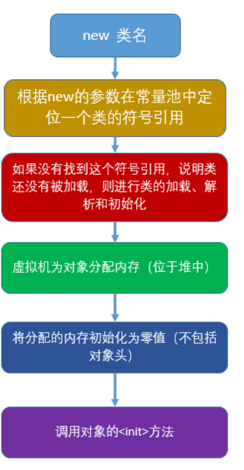
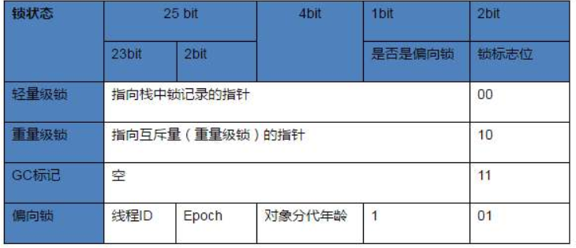
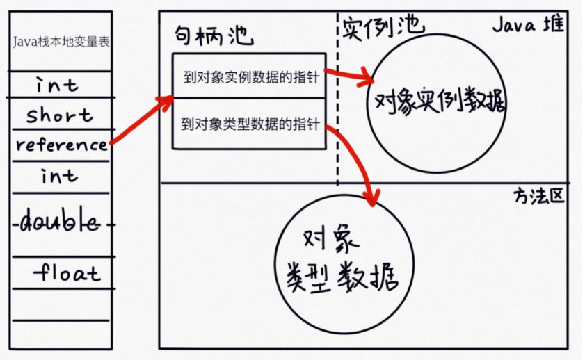
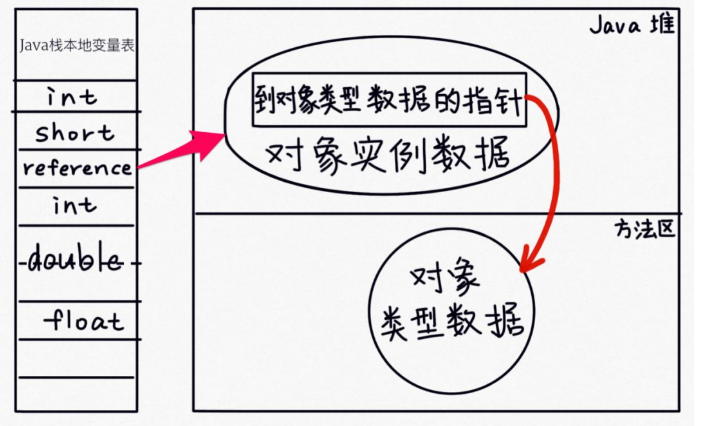

# 对象的创建

## 遇到new指令后

#### 在常量池中定位到一个类的符号引用

#### 检查符号引用代表的类是否被加载、解析、初始化。如果没有，就需要执行类的加载过程

#### 为新生对象分配内存空间

<!--more-->

- 指针碰撞 Dump the point
	- 条件：
		1. 假设java堆中的内存是绝对规整的。
		2. 所有用过的内存都放在一边，空闲的放在另一边。
		3. 中间放着一个指针作为分界点的指示器。
	- 操作：分配内存就是仅仅把那个指针向空闲那边挪动一段与对象相等的距离
	- 对应的垃圾收集器(带compact功能的收集器)
		- serial
		- parNew
- 空闲列表  free list
	- 条件：
		1. Java堆中的内存不规整，已使用和未使用的内存相互交错
		2. 虚拟机维护一个列表，用于记录那些内存时可用的。
	- 操作：
		- 找一块足够大的空间划分给对象实例。并更新列表上的记录。
	- 对应的收集器
		- Mark-sweep
		- CMS
	- 保证线程安全的两种方式
		1. CAS配上失败重试的方式保证更新操作的原子性
		2. 把内存分配的动作按照线程划分在不同的空间之中进行（即每个线程在java堆中预先分配一块小内存--本地线程分配缓冲（TLAB））

#### 虚拟机需要将分配到的内存空间都初始化零值（不包括对象头）

- 作用：保证了对象的实例字段在java代码中可以不赋初始值就直接使用

#### 对象头的必要设置

- 哪个类的实例、

- 如何才能找到类的元数据信息

- 对象的hash码

- GC分代年龄

- 锁的使用情况

#### init 方法的执行

- 对象按照程序员的意愿进行初始化

### 内存分配并发问题

在创建对象的时候有一个很重要的问题，就是线程安全，因为在实际开发过程中，创建对象是很频繁的事情，作为虚拟机来说，必须要保证线程是安全的，通常来讲，虚拟机采用两种方式来保证线程安全：

1. **CAS+失败重试：** CAS 是乐观锁的一种实现方式。所谓乐观锁就是，每次不加锁而是假设没有冲突而去完成某项操作，如果因为冲突失败就重试，直到成功为止。**虚拟机采用 CAS 配上失败重试的方式保证更新操作的原子性。**
2. **TLAB：** 为每一个线程预先在 Eden 区分配一块儿内存，JVM 在给线程中的对象分配内存时，首先在 TLAB 分配，当对象大于 TLAB 中的剩余内存或 TLAB 的内存已用尽时，再采用上述的 CAS 进行内存分配

# 内存的布局
#### 对象头 Header

- 自身运行时数据
	- hash码
	- GC分代年龄(markword)
	- 锁的状态标志
	- 线程持有的锁
	- 偏向线程id
	- 偏向时间戳
	
	类型指针
	
	- 对象指向它对应元数据的指针----确定这个对象是哪个类的实例

#### 实例数据区 Instance Data

1. 默认分配顺序：longs/doubles、ints、shorts/chars、bytes/booleans、oops (Ordinary Object Pointers)，相同宽度的字段会被分配在一起，除了 oops，其他的长度由长到短；
2. 默认分配顺序下，父类字段会被分配在子类字段前面。

#### 对齐填充区 padding

  - 占位符的作用
  - *HotSpot VM要求对象的起始地址必须是8字节的整数倍，所以不够要补齐。*
4. 对象的访问定位
  - 句柄
  - 直接指针

# 对象的访问

java 程序需要通过虚拟机栈上的 reference 数据来操作堆上的具体对象.reference 数据是一个指向对象的引用，不过如何通过这个引用定位到具体的对象，目前主要有以下两种访问方式：句柄访问和直接指针访问。

### 句柄访问

句柄访问会在 Java 堆中划分一块内存作为句柄池.每一个句柄存放着到对象实例数据和对象类型数据的指针。

优势：对象移动的时候（这在垃圾回收时十分常见）只需改变句柄池中对象实例数据的指针，不需要修改reference本身。

### 直接指针访问

直接指针访问方式在 Java 堆对象的实例数据中存放了一个指向对象类型数据的指针，在 HotSpot 中，这个指针会被存放在对象头中。

优势：减少了一次指针定位对象实例数据的开销，速度更快。

