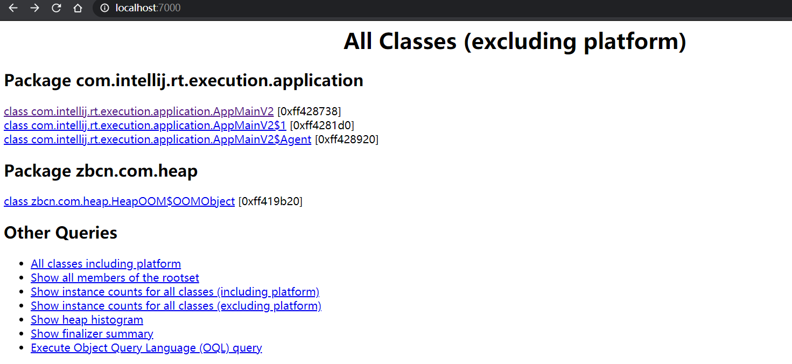
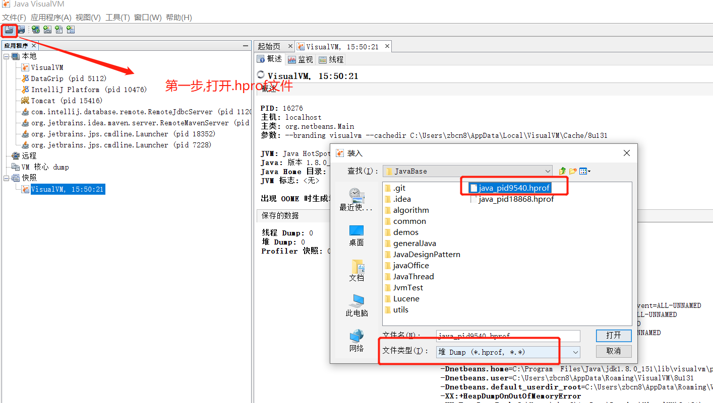
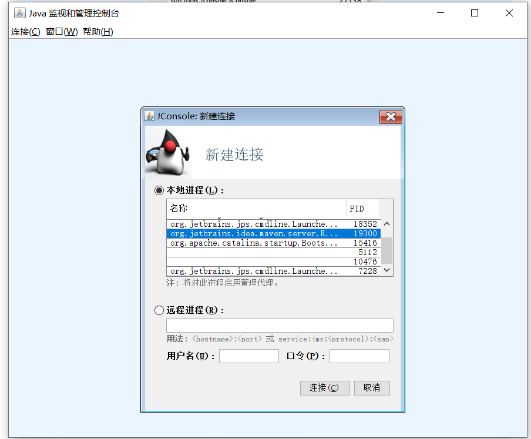
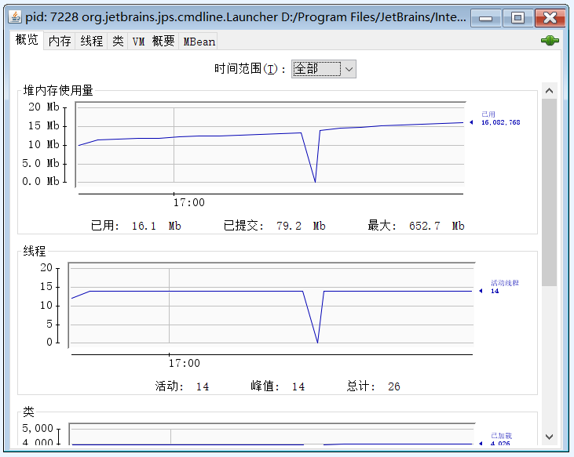
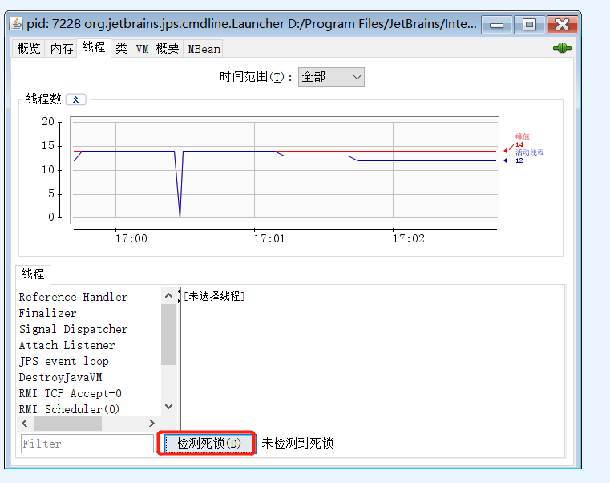

性能监控/故障处理

# JDK 自带工具

- `jps  ` `JVM Process Status Tool` 显示指定系统内所有的 HotSpot 虚拟机进程
- `jstat  ` `JVM Statistics Monitoring Tool`  用于收集 HotSpot 虚拟机各方面的运行数据
- `jinfo  ` `Configuration Info for Java`, 显示虚拟机配置信息
- `jmap`   `Memory Map for Java`  生成虚拟机的内存转储快照（heapdump 文件）
- `jhat`  `JVM Heap Analysis Tool` 用于分析 heapdump 文件（它会建立一个 HTTP/HTML 服务器，让用户可以在浏览器上查看分析结果）
- `jstack` `Stack Trace for Java` 显示虚拟机的线程快照

官方文档: https://docs.oracle.com/javase/8/docs/technotes/tools/unix/toc.html

# 命令格式

##  jps   虚拟金进程状况

```shell
# 命令格式
jps [ options ] [ hostid ]

# eg1
$ jps
15236 Jps
14966 Example1
# eg2
$ jps -l
15249 sun.tools.jps.Jps
14966 com.jaxer.jvm.egs.Example1

# eg3
$ jps -m
15264 Jps -m
14966 Example1
# eg4
$ jps -v
14966 Example1 -Dvisualvm.id=44321340563858 -Xmx50m -Xms50m -XX:+PrintGCDetails -javaagent:/Applications/IntelliJ IDEA.app/Contents/lib/idea_rt.jar=61849:/Applications/IntelliJ IDEA.app/Contents/bin -Dfile.encoding=UTF-8
15278 Jps -Dapplication.home=/Library/Java/JavaVirtualMachines/jdk1.8.0_191.jdk/Contents/Home -Xms8m

# eg5
$ jps -q
9938
14966
15334
```

##  jstat: 虚拟机统计信息监视工具

### 堆内存监控

```shell
# 命令格式
jstat [option vmid [interval[s|ms] [count]] ]

# eg: 监控堆内存信息
$ jstat -gc 11200
S0C    S1C    S0U    S1U      EC       EU        OC         OU       MC     MU    CCSC   CCSU   YGC     YGCT    FGC    FGCT     GCT
 0.0    0.0    0.0    0.0   13312.0   2048.0   11264.0     6465.8   17920.0 16755.0 2304.0 1853.8     13    0.050  22      1.524    1.574
# 每隔 1000 毫秒打印堆内存信息，打印 10 次
$ jstat -gc 11200 1000 10
```

- 参数主要是新生代、老年代的内存空间占用情况以及 GC 的次数和时间

  > `S0C`: Current survivor space 0 capacity (kB).
  >
  > `S1C`: Current survivor space 1 capacity (kB).
  >
  > `S0U`: Survivor space 0 utilization (kB).
  >
  > `S1U`: Survivor space 1 utilization (kB).
  >
  > `EC`: Current eden space capacity (kB).`EU`: Eden space utilization (kB).
  >
  > `OC`: Current old space capacity (kB).`OU`: Old space utilization (kB).
  >
  > `MC`: Metaspace capacity (kB).`MU`: Metacspace utilization (kB).
  >
  > `CCSC`: Compressed class space capacity (kB).`CCSU`: Compressed class space used (kB).
  >
  > `YGC`: Number of young generation garbage collection events.
  >
  > `YGCT`: Young generation garbage collection time.
  >
  > `FGC`: Number of full GC events.`FGCT`: Full garbage collection time.
  >
  > `GCT`: Total garbage collection time.

  官方文档:https://docs.oracle.com/javase/8/docs/technotes/tools/unix/jstat.html#BEHHGFAE


### 查看类加载/卸载信息

```shell
 jstat -class 14966
Loaded  Bytes  Unloaded  Bytes     Time
   829  1604.4        0     0.0       0.37
```


## jinfo java 配置信息工具

### 查看 JVM 启动参数

```java
$ jinfo -flags 15416
Attaching to process ID 15416, please wait...
Debugger attached successfully.
Server compiler detected.
JVM version is 25.151-b12
Non-default VM flags: -XX:CICompilerCount=4 -XX:InitialHeapSize=134217728 -XX:+ManagementServer -XX:MaxHeapSize=2118123520 -XX:MaxNewSize=705691648 -XX:MinHeapDeltaBytes=524288 -XX:NewSize=44564480 -XX:OldSize=89653248 -XX:+UseCompressedClassPointers -XX:+UseCompressedOops -XX:+UseFastUnorderedTimeStamps -XX:-UseLargePagesIndividualAllocation -XX:+UseParallelGC
Command line:  -Djava.util.logging.config.file=C:\Users\zbcn8\.IntelliJIdea2019.2\system\tomcat\Unnamed_czsb_2\conf\logging.properties -Djava.util.logging.manager=org.apache.juli.ClassLoaderLogManager -Drebel.base=C:\Users\zbcn8\.jrebel -Drebel.env.ide.plugin.version=2020.1.1 -Drebel.env.ide.version=2019.2.2 -Drebel.env.ide.product=IU -Drebel.env.ide=intellij -Drebel.notification.url=http://localhost:17434 -agentpath:C:\Users\zbcn8\.IntelliJIdea2019.2\config\plugins\jr-ide-idea\lib\jrebel6\lib\jrebel64.dll -agentlib:jdwp=transport=dt_socket,address=127.0.0.1:61103,suspend=y,server=n -javaagent:C:\Users\zbcn8\.IntelliJIdea2019.2\system\captureAgent\debugger-agent.jar -Dfile.encoding=UTF-8 -Dcom.sun.management.jmxremote= -Dcom.sun.management.jmxremote.port=1099 -Dcom.sun.management.jmxremote.ssl=false -Dcom.sun.management.jmxremote.password.file=C:\Users\zbcn8\.IntelliJIdea2019.2\system\tomcat\Unnamed_czsb_2\jmxremote.password -Dcom.sun.management.jmxremote.access.file=C:\Users\zbcn8\.IntelliJIdea2019.2\system\tomcat\Unnamed_czsb_2\jmxremote.access -Djava.rmi.server.hostname=127.0.0.1 -Djdk.tls.ephemeralDHKeySize=2048 -Dignore.endorsed.dirs= -Dcatalina.base=C:\Users\zbcn8\.IntelliJIdea2019.2\system\tomcat\Unnamed_czsb_2 -Dcatalina.home=D:\tomcat\tomcat-7-oracle -Djava.io.tmpdir=D:\tomcat\tomcat-7-oracle\temp
```

- 值得注意的是，JDK 8 使用该命令时会抛出如下异常：

```java
$ jinfo -flags 26284
Attaching to process ID 26284, please wait...
Error attaching to process: sun.jvm.hotspot.debugger.DebuggerException: Can't attach symbolicator to the process
sun.jvm.hotspot.debugger.DebuggerException: sun.jvm.hotspot.debugger.DebuggerException: Can't attach symbolicator to the process
 at sun.jvm.hotspot.debugger.bsd.BsdDebuggerLocal$BsdDebuggerLocalWorkerThread.execute(BsdDebuggerLocal.java:169)
 at sun.jvm.hotspot.debugger.bsd.BsdDebuggerLocal.attach(BsdDebuggerLocal.java:287)
 at sun.jvm.hotspot.HotSpotAgent.attachDebugger(HotSpotAgent.java:671)
 at sun.jvm.hotspot.HotSpotAgent.setupDebuggerDarwin(HotSpotAgent.java:659)
 at sun.jvm.hotspot.HotSpotAgent.setupDebugger(HotSpotAgent.java:341)
 at sun.jvm.hotspot.HotSpotAgent.go(HotSpotAgent.java:304)
 at sun.jvm.hotspot.HotSpotAgent.attach(HotSpotAgent.java:140)
 at sun.jvm.hotspot.tools.Tool.start(Tool.java:185)
 at sun.jvm.hotspot.tools.Tool.execute(Tool.java:118)
 at sun.jvm.hotspot.tools.JInfo.main(JInfo.java:138)
 at sun.reflect.NativeMethodAccessorImpl.invoke0(Native Method)
 at sun.reflect.NativeMethodAccessorImpl.invoke(NativeMethodAccessorImpl.java:62)
 at sun.reflect.DelegatingMethodAccessorImpl.invoke(DelegatingMethodAccessorImpl.java:43)
 at java.lang.reflect.Method.invoke(Method.java:498)
 at sun.tools.jinfo.JInfo.runTool(JInfo.java:108)
 at sun.tools.jinfo.JInfo.main(JInfo.java:76)
Caused by: sun.jvm.hotspot.debugger.DebuggerException: Can't attach symbolicator to the process
 at sun.jvm.hotspot.debugger.bsd.BsdDebuggerLocal.attach0(Native Method)
 at sun.jvm.hotspot.debugger.bsd.BsdDebuggerLocal.access$100(BsdDebuggerLocal.java:65)
 at sun.jvm.hotspot.debugger.bsd.BsdDebuggerLocal$1AttachTask.doit(BsdDebuggerLocal.java:278)
 at sun.jvm.hotspot.debugger.bsd.BsdDebuggerLocal$BsdDebuggerLocalWorkerThread.run(BsdDebuggerL
```

查资料说是 JVM 的 bug（链接：https://bugs.java.com/bugdatabase/view_bug.do?bug_id=8160376），在 JDK 9 b129 修复了。

## jmap: Java 内存映像工具

### 查看对象信息: 

- 可以使用 jmap 查看内存中的对象数量及内存空间占用：

```shell
# 命令
jmap [option] <pid>

#                                                                         
λ jmap -histo 11200 | head -20
 num     #instances         #bytes  class name (module)
-------------------------------------------------------
   1:         24274        2567096  [B (java.base@11.0.3)
   2:          2857         649120  [I (java.base@11.0.3)
   3:         22521         540504  java.lang.String (java.base@11.0.3)
   4:          3683         454944  java.lang.Class (java.base@11.0.3)
   5:          8779         280928  java.util.HashMap$Node (java.base@11.0.3)
   6:           246         255224  [C (java.base@11.0.3)
   7:          7912         253184  java.util.concurrent.ConcurrentHashMap$Node (java.base@11.0.3)
   8:           181         248688  [Ljava.util.concurrent.ConcurrentHashMap$Node; (java.base@11.0.3)
   9:          3319         237488  [Ljava.lang.Object; (java.base@11.0.3)
  10:          1547         136136  java.lang.reflect.Method (java.base@11.0.3)
  11:           563         102880  [Ljava.util.HashMap$Node; (java.base@11.0.3)
  12:          1348          53920  java.lang.ref.SoftReference (java.base@11.0.3)
  13:          1927          50808  [Ljava.lang.Class; (java.base@11.0.3)
  14:          1143          45720  java.util.LinkedHashMap$Entry (java.base@11.0.3)
  15:          2739          43824  java.lang.Object (java.base@11.0.3)
  16:           888          42624  java.lang.invoke.MemberName (java.base@11.0.3)
  17:           764          36672  sun.util.locale.LocaleObjectCache$CacheEntry (java.base@11.0.3)
  18:           606          29088  java.util.HashMap (java.base@11.0.3)      
  
```

###  导出堆转储快照

```shell
# 可以在对应路径下看到堆转储快照文件 dump.hprof。导出来之后，就可以用其它工具分析快照文件了。
$ jmap -dump:live,format=b,file=/Users/jaxer/Desktop/dump.hprof 26472
Dumping heap to /Users/jaxer/Desktop/dump.hprof ...
Heap dump file created
```

##  jhat: 堆转储快照分析工具

```shell
# 分析 jmap 生成的快照文件
λ jhat D:\baseCode\JavaBase\java_pid18868.hprof
Reading from D:\baseCode\JavaBase\java_pid18868.hprof...
Dump file created Thu Jul 30 14:27:28 CST 2020
Snapshot read, resolving...
Resolving 819534 objects...
Chasing references, expect 163 dots...................................................................................................................................................................
Eliminating duplicate references...................................................................................................................................................................
Snapshot resolved.
Started HTTP server on port 7000
Server is ready.
```

- Server 启动后，在浏览器打开 http://localhost:7000/，可以看到如下信息：



- 实际工作中，一般不会直接使用 jhat 命令来分析 dump 文件，主要原因：

> 1. 一般不会在部署应用程序的服务器上直接分析 dump 文件（分析工作一般比较耗时，而且消耗硬件资源，在其他机器上进行时则没必要受到命令行工具的限制）；
> 2. jhat 分析功能相对简陋，VisualVM 等更工具功能强大。

##  jvisualvm & VisualVM: 堆转储快照分析工具

- jvisualvm 也是 JDK 自带的命令，虽然后面独立发展了。这两种方式都可以使用。
- VisualVM 链接：https://visualvm.github.io/

### 使用 VisualVM 分析上面 jmap 导出的堆栈转储文件




## jconsole: JVM 性能监控

使用 jconsole 命令会启动一个用户界面，如下



概览



死锁检测



除了上面 JDK 自带的工具，还有个很好用的阿里开源的 Arthas

## Arthas

- 官方文档：

> 中：https://alibaba.github.io/arthas/
>
> 英：https://alibaba.github.io/arthas/en/

### 启动

为了演示部分功能，这里准备了一些简单的示例代码

- `hello.java`

```java
package com.jaxer.jvm.arthas;

import java.time.LocalDateTime;

public class Hello {
 public void sayHello() {
  System.out.println(LocalDateTime.now() + " hello");
 }
}
```

- `ArthasTest.java`

```java
package com.jaxer.jvm.arthas;

import java.util.concurrent.TimeUnit;

public class ArthasTest {
 public static void main(String[] args) throws InterruptedException {
  while (true) {
   TimeUnit.SECONDS.sleep(5);
   new Hello().sayHello();
  }
 }
}
```

- #### 启动 Arthas

```shell
# Arthas 其实是一个 jar 包，下载后运行：
$ java -jar arthas-boot.jar
# 打印帮助信息：
$ java -jar arthas-boot.jar -h
```

- 启动成功后

```shell
λ java -jar arthas-boot.jar                                             
[INFO] arthas-boot version: 3.1.7                                       
[INFO] Found existing java process, please choose one and hit RETURN.   
* [1]: 11200 com.intellij.database.remote.RemoteJdbcServer              
  [2]: 18352 org.jetbrains.jps.cmdline.Launcher                         
  [3]: 18292 org.jetbrains.kotlin.daemon.KotlinCompileDaemon            
  [4]: 19300 org.jetbrains.idea.maven.server.RemoteMavenServer          
  [5]: 15416 org.apache.catalina.startup.Bootstrap                      
  [6]: 5112                                                             
  [7]: 10476                                                            
  [8]: 16140 org.jetbrains.jps.cmdline.Launcher                         
                                                                    
```

- Arthas 会检测本地 JVM 进程并列出来（参见上面的 jps 命令），选择前面的序号就能附着到对应的进程。这里选择 1，然后回车：

```shell
1                                                                        
[INFO] arthas home: C:\Users\zbcn8\.arthas\lib\3.3.7\arthas              
[INFO] The target process already listen port 3658, skip attach.         
[INFO] arthas-client connect 127.0.0.1 3658                              
  ,---.  ,------. ,--------.,--.  ,--.  ,---.   ,---.                    
 /  O  \ |  .--. ''--.  .--'|  '--'  | /  O  \ '   .-'                   
|  .-.  ||  '--'.'   |  |   |  .--.  ||  .-.  |`.  `-.                   
|  | |  ||  |\  \    |  |   |  |  |  ||  | |  |.-'    |                  
`--' `--'`--' '--'   `--'   `--'  `--'`--' `--'`-----'                   
                                                                         
                                                                         
wiki      https://alibaba.github.io/arthas                               
tutorials https://alibaba.github.io/arthas/arthas-tutorials              
version   3.3.7                                                          
pid       11200                                                          
time      2020-07-30 09:33:21                                            
                                                                         
[arthas@11200]$                                                          
```

这样就成功附着到了该进程。接下来就可以执行各种命令来分析 JVM 了。

### 命令

#### help  Arthas 的命令概览

```shell
[arthas@36934]$ help
 NAME         DESCRIPTION
 help         Display Arthas Help
 keymap       Display all the available keymap for the specified connection.
 sc           Search all the classes loaded by JVM
 sm           Search the method of classes loaded by JVM
 classloader  Show classloader info
 jad          Decompile class
 getstatic    Show the static field of a class
 monitor      Monitor method execution statistics, e.g. total/success/failure count, average rt, fail rate, etc.
 stack        Display the stack trace for the specified class and method
 thread       Display thread info, thread stack
 trace        Trace the execution time of specified method invocation.
 watch        Display the input/output parameter, return object, and thrown exception of specified method invocation
 tt           Time Tunnel
 jvm          Display the target JVM information
 perfcounter  Display the perf counter infornation.
 ognl         Execute ognl expression.
 mc           Memory compiler, compiles java files into bytecode and class files in memory.
 redefine     Redefine classes. @see Instrumentation#redefineClasses(ClassDefinition...)
 dashboard    Overview of target jvm's thread, memory, gc, vm, tomcat info.
 dump         Dump class byte array from JVM
 heapdump     Heap dump
 options      View and change various Arthas options
 cls          Clear the screen
 reset        Reset all the enhanced classes
 version      Display Arthas version
 session      Display current session information
 sysprop      Display, and change the system properties.
 sysenv       Display the system env.
 vmoption     Display, and update the vm diagnostic options.
 logger       Print logger info, and update the logger level
 history      Display command history
 cat          Concatenate and print files
 echo         write arguments to the standard output
 pwd          Return working directory name
 mbean        Display the mbean information
 grep         grep command for pipes.
 tee          tee command for pipes.
 profiler     Async Profiler. https://github.com/jvm-profiling-tools/async-profiler
 stop         Stop/Shutdown Arthas server and exit the console.
```

#### 查看每个命令的用法, 命令后面加 -help

```shell
[arthas@36934]$ help -help
 USAGE:
   help [-h] [cmd]

 SUMMARY:
   Display Arthas Help
 Examples:
  help
  help sc
  help sm
  help watch

 OPTIONS:
 -h, --help                                      this help
 <cmd>                                           command name
```

#### dashboard

dashboard 命令可以总览 JVM 状况（默认 5 秒刷新一次）


####  jvm

- jvm 可以查看当前 JVM 的运行时信息，比如机器信息、JVM 版本、启动参数、ClassPath 等：


- 还有类加载信息、编译信息、垃圾收集器、内存相关信息


- 以及操作系统信息、死锁等


#### thread

- 线程信息、线程堆栈：


#### sc & sm

- sc 可以查看类加载信息：

```shell
[arthas@7176]$ sc zbcn.com.*
zbcn.com.arthas.ArthasTest
zbcn.com.arthas.Hello
```

- sm 可以查看类的方法信息：

```shell
[arthas@7176]$ sm zbcn.com.arthas.ArthasTest
zbcn.com.arthas.ArthasTest <init>()V
zbcn.com.arthas.ArthasTest main([Ljava/lang/String;)V
Affect(row-cnt:2) cost in 8 ms.
```

#### jad

jad 可以堆类进行反编译,

```shell
[arthas@7176]$ jad zbcn.com.arthas.ArthasTest
# 编译结果
ClassLoader:
+-sun.misc.Launcher$AppClassLoader@18b4aac2
  +-sun.misc.Launcher$ExtClassLoader@66d460a5

Location:
/D:/baseCode/JavaBase/JvmTest/target/classes/

/*
 * Decompiled with CFR.
 *
 * Could not load the following classes:
 *  zbcn.com.arthas.Hello
 */
package zbcn.com.arthas;

import java.util.concurrent.TimeUnit;
import zbcn.com.arthas.Hello;

public class ArthasTest {
    public static void main(String[] args) throws InterruptedException {
        while (true) {
            TimeUnit.SECONDS.sleep(5L);
            new Hello().sayHello();
        }
    }
}

Affect(row-cnt:1) cost in 549 ms.
```

#### redefine

redefine 就是热部署，通俗来讲就是「开着飞机换引擎」

- 原始代码执行结果

```shell
2020-07-30T18:42:53.040 hello
2020-07-30T18:42:58.040 hello
2020-07-30T18:43:03.040 hello

```

- 在不停止该程序的情况下，可以改变输出内容
- 在不停止该程序的情况下，可以改变输出内容

```shell
package zbcn.com.arthas;

import java.time.LocalDateTime;

public class Hello {
    public void sayHello() {
        System.out.println(LocalDateTime.now() + "test hello update");
    }
}


```

- 然后在本地执行 javac 将其编译为 class 文件（注意该文件的路径为 D:\\baseCode\\JavaBase\\JvmTest\\target\\classes\\zbcn\\com\\arthas\\Hello.class），然后运行 redefine 命令

```shell
[arthas@7176]$ redefine D:\\baseCode\\JavaBase\\JvmTest\\target\\classes\\zbcn\\com\\arthas\\Hello.class
redefine success, size: 1, classes:
zbcn.com.arthas.Hello
```

- 执行结果

```shell
2020-07-30T18:57:13.136 hello
2020-07-30T18:57:18.137 hello
2020-07-30T18:57:23.137 hello
2020-07-30T18:57:28.137 test hello update
2020-07-30T18:57:33.138 test hello update
2020-07-30T18:57:38.138 test hello update
2020-07-30T18:57:43.138 test hello update
2020-07-30T18:57:48.138 test hello update
```


## 注意

- 命令不知道了,别忘了help

# 参考

- https://mp.weixin.qq.com/s/iqlzfq_niGBBGeDz7iNTDg