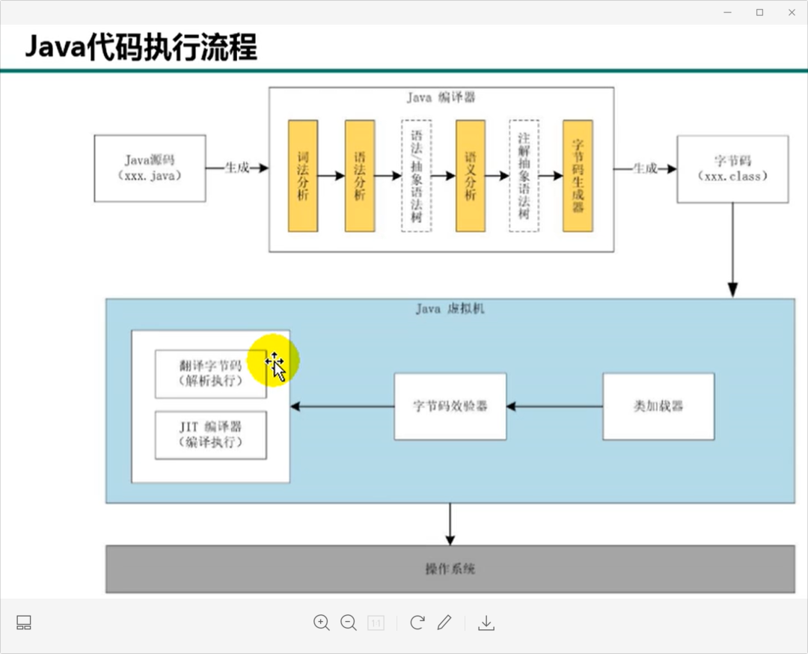
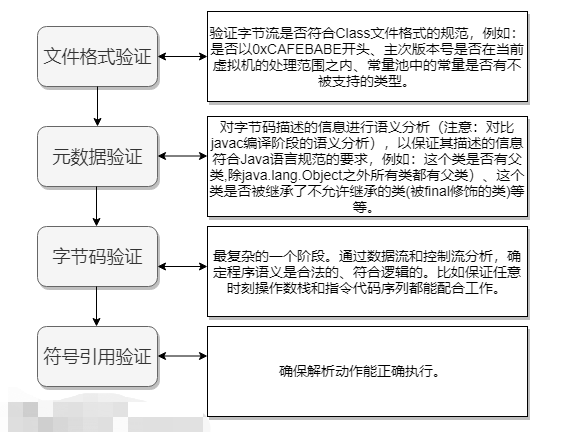
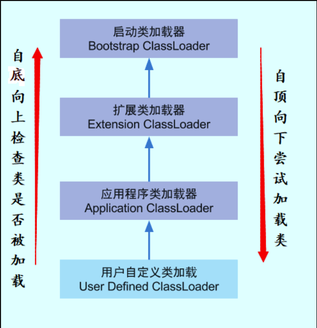
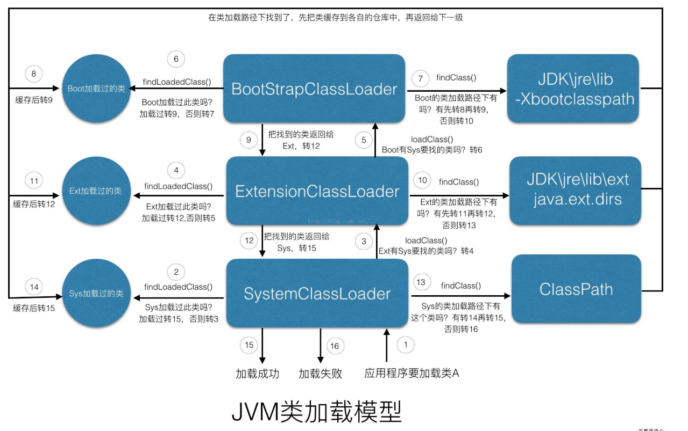

# java 代码转换字节码



# 类的加载机制

## 类的加载时机

### 生命周期：


- 加载（loading）->验证（verification）->准备（preparation）->解析（resolution）->初始化（initialization）->使用（using）->卸载（unloading）

> 一个非数组类的加载阶段（加载阶段获取类的二进制字节流的动作）是可控性最强的阶段.这一步我们可以去完成还可以自定义类加载器去控制字节流的获取方式（重写一个类加载器的 `loadClass()` 方法）。数组类型不通过类加载器创建，它由 Java 虚拟机直接创建。
>
> 所有的类都由类加载器加载，加载的作用就是将 .class文件加载到内存。

<!--more-->

### 需要初始化
- 遇到new、getstatic、putstatic或者invokestatic这四条字节码指令时
	- 对应的Java指令
		- 使用new 关键字实例化对象
		- 读取或者设置一个类的静态字段（被final修饰、已在编译器把结果放入常量池的静态字段除外）
		- 调用一个类的静态方法的时候
	- 使用java.lang.reflect包的方法对类进行反射调用时
	- 当初始化一个类的时候，如果父类没初始化，则需要先触发父类的初始化
	- 虚拟机启动时，用户需要指定一个要执行的主类，虚拟机首先会初始化这个主类
	- 动态语言支持时，java.lang.invoke.MehodHandle实例最后解析结果为：ref_getStatic\REF_putStatic\REF_invokStatic的方法句柄。并且这个方法句柄对应的类没有初始化

- 不需要初始化
	- 通过子类引用父类的静态字段，不会导致子类的初始化
	- 通过数组定义来引用类，不会触发此类的初始化
	- 常量在编译阶段会存储在调用类的常量池中，本质上并没有直接引用到定义常量的类，因此不会触发定义常量类的初始化

# 类的加载过程

## 加载
- 步骤
    1. 通过全限定性类名获取定义此类的二进制字节流
        - 获取位置
          - 从zip包中获取
          - 从网络中获取
          - 运行时计算生成（动态代理）
          - 其他文件生成（jsp）
          - 数据库中读取
    2. 将这个字节流代表的静态存储结构转化为方法区的运行时数据结构
    3. 在内存中生成一个代表这个类的`class.lang.Class` 对象，作为方法区这个类的各种相关数据的访问入口

## 验证



- 功能：确保从加载文件的字节流中包含的信息符合当前虚拟机的要求，并不会危害虚拟机自身的安全
 验证阶段的4个步骤
### 文件格式验证
```
 - 是否以魔数0xCAFEBABE 开头
 - 主、次版本号是否在当前虚拟机处理的范围内
 - 常量池的常量中是否有不被支持的常量类型（tag标志）
 - 指向常量的各种索引值是否有指向不存在的常量或者不符合类型的常量
 - CONSTANT_Utf_8_info 型的常量是否有不符合utf-8 格式的数据
 - class文件中各个部分以及文件本身是否有被删除的或者附加的其他信息
```

### 元数据的验证（语义分析）
    - 这个类是否有父类
    - 这个类是否继承了不允许继承的类（被final 修饰的类）
    - 如果这个类不是抽象的类，是否实现了其父类或者接口之中要求要实现的方法
    - 类中的字段、方法是否与父类产生矛盾
### 字节码验证
    - 目的
    - 数据流和控制流的分析。确定程序语义是合法的，符合逻辑的
    - 对方法体进行校验分析
    - 内容
    - 保证任意时刻操作数栈的数据类型与指令代码都能够配合使用
    - 保证跳转指令不会跳转到方法以外的字节码上
    - 保证方法体中的类型转换是有效的

- 版本不同
    - 类型推导（jdk1.6之前）
    - 类型检查（jdk1.6 之后）

### 符号引用验证
	- 目的
		- 该阶段发生在将符号引用转化为直接引用的时候，这个转化动作发生在“解析阶段”
		- 可以看作是类对自身以外（常量池中的各种符号引用）的信息进行匹配性校验
	- 内容
		- 符号引用中通过字符串描述的全限定性类名能否找到对应的类
		- 在指定类中是否存在符合方法的字段描述符以及简单名称所描述的方法和字段
		- 符号引用中的类、字段、方法的访问性是否可被当前类访问

### 关闭验证：-Xverify:none

## 准备
- 目的
	
	- 正式为类变量分配内存并设置类变量初始化值的阶段，这些变量所使用的内存都将在方法区中进行分配
- 说明
	
	- 通常情况:(初始化零值)
	- 基本数据类型的零值：
	
	
- 特殊情况
	- 属性表中存在ConstantValue属性，那在准备阶段变量value就会被初始化为constantValue 属性指定的值
	- javac时会将final 修饰的的属性，对应的value值在constantValue中存放

## 解析
- 作用
	- 将常量池中的符号引用转化为直接引用的过程
	- 解析动作主要针对：类或者接口、字段、类方法、接口方法、方法类型、方法句柄、调用点限定符
- 定义
	- 符号引用（symbolic references）
		- 以一组符号来描述所引用的目标，可以是任意形式的字面量，只要是使用时能无歧义的定位到目标即可
	- 直接引用 （direct references）
		- 直接指向目标的指针、相对偏移量或者一个能间接定位到目标的句柄
		- 如果有了直接引用，说明目标必定已经在内存中存在
	- 分类
		- 类或者接口的解析
		- 字段的解析
		- 接口方法解析
		- 。。。。

## 初始化
- 类加载的最后一步。该阶段才是真正执行类中定义的java代码的阶段
- 初始化阶段是执行类构造器`<cinit>()`方法的过程
- 编译器收集类中的赋值动作，和静态语句快（static{}）,合并并产生结果
- 子类在执行`<cinit>()`方法之前，一定优先执行父类的`<cinit>()`方法

###  对于初始化阶段，虚拟机严格规范了有且只有5种情况下，必须对类进行初始化(只有主动去使用类才会初始化类)：

1. 当遇到 new 、 getstatic、putstatic或invokestatic 这4条直接码指令时，比如 new 一个类，读取一个静态字段(未被 final 修饰)、或调用一个类的静态方法时。

- 当jvm执行new指令时会初始化类。即当程序创建一个类的实例对象。
- 当jvm执行getstatic指令时会初始化类。即程序访问类的静态变量(不是静态常量，常量会被加载到运行时常量池)。
- 当jvm执行putstatic指令时会初始化类。即程序给类的静态变量赋值。
- 当jvm执行invokestatic指令时会初始化类。即程序调用类的静态方法。

2. 使用 `java.lang.reflect` 包的方法对类进行反射调用时如`Class.forname("..."),newInstance()`等等，如果类没初始化，需要触发其初始化。

3. 初始化一个类，如果其父类还未初始化，则先触发该父类的初始化。

4. 当虚拟机启动时，用户需要定义一个要执行的主类 (包含 main 方法的那个类)，虚拟机会先初始化这个类。

5. `MethodHandle`和`VarHandle`可以看作是轻量级的反射调用机制，而要想使用这2个调用， 就必须先使用`findStaticVarHandle`来初始化要调用的类。

 **当一个接口中定义了JDK8新加入的默认方法（被default关键字修饰的接口方法）时，如果有这个接口的实现类发生了初始化，那该接口要在其之前被初始化。**

## 使用
##  卸载

​	卸载类即该类的Class对象被GC。

### 卸载类需要满足3个要求:

1. 该类的所有的实例对象都已被GC，也就是说堆不存在该类的实例对象。
2. 该类没有在其他任何地方被引用
3. 该类的类加载器的实例已被GC

所以，在JVM生命周期类，由jvm自带的类加载器加载的类是不会被卸载的。但是由我们自定义的类加载器加载的类是可能被卸载的。

jdk自带的BootstrapClassLoader,PlatformClassLoader,AppClassLoader负责加载jdk提供的类，所以它们(类加载器的实例)肯定不会被回收。而我们自定义的类加载器的实例是可以被回收的，所以使用我们自定义加载器加载的类是可以被卸载掉的。

#  类加载器

## 类与类加载器
	- 判断两个类相等
		- 相同的类加载器
		- class对象的equals方法
		- isAssignableFrom()方法
		- isInstance()方法
		- 使用instanceof关键字

## 双亲委派机制模型


	

```java
public class ClassLoaderDemo {
    public static void main(String[] args) {
        System.out.println("ClassLodarDemo's ClassLoader is " + ClassLoaderDemo.class.getClassLoader());
        System.out.println("The Parent of ClassLodarDemo's ClassLoader is " + ClassLoaderDemo.class.getClassLoader().getParent());
        System.out.println("The GrandParent of ClassLodarDemo's ClassLoader is " + ClassLoaderDemo.class.getClassLoader().getParent().getParent());
    }
}
//ClassLodarDemo's ClassLoader is sun.misc.Launcher$AppClassLoader@18b4aac2
//The Parent of ClassLodarDemo's ClassLoader is sun.misc.Launcher$ExtClassLoader@1b6d3586
//The GrandParent of ClassLodarDemo's ClassLoader is null
```

`AppClassLoader`的父类加载器为`ExtClassLoader` `ExtClassLoader`的父类加载器为null，**null并不代表`ExtClassLoader`没有父类加载器，而是 `BootstrapClassLoader`**

###  加载器的类型
####  启动类加载器（`BootstrapClassLoader`）:

> 最顶层的加载类，由C++实现，负责加载 `%JAVA_HOME%/lib`目录下的jar包和类或者或被 `-Xbootclasspath`参数指定的路径中的所有类

####　 扩展类加载器 `ExtensionClassLoader`

>  主要负责加载目录 `%JRE_HOME%/lib/ext` 目录下的jar包和类，或被 `java.ext.dirs` 系统变量所指定的路径下的jar包。

####  应用程序类加载器 （`AppClassLoader`）: 

> 面向我们用户的加载器，负责加载当前应用classpath下的所有jar包和类

##  双亲委派模型实现源码分析



双亲委派模型的实现代码非常简单，逻辑非常清晰，都集中在 `java.lang.ClassLoader` 的 `loadClass()` 中，相关代码如下所示。

```java
private final ClassLoader parent; 
protected Class<?> loadClass(String name, boolean resolve)
        throws ClassNotFoundException
    {
        synchronized (getClassLoadingLock(name)) {
            // 首先，检查请求的类是否已经被加载过
            Class<?> c = findLoadedClass(name);
            if (c == null) {
                long t0 = System.nanoTime();
                try {
                    if (parent != null) {//父加载器不为空，调用父加载器loadClass()方法处理
                        c = parent.loadClass(name, false);
                    } else {//父加载器为空，使用启动类加载器 BootstrapClassLoader 加载
                        c = findBootstrapClassOrNull(name);
                    }
                } catch (ClassNotFoundException e) {
                   //抛出异常说明父类加载器无法完成加载请求
                }
                
                if (c == null) {
                    long t1 = System.nanoTime();
                    //自己尝试加载
                    c = findClass(name);

                    // this is the defining class loader; record the stats
                    sun.misc.PerfCounter.getParentDelegationTime().addTime(t1 - t0);
                    sun.misc.PerfCounter.getFindClassTime().addElapsedTimeFrom(t1);
                    sun.misc.PerfCounter.getFindClasses().increment();
                }
            }
            if (resolve) {
                resolveClass(c);
            }
            return c;
        }
    }
```

###  双亲委派模型的好处

双亲委派模型保证了Java程序的稳定运行，可以避免类的重复加载（JVM 区分不同类的方式不仅仅根据类名，相同的类文件被不同的类加载器加载产生的是两个不同的类），也保证了 Java 的核心 API 不被篡改。如果没有使用双亲委派模型，而是每个类加载器加载自己的话就会出现一些问题，比如我们编写一个称为 `java.lang.Object` 类的话，那么程序运行的时候，系统就会出现多个不同的 Object 类。

## 破坏双亲委派模型

为了避免双亲委托机制，我们可以自己定义一个类加载器，然后重写 loadClass() 即可

## 自定义类加载器

除了 `BootstrapClassLoader`其他类加载器均由 Java 实现且全部继承自`java.lang.ClassLoader`。如果我们要自定义自己的类加载器，很明显需要继承 `ClassLoader`