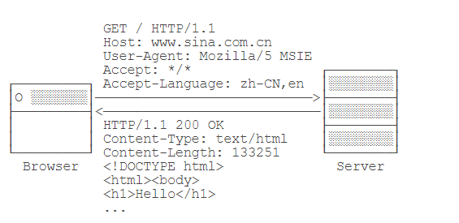
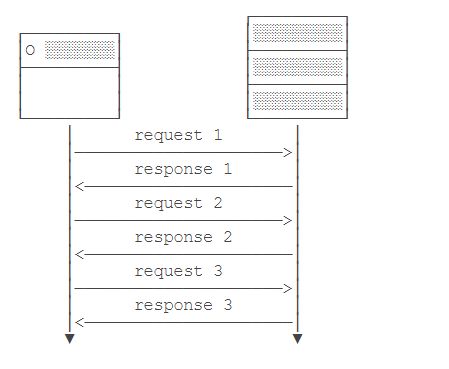
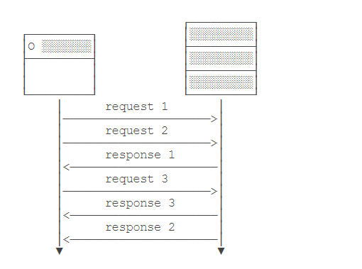

# 什么是HTTP？

> HTTP就是目前使用最广泛的Web应用程序使用的基础协议，例如，浏览器访问网站，手机App访问后台服务器，都是通过HTTP协议实现的。
>
> HTTP(HyperText Transfer Protocol).超文本传输协议，它是基于TCP协议之上的一种请求-响应协议

# 浏览器请求访问某个网站时

当浏览器希望访问某个网站时，浏览器和网站服务器之间首先建立TCP连接，且服务器总是使用`80`端口和加密端口`443`，然后，浏览器向服务器发送一个HTTP请求，服务器收到后，返回一个HTTP响应，并且在响应中包含了HTML的网页内容，这样，浏览器解析HTML后就可以给用户显示网页了。

- 一个完整的http请求

  

  ## HTTP 请求

- HTTP请求的格式是固定的，它由HTTP Header和HTTP Body两部分构成。
- 第一行总是`请求方法 路径 HTTP版本`，例如，`GET / HTTP/1.1`表示使用`GET`请求，路径是`/`，版本是`HTTP/1.1`。
- 后续的每一行都是固定的`Header: Value`格式，我们称为HTTP Header，服务器依靠某些特定的Header来识别客户端请求，例如：

>- Host：表示请求的域名，因为一台服务器上可能有多个网站，因此有必要依靠Host来识别用于请求；
>- User-Agent：表示客户端自身标识信息，不同的浏览器有不同的标识，服务器依靠User-Agent判断客户端类型；
>- Accept：表示客户端能处理的HTTP响应格式，`*/*`表示任意格式，`text/*`表示任意文本，`image/png`表示PNG格式的图片；
>- Accept-Language：表示客户端接收的语言，多种语言按优先级排序，服务器依靠该字段给用户返回特定语言的网页版本。

- 如果是`GET`请求，那么该HTTP请求只有HTTP Header，没有HTTP Body。
- 如果是`POST`请求，那么该HTTP请求带有Body，以一个空行分隔。一个典型的带Body的HTTP请求如下：

> ```
> POST /login HTTP/1.1
> Host: www.example.com
> Content-Type: application/x-www-form-urlencoded
> Content-Length: 30
> 
> username=hello&password=123456
> ```

- `POST`请求通常要设置`Content-Type`表示Body的类型，`Content-Length`表示Body的长度，这样服务器就可以根据请求的Header和Body做出正确的响应。
- `GET`请求的参数必须附加在URL上，并以URLEncode方式编码，例如：`http://www.example.com/?a=1&b=K%26R`，参数分别是`a=1`和`b=K&R`。
- 因为URL的长度限制，`GET`请求的参数不能太多，而`POST`请求的参数就没有长度限制，因为`POST`请求的参数必须放到Body中。
- `POST`请求的参数不一定是URL编码，可以按任意格式编码，只需要在`Content-Type`中正确设置即可。常见的发送JSON的`POST`请求如下：

> ```
> POST /login HTTP/1.1
> Content-Type: application/json
> Content-Length: 38
> 
> {"username":"bob","password":"123456"}
> ```

## HTTP 响应

- HTTP响应也是由Header和Body两部分组成，一个典型的HTTP响应如下：

> ```
> HTTP/1.1 200 OK
> Content-Type: text/html
> Content-Length: 133251
> 
> <!DOCTYPE html>
> <html><body>
> <h1>Hello</h1>
> ...
> ```

- 响应的第一行总是`HTTP版本 响应代码 响应说明`,例如，`HTTP/1.1 200 OK`表示版本是`HTTP/1.1`，响应代码是`200`，响应说明是`OK`。
- 客户端只依赖响应代码判断HTTP响应是否成功。HTTP有固定的响应代码：

> - 1xx：表示一个提示性响应，例如101表示将切换协议，常见于WebSocket连接；
> - 2xx：表示一个成功的响应，例如200表示成功，206表示只发送了部分内容；
> - 3xx：表示一个重定向的响应，例如301表示永久重定向，303表示客户端应该按指定路径重新发送请求；
> - 4xx：表示一个因为客户端问题导致的错误响应，例如400表示因为Content-Type等各种原因导致的无效请求，404表示指定的路径不存在；
> - 5xx：表示一个因为服务器问题导致的错误响应，例如500表示服务器内部故障，503表示服务器暂时无法响应

- 当浏览器收到第一个HTTP响应后，它解析HTML后，又会发送一系列HTTP请求，例如，`GET /logo.jpg HTTP/1.1`请求一个图片，服务器响应图片请求后，会直接把二进制内容的图片发送给浏览器：

> ```
> HTTP/1.1 200 OK
> Content-Type: image/jpeg
> Content-Length: 18391
> 
> ????JFIFHH??XExifMM?i&??X?...(二进制的JPEG图片)
> ```

- 因此，服务器总是被动地接收客户端的一个HTTP请求，然后响应它。客户端则根据需要发送若干个HTTP请求。
- 对于最早期的HTTP/1.0协议，每次发送一个HTTP请求，客户端都需要先创建一个新的TCP连接，然后，收到服务器响应后，关闭这个TCP连接。由于建立TCP连接就比较耗时，因此，为了提高效率，HTTP/1.1协议允许在一个TCP连接中反复发送-响应，这样就能大大提高效率：



- 因为HTTP协议是一个请求-响应协议，客户端在发送了一个HTTP请求后，必须等待服务器响应后，才能发送下一个请求，这样一来，如果某个响应太慢，它就会堵住后面的请求。

- 为了进一步提速，HTTP/2.0允许客户端在没有收到响应的时候，发送多个HTTP请求，服务器返回响应的时候，不一定按顺序返回，只要双方能识别出哪个响应对应哪个请求，就可以做到并行发送和接收：



可见，HTTP/2.0进一步提高了效率。

# HTTP 编程

- 既然HTTP涉及到客户端和服务器端，和TCP类似，我们也需要针对客户端编程和针对服务器端编程。
- 本节我们不讨论服务器端的HTTP编程，因为服务器端的HTTP编程本质上就是编写Web服务器，这是一个非常复杂的体系，也是JavaEE开发的核心内容.

## 客户端的HTTP编程

因为浏览器也是一种HTTP客户端，所以，客户端的HTTP编程，它的行为本质上和浏览器是一样的，即发送一个HTTP请求，接收服务器响应后，获得响应内容。只不过浏览器进一步把响应内容解析后渲染并展示给了用户，而我们使用Java进行HTTP客户端编程仅限于获得响应内容。

### java 实现 http 客户端编程

#### 早期

Java标准库提供了基于HTTP的包，但是要注意，早期的JDK版本是通过`HttpURLConnection`访问HTTP，典型代码如下：

```java
URL url = new URL("http://www.example.com/path/to/target?a=1&b=2");
HttpURLConnection conn = (HttpURLConnection) url.openConnection();
conn.setRequestMethod("GET");
conn.setUseCaches(false);
conn.setConnectTimeout(5000); // 请求超时5秒
// 设置HTTP头:
conn.setRequestProperty("Accept", "*/*");
conn.setRequestProperty("User-Agent", "Mozilla/5.0 (compatible; MSIE 11; Windows NT 5.1)");
// 连接并发送HTTP请求:
conn.connect();
// 判断HTTP响应是否200:
if (conn.getResponseCode() != 200) {
    throw new RuntimeException("bad response");
}		
// 获取所有响应Header:
Map<String, List<String>> map = conn.getHeaderFields();
for (String key : map.keySet()) {
    System.out.println(key + ": " + map.get(key));
}
// 获取响应内容:
InputStream input = conn.getInputStream();
...
```

上述代码编写比较繁琐，并且需要手动处理`InputStream`，所以用起来很麻烦。

#### 晚期

##### JDK 8

HttpClient 是 Apache Jakarta Common 下的子项目，用来提供高效的、最新的、功能丰富的支持 HTTP 协议的客户端编程工具包，并且它支持 HTTP 协议最新的版本和建议。

**HttpClient的主要功能：**

- 实现了所有 HTTP 的方法（GET、POST、PUT、HEAD、DELETE、HEAD、OPTIONS 等）
- 支持 HTTPS 协议
- 支持代理服务器（Nginx等）等
- 支持自动（跳转）转向
- ……


1. java 8 则需要引入依赖

```xml
<dependency>
    <groupId>org.apache.httpcomponents</groupId>
    <artifactId>httpclient</artifactId>
    <version>4.5.12</version>
</dependency>
```

###### get 请求

```java
/**
* get 请求: 无参
*/
private static void get() {
    HttpGet httpGet = new HttpGet("https://www.baidu.com");
    // 响应模型
    CloseableHttpResponse response = null;
    try {
        // 由客户端执行(发送)Get请求
        response = httpClient.execute(httpGet);
        // 从响应模型中获取响应实体
        handleResponse(response);

    } catch (IOException e) {
        e.printStackTrace();
    }
}

 /**
     * get请求: 带参数:手动在url后面加上参数
     */
    private static void getWithParam() {
        // 参数
        StringBuffer params = new StringBuffer();
        try {
            // 字符数据最好encoding以下;这样一来，某些特殊字符才能传过去(如:某人的名字就是“&”,不encoding的话,传不过去)
            params.append("name=" + URLEncoder.encode("&", "utf-8"));
            params.append("&");
            params.append("age=24");
        } catch (UnsupportedEncodingException e1) {
            e1.printStackTrace();
        }

        HttpGet httpGet = new HttpGet("https://www.baidu.com" + "?" + params);
        // 响应模型
        CloseableHttpResponse response = null;
        try {
            // 配置信息
            RequestConfig requestConfig = getBuilder()
                    // 设置是否允许重定向(默认为true)
                    .setRedirectsEnabled(true).build();

            // 将上面的配置信息 运用到这个Get请求里
            httpGet.setConfig(requestConfig);

            // 由客户端执行(发送)Get请求
            response = httpClient.execute(httpGet);
            // 从响应模型中获取响应实体
            handleResponse(response);

        } catch (IOException e) {
            e.printStackTrace();
        }
    }

    private static RequestConfig.Builder getBuilder() {
        return RequestConfig.custom()
                // 设置连接超时时间(单位毫秒)
                .setConnectTimeout(5000)
                // 设置请求超时时间(单位毫秒)
                .setConnectionRequestTimeout(5000)
                // socket读写超时时间(单位毫秒)
                .setSocketTimeout(5000);
    }

    //有参测试 (方式二:将参数放入键值对类中,再放入URI中,从而通过URI得到HttpGet实例)
    private static void getWithParam2(){
        // 参数
        URI uri = null;
        try {
            // 将参数放入键值对类NameValuePair中,再放入集合中
            List<NameValuePair> params = new ArrayList<>();
            params.add(new BasicNameValuePair("name", "&"));
            params.add(new BasicNameValuePair("age", "18"));
            // 设置uri信息,并将参数集合放入uri;
            // 注:这里也支持一个键值对一个键值对地往里面放setParameter(String key, String value)
            uri = new URIBuilder().setScheme("http").setHost("localhost")
                    .setPort(12345).setPath("/doGetControllerTwo")
                    .setParameters(params).build();
        } catch (URISyntaxException e1) {
            e1.printStackTrace();
        }

        // 创建Get请求
        HttpGet httpGet = new HttpGet(uri);

        // 响应模型
        CloseableHttpResponse response = null;
        try {
            // 配置信息
            setGetConfig(httpGet);

            // 由客户端执行(发送)Get请求
            response = httpClient.execute(httpGet);
            handleResponse(response);

        } catch (ClientProtocolException e) {
            e.printStackTrace();
        } catch (IOException e) {
            e.printStackTrace();
        } finally {
            try {
                // 释放资源
                if (httpClient != null) {
                    httpClient.close();
                }
                if (response != null) {
                    response.close();
                }
            } catch (IOException e) {
                e.printStackTrace();
            }
        }


    }

    /**
     * 处理响应信息
     * @param response
     * @throws IOException
     */
    private static void handleResponse(CloseableHttpResponse response) throws IOException {
        // 从响应模型中获取响应实体
        HttpEntity responseEntity = response.getEntity();
        System.out.println("响应状态为:" + response.getStatusLine());
        if (responseEntity != null) {
            System.out.println("响应内容长度为:" + responseEntity.getContentLength());
            System.out.println("响应内容为:" + EntityUtils.toString(responseEntity));
        }
    }
```

###### POST 请求

```java
    /**
     * 无参post 请求
     */
    public static void post(){
        // 创建Post请求
        HttpPost httpPost = new HttpPost("http://localhost:12345/doPostControllerOne");
        // 响应模型
        CloseableHttpResponse response = null;
        try {
            // 由客户端执行(发送)Post请求
            response = httpClient.execute(httpPost);
            // 从响应模型中获取响应实体
            HttpEntity responseEntity = response.getEntity();

            System.out.println("响应状态为:" + response.getStatusLine());
            if (responseEntity != null) {
                System.out.println("响应内容长度为:" + responseEntity.getContentLength());
                System.out.println("响应内容为:" + EntityUtils.toString(responseEntity));
            }
        } catch (ClientProtocolException e) {
            e.printStackTrace();
        } catch (IOException e) {
            e.printStackTrace();
        } finally {
            try {
                // 释放资源
                if (httpClient != null) {
                    httpClient.close();
                }
                if (response != null) {
                    response.close();
                }
            } catch (IOException e) {
                e.printStackTrace();
            }
        }

    }

    /**
     * POST传递普通参数时，方式与GET一样即可，这里以直接在url后缀上参数的方式示例。
     */
    public static void postWithParam(){
        // 参数
        StringBuffer params = new StringBuffer();
        try {
            // 字符数据最好encoding以下;这样一来，某些特殊字符才能传过去(如:某人的名字就是“&”,不encoding的话,传不过去)
            params.append("name=" + URLEncoder.encode("&", "utf-8"));
            params.append("&");
            params.append("age=24");
        } catch (UnsupportedEncodingException e1) {
            e1.printStackTrace();
        }

        // 创建Post请求
        HttpPost httpPost = new HttpPost("http://localhost:12345/doPostControllerFour" + "?" + params);

        // 设置ContentType(注:如果只是传普通参数的话,ContentType不一定非要用application/json)
        httpPost.setHeader("Content-Type", "application/json;charset=utf8");

        // 响应模型
        CloseableHttpResponse response = null;
        try {
            // 由客户端执行(发送)Post请求
            response = httpClient.execute(httpPost);
            handleResponse(response);

        } catch (ClientProtocolException e) {
            e.printStackTrace();
        } catch (IOException e) {
            e.printStackTrace();
        } finally {
            try {
                // 释放资源
                if (httpClient != null) {
                    httpClient.close();
                }
                if (response != null) {
                    response.close();
                }
            } catch (IOException e) {
                e.printStackTrace();
            }
        }
    }
    //POST有参(对象参数)
    public static void postWithParam2(){
        // 创建Post请求
        HttpPost httpPost = new HttpPost("http://localhost:12345/doPostControllerTwo");
        User user = new User();
        user.setPwd("123");
        user.setUsername("张三");
        // 我这里利用阿里的fastjson，将Object转换为json字符串;
        // (需要导入com.alibaba.fastjson.JSON包)
        String jsonString = JSON.toJSONString(user);

        StringEntity entity = new StringEntity(jsonString, "UTF-8");

        // post请求是将参数放在请求体里面传过去的;这里将entity放入post请求体中
        httpPost.setEntity(entity);

        httpPost.setHeader("Content-Type", "application/json;charset=utf8");

        // 响应模型
        CloseableHttpResponse response = null;
        try {
            // 由客户端执行(发送)Post请求
            response = httpClient.execute(httpPost);
            handleResponse(response);
        } catch (ClientProtocolException e) {
            e.printStackTrace();
        } catch (IOException e) {
            e.printStackTrace();
        } finally {
            try {
                // 释放资源
                if (httpClient != null) {
                    httpClient.close();
                }
                if (response != null) {
                    response.close();
                }
            } catch (IOException e) {
                e.printStackTrace();
            }
        }

    }

    //POST有参(普通参数 + 对象参数)：
    public static void postWithParam3(){
        // 创建Post请求
        // 参数
        URI uri = null;
        try {
            // 将参数放入键值对类NameValuePair中,再放入集合中
            List<NameValuePair> params = new ArrayList<>();
            params.add(new BasicNameValuePair("flag", "4"));
            params.add(new BasicNameValuePair("meaning", "这是什么鬼？"));
            // 设置uri信息,并将参数集合放入uri;
            // 注:这里也支持一个键值对一个键值对地往里面放setParameter(String key, String value)
            uri = new URIBuilder().setScheme("http").setHost("localhost").setPort(12345)
                    .setPath("/doPostControllerThree").setParameters(params).build();
        } catch (URISyntaxException e1) {
            e1.printStackTrace();
        }
        HttpPost httpPost = new HttpPost(uri);
        // HttpPost httpPost = new
        // HttpPost("http://localhost:12345/doPostControllerThree1");
        StringEntity entity = buildUser();

        // post请求是将参数放在请求体里面传过去的;这里将entity放入post请求体中
        httpPost.setEntity(entity);

        httpPost.setHeader("Content-Type", "application/json;charset=utf8");

        // 响应模型
        CloseableHttpResponse response = null;
        try {
            // 由客户端执行(发送)Post请求
            response = httpClient.execute(httpPost);
            handleResponse(response);
        } catch (ClientProtocolException e) {
            e.printStackTrace();
        } catch (IOException e) {
            e.printStackTrace();
        } finally {
            try {
                // 释放资源
                if (httpClient != null) {
                    httpClient.close();
                }
                if (response != null) {
                    response.close();
                }
            } catch (IOException e) {
                e.printStackTrace();
            }
        }

    }

    private static StringEntity buildUser() {
        // 创建user参数
        User user = new User();
        user.setPwd("123");
        user.setUsername("张三");

        // 将user对象转换为json字符串，并放入entity中
        return new StringEntity(JSON.toJSONString(user), "UTF-8");
    }
```

###### 发送文件

```java
//发送文件
    public static void sendFile(){
        HttpPost httpPost = new HttpPost("http://localhost:12345/file");
        CloseableHttpResponse response = null;
        try {
            MultipartEntityBuilder multipartEntityBuilder = MultipartEntityBuilder.create();
            // 第一个文件
            String filesKey = "files";
            File file1 = new File("C:\\Users\\JustryDeng\\Desktop\\back.jpg");
            multipartEntityBuilder.addBinaryBody(filesKey, file1);
            // 第二个文件(多个文件的话，使用同一个key就行，后端用数组或集合进行接收即可)
            File file2 = new File("C:\\Users\\JustryDeng\\Desktop\\头像.jpg");
            // 防止服务端收到的文件名乱码。 我们这里可以先将文件名URLEncode，然后服务端拿到文件名时在URLDecode。就能避免乱码问题。
            // 文件名其实是放在请求头的Content-Disposition里面进行传输的，如其值为form-data; name="files"; filename="头像.jpg"
            multipartEntityBuilder.addBinaryBody(filesKey, file2, ContentType.DEFAULT_BINARY, URLEncoder.encode(file2.getName(), "utf-8"));
            // 其它参数(注:自定义contentType，设置UTF-8是为了防止服务端拿到的参数出现乱码)
            ContentType contentType = ContentType.create("text/plain", Charset.forName("UTF-8"));
            multipartEntityBuilder.addTextBody("name", "邓沙利文", contentType);
            multipartEntityBuilder.addTextBody("age", "25", contentType);

            HttpEntity httpEntity = multipartEntityBuilder.build();
            httpPost.setEntity(httpEntity);

            response = httpClient.execute(httpPost);
            HttpEntity responseEntity = response.getEntity();
            System.out.println("HTTPS响应状态为:" + response.getStatusLine());
            if (responseEntity != null) {
                System.out.println("HTTPS响应内容长度为:" + responseEntity.getContentLength());
                // 主动设置编码，来防止响应乱码
                String responseStr = EntityUtils.toString(responseEntity, StandardCharsets.UTF_8);
                System.out.println("HTTPS响应内容为:" + responseStr);
            }
        } catch (IOException e) {
            e.printStackTrace();
        } finally {
            try {
                // 释放资源
                if (httpClient != null) {
                    httpClient.close();
                }
                if (response != null) {
                    response.close();
                }
            } catch (IOException e) {
                e.printStackTrace();
            }
        }

    }
```

###### 发送流

```java
//发送流(示例)
public static void sendStream(){
    HttpPost httpPost = new HttpPost("http://localhost:12345/is?name=邓沙利文");
    CloseableHttpResponse response = null;
    try {
        InputStream is = new ByteArrayInputStream("流啊流~".getBytes());
        InputStreamEntity ise = new InputStreamEntity(is);
        httpPost.setEntity(ise);

        response = httpClient.execute(httpPost);
        HttpEntity responseEntity = response.getEntity();
        System.out.println("HTTPS响应状态为:" + response.getStatusLine());
        if (responseEntity != null) {
            System.out.println("HTTPS响应内容长度为:" + responseEntity.getContentLength());
            // 主动设置编码，来防止响应乱码
            String responseStr = EntityUtils.toString(responseEntity, StandardCharsets.UTF_8);
            System.out.println("HTTPS响应内容为:" + responseStr);
        }
    } catch (IOException e) {
        e.printStackTrace();
    } finally {
        try {
            // 释放资源
            if (httpClient != null) {
                httpClient.close();
            }
            if (response != null) {
                response.close();
            }
        } catch (IOException e) {
            e.printStackTrace();
        }
    }

}
```


##### JDK 11

从Java 11开始，引入了新的`HttpClient`，它使用链式调用的API，能大大简化HTTP的处理。

我们来看一下如何使用新版的`HttpClient`。首先需要创建一个全局`HttpClient`实例，因为`HttpClient`内部使用线程池优化多个HTTP连接，可以复用：

```java
static HttpClient httpClient = HttpClient.newBuilder().build();
```

使用`GET`请求获取文本内容代码如下：

```java
import java.net.URI;
import java.net.http.*;
import java.net.http.HttpClient.Version;
import java.time.Duration;
import java.util.*;

public class Main {
    // 全局HttpClient:
    static HttpClient httpClient = HttpClient.newBuilder().build();

    public static void main(String[] args) throws Exception {
        String url = "https://www.sina.com.cn/";
        HttpRequest request = HttpRequest.newBuilder(new URI(url))
            // 设置Header:
            .header("User-Agent", "Java HttpClient").header("Accept", "*/*")
            // 设置超时:
            .timeout(Duration.ofSeconds(5))
            // 设置版本:
            .version(Version.HTTP_2).build();
        HttpResponse<String> response = httpClient.send(request, HttpResponse.BodyHandlers.ofString());
        // HTTP允许重复的Header，因此一个Header可对应多个Value:
        Map<String, List<String>> headers = response.headers().map();
        for (String header : headers.keySet()) {
            System.out.println(header + ": " + headers.get(header).get(0));
        }
        System.out.println(response.body().substring(0, 1024) + "...");
    }
}
```

如果我们要获取图片这样的二进制内容，只需要把`HttpResponse.BodyHandlers.ofString()`换成`HttpResponse.BodyHandlers.ofByteArray()`，就可以获得一个`HttpResponse<byte[]>`对象。如果响应的内容很大，不希望一次性全部加载到内存，可以使用`HttpResponse.BodyHandlers.ofInputStream()`获取一个`InputStream`流。

要使用`POST`请求，我们要准备好发送的Body数据并正确设置`Content-Type`：

```java
String url = "http://www.example.com/login";
String body = "username=bob&password=123456";
HttpRequest request = HttpRequest.newBuilder(new URI(url))
    // 设置Header:
    .header("Accept", "*/*")
    .header("Content-Type", "application/x-www-form-urlencoded")
    // 设置超时:
    .timeout(Duration.ofSeconds(5))
    // 设置版本:
    .version(Version.HTTP_2)
    // 使用POST并设置Body:
    .POST(BodyPublishers.ofString(body, StandardCharsets.UTF_8)).build();
HttpResponse<String> response = httpClient.send(request, HttpResponse.BodyHandlers.ofString());
String s = response.body();
```

# 小结

- Java提供了`HttpClient`作为新的HTTP客户端编程接口用于取代老的`HttpURLConnection`接口；
- HttpClient`使用链式调用并通过内置的`BodyPublishers`和`BodyHandlers`来更方便地处理数据。

# 参考

- 