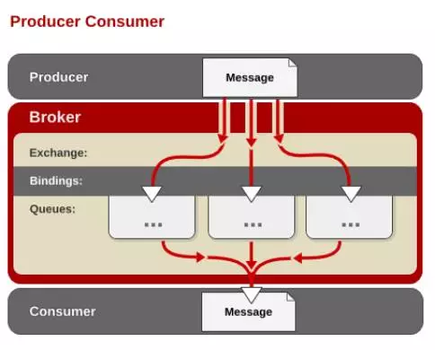
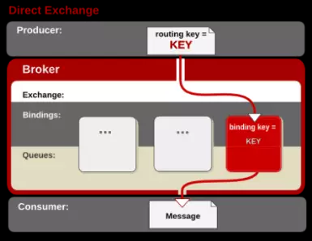

## AMQP messaging 中的基本概念


- Broker: 接收和分发消息的应用，RabbitMQ Server就是Message Broker。
- Virtual host: 出于多租户和安全因素设计的，把AMQP的基本组件划分到一个虚拟的分组中，类似于网络中的namespace概念。

<!--more-->

  - __当多个不同的用户使用同一个RabbitMQ server提供的服务时，可以划分出多个vhost，每个用户在自己的vhost创建exchange／queue等__
- Connection: publisher／consumer和broker之间的TCP连接。断开连接的操作只会在client端进行，Broker不会断开连接，除非出现网络故障或broker服务出现问题。
- Channel: 如果每一次访问RabbitMQ都建立一个Connection，在消息量大的时候建立TCP Connection的开销将是巨大的，效率也较低。Channel是在connection内部建立的逻辑连接，如果应用程序支持多线程，通常每个thread创建单独的channel进行通讯，AMQP method包含了channel id帮助客户端和message broker识别channel，所以channel之间是完全隔离的。Channel作为轻量级的Connection极大减少了操作系统建立TCP connection的开销。
- Exchange: message到达broker的第一站，根据分发规则，匹配查询表中的routing key，分发消息到queue中去。常用的类型有：direct (point-to-point), topic (publish-subscribe) and fanout (multicast)。
- Queue: 消息最终被送到这里等待consumer取走。一个message可以被同时拷贝到多个queue中。
- Binding: exchange和queue之间的虚拟连接，binding中可以包含routing key。Binding信息被保存到exchange中的查询表中，用于message的分发依据。

## 典型的“生产／消费”消息模型

生产者发送消息到broker server（RabbitMQ）。在Broker内部，用户创建Exchange／Queue，通过Binding规则将两者联系在一起。Exchange分发消息，根据类型／binding的不同分发策略有区别。消息最后来到Queue中，等待消费者取走。
## Exchange类型
> Exchange有多种类型，最常用的是Direct／Fanout／Topic三种类型。

### Direct
  
Message中的“routing key”如果和Binding中的“binding key”一致， Direct exchange则将message发到对应的queue中。

大致流程，有一个队列绑定到一个直连交换机上，同时赋予一个路由键 routing key 。

然后当一个消息携带着路由值为X，这个消息通过生产者发送给交换机时，交换机就会根据这个路由值X去寻找绑定值也是X的队列。

## Fanout

每个发到Fanout类型Exchange的message都会分到所有绑定的queue上去。

扇型交换机，这个交换机没有路由键概念，就算你绑了路由键也是无视的。 这个交换机在接收到消息后，会直接转发到绑定到它上面的所有队列。

## Topic


- 根据routing key，及通配规则，Topic exchange将分发到目标queue中。
- Routing key中可以包含两种通配符，类似于正则表达式：
```
“#”通配任何零个或多个word
“*”通配任何单个word
```

主题交换机，这个交换机其实跟直连交换机流程差不多，但是它的特点就是在它的路由键和绑定键之间是有规则的。
简单地介绍下规则：

```shell
*  (星号) 用来表示一个单词 (必须出现的)
#  (井号) 用来表示任意数量（零个或多个）单词
```

通配的绑定键是跟队列进行绑定的，举个小例子:

- 队列Q1 绑定键为 *.TT.*     队列Q2绑定键为 TT.#
- 如果一条消息携带的路由键为 A.TT.B，那么队列Q1将会收到；
- 如果一条消息携带的路由键为TT.AA.BB，那么队列Q2将会收到；

**主题交换机是非常强大的，为啥这么膨胀？**
当一个队列的绑定键为 "#"（井号） 的时候，这个队列将会无视消息的路由键，接收所有的消息。
当 * (星号) 和 # (井号) 这两个特殊字符都未在绑定键中出现的时候，此时主题交换机就拥有的直连交换机的行为。
所以主题交换机也就实现了扇形交换机的功能，和直连交换机的功能。

# 消息监听

- 消息监听，消息消费者只要监听指定队列即可。

# 其他交换机

 ## Header Exchange 头交换机 ，

## Default Exchange 默认交换机，

## Dead Letter Exchange 死信交换机

##### 想要了解RabbitMQ的一个网站，http://tryrabbitmq.com ，它提供在线RabbitMQ 模拟器，可以帮助理解Exchange／queue／binding概念。