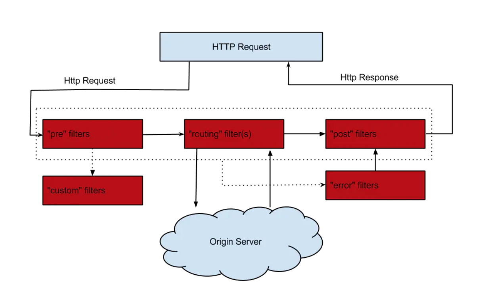

# zuul api 网关
- 定义类似于 面向对象的 Facade 模式，像一个微服务的门面。所有客户端的访问都要经过 网关来过滤和调度。
## 集合的工能
### 通用功能
- 路由
- 负载均衡
- 校验过滤

### 其他
- 与服务治理框架结合
- 请求转发时的熔断机制
- 服务聚合
- 。。。。


## 整合方式
spring-zuul 与eureka 整合
- 将自身注册为eureka 的服务治理下的应用，同时从eureka 中 获取其他服务的实例信息。
- 维护服务实例的工作交给 eureka。
- zuul 只负责路由规则的维护

- zuul 默认会将通过服务名作为 contextPath 的方式来创建路由映射。

# 项目搭建
## 新建 zuul-gateway 项目
## 引入 maven依赖
```xml
<!--注册eureka 客户端-->
<dependency>
    <groupId>org.springframework.cloud</groupId>
    <artifactId>spring-cloud-starter-netflix-eureka-client</artifactId>
</dependency>
<!--网关核心依赖-->
<dependency>
    <groupId>org.springframework.cloud</groupId>
    <artifactId>spring-cloud-starter-netflix-zuul</artifactId>
</dependency>
<!--添加actuator ，查看路由信息-->
<dependency>
    <groupId>org.springframework.boot</groupId>
    <artifactId>spring-boot-starter-actuator</artifactId>
</dependency>
```
### 说明：
- `spring-cloud-starter-netflix-eureka-client` 用来将其整合 eureka。
在 配置文件中添加 注册 为 eureka 客户端的配置
```yaml
eureka:
  instance:
    # hostname: demo.server # 主机名称
    instance-id: zuul.server # eureka 服务列表显示名称
  client:
    register-with-eureka: true
    fetch-registry: true
    service-url:
      defaultZone: http://localhost:8000/eureka/
```
- `spring-cloud-starter-netflix-zuul` 用来集成 zuul 网关功能
在配置文件中添加 
```yaml
zuul:
  host:
    connect-timeout-millis: 3000
    socket-timeout-millis: 3000
  routes: #给服务配置路由
    # 这里可以自定义
    demo-server:
      # 匹配的路由规则: 表示以demo 开头的访问，都将进入 demo-server
      path: /demo/**
      # 路由的目标地址
      #url: http://localhost:9000/
      sericeId: demo-server # 路由的目标服务名
```
遇到的坑：

1. `Load balancer does not have available server for client: xxx`
原因是 sericeId 配置不对，此处配置的为服务 的名称。即： `spring.application.name` 对应的名称

2. 访问路径 404：
原因：是对路由有误解、 path 对应的路径是用来寻找 指定服务的，即 通过：`/demo/..` 就能找到对应的demo-server服务，而资源路径是全模式匹配
eg：访问： `http://localhost:8080/demo/api-demo-url/index` 可以访问到 demo-server 服务下的 `/api-demo-url/index` 资源。

3. spring-boot 和 spring-cloud 对应的版本问题。
4. spring-cloud 对应的 zuul-starter 名称修改问题

- `spring-boot-starter-actuator` 用来集成actuator 监控功能
配置文件中添加如下信息，可以监控路由信息
```yaml
#路由的端点
management:
  endpoints:
    web:
      exposure:
        include: 'routes'
```
通过url 路径： `http://localhost:8080/actuator/routes` 可以查看路由信息

# 开启网关 `@EnableZuulProxy`
在启动类上添加@EnableZuulProxy注解来启用Zuul的API网关功能
```java
@EnableZuulProxy //启用Zuul的API网关功能
@EnableEurekaClient
@SpringBootApplication
public class ZuulGatewayApplication {
    public static void main(String[] args) {
        SpringApplication.run(ZuulGatewayApplication.class, args);
    }
}
```

## 默认路由规则
Zuul和Eureka结合使用，可以实现路由的自动配置，自动配置的路由以服务名称为匹配路径，相当于如下配置：
```yaml
zuul:
  host:
    connect-timeout-millis: 3000
    socket-timeout-millis: 3000
  routes: #给服务配置路由
    # 这里可以自定义
    demo-server:
      # 匹配的路由规则: 表示以demo 开头的访问，都将进入 demo-server
      path: /demo/**
```
- 访问： `http://localhost:8080/demo/api-demo-url/index` 可以访问到 demo-server 服务下的 `/api-demo-url/index` 资源

## 负载均衡功能
如果有两个 demo-server 服务，多次调用`http://localhost:8080/demo/api-demo-url/index`，将会在两个服务之间切换调用

## 配置访问前缀
我们可以通过以下配置来给网关路径添加前缀，此处添加了/proxy前缀，
```yaml
zuul:
  prefix: /proxy #给网关路由添加前缀
```
访问路径变更为：`http://localhost:8080/proxy/demo/api-demo-url/index`

## Header过滤及重定向添加Host
- Zuul在请求路由时，默认会过滤掉一些敏感的头信息，以下配置可以防止路由时的Cookie及Authorization的丢失：
```yaml
zuul:
  sensitive-headers: Cookie,Set-Cookie,Authorization #配置过滤敏感的请求头信息，设置为空就不会过滤
```
- Zuul在请求路由时，不会设置最初的host头信息，以下配置可以解决：
```yaml
zuul:
  add-host-header: true #设置为true重定向是会添加host请求头
```

# 过滤器
路由与过滤是Zuul的两大核心功能，路由功能负责将外部请求转发到具体的服务实例上去，是实现统一访问入口的基础，过滤功能负责对请求过程进行额外的处理，是请求校验过滤及服务聚合的基础。

## 过滤器类型
Zuul中有以下几种典型的过滤器类型。
- pre：在请求被路由到目标服务前执行，比如权限校验、打印日志等功能；
- routing：在请求被路由到目标服务时执行，这是使用Apache HttpClient或Netflix Ribbon构建和发送原始HTTP请求的地方；
- post：在请求被路由到目标服务后执行，比如给目标服务的响应添加头信息，收集统计数据等功能；
- error：请求在其他阶段发生错误时执行。
## 过滤器的生命周期
- 下图描述了一个HTTP请求到达API网关后，如何在各种不同类型的过滤器中流转的过程。



## 自定义过滤器

### 添加PreLogFilter类继承ZuulFilter

这是一个前置过滤器，用于在请求路由到目标服务前打印请求日志

```java
/**
 * 日志记录过滤器
 */
@Component
public class PreLogFilter  extends ZuulFilter {
    private Logger log = LoggerFactory.getLogger(PreLogFilter.class);

    /**
     * 过滤器类型，有pre、routing、post、error四种。
     * @return
     */
    @Override
    public String filterType() {
        return "pre";
    }

    /**
     * 过滤器执行顺序，数值越小优先级越高。
     * @return
     */
    @Override
    public int filterOrder() {
        return 1;
    }

    /**
     * 是否进行过滤，返回true会执行过滤。
     * @return
     */
    @Override
    public boolean shouldFilter() {
        return true;
    }

    /**
     * 自定义的过滤器逻辑，当shouldFilter()返回true时会执行
     * @return
     * @throws ZuulException
     */
    @Override
    public Object run() throws ZuulException {
        RequestContext requestContext = RequestContext.getCurrentContext();
        HttpServletRequest request = requestContext.getRequest();
        String host = request.getRemoteHost();
        String method = request.getMethod();
        String uri = request.getRequestURI();
        log.info("Remote host:{},method:{},uri:{}", host, method, uri);
        return null;
    }
}
```

## 核心过滤器

| 过滤器名称              | 过滤类型 | 优先级 | 过滤器的作用                                                 |
| :---------------------- | :------- | :----- | :----------------------------------------------------------- |
| ServletDetectionFilter  | pre      | -3     | 检测当前请求是通过DispatcherServlet处理运行的还是ZuulServlet运行处理的 |
| Servlet30WrapperFilter  | pre      | -2     | 对原始的HttpServletRequest进行包装                           |
| FormBodyWrapperFilter   | pre      | -1     | 将Content-Type为application/x-www-form-urlencoded或multipart/form-data的请求包装成FormBodyRequestWrapper对象 |
| DebugFilter             | route    | 1      | 根据zuul.debug.request的配置来决定是否打印debug日志          |
| PreDecorationFilter     | route    | 5      | 对当前请求进行预处理以便执行后续操作                         |
| RibbonRoutingFilter     | route    | 10     | 通过Ribbon和Hystrix来向服务实例发起请求，并将请求结果进行返回。 |
| SimpleHostRoutingFilter | route    | 100    | 只对请求上下文中有routeHost参数的进行处理，直接使用HttpClient向routeHost对应的物理地址进行转发。 |
| SendForwardFilter       | route    | 500    | 只对请求上下文中有forward.to参数的进行处理，进行本地跳转。   |
| SendErrorFilter         | post     | 0      | 当其他过滤器内部发生异常时的会由它来进行处理，产生错误响应。 |
| SendResponseFilter      | post     | 1000   | 利用请求上下文的响应信息来组织请求成功的响应内容             |

## 禁用过滤器

- 我们可以对过滤器进行禁用的配置，配置格式如下：

```yaml
zuul:
  filterClassName:
    filter:
      disable: true 

```

- 以下是禁用PreLogFilter的示例配置：

```yaml
zuul:
  PreLogFilter:
    pre:
      disable: true 
```

# Ribbon和Hystrix的支持

由于Zuul自动集成了Ribbon和Hystrix，所以Zuul天生就有负载均衡和服务容错能力，我们可以通过Ribbon和Hystrix的配置来配置Zuul中的相应功能。

- 可以使用Hystrix的配置来设置路由转发时HystrixCommand的执行超时时间：

```yaml
hystrix:
  command: #用于控制HystrixCommand的行为
    default:
      execution:
        isolation:
          thread:
            timeoutInMilliseconds: 1000 #配置HystrixCommand执行的超时时间，执行超过该时间会进行服务降级处理

```

- 可以使用Ribbon的配置来设置路由转发时请求连接及处理的超时时间：

```yaml
ribbon: #全局配置
  ConnectTimeout: 1000 #服务请求连接超时时间（毫秒）
  ReadTimeout: 3000 #服务请求处理超时时间（毫秒）
```

# 常用的配置

```yaml
zuul:
  routes: #给服务配置路由
    user-service:
      path: /userService/**
    feign-service:
      path: /feignService/**
  ignored-services: user-service,feign-service #关闭默认路由配置
  prefix: /proxy #给网关路由添加前缀
  sensitive-headers: Cookie,Set-Cookie,Authorization #配置过滤敏感的请求头信息，设置为空就不会过滤
  add-host-header: true #设置为true重定向是会添加host请求头
  retryable: true # 关闭重试机制
  PreLogFilter:
    pre:
      disable: false #控制是否启用过滤器

```

# 对应的项目

```shell
ZBCN-SERVER
├── zbcn-register/eureka-server -- eureka注册中心
├── zbcn-gateway/zuul-gateway -- zuul网关
└── /zbcn-business/zbcn-demo-server -- 业务服务
```