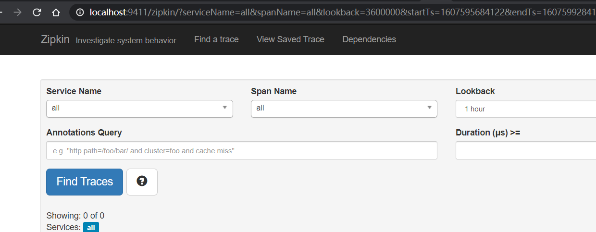

# Spring Cloud Sleuth：分布式请求链路跟踪

Spring Cloud Sleuth 是分布式系统中跟踪服务间调用的工具，它可以直观地展示出一次请求的调用过程，本文将对其用法进行详细介绍。

# Spring Cloud Sleuth 简介

随着我们的系统越来越庞大，各个服务间的调用关系也变得越来越复杂。当客户端发起一个请求时，这个请求经过多个服务后，最终返回了结果，经过的每一个服务都有可能发生延迟或错误，从而导致请求失败。这时候我们就需要请求链路跟踪工具来帮助我们，理清请求调用的服务链路，解决问题。

# 给服务添加请求链路跟踪

我们将通过user-service和ribbon-service之间的服务调用来演示该功能，这里我们调用ribbon-service的接口时，ribbon-service会通过RestTemplate来调用user-service提供的接口。

- 首先给user-service和ribbon-service添加请求链路跟踪功能的支持；

- 在user-service和ribbon-service中添加相关依赖：

 ```xml
  <dependency>
      <groupId>org.springframework.cloud</groupId>
      <artifactId>spring-cloud-starter-zipkin</artifactId>
  </dependency>
 ```
- 复制application.yml文件，修改为application-zipkin.yml，然后在application-zipkin.yml中配置收集日志的zipkin-server访问地址：（user-service和ribbon-service都要处理）

```yaml
spring:
  zipkin:
    base-url: http://localhost:9411
  sleuth:
    sampler:
      probability: 0.1 #设置Sleuth的抽样收集概率

```

## 整合Zipkin获取及分析日志

Zipkin是Twitter的一个开源项目，可以用来获取和分析Spring Cloud Sleuth 中产生的请求链路跟踪日志，它提供了Web界面来帮助我们直观地查看请求链路跟踪信息。

- SpringBoot 2.0以上版本已经不需要自行搭建zipkin-server，我们可以从该地址下载zipkin-server：https://repo1.maven.org/maven2/io/zipkin/java/zipkin-server/2.9.4/zipkin-server-2.9.4-exec.jar

- 下载完成后使用以下命令运行zipkin-server：

```java
java -jar zipkin-server-2.9.4-exec.jar
```

- Zipkin页面访问地址：http://localhost:9411



- 启动eureka-sever，ribbon-service，user-service：

```shell
# 在 program arguments 中配置 ribbon-service，user-service 使用 application-zipkin.yml 文件启动
--spring.config.location=classpath:application-zipkin.yml
```


- 多次调用（Sleuth为抽样收集）ribbon-service的接口http://localhost:8301/user/1 ，调用完后查看Zipkin首页发现已经有请求链路跟踪信息了；
- 点击查看详情可以直观地看到请求调用链路和通过每个服务的耗时：

## 使用Elasticsearch存储跟踪信息

如果我们把zipkin-server重启一下就会发现刚刚的存储的跟踪信息全部丢失了，可见其是存储在内存中的，有时候我们需要将所有信息存储下来，这里以存储到Elasticsearch为例，来演示下该功能。

### 安装Elasticsearch

略

### 修改启动参数将信息存储到Elasticsearch

**zipkin不支持7.0 以上版本的es**

- 使用以下命令运行，就可以把跟踪信息存储到Elasticsearch里面去了，重新启动也不会丢失；

  ```shell
  # STORAGE_TYPE：表示存储类型 ES_HOSTS：表示ES的访问地址 ES_USERNAME用户名（可选） ES_PASSWORD 用户密码（可选）
  java -jar zipkin-server-2.9.4-exec.jar --STORAGE_TYPE=elasticsearch --ES_HOSTS=localhost:9200  --ES_USERNAME=elastic --ES_PASSWORD=123456
  ```

  

- 之后需要重新启动user-service和ribbon-service才能生效，重启后多次调用ribbon-service的接口http://localhost:8301/user/1；

- 如果安装了Elasticsearch的可视化工具Kibana的话，可以看到里面已经存储了跟踪信息：

## 使用到的源码

```shell
ZBCN-SERVER
├── zbcn-register/eureka-server -- eureka注册中心
├── zbcn-business/user-service -- 提供User对象CRUD接口的服务
└── zbcn-common/ribbon-server -- ribbon服务调用测试服务
```

