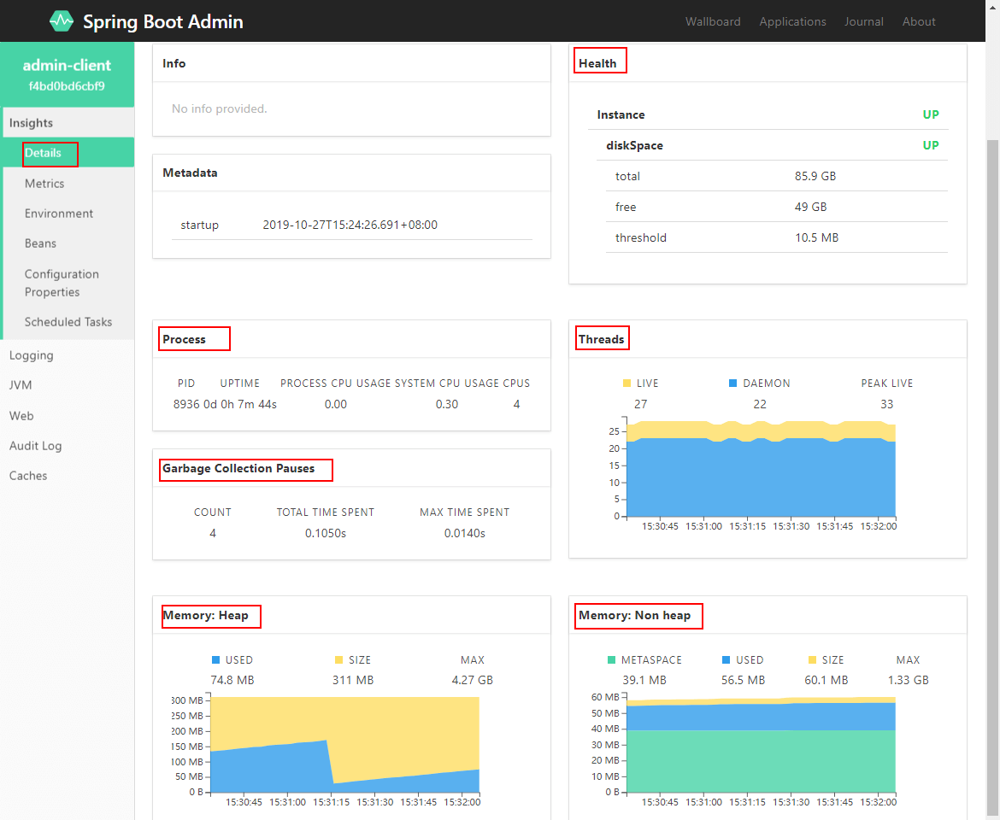
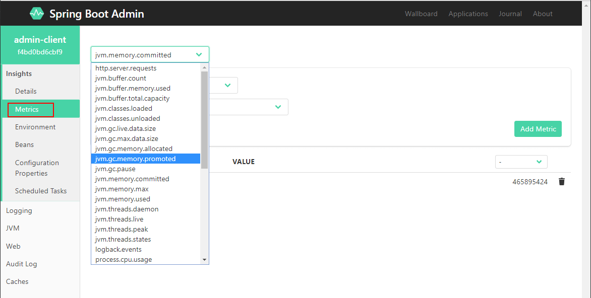
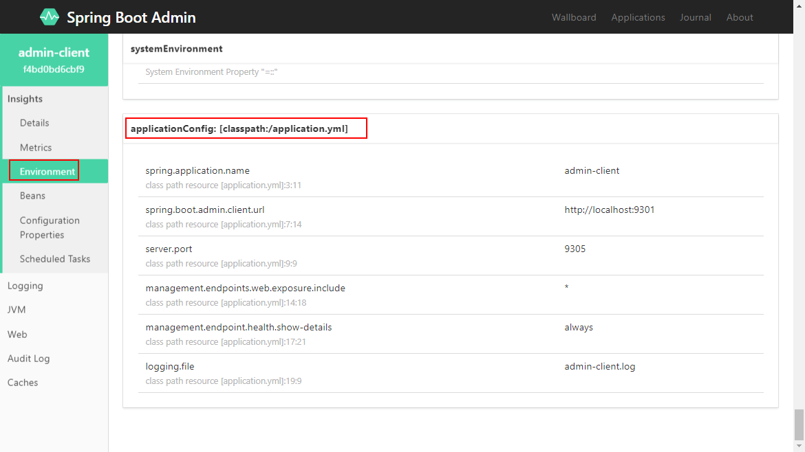
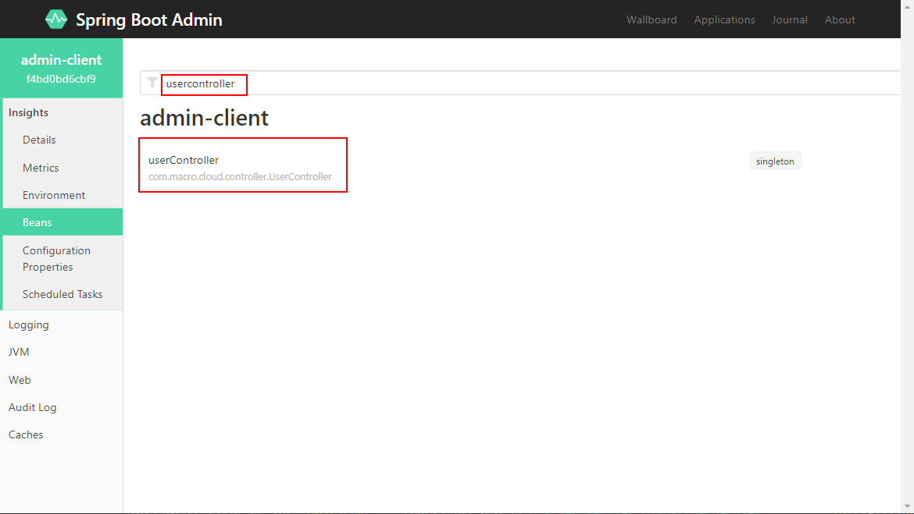
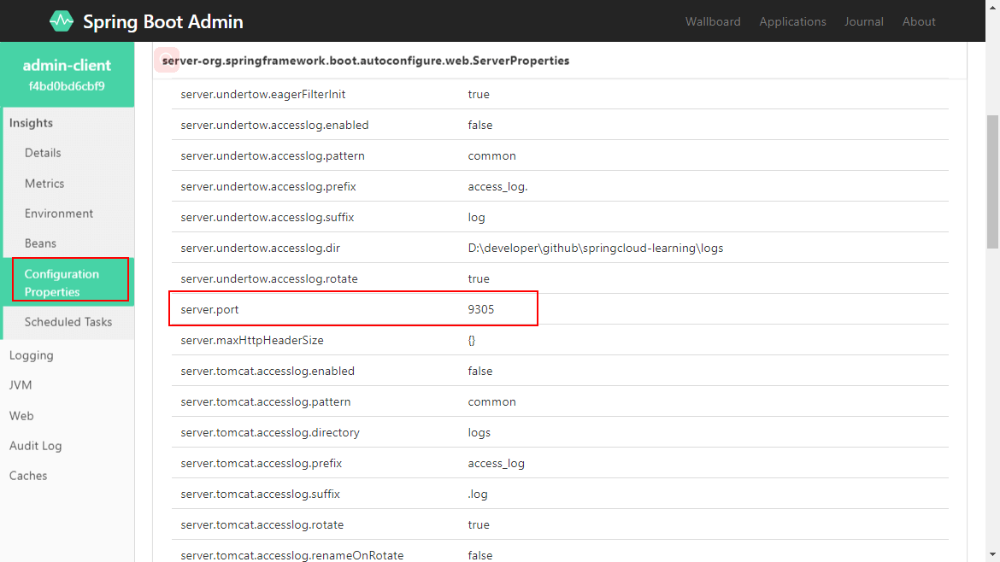
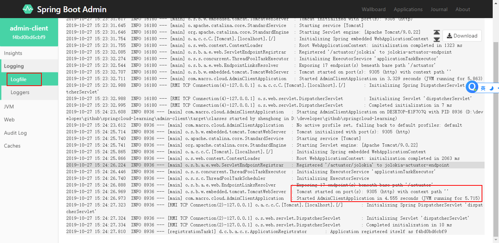
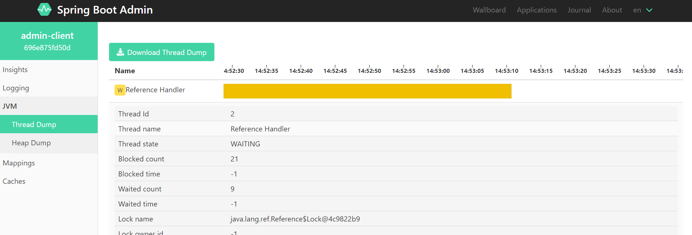
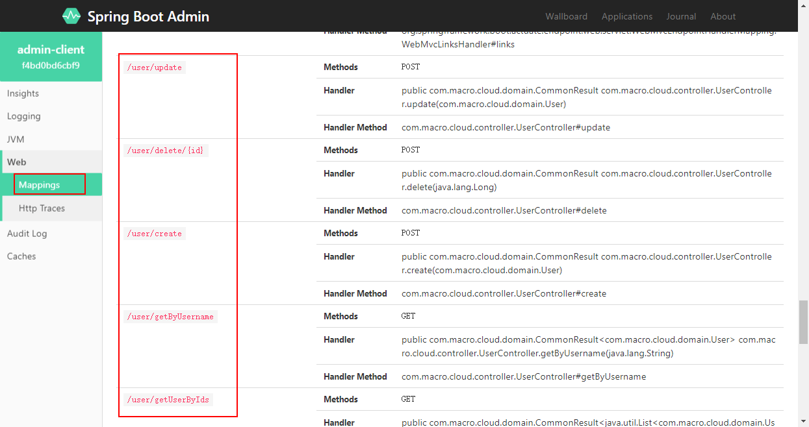
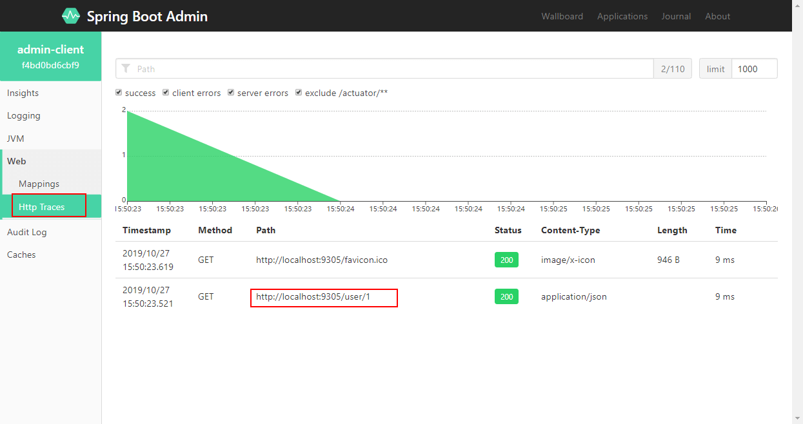
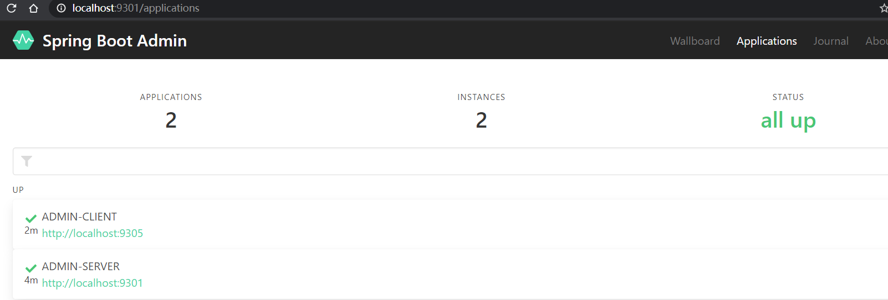

# Spring Boot Admin：微服务应用监控

Spring Boot Admin 可以对SpringBoot应用的各项指标进行监控，可以作为微服务架构中的监控中心来使用，本文将对其用法进行详细介绍。

#  Spring Boot Admin 简介

SpringBoot应用可以通过Actuator来暴露应用运行过程中的各项指标，Spring Boot Admin通过这些指标来监控SpringBoot应用，然后通过图形化界面呈现出来。Spring Boot Admin不仅可以监控单体应用，还可以和Spring Cloud的注册中心相结合来监控微服务应用。

Spring Boot Admin 可以提供应用的以下监控信息：

- 监控应用运行过程中的概览信息；
- 度量指标信息，比如JVM、Tomcat及进程信息；
- 环境变量信息，比如系统属性、系统环境变量以及应用配置信息；
- 查看所有创建的Bean信息；
- 查看应用中的所有配置信息；
- 查看应用运行日志信息；
- 查看JVM信息；
- 查看可以访问的Web端点；
- 查看HTTP跟踪信息。

# 创建admin-server模块

这里我们创建一个admin-server模块来作为监控中心演示其功能。

- 在pom.xml中添加相关依赖：

```xml
<dependency>
    <groupId>org.springframework.boot</groupId>
    <artifactId>spring-boot-starter-web</artifactId>
</dependency>
<dependency>
    <groupId>de.codecentric</groupId>
    <artifactId>spring-boot-admin-starter-server</artifactId>
</dependency>
```

- 在启动类上添加@EnableAdminServer来启用admin-server功能：

```java
@EnableAdminServer
@SpringBootApplication
public class AdminServerApplication {

    public static void main(String[] args) {
        SpringApplication.run(AdminServerApplication.class, args);
    }

}
```

# 创建admin-client模块

这里我们创建一个admin-client模块作为客户端注册到admin-server。

- 在pom.xml中添加相关依赖：

```xml
<dependency>
    <groupId>org.springframework.boot</groupId>
    <artifactId>spring-boot-starter-web</artifactId>
</dependency>
<dependency>
    <groupId>de.codecentric</groupId>
    <artifactId>spring-boot-admin-starter-client</artifactId>
</dependency>
```

- 在application.yml中进行配置：

```yaml
server:
  port: 9305
spring:
  application:
    name: admin-client
  profiles:
    active: dev

  boot:
    admin:
      client:
        url: http://localhost:9301 #配置admin-server地址

management:
  endpoints:
    web:
      exposure:
        include: '*'
  endpoint:
    health:
      show-details: always

logging:
  file:
    name: admin-client.log #添加开启admin的日志监控
```

- 启动admin-server和admin-client服务。

# 监控信息演示

- 访问如下地址打开Spring Boot Admin的主页：http://localhost:9301


- 点击wallboard按钮，选择admin-client查看监控信息；
- 监控信息概览；



- 度量指标信息，比如JVM、Tomcat及进程信息；



- 环境变量信息，比如系统属性、系统环境变量以及应用配置信息；



- 查看所有创建的Bean信息；



- 查看应用中的所有配置信息；



- 查看日志信息，需要添加以下配置才能开启；

```yml
logging:
  file: admin-client.log #添加开启admin的日志监控
```



- 查看JVM信息；



- 查看可以访问的Web端点；



- 查看HTTP跟踪信息；



# 结合注册中心使用

Spring Boot Admin结合Spring Cloud 注册中心使用，只需将admin-server和注册中心整合即可，admin-server 会自动从注册中心获取服务列表，然后挨个获取监控信息。这里以Eureka注册中心为例来介绍下该功能。

## 修改admin-server

- 在pom.xml中添加相关依赖：

```xml
<dependency>
    <groupId>org.springframework.cloud</groupId>
    <artifactId>spring-cloud-starter-netflix-eureka-client</artifactId>
</dependency>
```

- 在application-eureka.yml中进行配置，只需添加注册中心配置即可：

```yml
spring:
  application:
    name: admin-server
server:
  port: 9301
eureka:
  client:
    register-with-eureka: true
    fetch-registry: true
    service-url:
      defaultZone: http://localhost:8000/eureka/
```

- 在启动类上添加@EnableDiscoveryClient来启用服务注册功能：

```java
@EnableDiscoveryClient
@EnableAdminServer
@SpringBootApplication
public class AdminServerApplication {

    public static void main(String[] args) {
        SpringApplication.run(AdminServerApplication.class, args);
    }

}
```

## 修改admin-client

- 在pom.xml中添加相关依赖：

```xml
<dependency>
    <groupId>org.springframework.cloud</groupId>
    <artifactId>spring-cloud-starter-netflix-eureka-client</artifactId>
</dependency>
```

- 在application-dev.yml中进行配置，删除原来的admin-server地址配置，添加注册中心配置即可：

```yaml
server:
  port: 9305
spring:
  application:
    name: admin-client
  profiles:
    active: dev

management:
  endpoints:
    web:
      exposure:
        include: '*'
  endpoint:
    health:
      show-details: always

logging:
  file:
    name: admin-client.log #添加开启admin的日志监控

eureka:
  client:
    register-with-eureka: true
    fetch-registry: true
    service-url:
      defaultZone: http://localhost:8000/eureka/
```

- 在启动类上添加@EnableDiscoveryClient来启用服务注册功能：

```java
@EnableDiscoveryClient
@SpringBootApplication
public class AdminClientApplication {

    public static void main(String[] args) {
        SpringApplication.run(AdminClientApplication.class, args);
    }

}
```


## 演示功能

- 启动eureka-server，使用application-eureka.yml配置启动admin-server，admin-client；

启动项设置

```shell
--spring.config.location=classpath:application-eureka.yml
```

- 查看注册中心发现服务均已注册：http://localhost:8000/

  

- 查看Spring Boot Admin 主页发现可以看到服务信息：http://localhost:9301



# 添加登录认证

- 我们可以通过给admin-server添加Spring Security支持来获得登录认证功能。

## 创建admin-security-server模块

- 在pom.xml中添加相关依赖：

```xml
<dependency>
    <groupId>org.springframework.cloud</groupId>
    <artifactId>spring-cloud-starter-netflix-eureka-client</artifactId>
</dependency>
<dependency>
    <groupId>de.codecentric</groupId>
    <artifactId>spring-boot-admin-starter-server</artifactId>
    <version>2.3.6</version>
</dependency>
<dependency>
    <groupId>org.springframework.boot</groupId>
    <artifactId>spring-boot-starter-security</artifactId>
</dependency>
<dependency>
    <groupId>org.springframework.boot</groupId>
    <artifactId>spring-boot-starter-web</artifactId>
</dependency>

```

- 在application.yml中进行配置，配置登录用户名和密码，忽略admin-security-server的监控信息：

```yaml
spring:
  application:
    name: admin-security-server
  security: # 配置登录用户名和密码
    user:
      name: zbcn
      password: 123456
  boot:  # 不显示admin-security-server的监控信息
    admin:
      discovery:
        ignored-services: ${spring.application.name}
server:
  port: 9301
eureka:
  client:
    register-with-eureka: true
    fetch-registry: true
    service-url:
      defaultZone: http://localhost:8001/eureka/

```

- 对SpringSecurity进行配置，以便admin-client可以注册：

```java
@Configuration
public class SecuritySecureConfig extends WebSecurityConfigurerAdapter {
    private final String adminContextPath;

    public SecuritySecureConfig(AdminServerProperties adminServerProperties) {
        this.adminContextPath = adminServerProperties.getContextPath();
    }

    @Override
    protected void configure(HttpSecurity http) throws Exception {
        SavedRequestAwareAuthenticationSuccessHandler successHandler = new SavedRequestAwareAuthenticationSuccessHandler();
        successHandler.setTargetUrlParameter("redirectTo");
        successHandler.setDefaultTargetUrl(adminContextPath + "/");

        http.authorizeRequests()
                //1.配置所有静态资源和登录页可以公开访问
                .antMatchers(adminContextPath + "/assets/**").permitAll()
                .antMatchers(adminContextPath + "/login").permitAll()
                .anyRequest().authenticated()
                .and()
                //2.配置登录和登出路径
                .formLogin().loginPage(adminContextPath + "/login").successHandler(successHandler).and()
                .logout().logoutUrl(adminContextPath + "/logout").and()
                //3.开启http basic支持，admin-client注册时需要使用
                .httpBasic().and()
                .csrf()
                //4.开启基于cookie的csrf保护
                .csrfTokenRepository(CookieCsrfTokenRepository.withHttpOnlyFalse())
                //5.忽略这些路径的csrf保护以便admin-client注册
                .ignoringAntMatchers(
                        adminContextPath + "/instances",
                        adminContextPath + "/actuator/**"
                );
    }
}

```

- 修改启动类，开启AdminServer及注册发现功能：

```java
@EnableDiscoveryClient
@EnableAdminServer
@SpringBootApplication
public class AdminSecurityServerApplication {

    public static void main(String[] args) {
        SpringApplication.run(AdminSecurityServerApplication.class, args);
    }
}
```

- 启动eureka-server，admin-security-server，admiin-client 访问Spring Boot Admin 主页发现需要登录才能访问：http://localhost:9301

# 使用到的模块

```shell
ZBCN-SERVER
├── zbcn-apm/admin-server -- admin监控中心服务
├── zbcn-apm/admin-security-server -- 带登录认证的admin监控中心服务
├── zbcn-apm/admin-client -- admin 服务监控的测试客户端
└── zbcn-register/eureka-server -- 注册中心
```

