## 说明：
### 基本的概念

数据结构表示数据在计算机中的存储和组织形式，主要描述数据元素之间和位置关系等。选择适当的数据结构可以提高计算机程序的运行效率（时间复杂度）和存储效率（空间复杂度）。

### 数据结构的三种层次

#### 逻辑结构--抽象层： 主要描述的是数据元素之间的逻辑关系

- 集合结构（集）： 所有的元素都属于一个总体。除了同属于一个集合外没有其他关系。集合结构不强调元素之间的任何关联性。

- 线性结构（表）： 数据元素之间具有一对一的前后关系，结构中必须存在唯一的首元素和唯一的尾元素。

- 树形结构（树）： 数据元素之间一对多的关系
- 网状结构（图）： 图状结构或网状结构 结构中的数据元素之间存在多对多的关系

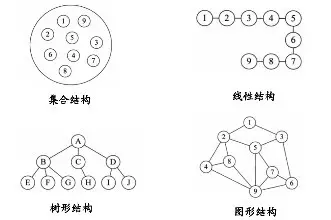

#### 物理结构--存储结构： 主要描述的是数据元素之间的位置关系

- 顺序结构： 使用一种连续的存储单元依次存储逻辑上相邻的各个元素。
    - 优点： 只需要申请存放数据本身的内存空间即可，支持下标访问，也可以实现随机访问。
    - 缺点： 必须静态分配连续空间，内存空间的利用率比较低。插入或删除可能需要移动大量元素，效率比较低

- 链式结构： 链式存储结构不强制使用连续的存储空间存放结构的元素，而是为每一个元素构造一个节点，节点中除了存放数据本身以外，还需要存放指向下一个节点的指针。
    - 优点： 不采用连续的存储空间导致内存空间利用率比较高，克服顺序存储结构中预知元素个数的缺点 插入或删除元素时，不需要移动大量的元素。
    - 缺点： 需要额外的空间来表达数据之间的逻辑关系， 不支持下标访问和随机访问。

- 索引结构：除建立存储节点信息外，还建立附加的索引表来标节点的地址。索引表由若干索引项组成。
    - 优点： 是用节点的索引号来确定结点存储地址，检索速度块
    - 缺点： 增加了附加的索引表,会占用较多的存储空间。

- 散列结构：由节点的关键码值决定节点的存储地址。散列技术除了可以用于查找外，还可以用于存储。
    - 优点： 散列是数组存储方式的一种发展，采用存储数组中内容的部分元素作为映射函数的输入，映射函数的输出就是存储数据的位置, 相比数组，散列的数据访问速度要高于数组
    - 缺点： 不支持排序，一般比用线性表存储需要更多的空间，并且记录的关键字不能重复。

### 运算结构--实现层： 主要描述的是如何实现数据结构
- 分配资源，建立结构，释放资源
- 插入和删除
- 获取和便利
- 修改和排序

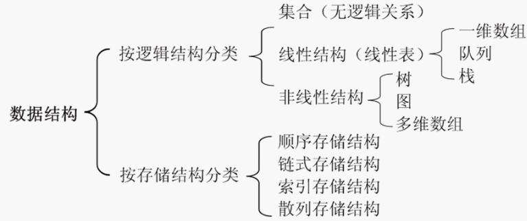

每一种逻辑结构采用何种物理结构来实现，并没有具体的规定。 当一个结构，在逻辑结构中只有一种定义，在屋里结构中却有两种选择，那么这种结构就属于逻辑结构

### 数据结构比较

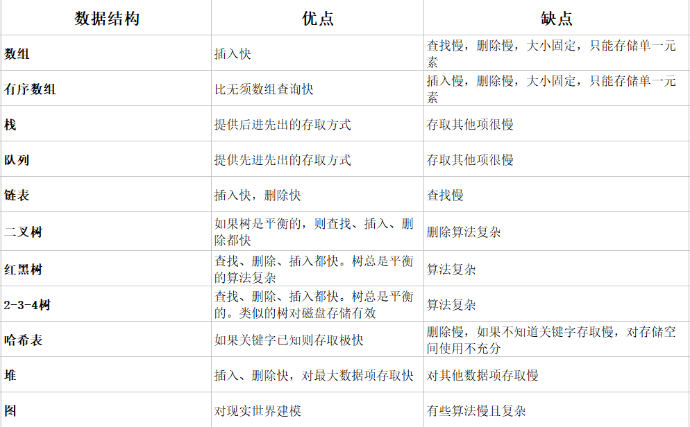


### 数据结构
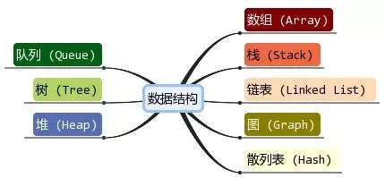

### 数据结构的选择
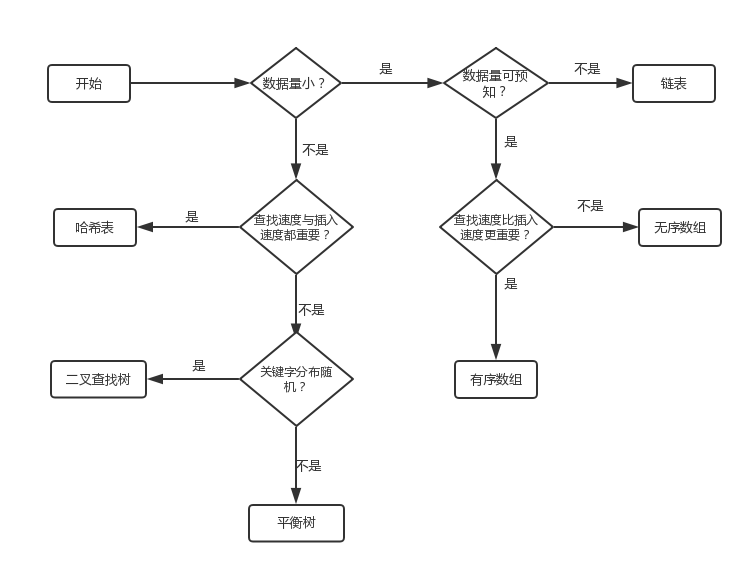

### 时间复杂度（O符号）
1. O(1)：最低的复杂度，无论数据量大小，耗时都不变，都可以在一次计算后获得。哈希算法就是典型的O(1)
2. O(n)：线性，n表示数据的量，当量增大，耗时也增大，常见有遍历算法
3. O(n²)：平方，表示耗时是n的平方倍，当看到循环嵌循环的时候，基本上这个算法就是平方级的，如：冒泡排序等
4. O(log n)：对数，通常ax=n,那么数x叫做以a为底n的对数,也就是x=logan，这里是a通常是2，如：数量增大8倍，耗时只增加了3倍，二分查找就是对数级的算法，每次剔除一半
5. O(n log n)：线性对数，就是n乘以log n,按照上面说的数据增大8倍，耗时就是8*3=24倍，归并排序就是线性对数级的算法

### Array  
在Java中，数组是用来存放同一种数据类型的集合，注意只能存放同一种数据类型
```java_holder_method_tree
//只声明了类型和长度
数据类型 []  数组名称 = new 数据类型[数组长度];
//声明了类型，初始化赋值，大小由元素个数决定
数据类型 [] 数组名称 = {数组元素1，数组元素2，......}
```
- 特点：大小固定，不能动态扩展(初始化给大了，浪费；给小了，不够用)，插入快，删除和查找慢

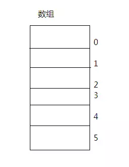

- 模拟实现: Array
(详见 Array)

### Stack
- 栈（stack）又称为堆栈或堆叠，栈作为一种数据结构,他按照先进后出原则存储数据,先进入的数据被压入栈底,最后进入的压入栈顶.
- java 中的stack 是Vector 的一个子类,只定义了默认的构造函数,用来创建空栈
- 栈式元素的集合,其中包括了两个基本操作, push 可以将元素压入栈底,pop 可以将栈顶元素弹出,
- 遵循后入先出（LIFO）原则。
- 时间复杂度
    - 索引: O(n)
    - 搜索: O(n)
    - 插入: O(1)
    - 移除: O(1)

 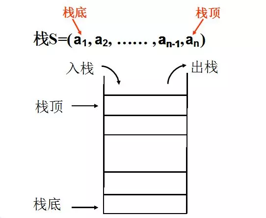

 #### 模拟实现
 详见 stack

 ### Queue

 - 队列是元素的集合，其包含了两个基本操作：enqueue 操作可以用于将元素插入到队列中，而 dequeue 操作则是将元素从队列中移除。
 - 队列遵循先入先出原则(FIFO)
 - 时间复杂度:
    - 索引: O(n)
    - 搜索: O(n)
    - 插入: O(1)
    - 移除: O(1)

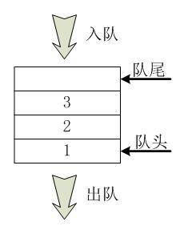

 #### 源码
 - 详见 queue

 ### Linked List

 - 链表是由节点（Node） 组成的线性集合，每个节点可以利用指针指向其他节点。 他是一种包含了多个节点的，能够用于表示序列的数据结构。
 - 单向链表：链表中的节点指向下一个节点，并且最后一个节点指向空。
 - 双向链表: 其中每个节点有两个指针 p、n，使得p 指向前一个节点 n指向下一个节点；最后一个几点的n 指向null。
 - 循环链表：每个节点指向下一个节点并且最后一个节点指向第一个节点的链表。
 - 时间复杂度：
    - 索引: O(n)
    - 搜索: O(n)
    - 插入: O(1)
    - 移除: O(1)

    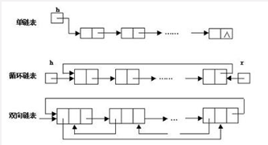
 #### 源码
 - 详见LinkedList 源码

 ### Binary Tree

 - 二叉树（由一个根节点和两个互不交互的，分别称之为根节点，一个称之为左子树，一个称之为右子树组成），二叉树即是每个节点最多包含左子节点与右子节点这两个节点的树形数据结构。
 - 满二叉树: 树中的每个节点仅包含 0 或 2 个节点。
 - 完美二叉树（Perfect Binary Tree）: 二叉树中的每个叶节点都拥有两个子节点，并且具有相同的高度
 - 完全二叉树: 除最后一层外，每一层上的结点数均达到最大值；在最后一层上只缺少右边的若干结点。
 #### 树结构
 - 二叉树
 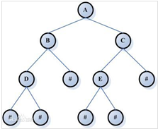

 - 红黑树
 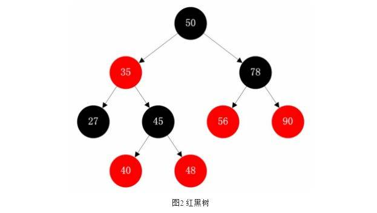

 ### heap
 - 堆被称为优先队列（队列+优先队列），图一最大堆，图二最小堆
 
 - 堆是一种特殊的基于树的满足某些特性的数据结构，整个堆中的所有父子节点的键值都会满足相同的排序条件。堆更准确的可以分为最大堆和最小堆，在最大堆中，父节点的键值永远大于或者等于子节点的值，并且整个堆中的最大值存储于根节点；而最小堆中，父节点的键值永远小于或者等于其子节点的键值，并且整个堆中的最小值存储于根节点。
 - 时间复杂度：
    - 访问最大值 / 最小值: O(1)
    - 插入: O(log(n))
    - 移除最大值 / 最小值: O(log(n))

### hashing
- hashing 能够将任意长度的数据映射到固定长度的数据，hash 函数返回的为hash 值，如果两个不同的键得到相同的哈希值，即将这种现象称为 __hash碰撞__。

- __Hash Map:__ Hash Map 是一种能够建立起键与值之间关系的数据结构，Hash Map 能够使用哈希函数将键转化为桶或者槽中的下标，从而优化对于目标值的搜索速度。

- 碰撞解决:
    - __链地址法（Separate Chaining）:__ 链地址法中，每个桶是相互独立的，包含了一系列索引的列表。搜索操作的时间复杂度即是搜索桶的时间（固定时间）与遍历列表的时间之和。
    - __开地址法（Open Addressing）:__ 在开地址法中，当插入新值时，会判断该值对应的哈希桶是否存在，如果存在则根据某种算法依次选择下一个可能的位置，直到找到一个尚未被占用的地址。所谓开地址法也是指某个元素的位置并不永远由其哈希值决定。

### Graph
- 图是一种数据元素间为多对多关系的数据结构, 加上一组基本操作构成的抽象数据类型。
    - __无向图（Undirected Graph）__: 无向图具有对称的邻接矩阵，因此如果存在某条从节点 u 到节点 v 的边，反之从 v 到 u 的边也存在。
    - __有向图（Directed Graph）__: 有向图的邻接矩阵是非对称的，即如果存在从 u 到 v 的边 __并不意味着__ 一定存在从 v 到 u 的边。

## 参考：
 - https://juejin.im/post/5b3c30bde51d451964620710
