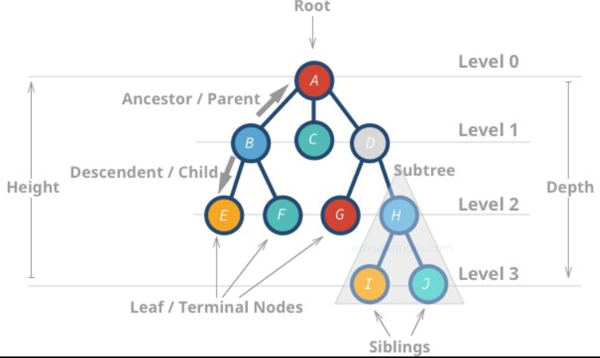
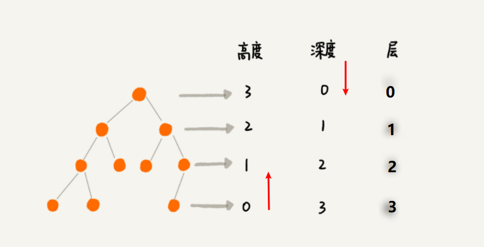
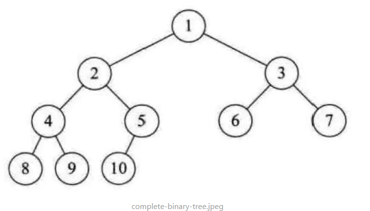
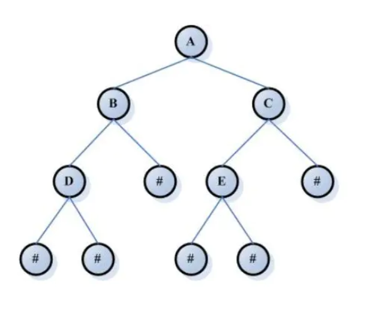
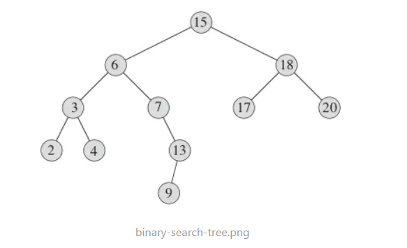
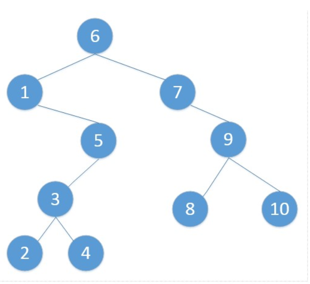
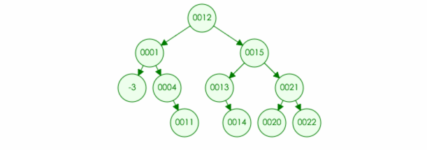
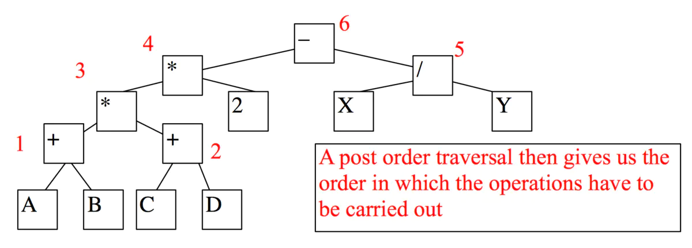
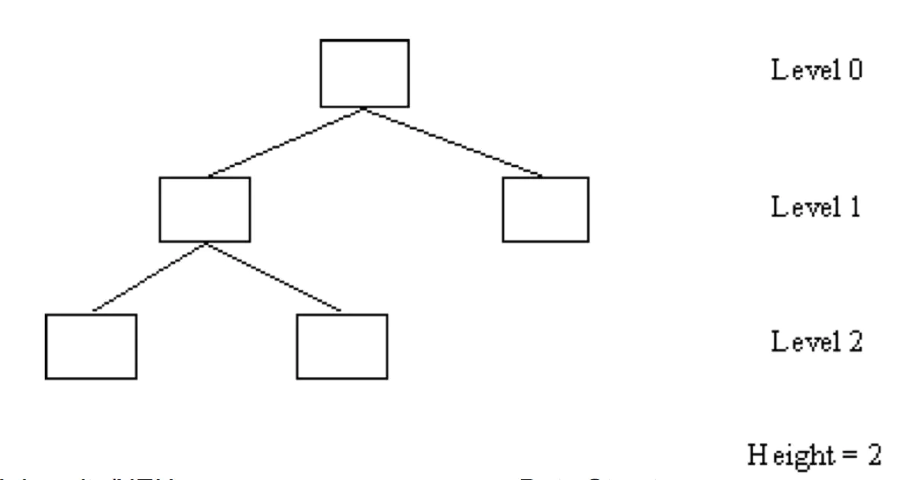
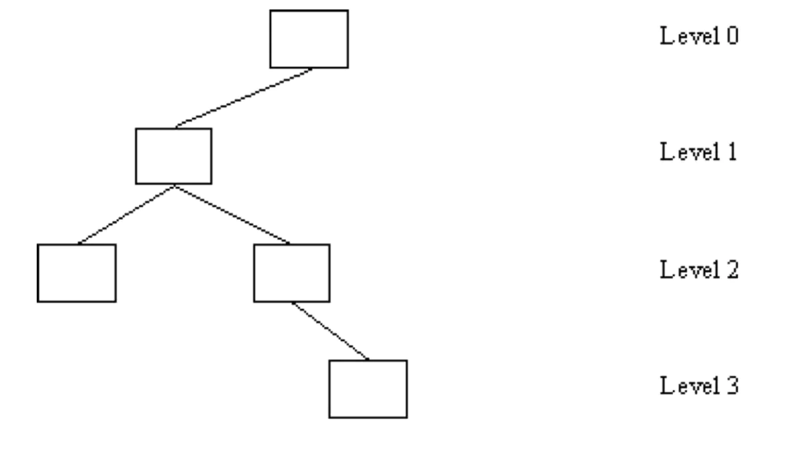

# 树

**树有多个节点(node)，用以储存元素。某些节点之间存在一定的关系，用连线表示，连线称为边(edge)。边的上端节点称为父节点，下端称为子节点。树像是一个不断分叉的树根。**



## 树的相关概念

### 根节点 Root node

没有任何父节点的节点：最顶层的节点被称为**根**（root）节点

### 叶子节点 leaf node

没有任何子节点的节点被称为叶子节点（leaf node）或者**终端**节点（terminal node）。

### 树的高度 Height

最深的叶节点与根节点之间的距离（即边的数量）

- 以`A`为根节点的树 的高度是 3。
- 以`I`为根节点的树 的高度是 0（子树也是树，I 的度是指 I 为根节点的子树的度）。

### 树的深度 Depth

**深度**（Depth）或者**层次**（level）是节点与根节点的距离。

- `H` 的层次是 2。
- `B` 的层次是 1。

<!--more-->

**深度定义是从上往下的，高度定义是从下往上的**



# 二叉树 Binary Tree

**二叉树(binary)是一种特殊的树，它是每个节点最多有两个子树的树结构，通常子树被称作是 "左子树" 和 "右子树"，二叉树常用于实现二叉搜索树和二叉堆。**


常见的二叉树：完全二叉树,满二叉数,二叉搜索数,二叉堆,AVL 树,红黑树，哈夫曼树

## 完全二叉树 Complete Binary Tree

若设二叉树的深度为 h，除第 h 层外，其它各层 (1～h-1) 的结点数都达到最大个数，第 h 层所有的结点都连续集中在最左边，这就是完全二叉树。



**即除了最后一层外，每一层上的节点数均达到最大值；在最后一层上只缺少右边的若干结点。**

而像这样就不是完全二叉树, 例如下图：(# 代表有元素)



**用途**：

完全二叉树是效率很高的数据结构，堆是一种完全二叉树或者近似完全二叉树，所以效率极高。后面介绍的二叉堆也是基于完全二叉树来实现的。

## 满二叉树 Full Binary Tree

除最后一层无任何子节点外，每一层上的所有结点都有两个子结点的二叉树被称之为满二叉树。

**满二叉树一定是完全二叉树，完全二叉树不一定满二叉树。**


一个高度为 h 的满二叉树含有 `1 + 2 + 4 + ... + 2^h = 2^(h + 1) - 1个节点`，所以满二叉树的节点个数一定为奇数。

## 二叉搜索树 (Binary Search Tree)

**二叉搜索树是一种特殊的二叉树，也可以称为二叉排序树，二叉查找树。**除了具有二叉树的基本性质外，它还具备：

- 树中每个节点最多有两个子树，通常称为左子树和右子树
- 若它的左子树不空，则左子树上所有结点的值均小于它的根结点的值
- 若它的右子树不空，则右子树上所有结点的值均大于它的根结点的值
- 它的左右子树仍然是一棵二叉搜索树 (recursive)



**基本操作**

### 数据结构

```java
class TreeNode<E extends Comparable<E>>{
    private E data;
    private TreeNode<E> left;
    private TreeNode<E> right;
    private TreeNode<E> parent;
    TreeNode(E theData){
        data = theData;
        left = null;
        right = null;
        parent = null;
    }
}
public class BinarySearchTree<E extends Comparable<E>>{
    private TreeNode<E> root = null;
}
```

### 树的遍历

假设我们需要遍历树中所有节点，这里有许多递归方法可以实现：(**中序,前序,后序  指的是 父节点遍历的位置**)

#### 中序遍历

**当到达某个节点时，先访问左子节点，再输出该节点，最后访问右子节点。**

```java
public void inOrder(TreeNode<E> cursor){
    if(cursor == null) return;
    inOrder(cursor.getLeft());
    System.out.println(cursor.getData());
    inOrder(cursor.getRight());
}
```

#### 前序遍历

**前序遍历：当到达某个节点时，先输出该节点，再访问左子节点，最后访问右子节点。**

```java
public void preOrder(TreeNode<E> cursor){
    if(cursor == null) return;
    System.out.println(cursor.getData());
    inOrder(cursor.getLeft());
    inOrder(cursor.getRight());
}
```

#### 后续遍历

**当到达某个节点时，先访问左子节点，再访问右子节点，最后输出该节点。**

```java
public void postOrder(TreeNode<E> cursor){
    if(cursor == null) return;
    inOrder(cursor.getLeft());
    inOrder(cursor.getRight());
    System.out.println(cursor.getData());
}
```

### 树的搜索

树的搜索和树的遍历差不多，就是在遍历的时候只搜索不输出就可以了:

example:我们在树中搜索元素 20


#### 代码实现:

```java
	/**
     * 非递归方式查找
     * @param currentNode
     * @param data
     * @return
     */
public boolean searchNode(TreeNode<E> node){
    TreeNode<E> currentNode = root;
    while(true){
        if(currentNode == null){
            return false;
        }
        if(currentNode.getData().compareTo(node.getData()) == 0){
            return true;
        }else if(currentNode.getData().compareTo(node.getData()) < 0){
            currentNode = currentNode.getLeft();
        }else{
            currentNode = currentNode.getRight();
        }
    }
}

    /**
     * 查找的递归版本
     * @param currentNode
     * @param data
     * @return
     */
    public TreeNode<E> search2(TreeNode<E> currentNode,E data){
        if (Objects.isNull(currentNode)){
            return null;
        }
        if(currentNode.getData().compareTo(data) < 0){
           return search2(currentNode.getRight(),data);
        }else if(currentNode.getData().compareTo(data) > 0){
            return search2(currentNode.getLeft(),data);
        }else{
            //currentNode.getData().compareTo(data) == 0
            return currentNode;
        }
    }
```

## 前驱和后驱节点

**二叉树的节点val值是按照二叉树中序遍历顺序连续设定**



### 节点的前驱节点

节点val值小于该节点val值并且值最大的节点

找结点(x)的前驱结点。即，查找"二叉树中数据值小于该结点"的"最大结点"。

上图的结果:

- 4的前驱结点是3
- 2的前驱结点是1
- 6的前驱结点是5

#### 寻找前驱节点的方法论:

1. 若一个节点有左子树，那么该节点的前驱节点是其左子树中val值最大的节点（也就是左子树中所谓的rightMostNode）
2. 若一个节点没有左子树，那么判断该节点和其父节点的关系
   2.1 若该节点是其父节点的右边孩子，那么该节点的前驱结点即为其父节点。
   2.2 若该节点是其父节点的左边孩子，那么需要沿着其父亲节点一直向树的顶端寻找，直到找到一个节点P，P节点是其父节点Q的右边孩子（可参考例子2的前驱结点是1），那么Q就是该节点的后继节点

#### 代码实现

```java
   /**
     * 前驱节点
     * 找结点(x)的前驱结点。即，查找"二叉树中数据值小于该结点"的"最大结点"。
     * @param node
     * @return
     */
    public TreeNode<E> predecessor(TreeNode<E> node){
        //若该节点有左子节点,则前驱节点为"以其左孩子为根的子树的最大结点"。
        if(node.getLeft() != null){
            return getMaxNode(node.getLeft());
        }

        //若该节点不存在左子节点:
        //1. 该节点为其父节点的右子节点,则"node的前驱结点"为 "它的父结点"
        //2. 该节点为其父节点的左子节点,则查找"node的最低的父结点，并且该父结点要具有右孩子"，找到的这个"最低的父结点"就是"x的前驱结点"
        //寻找其父辈节点中,左子树为null 的第一个父辈节点
        TreeNode<E> parent = node.getParent();
        // //node != parent.getLeft() 时,说明 node 就是 parent 的右子节点
        while (parent!= null && node == parent.getLeft()){
            node = parent;
              parent = parent.getParent();
        }
        return parent;
    }
```

### 节点的后继节点

节点val值大于该节点val值并且值最小的节点

找结点(x)的后继结点。即，查找"二叉树中数据值大于该结点"的"最小结点"。

上图结果:

- 7的后继结点是8
- 5的后继节点是6
- 2的后继节点是3

#### 寻找后继结点的方法论

1. 若一个节点有右子树，那么该节点的后继节点是其右子树中val值最小的节点（也就是右子树中所谓的leftMostNode）
2. 若一个节点没有右子树，那么判断该节点和其父节点的关系
   2.1 若该节点是其父节点的左边孩子，那么该节点的后继结点即为其父节点
   2.2 若该节点是其父节点的右边孩子，那么需要沿着其父亲节点一直向树的顶端寻找，直到找到一个节点P，P节点是其父节点Q的**左边孩子**（可参考例子5的后继节点是6），那么Q就是该节点的后继节点

#### 代码实现

```java
/**
     * 后继节点
     * 找结点(x)的后继结点。即，查找"二叉树中数据值大于该结点"的"最小结点"。
     * @param node
     * @return
     */
    public TreeNode<E> successor(TreeNode<E> node){
        //1. 如果该节点有右侧节点,则后继结点"为 "以其右孩子为根的子树的最小结点"。
        if(node.getRight() != null){
            return getMinNode(node.getRight());
        }
        //如果改节点不存啊在右侧节点
        //1. 该节点为其父节点的左侧节点,则"node的后继结点"为 "它的父结点"
        //2. 该节点为其父节点的右侧节点,则查找"node的最低的父结点，并且该父结点要具有左孩子",找到的这个"最低的父结点"就是"x的后继结点"。
        TreeNode<E> parent = node.getParent();
        //node != parent.getRight() 时,说明 node 就是 parent 的左子节点
        while (parent!=null && node == parent.getRight()){
            node = parent;
            parent = parent.getParent();
        }
        return parent;
    }
```


参考:https://www.cnblogs.com/xiejunzhao/p/f5f362c1a89da1663850df9fc4b80214.html


### 节点插入

步骤：

1. 递归地去查找该二叉树，找到应该插入的节点
2. 若当前的二叉查找树为空，则插入的元素为根节点
3. 若插入的元素值小于根节点值，则将元素插入到左子树中
4. 若插入的元素值不小于根节点值，则将元素插入到右子树中

比如：我们往树种插入元素 21


#### 代码实现：

```java
public void insertNode(TreeNode<E> node){
    TreeNode<E> currentNode = root;
    if(currentNode == null){
        root = node;
        return;
    }else{
        while(true){
            if(node.getData().compareTo(currentNode.getData()) < 0){
                if(currentNode.getLeft() == null){
                    break;
                }else{
                    currentNode = currentNode.getLeft();
                }
            }else if(node.getData().compareTo(currentNode.getData()) > 0){

                if(currentNode.getRight() == null){
                    break;
                }else{
                    currentNode = currentNode.getRight();
                }
            }
        }   
    }
    if(node.getData().compareTo(currentNode.getData()) < 0){
        currentNode.setLeft(node);
    }else if(node.getData().compareTo(currentNode.getData()) > 0){
        currentNode.setRight(node);
    }
}
```

### 节点删除：

首先需要搜索该节点，然后可以分为以下四种情况进行讨论：

1. 如果找不到该节点，那么什么都不用做

例如：要在树中删除元素 22


2. 如果被移除的元素在叶节点(no children)：那么直接移除该节点，并且将父节点原本指向该位置改为 null (如果是根节点，那就不用修改父节点指向位置)

例如：要在树中删除元素 6


3.  如果删除的元素只有一个儿子(one child)：那么也很简单，直接删除该节点，并且将父节点原本指向的位置改为该儿子 (如果是根节点，那么该儿子成为新的根节点)

例如：要在树中删除元素 20


4. 如果删除的元素有两个儿子，那么可以取左子树中最大元素(前驱节点)或者右子树中最小元素(后继节点)进行替换，然后将最大元素最小元素原位置置空

例如：要在树中删除元素 15



#### 源码实现

```java
public TreeNode<E> remove(TreeNode<E> node){
        // node 节点的左右子树都不为null
        if(node.getRight() != null && node.getLeft() != null){
            //找到后继节点
            TreeNode<E> successor = successor(node);
            //转移后继结点值到当前节点
            node.setData(successor.getData());
            //把要删除的当前节点设置为后继结点
            node = successor;
        }
        //只有一个子节点,或者没有子节点
        TreeNode<E> child = null;
        if(node.getLeft() != null){
            child = node.getLeft();
        }else{
            child = node.getRight();
        }
        //如果 child != null，就说明是有一个节点的情况
        if(child != null){
            //将子节点和父节点关联上
            child.setParent(node.getParent());
        }
        //如果当前节点没有父节点（后继情况到这儿时一定有父节点）
        //说明要删除的就是根节点
        TreeNode<E> parent = node.getParent();
        if( parent == null){
            //根节点设置为子节点
            //按照前面逻辑，根只有一个或者没有节点，所以直接赋值 child 即可
            root = child;
        }else if(node == parent.getLeft()){ //子节点时父亲的做左节点
            //将父节点的左节点设置为 child
            parent.setLeft(child);
        }else{//子节点时父亲的右子节点
            parent.setRight(child);
        }
        return node;
    }
```


## 平衡树 Balanced Tree：

### 平衡树的应用

1. 排序：我们可以将数据一个个读取，构造出一棵平衡树。但我们读取完所有数据后，我们可以按次序遍历该树。但是在插入的过程中需要不断调整。否则他有可能会越来与不平衡，调整的方式有我们后面介绍的 AVL 树和红黑树两种方法。
2. 时间复杂度为 O(nlog2n + n)
3. 编译算数表达式：
    我们可以将算术表达式展现为一棵搜索树：所有的叶子节点都是常量或者变量，而除叶节点外所有节点都是操作符。

比如：我们可以将 `(A + B) * (C + D) * 2 - X / Y`展现为:



### 平衡树分析

二叉搜索树虽然在插入和删除时的效率都有所提升，但是如果二叉树变成了下图：


二叉树快退化成了，那么搜索效率效率就会变得很低,时间复杂度由 logn 退化到 n，这时候我们需要添加一些额外的条件来约束它，使其可以保持具有 log(n) 的时间复杂度。

- 首先平衡树得是二叉树，它满足二叉树的所有性质。
- **判定是否为平衡树的条件：将该树重新排序，若不存在重新排序后的二叉树的树高比原来的树小，则判定该树为平衡树。**

比如:



这里有棵树高度为 2，那么我们知道高度为 1 的树最多只有三个节点，五个节点是无法构成一棵高度为 1 的二叉树，故上图的二叉树是平衡树。

又比如:



该树高度为 3，我们知道一棵高度为 2 的树最多可以有 `2^(h + 1) - 1 = 7`(**满二叉树**)的节点，故图上的的树只有五个节点，那么它经过重新调整之后可以变为一个高度为 2 的二叉树，故不符合平衡树的性质，故该树不是平衡树。

由上我们可以得出一个结论：

1. 如果一棵树是平衡的，那么它所满足的节点数 n 需要满足 `2^h - 1 < n <= 2^(h + 1) - 1`
2. 插入和删除一个节点的时间复杂度均为: O(logn)
3. 这里虽然有一些算法可以使平衡二叉树 - 但是它们并没什么卵用，因为我们一般都是在添加或删除操作时候来去平衡树，而不是再一开始去平衡树
