# 平衡二叉树的由来

## 平衡二叉树存在缺馅

- 二叉搜索树一定程度上可以提高搜索效率，但是当原序列有序时，例如序列 A = {1，2，3，4，5，6}，构造二叉搜索树如图 1.1。依据此序列构造的二叉搜索树为右斜树，同时二叉树退化成单链表，搜索效率降低为 O(n)。

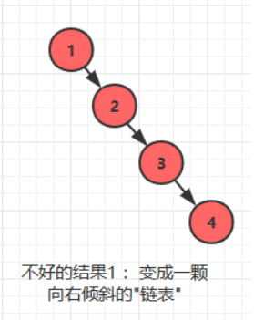

- 插入和删除操作可能降低未来操作的性能

# 什么是平衡二叉树

`Balanced BinaryTree`  平衡二叉树,又被称作VAL 树.特点:为一颗空树,或者它的左右两颗子树之前的高度差的绝对值不能超过1,并且左右两颗子树都是一颗平衡二叉树.

平衡二叉树一般是一个有序树，它具有二叉树的所有性质，其遍历操作和二叉树的遍历操作相同。但是由于其对二叉树施加了额外限制，因而其添加、删除操作都必须保证平衡二叉树的因子被保持。

## 平衡因子

指的是该节点的两个子树，即左子树和右子树的高度差.即用左子树的高度减去右子树的高度，如果该节点的某个子树不存在，则该子树的高度为0,如果高度差的绝对值超过1就要根据情况进行调整。

下图中：

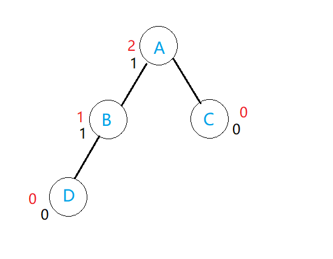

- 对根结点A而言， 它左子树高度为2， 右子树高度为1， 那么它的平衡因子BF = 2 - 1 = 1
- 对结点B而言， 它左子树高度为1， 没有右子树（高度视为0），BF = 1 - 0 = 1；

## 平衡二叉树的节点

```java
  /**
     *  平衡二叉树的节点
     *  <br/>
     *  @author zbcn8
     *  @since  2020/8/19 13:32
     */
    public static class Node<T>{

        /**
         * 节点值
         */
        private T val;

        /**
         * 深度，这里计算每个结点的深度，通过深度的比较可得出是否平衡
         */
        private int depth;

        /**
         * 父节点
         */
        private Node<T> parent;

        /**
         * 左子树
         */
        private Node<T> left;

        /**
         * 右子树
         */
        private Node<T> right;

        public Node(T val) {
            this.val = val;
            depth=0;
            parent=null;
            left= null;
            right = null;

        }
    }
```


## 平衡因子

某节点的左子树与右子树的高度(深度)差即为该节点的平衡因子（BF,Balance Factor）。平衡二叉树中不存在平衡因子大于 1 的节点，在一棵平衡二叉树中，节点的平衡因子只能取 0 （左右子树等高）、1（左子树比较高） 或者 -1（右子树比较高） ，分别对应着。

- 左右子树等高

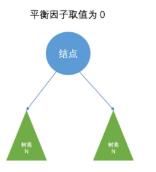

- 左子树高

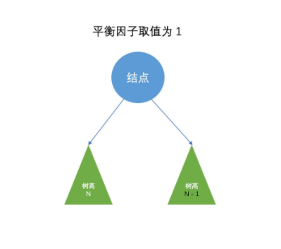

- 右子树高

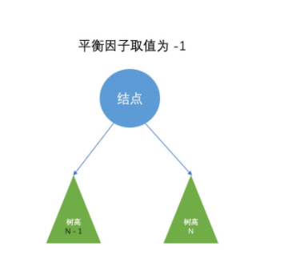

## 最小失衡子树

在新插入的结点向上查找，以第一个平衡因子的**绝对值**超过 1 的结点为根的子树称为最小不平衡子树。也就是说，一棵失衡的树，是有可能有多棵子树同时失衡的。而这个时候，我们只要调整最小的不平衡子树，就能够将不平衡的树调整为平衡的树。

如下图：

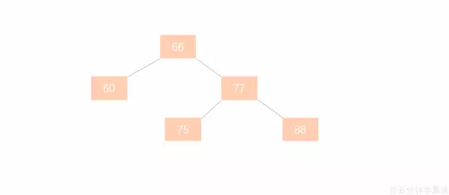

上图中，增加99节点后，节点 66 的左子树高度为 1，右子树高度为 3，此时平衡因子为 -2，树失去平衡。

# 二叉树的修正机制

**平衡二叉树的失衡调整主要是通过旋转最小失衡子树来实现的**。根据旋转的方向有两种处理方式，**左旋** 与 **右旋** 。

## 左旋

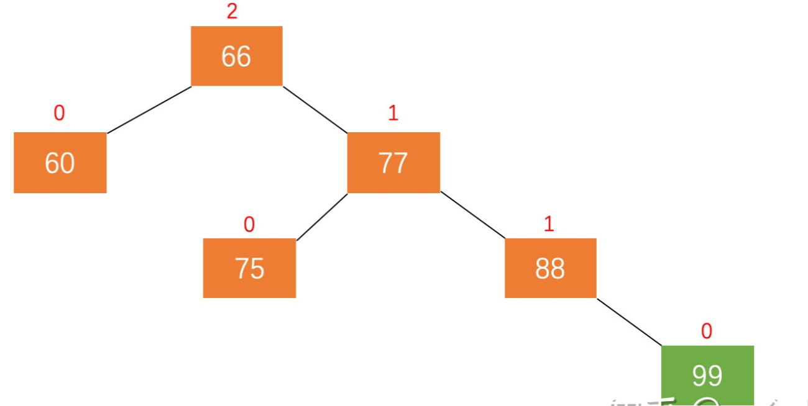

上图中：加入新节点 99 后， 节点 66 的左子树高度为 1，右子树高度为 3，此时平衡因子为 -2。为保证树的平衡，此时需要对节点 66 做出旋转，因为右子树高度高于左子树，对节点进行左旋操作。

### 操作流程如下：

1. 节点的右孩子替代此节点位置
2. 右孩子的左子树变为该节点的右子树
3. 节点本身变为右孩子的左子树

如下图：

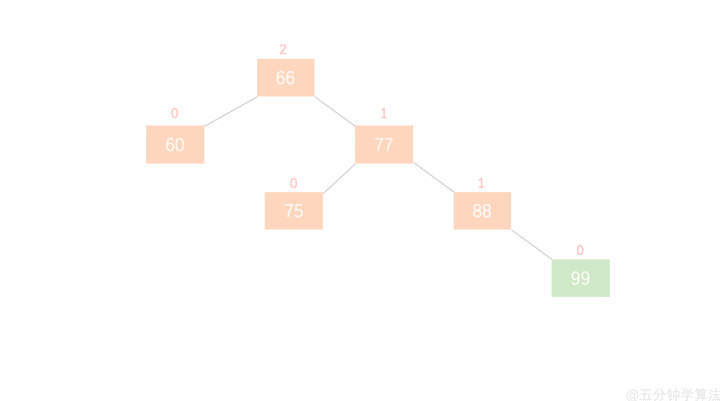


## 右旋

右旋操作与左旋类似，

### 操作流程为

1. 节点的左孩子代表此节点
2. 节点的左孩子的右子树变为节点的左子树
3. 将此节点作为左孩子节点的右子树。

如下图：

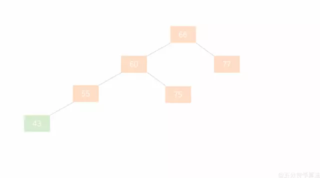

## 四种失衡的情况

| 插入方式 | 描述 | 旋转方式 |
| -------- | -------------------- |---------- |
| LL | 在 A 的左子树根节点的左子树上插入节点而破坏平衡 | 右旋转 |
| RR | 在 A 的右子树根节点的右子树上插入节点而破坏平衡 | 左旋转 |
| LR | 在A的左子树根节点的右子树上插入节点而破坏平衡 | 先左旋后右旋 |
| RL | 在 A 的右子树根节点的左子树上插入节点而破坏平衡 | 先右旋后左旋 |
| RL | 在 A 的**右子树**根节点的**左子树**上插入节点而破坏平衡 | 先右旋后左旋 |


### LL型 -（左孩子的左子树）通过右旋解决

在结点的左孩子的左子树中插入数据。


#### 代码

```java
/**
 * 右旋
 * @param node
 * @return
 */
public Node<T> rotateRight(Node<T> node){
    //获取左儿子
    Node<T> left = node.getLeft();
    //将左儿子的右儿子（"拖油瓶"结点）链接到旋转后的node的左链接中
    node.setLeft(left.getRight());
    // 调转node和它左儿子的父子关系，使node成为它原左儿子的右子树
    left.setRight(node);
    // 更新并维护受影响结点的height
    node.setHeight(max(height(node.getLeft()), height(node.getRight()))+1);
    // 更新并维护受影响结点的height
    left.setHeight(max(height(left.getLeft()),height(left.getRight()))+1);
    return left;
}
```


### RR型-（右孩子的右子树）通过左旋解决

只需要执行一次左旋即可。


#### 代码

```java
 /**
  * 左旋
  * @param node
  * @return
  */
public Node<T> rotateLeft(Node<T> node){
    //获取右儿子
    Node<T> right = node.getRight();
    //将右儿子的左儿子("拖油瓶"结点）链接到旋转后的node的右侧链接中
    node.setRight(right.getLeft());
    //调转node 节点和它右侧儿子的父子关系,使node 成为它原右生儿子的左子树
    right.setLeft(node);
    node.setHeight(max(height(node.getRight()),height(node.getLeft()))+1);
    right.setHeight(max(height(right.getLeft()),height(right.getRight()))+1);
    return right;
}
```


### LR型（左孩子的右子树）通过先左旋再右旋解决

若 A 的左孩子节点 B 的右子树 E 插入节点 F ，导致节点 A 失衡

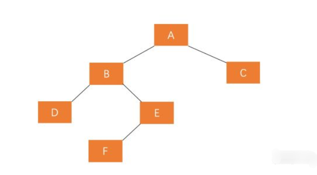

- 解决方案

需要执行两步操作，使得旋转之后为 **原来根结点的左孩子的右孩子作为新的根节点**，即E作为根节点

1. 对失衡节点 A 的左孩子 B 进行左旋操作，即上述 RR 情形操作（左旋）

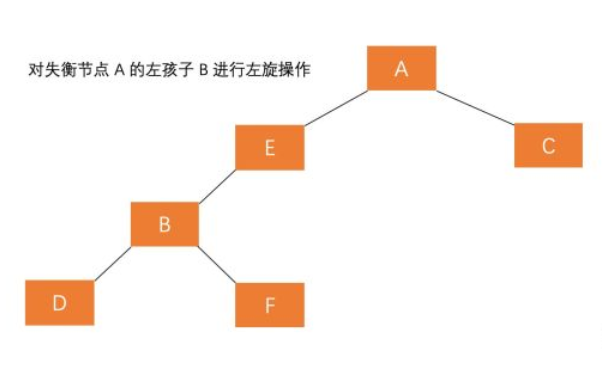

2. 对失衡节点 A 做右旋操作，即上述 LL 情形操作（右旋）

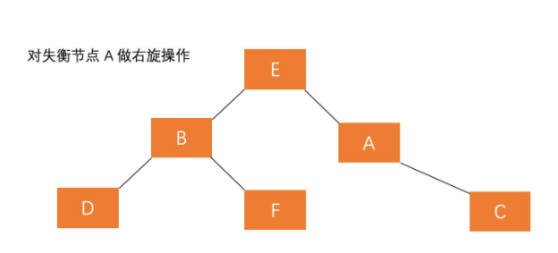

也就是说，经过这两步操作，使得 **原来根节点的左孩子的右孩子 E 节点成为了新的根节点**。

#### 两次旋转、先左旋后右旋

由于在a的左子树根结点的右子树上插入结点（LR）， 导致a的平衡因子由1变成2，导致以a为根结点的子树失去平衡，需要进行两次旋转， 先左旋后右旋

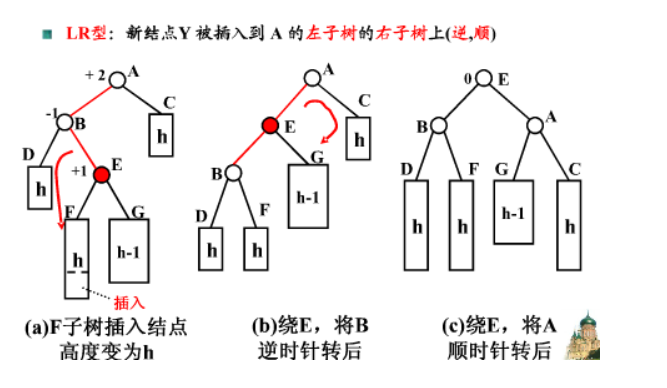


### RL型（右孩子的左子树）通过先右旋再左旋解决

若 A 的右孩子节点 C 的左子树 D 插入节点 F ，导致节点 A 失衡，

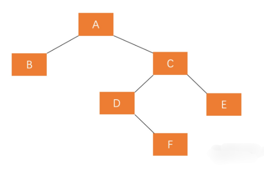

- 解决方案

要执行两步操作，使得旋转之后为 **原来根结点的右孩子的左孩子作为新的根节点** 。

1. 对失衡节点 A 的右孩子 C 进行右旋操作，即上述 LL 情形操作（右旋）

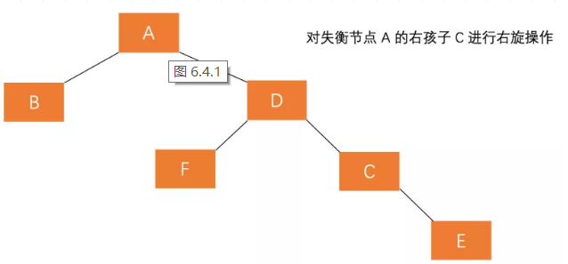

1. 对失衡节点 A 做左旋操作，即上述 RR 情形操作（左旋）

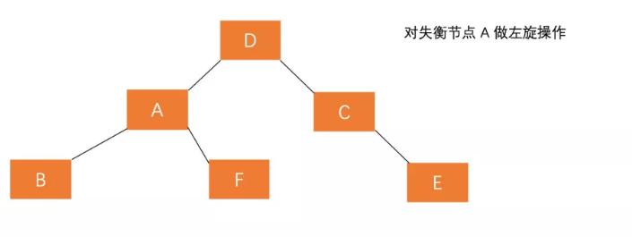

经过这两步操作，使得 **原来根节点的右孩子的左孩子 D 节点成为了新的根节点**。

#### 两次旋转， 先右旋后左旋

由于在a的右子树根结点的左子树上插入结点（RL）， a的平衡因子由-1变成-2，导致以a为根结点的子树失去平衡， 则需要进行两次旋转，先右旋后左旋

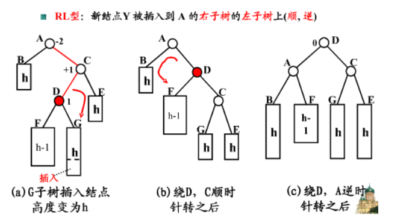

## 总结

- 在所有的不平衡情况中，都是按照先 **寻找最小不平衡树**，然后 **寻找所属的不平衡类别**，再 **根据 4 种类别进行固定化程序的操作**。
- LL , LR ，RR ，RL其实已经为我们提供了最后哪个节点作为新的根指明了方向。如 LR 型最后的根节点为原来的根的左孩子的右孩子，RL 型最后的根节点为原来的根的右孩子的左孩子。只要记住这四种情况，可以很快地推导出所有的情况。
- 维护平衡二叉树，最麻烦的地方在于平衡因子的维护

# AVL 树的四种删除节点的方式

AVL 树和二叉查找树的删除操作情况一致，都分为四种情况：

1. 删除叶子节点
2. 删除的节点只有左子树
3. 删除的节点只有右子树
4. 删除的节点既有左子树又有右子树

AVL 树在删除节点后需要重新**检查平衡性并修正**，同时，删除操作与插入操作后的平衡修正区别在于，插入操作后只需要对插入栈中的弹出的第一个非平衡节点进行修正，而删除操作需要修正栈中的所有非平衡节点。

## 删除操作的大致步骤

- 以前三种情况为基础尝试删除节点，并将访问节点入栈。
- 如果尝试删除成功，则依次检查栈顶节点的平衡状态，遇到非平衡节点，即进行旋转平衡，直到栈空。
- 如果尝试删除失败，证明是第四种情况。这时先找到被删除节点的右子树最小节点并删除它，将访问节点继续入栈。
- 再依次检查栈顶节点的平衡状态和修正直到栈空。

对于删除操作造成的非平衡状态的修正，可以这样理解：对左或者右子树的删除操作相当于对右或者左子树的插入操作，然后再对应上插入的四种情况选择相应的旋转就好了。

## 删除叶子节点

1. 将该节点直接从树中删除；
2. 其父节点的子树高度的变化将导致父节点平衡因子的变化，通过向上检索并推算其父节点是否失衡；
3. 如果其父节点未失衡，则继续向上检索推算其父节点的父节点是否失衡…如此反复2的判断，直到根节点 ；如果向上推算过程中发现了失衡的现象，则进行 4 的处理；
4. 如果其父节点失衡，则判断是哪种失衡类型 [LL、LR、RR、RL] ，并对其进行相应的平衡化处理。如果平衡化处理结束后，发现与原来以父节点为根节点的树的高度发生变化，则继续进行 2 的检索推算；如果与原来以父节点为根节点的高度一致时，则可说明父节点的父节点及祖先节点的平衡因子将不会有变化，因此可以退出处理；

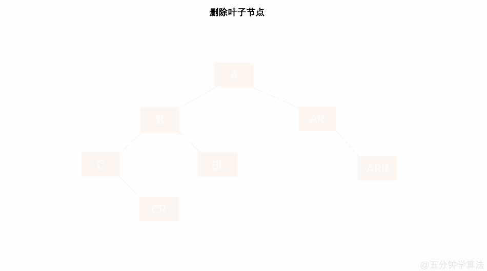

具体数字演示：

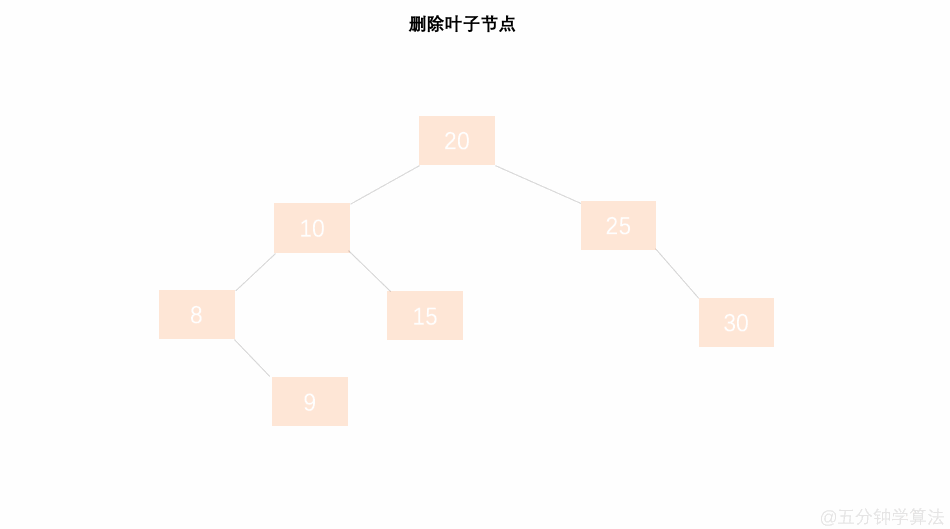

## 删除的节点只有左子树或右子树

- 将左子树（右子树）替代原有节点 C 的位置；
- 节点  C 被删除后，则以 C 的父节点  B 为起始推算点，依此向上检索推算各节点（父、祖先）是否失衡；
- 如果其父节点未失衡，则继续向上检索推算其父节点 的父节点 是否失衡…如此反复 ② 的判断，直到根节点 ；如果向上推算过程中发现了失衡的现象，则进行 ④ 的处理；
- 如果其父节点失衡，则判断是哪种失衡类型 [LL、LR、RR、RL] ，并对其进行相应的平衡化处理。如果平衡化处理结束后，发现与原来以父节点为根节点的树的高度发生变化，则继续进行 ② 的检索推算；如果与原来以父节点为根节点的高度一致时，则可说明父节点的父节点及祖先节点的平衡因子将不会有变化，因此可以退出处理；


## 删除的节点既有左子树又有右子树

1. 找到被删节点 B 和替代节点 BLR (节点 B 的前继节点或后继节点 —— 在此选择 **前继**)；
2. 将替代节点 BLR 的值赋给节点 B ，再把替代节点 BLR 的左孩子 BLRL 替换替代节点 BLR 的位置；
3. 以 BLR 的父节点 BL 为起始推算点，依此向上检索推算父节点或祖先节点是否失衡；
4. 如果其父节点未失衡，则继续向上检索推算其父节点的父节点是否失衡…如此反复③的判断，直到根节点；如果向上推算过程中发现了失衡的现象，则进行⑤的处理；
5. 如果其父节点失衡，则判断是哪种失衡类型  [LL、LR、RR、RL]  ，并对其进行相应的平衡化处理。如果平衡化处理结束后，发现与原来以父节点为根节点的树的高度发生变化，则继续进行 ② 的检索推算；如果与原来以父节点为根节点的高度一致时，则可说明父节点的父节点及祖先节点的平衡因子将不会有变化，因此可以退出处理；


# 参考

- https://zhuanlan.zhihu.com/p/56066942
- https://www.cnblogs.com/penghuwan/archive/2018/01/01/8166133.html
- [https://blog.zhenlanghuo.top/2017/08/22/AVL%E5%B9%B3%E8%A1%A1%E4%BA%8C%E5%8F%89%E6%A0%91%E7%9A%84%E5%AE%9E%E7%8E%B0/](https://blog.zhenlanghuo.top/2017/08/22/AVL平衡二叉树的实现/)
- https://blog.csdn.net/u014634338/article/details/42465089
