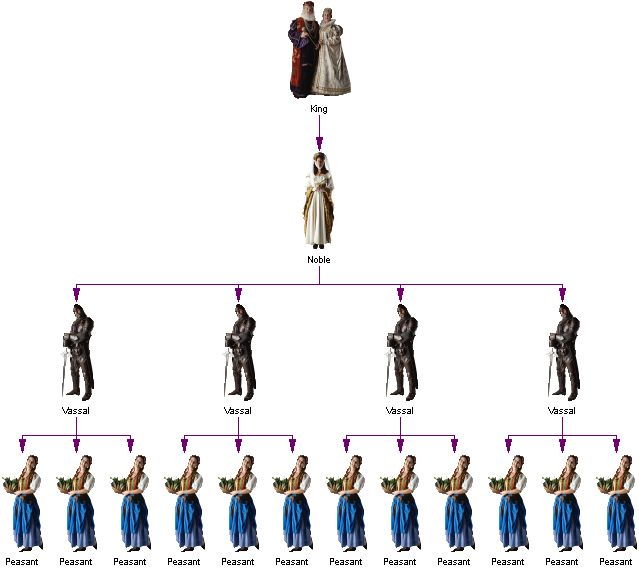
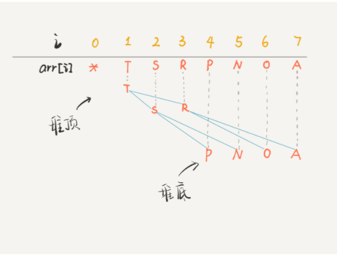
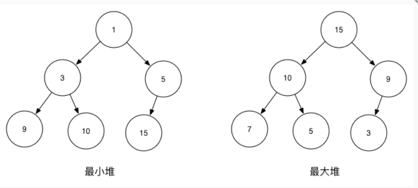
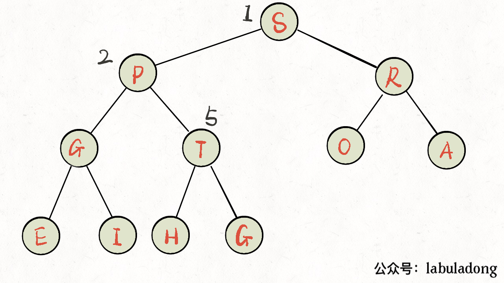

# 堆的概念：

堆(heap)又被为优先队列(priority queue). 尽管名为优先队列，但堆并不是队列。在[队列](http://www.cnblogs.com/vamei/archive/2013/03/15/2961729.html)中，我们可以进行的限定操作是dequeue和enqueue。dequeue是按照进入队列的先后顺序来取出元素。而在堆中，我们不是按照元素进入队列的先后顺序取出元素的,而是按照元素的优先级取出元素。

这就好像候机的时候，无论谁先到达候机厅，总是头等舱的乘客先登机，然后是商务舱的乘客，最后是经济舱的乘客。每个乘客都有头等舱、商务舱、经济舱三种个键值(key)中的一个。头等舱->商务舱->经济舱依次享有从高到低的优先级。



Linux内核中的调度器(scheduler)会按照各个进程的优先级来安排CPU执行哪一个进程。计算机中通常有多个进程，每个进程有不同的优先级(该优先级的计算会综合多个因素，比如进程所需要耗费的时间，进程已经等待的时间，用户的优先级，用户设定的进程优先程度等等)。内核会找到优先级最高的进程，并执行。如果有优先级更高的进程被提交，那么调度器会转而安排该进程运行。优先级比较低的进程则会等待。“堆”是实现调度器的理想数据结构。

(Linux中可以使用nice命令来影响进程的优先级)

## 总结

堆就是用数组实现的二叉树，所以它没有使用父指针或者子指针。堆根据“堆属性”来排序，“堆属性”决定了树中节点的位置。

n个元素序列 { k1, k2, k3, k4, k5, k6 …. kn } 当且仅当满足以下关系时才会被称为堆：

```
ki <= k2i,ki <= k2i+1 或者 ki >= k2i,ki >= k2i+1 (i = 1,2,3,4 .. n/2)
```

如果数组的下表是从0开始，那么需要满足

```
ki <= k2i+1,ki <= k2i+2 或者 ki >= k2i+1,ki >= k2i+2 (i = 0,1,2,3 .. n/2)
```

比如 { 1,3,5,10,15,9 } 这个序列就满足 [1 <= 3; 1 <= 5], [3 <= 10; 3 <= 15], [5 <= 9] 这3个条件，这个序列就是一个堆。

所以堆其实是一个序列(数组)，如果这个序列满足上述条件，那么就把这个序列看成堆。

## 二叉堆概览

首先，二叉堆和二叉树有啥关系呢，为什么人们总数把二叉堆画成一棵二叉树？

因为，二叉堆其实就是一种特殊的二叉树（完全二叉树），只不过存储在数组里。一般的链表二叉树，我们操作节点的指针，而在数组里，我们把数组索引作为指针：

```java
// 父节点的索引
int parent(int root){
    return root / 2;
}
// 左孩子的索引
int left(int root) {
    return root * 2;
}
// 右孩子的索引
int right(int root) {
    return root * 2 + 1;
}
```


堆的实现通常是通过构造二叉堆，因为二叉堆应用很普遍，当不加限定时，堆通常指的就是二叉堆。



你看到了，把 arr[1] 作为整棵树的根的话，每个节点的父节点和左右孩子的索引都可以通过简单的运算得到，这就是二叉堆设计的一个巧妙之处。为了方便讲解，下面都会画的图都是二叉树结构，相信你能把树和数组对应起来。

二叉堆还分为最大堆和最小堆。**最大堆的性质是：每个节点都大于等于它的两个子节点。**类似的，最小堆的性质是：每个节点都小于等于它的子节点。

# 堆的实现

堆的一个经典的实现是完全二叉树(complete binary tree)。这样实现的堆成为二叉堆(binary heap)。

二叉堆是一种特殊的堆，是一棵完全二叉树或者是近似完全二叉树，同时二叉堆还满足堆的特性：父节点的键值总是保持固定的序关系于任何一个子节点的键值，且每个节点的左子树和右子树都是一个二叉堆。

当父节点的键值总是大于或等于任何一个子节点的键值时为**最大堆**。 当父节点的键值总是小于或等于任何一个子节点的键值时为**最小堆**。



上图中的最小堆对应的序列是： [1,3,5,9,10,15] 满足最小堆的特性(父节点的键值小于或等于任何一个子节点的键值，并且也满足堆的性质 [1 <= 3; 1 <= 5], [3 <= 9; 3 <= 10], [5 <= 15])

上图中的最大堆对应的序列是： [15,10,9,7,5,3] 满足最大堆的特性(父节点的键值大于或等于任何一个子节点的键值，并且也满足堆的性质 [15 >= 10; 15 >= 9], [10 >= 7; 10 >= 5], [9 >= 3])

两种堆核心思路都是一样的，本文以最大堆为例讲解。

对于一个最大堆，根据其性质，显然堆顶，也就是 arr[1] 一定是所有元素中最大的元素。

## 优先级队列概览

优先级队列这种数据结构有一个很有用的功能，你插入或者删除元素的时候，元素会自动排序，这底层的原理就是二叉堆的操作。

数据结构的功能无非增删查该，优先级队列有两个主要 API，分别是 insert 插入一个元素和 delMax 删除最大元素（如果底层用最小堆，那么就是 delMin）。

下面我们实现一个简化的优先级队列，先看下代码框架：

```java
public class MaxPq<T extends Comparable> {
    /**
     * 存储元素的数组
     */
    private T[] pq;
    /**
     * 当前 Priority Queue 中的元素个数
     */
    private int N = 0;
    public MaxPq(int cap) {
        // 索引 0 不用，所以多分配一个空间
        pq = (T[]) new Comparable[cap + 1];
    }
    /**
     * 返回当前队列中最大元素
     * @return
     */
    public T max(){
        return pq[1];
    }
    /* 插入元素 e */
    public void insert(T e) {
        //.....
    }
    /* 删除并返回当前队列中最大元素 */
    public T delMax() {
        //...
        return null;
    }
    /* 上浮第 k 个元素，以维护最大堆性质 */
    private void swim(int k) {
        //...
    }
    /* 下沉第 k 个元素，以维护最大堆性质 */
    private void sink(int k) {
        //...
    }
    /* 交换数组的两个元素 */
    private void exch(int i, int j) {
        T temp = pq[i];
        pq[i] = pq[j];
        pq[j] = temp;
    }
    /* pq[i] 是否比 pq[j] 小？ */
    private boolean less(int i, int j) {
        return pq[i].compareTo(pq[j]) < 0;
    }
    /* 还有 left, right, parent 三个方法 */
}
```

## 实现 swim 和sink 	

为什么要有**上浮 swim**  和 **下沉 sink**  的操作呢？为了维护堆结构。

我们要讲的是最大堆，每个节点都比它的两个子节点大，但是在插入元素和删除元素时，难免破坏堆的性质，这就需要通过这两个操作来恢复堆的性质了。

对于最大堆，会破坏堆性质的有有两种情况：

- 如果某个节点 A 比它的子节点（中的一个）小，那么 A 就不配做父节点，应该下去，下面那个更大的节点上来做父节点，这就是对 A 进行 **下沉**。
- 如果某个节点 A 比它的父节点大，那么 A 不应该做子节点，应该把父节点换下来，自己去做父节点，这就是对 A 的 **上浮**。

当然，错位的节点 A 可能要上浮（或下沉）很多次，才能到达正确的位置，恢复堆的性质。所以代码中肯定有一个 `while` 循环。

细心的读者也许会问，这两个操作不是互逆吗，所以上浮的操作一定能用下沉来完成，为什么我还要费劲写两个方法？

是的，操作是互逆等价的，但是最终我们的操作只会在堆底和堆顶进行（等会讲原因），显然堆底的「错位」元素需要上浮，堆顶的「错位」元素需要下沉。

### 上浮 swim 实现代码

```java
private void swim(int k) {
    // 如果浮到堆顶，就不能再上浮了
    while (k > 1 && less(parent(k), k)) {
        // 如果第 k 个元素比上层大
        // 将 k 换上去
        exch(parent(k), k);
        k = parent(k);
    }
}
```

如下图:



### **下沉的代码实现**

下沉比上浮略微复杂一点，因为上浮某个节点 A，只需要 A 和其父节点比较大小即可；但是下沉某个节点 A，需要 A 和其两个子节点比较大小，如果 A 不是最大的就需要调整位置，要把较大的那个子节点和 A 交换。

```java
private void sink(int k) {
    // 如果沉到堆底，就沉不下去了
    while (left(k) <= N) {
        // 先假设左边节点较大
        int older = left(k);
        // 如果右边节点存在，比一下大小
        if (right(k) <= N && less(older, right(k)))
            older = right(k);
        // 结点 k 比俩孩子都大，就不必下沉了
        if (less(older, k)) break;
        // 否则，不符合最大堆的结构，下沉 k 结点
        exch(k, older);
        k = older;
    }
}
```

如下图:


至此，二叉堆的主要操作就讲完了，一点都不难吧，代码加起来也就十行。明白了 `sink` 和 `swim` 的行为，下面就可以实现优先级队列了。

## 实现 delMax 和 insert

这两个方法就是建立在 `swim` 和 `sink` 上的。

**`insert` 方法先把要插入的元素添加到堆底的最后，然后让其上浮到正确位置。**


```java
public void insert(Key e) {
    N++;
    // 先把新元素加到最后
    pq[N] = e;
    // 然后让它上浮到正确的位置
    swim(N);
}
```

**`delMax` 方法先把堆顶元素 A 和堆底最后的元素 B 对调，然后删除 A，最后让 B 下沉到正确位置。**

```java
public Key delMax() {
    // 最大堆的堆顶就是最大元素
    Key max = pq[1];
    // 把这个最大元素换到最后，删除之
    exch(1, N);
    pq[N] = null;
    N--;
    // 让 pq[1] 下沉到正确位置
    sink(1);
    return max;
}
```


至此，一个优先级队列就实现了，插入和删除元素的时间复杂度为 O(logK)O(logK)，KK 为当前二叉堆（优先级队列）中的元素总数。因为我们时间复杂度主要花费在 sink 或者 swim 上，而不管上浮还是下沉，最多也就树（堆）的高度，也就是 log 级别。

# 总结

二叉堆就是一种完全二叉树，所以适合存储在数组中，而且二叉堆拥有一些特殊性质。

二叉堆的操作很简单，主要就是上浮和下沉，来维护堆的性质（堆有序），核心代码也就十行。

优先级队列是基于二叉堆实现的，主要操作是插入和删除。插入是先插到最后，然后上浮到正确位置；删除是调换位置后再删除，然后下沉到正确位置。核心代码也就十行。