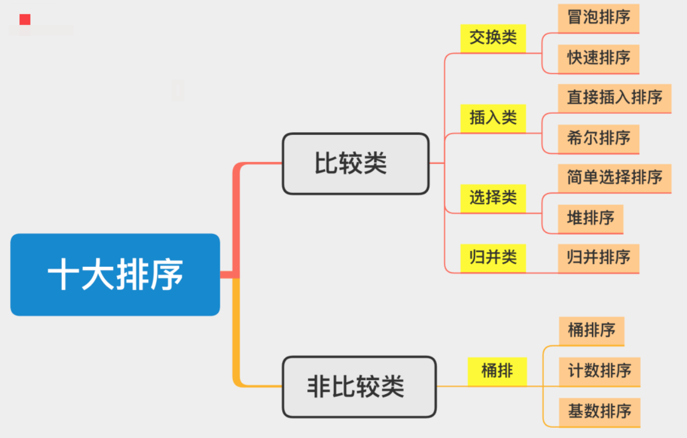
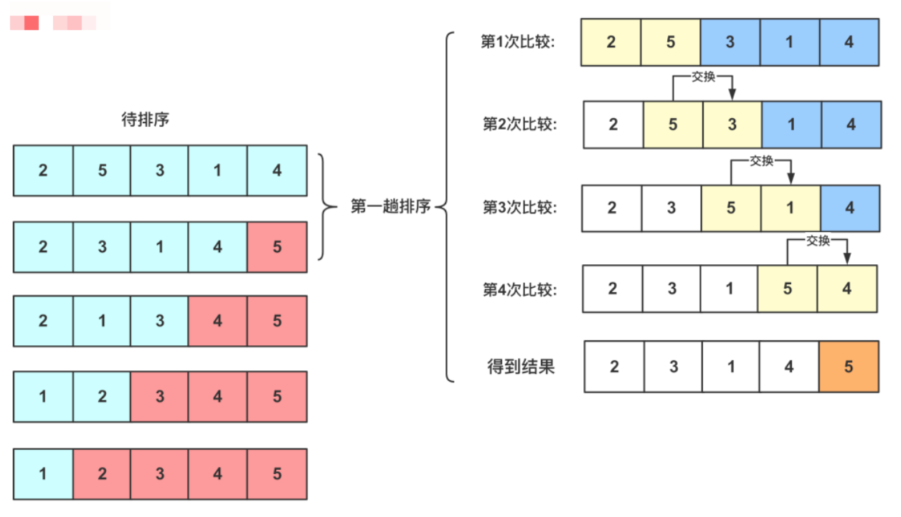
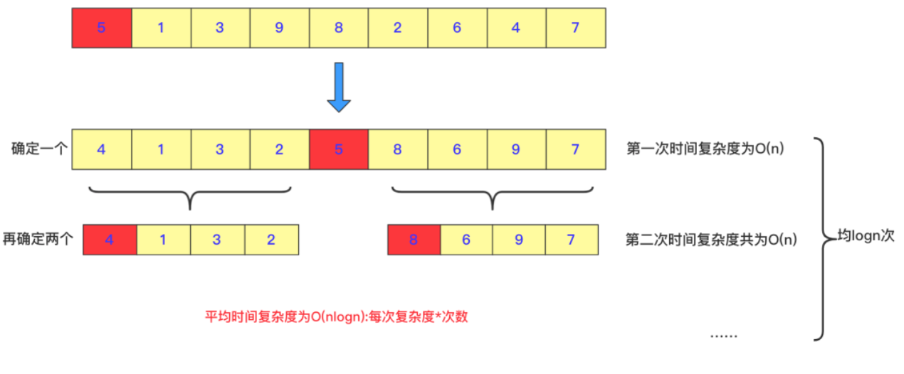
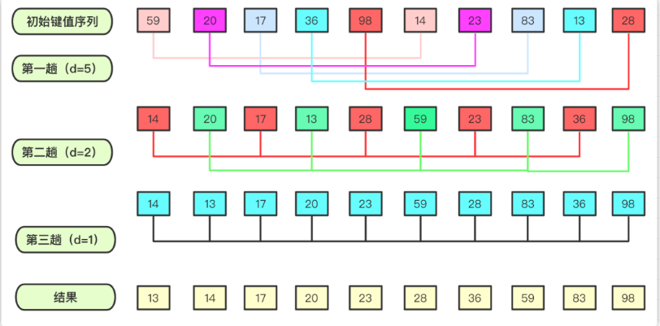
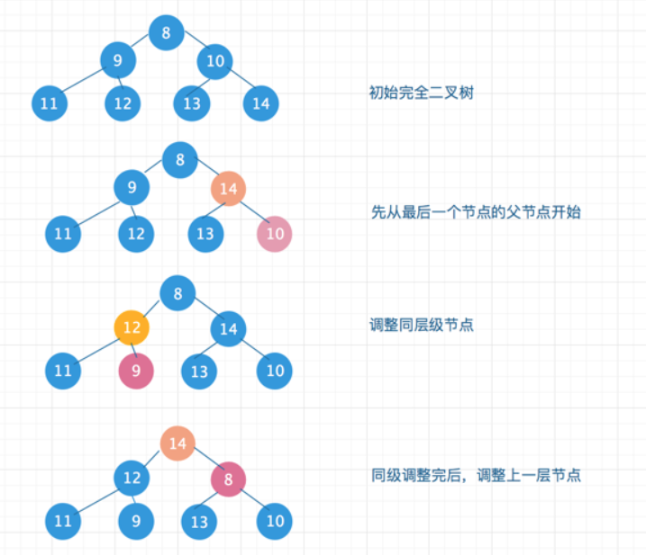
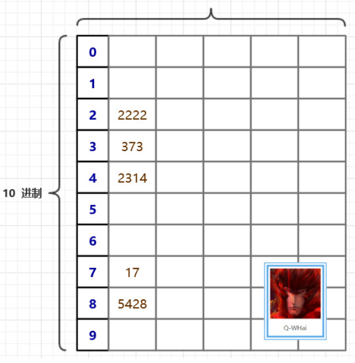
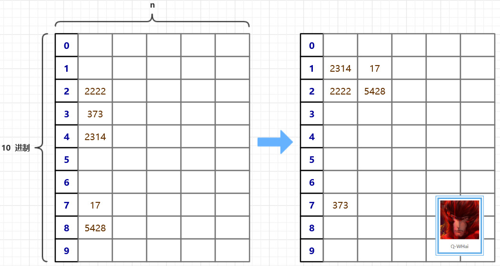
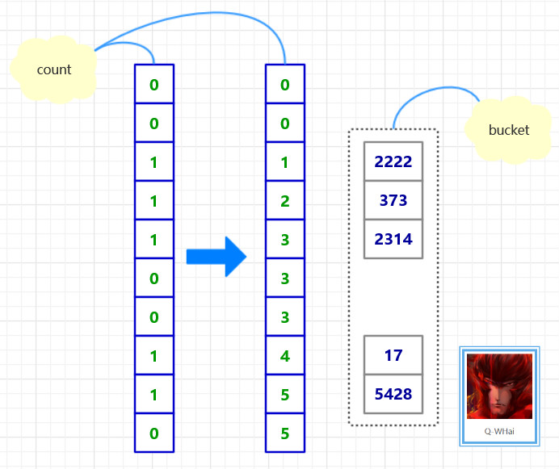
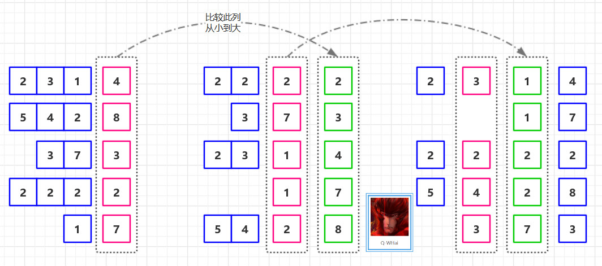
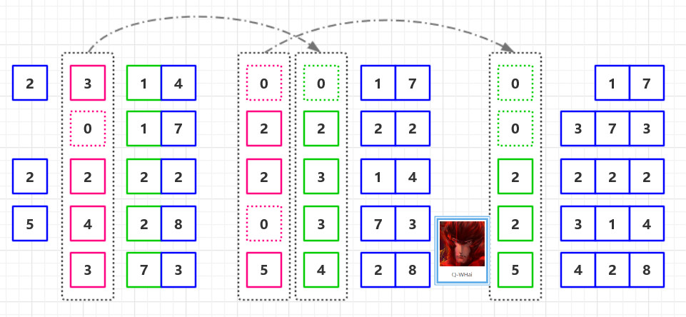

# 十大排序算法




## 十大算法的复杂度


# 比较排序

## 交换类

### 冒泡排序

交换排序的典型，也是快排思想的基础，冒泡排序是一种稳定排序算法。

- 时间复杂度：O(n^2).
- 基本思想：**循环遍历多次，每次从前往后把大元素往后调，每次确定一个最大（最小）元素，多次后达到排序序列。（或者从后往前把小元素往前调）**

#### 算法思想：

1. 比较相邻的元素。如果第一个比第二个大，就交换他们两个。
2. 对每一对相邻元素作同样的工作，从开始第一对到结尾的最后一对。这步做完后，最后的元素会是最大的数。
3. 针对所有的元素重复以上的步骤，除了最后一个。
4. 持续每次对越来越少的元素重复上面的步骤，直到没有任何一对数字需要比较。


##### 实现思路

- 从第一个元素开始往后遍历，每一个位置判断是否比后面的元素大，如果比后面的元素大，那么就交换两者大小，然后继续向后，这样的话进行一轮之后就可以保证**「最大的那个数被交换交换到最末的位置可以确定」**。
- 第二次同样从开始起向后判断着前进，如果当前位置比后面一个位置更大的那么就和他后面的那个数交换。但是有点注意的是，这次并不需要判断到最后，只需要判断到倒数第二个位置就行(因为第一次我们已经确定最大的在倒数第一，这次的目的是确定倒数第二)
- 同理，后面的遍历长度每次减一，直到第一个元素使得整个元素有序。



代码实现：

```python
def bubble_sort(arr):
    """
    冒泡算法
    :return:
    """
    length = len(arr)
    # 第一层遍历(表示比较的次数)
    for i in range(length):
        # 数据处理
        for j in range(1, length - i):
            if arr[j - 1] > arr[j]:
                # 两者交换数据，这里没用temp，因为python 特性： 元组
                arr[j - 1], arr[j] = arr[j], arr[j - 1]

    return arr


def bubble_sort_flag(arr):
    """
    带标记的排序算法
    :param arr:
    :return:
    """
    length = len(arr)
    for index in range(length):
        flag = True
        for j in range(1,length-index):
            if arr[j-1] > arr[j]:
                arr[j],arr[j-1] = arr[j-1], arr[j]
                flag = False
        # 表示排序已经完成，则直接退出
        if flag:
            return arr
    return arr
```


### 快速排序

快速排序是对冒泡排序的一种改进，采用递归分制的方法进行求解。快速排序是一种不稳定的排序方法。

- 时间复杂度：最坏是O(n^2)，平均时间复杂度为O(nlogn),最好情况的时间复杂度为O(nlogn)

##### 基本思想

- 从数列中挑出一个元素，称为”基准”（pivot），
- 重新排序数列，所有元素比基准值小的摆放在基准前面，所有元素比基准值大的摆在基准的后面（相同的数可以到任一边）。在这个分区结束之后，该基准就处于数列的中间位置。这个称为分区（partition）操作。
- 递归地（recursive）把小于基准值元素的子数列和大于基准值元素的子数列排序。

##### 算法思想：

1. 选取第一个数为基准 
2. 将比基准小的数交换到前面，比基准大的数交换到后面 
3. 对左右区间重复第二步，直到各区间只有一个数




##### 代码实现

```python
def quick_sort(arr):
    """
    快速排序
    1. 从数列中挑出一个元素，称为”基准”（pivot），
    2. 重新排序数列，所有元素比基准值小的摆放在基准前面，所有元素比基准值大的摆在基准的后面（相同的数可以到任一边）。在这个分区结束之后，该基准就处于数列的中间位置。这个称为分区（partition）操作。
    3. 递归地（recursive）把小于基准值元素的子数列和大于基准值元素的子数列排序。
    :param arr:
    :param left:
    :param right:
    :return:
    """
    # 比基准小的数组
    less = []
    # 比基准大的数组
    more = []
    # 等于基准数据的集合
    pivotList = []

    # 跳出递归的节点
    if len(arr) <= 1:
        return arr
    else:
        # 将第一个值作为基准节点
        pivote = arr[0]
        for i in arr:
            # 将 比基准小的放到 less 数组
            if i < pivote:
                less.append(i)
            elif i > pivote:  # 比基准大的放到more 节点
                more.append(i)
            else:  # 等于基准的放到 pivoteList
                pivotList.append(i)
        # 对less数列和more数列继续进行排序
        less = quick_sort(less)
        more = quick_sort(more)
        #  最终结果拼接
        return less + pivotList + more


def quick_sort2(arr, left, right):
    """
    1. 快排需要将序列变成两个部分，就是「序列左边全部小于一个数」，「序列右面全部大于一个数」，
    然后利用递归的思想再将左序列当成一个完整的序列再进行排序，同样把序列的右侧也当成一个完整的序列进行排序。
    2. 其中这个数在这个序列中是可以随机取的，可以取最左边，可以取最右边，当然也可以取随机数。但是「通常」不优化情况我们取最左边的那个数
    :param arr:  原始数组
    :param left: 起始位置:默认 0
    :param right: 数组的长度 -1
    :return:
    """
    low = left
    high = right
    if low > high:  # 下面两句的顺序一定不能混，否则会产生数组越界！
        return
    # 额外空间temp，取最左侧的一个作为衡量，最后要求左侧都比它小，右侧都比它大。
    temp = arr[low]
    # 这一轮要求把左侧小于temp,右侧大于temp。
    while low < high:
        # 右侧找到第一个小于temp的停止
        while low < high and arr[high] > temp:
            high -= 1
        arr[low] = arr[high]
        # 左侧找到第一个大于 temp 的值停止
        while low < high and arr[low] < temp:
            low += 1
        arr[high] = arr[low]

    # 赋值然后左右递归分治求之
    arr[low] = temp
    quick_sort2(arr, left, low - 1)
    quick_sort2(arr, low + 1, right)
```


## 插入类

### 直接插入排序

直接插入排序在所有排序方法中是最简单的排序方法之一。

- 时间复杂度：遍历比较时间复杂度是每次O(n),交换的时间复杂度每次也是O(n),那么n次总共的时间复杂度就是O(n^2)
- 基本思想：从前往后，按照大小顺序排序，从第一个开始，如果前面有比自己大的，就继续寻找，直到前面的数据比自己小，插入改位置。直到最后一个元素插入完成。

##### 具体步骤：


方式1:

1. 从第一个元素开始，该元素可以认为已经被排序
2. 取出下一个元素，在已经排序的元素序列中从后向前扫描
3. 如果该元素（已排序）大于新元素，将该元素移到下一位置
4. 重复步骤3，直到找到已排序的元素小于或者等于新元素的位置
5. 将新元素插入到该位置后
6. 重复步骤2~5


方式2:


- 选取当前位置(当前位置前面已经有序) 目标就是将当前位置数据插入到前面合适位置。
- 向前枚举或者二分查找，找到待插入的位置。
- 移动数组，赋值交换，达到插入效果。

```python
def insert_sort(arr):
    """
    快速排序
    1. 选取当前位置(当前位置前面已经有序) 目标就是将当前位置数据插入到前面合适位置。
    2. 向前枚举或者二分查找，找到待插入的位置。
    3. 移动数组，赋值交换，达到插入效果。
    :param arr:
    :return:
    """
    if len(arr) == 0:
        return
    length = len(arr)
    for i in range(1, length):
        temp = arr[i]  # 取第二个值为当前值
        for j in range(i - 1, -1, -1):  # 循环 i-1 个元素
            if arr[j] > temp:  # 如果 比 temp 大，则 将arr[j] 赋值给 arr[j+1], arr[j] 赋值为temp
                arr[j + 1], arr[j] = arr[j], temp
                print(arr)  # 打印当前需要排序的数组
            else:  # j 前面的数据都是排好序的，所以，只要arr[j]比 temp小，则 j-- 都比 temp 小
                break
                
def insert_sort2(arr):
    """
    1. 从第一个元素开始，该元素可以认为已经被排序
    2. 取出下一个元素，在已经排序的元素序列中从后向前扫描
    3. 如果该元素（已排序）大于新元素，将该元素移到下一位置
    4. 重复步骤3，直到找到已排序的元素小于或者等于新元素的位置
    5. 将新元素插入到该位置后
    6. 重复步骤2~5
    :param arr:
    :return:
    """
    length = len(arr)
    if length == 0:
        return
    for i in range(1, length):
        # 后一个元素和前一个元素比较
        # 如果比前一个小
        if arr[i] < arr[i - 1]:
            # 将这个数取出
            temp = arr[i]
            index = 1  # 保存下标
            # 从后往前依次比较每个元素
            for j in range(i - 1, -1, -1):
                # 和比取出元素大的元素交换
                if arr[j] > temp:
                    arr[j + 1] = arr[j]
                    index = j
                else:
                    break
            # 插入元素
            arr[index] = temp
```

### 希尔排序

希尔排序，也称递减增量排序算法，是插入排序的一种更高效的改进版本。但希尔排序是非稳定排序算法。先将整个待排序的记录序列分割成为若干子序列分别进行直接插入排序.



##### 算法思想

1. 选择一个增量序列t1，t2，…，tk，其中ti>tj，tk=1；
2. 按增量序列个数k，对序列进行k 趟排序；
3. 每趟排序，根据对应的增量ti，将待排序列分割成若干长度为m 的子序列，分别对各子表进行直接插入排序。仅增量因子为1 时，整个序列作为一个表来处理，表长度即为整个序列的长度。

#####　原理


希尔排序，也称递减增量排序算法，是插入排序的一种更高效的改进版本。希尔排序是非稳定排序算法。

希尔排序是基于插入排序的以下两点性质而提出改进方法的：

1. 插入排序在对几乎已经排好序的数据操作时，效率高，即可以达到线性排序的效率
2. 但插入排序一般来说是低效的，因为插入排序每次只能将数据移动一位。

##### 步骤

每次以一定步长(就是跳过等距的数)进行排序，直至步长为1.

步长使用的是Donald Shell的建议，另外步长还可以使用Sedgewick提出的(1, 5, 19, 41, 109,…)。
也可以使用[斐波那契数列](https://link.zhihu.com/?target=https%3A//zh.wikipedia.org/wiki/%E6%96%90%E6%B3%A2%E9%82%A3%E5%A5%91%E6%95%B0%E5%88%97)除去0和1将剩余的数以黄金分区比的两倍的幂进行运算得到的数列。

##### 代码实现

```python
def shell_sort(arr):
    """
    希尔排序:
    1. 计算初始步长 (arr的长度除于 2)
    2. 当步长 大于 1时,循环处理
    3. 以步长为初始值,结束值为数组的长度,循环arr
    4. 当 当前值 i - d 大于 等于 0时,按照插入法 排序 步长为 d 的数据
    5. 修改步长
    :param arr:
    :return:
    """
    length = len(arr)  # 数组的长度
    # 初始的步长 ('//' 整除,返回整数结果)
    d = length // 2
    while d >= 1:  # 当步长 大于等于 1 时
        for i in range(d, length, 1):
            temp = arr[i]
            j = i - d
            while j >= 0:  # 按照指定的步长将数据按照插入法排序
                if arr[j] > temp:
                    arr[j + d] = arr[j]
                    arr[j] = temp
                j -= d
        d //= 2  # 步长再次折半
      
def shell_sort2(arr):
    """
    1.选择一个增量序列t1，t2，…，tk，其中ti>tj，tk=1；
    2.按增量序列个数k，对序列进行k 趟排序；
    3.每趟排序，根据对应的增量ti，将待排序列分割成若干长度为m 的子序列，分别对各子表进行直接插入排序。仅增量因子为1 时，整个序列作为一个表来处理，表长度即为整个序列的长度。
    :param arr:
    :return:
    """
    length = len(arr)
    # 增量序列计算逻辑
    h = 1
    while h < length // 3:
        h = 3 * h + 1
    # 如果增量序列大于 1
    while h >= 1:
        # 以增量序列为开始，对数组进行排序
        for i in range(h, length - 1, 1):
            j = i
            # 对截取数据按照 步长 h 进行排序
            while j >= h:
                if arr[j] < arr[j - h]:
                    arr[j - h], arr[j] = arr[j], arr[j - h]
                j -= h
        # 调整增量大小
        h = h // 3

```


## 选择类

### 简单选择类排序

选择排序（Selection sort）是一种简单直观的排序算法。它的工作原理大致是将后面的元素最小元素一个个取出然后按顺序放置。


#### 算法思想

1. 在未排序序列中找到最小（大）元素，存放到排序序列的起始位置
2. 从剩余未排序元素中继续寻找最小（大）元素，然后放到已排序序列的末尾
3. 以此类推，直到所有元素均排序完毕

#### 代码实现

```python
def selection_sort(arr):
    """
    选择排序
    1. 在未排序序列中找到最小（最大）元素，存放到排序序列的起始位置
    2. 然后再从剩余的未排序序列中继续寻找最小（最大）元素，然后放到已排序序列的末尾
    3.重复第二步，直到所有元素排序完成
    :param arr:
    :return:
    """
    length = len(arr)

    for i in range(0, length):
        min = i
        for j in range(i + 1, length):
            if arr[j] < arr[min]:
                min = j
                arr[min], arr[i] = arr[i], arr[min]
    return arr


def selection_sort2(arr):
    length = len(arr)
    for i in range(0, length):
        min = i
        temp = arr[i]
        # 找出最小元素的 索引值
        for j in range(i + 1, length):
            if arr[j] < arr[min]:
                min = j
        # temp = arr[i]
        # arr[i] = arr[min]
        # arr[min] = temp
        arr[i], arr[min] = arr[min], temp
    return arr
```


### 堆排序

堆排序（Heapsort）是指利用堆这种数据结构所设计的一种排序算法。堆积是一个近似完全二叉树的结构，并同时满足堆积的性质：即子结点的键值或索引总是小于（或者大于）它的父节点。

#### 最大堆

假设有一个数组 int[] arr = {8,9,10,11,12,13,14};

用它来构建最大堆

##### 基本思路

1. 最大堆或最小堆都是完全二叉树，利用这个性质，先按照数组顺序构建最简单的完全二叉树
2. 从 **最后一个节点的父节点（arr.length / 2 - 1）** 开始 逐次调整位置，开始构建最大堆
   1. 若父节点小于左节点，父节点与左节点互换，继续调整
   2. 若父节点小于右节点，父节点与右节点互换（注意是经过2.1），继续调整

##### 构建示意图



##### 构建最大堆源代码

```java
public static int[] buildHeap(int[] arr) {
        //最后一个非叶子节点： arr.length/2-1
        int index = arr.length / 2 - 1;
        for (int i = index; i >= 0; i--) {
            shiftDown(arr, i, arr.length);
        }
        System.out.println("输出最大堆："+ Arrays.toString(arr));
        return arr;
    }

    /**
     * 调整堆结构
     *
     * @param arr
     * @param index
     * @param size  size 的值必须大于1。 如果小于等于1 则 不会改变任何结构
     */
    public static void shiftDown(int[] arr, int index, int size) {
        //当前节点的左侧孩子节点
        int leftChild = index * 2 + 1;
        // 当前节点的右侧孩子节点
        int rightChild = index * 2 + 2;
        //临时变量，存储当前索引位置
        int temp = index;
        if (leftChild < size && arr[index] < arr[leftChild]) {
            index = leftChild;
        }
        if (rightChild < size && arr[index] < arr[rightChild]) {
            index = rightChild;
        }
        if (temp != index) { //说明父节点小于孩子节点，需要调换位置
            swap(arr, index, temp);
            // 交换后继续向下调整,以index为父节点，继续向下调整
            shiftDown(arr, index, size);
        }
    }

    /**
     * 交换 arr中 索引 i 和 j 位置对应的 值
     *
     * @param arr
     * @param i
     * @param j
     */
    private static void swap(int[] arr, int i, int j) {
        int temp = arr[i];
        arr[i] = arr[j];
        arr[j] = temp;
    }

   /**
     * 堆排序：
     * 1)将已经建立好的大顶堆，每次取出根节点，即最大值。
     * 2)将最后一个节点的值赋给根节点，重新构建大顶堆。
     * 3)删除最后节点的数据
     */
    public static int[] heapSort(int[] arr) {
        for (int i = arr.length - 1; i >= 1; i--) {
            swap(arr, 0, i);
            System.out.println("交换位置后：" + Arrays.toString(arr));
            // 从根节点向下调整，每次取出一个数值，集合长度逐渐减小
            shiftDown(arr, 0, i);
            System.out.println("调整后：" + Arrays.toString(arr));
        }
        return arr;
    }

static int[] arr = {8, 9, 7, 6, 5, 10, 11, 12, 13, 14};

    public static void main(String[] args) {
        //构建大顶堆
        int[] bigHeap = buildHeap(arr);
        heapSort(bigHeap);
        System.out.println("升序排列结果：");
        for (int i = 0; i < arr.length; i++) {
            System.out.print(arr[i] + " ");
        }
    }

 
```

#### 堆排序

##### 基本思路
 1)将已经建立好的大顶堆，每次取根节点，即最大值，并与最后的节点交换。
 2)重新构建大顶堆，注意索引是从 `int i = arr.length - 1` 开始的，重建大顶堆时，实际上相当于删除了最后一个元素，即删除了刚刚完成第一步交换的最大值。对于数组来说，刚好是将最大值，固定在最后的索引上。

#### 算法思想：

1. 将初始待排序关键字序列(R1,R2….Rn)构建成大顶堆，此堆为初始的无序区；
2. 将堆顶元素R[1]与最后一个元素R[n]交换，此时得到新的无序区(R1,R2,……Rn-1)和新的有序区(Rn),且满足R[1,2…n-1]<=R[n]；
3. 由于交换后新的堆顶R[1]可能违反堆的性质，因此需要对当前无序区(R1,R2,……Rn-1)调整为新堆，然后再次将R[1]与无序区最后一个元素交换，得到新的无序区(R1,R2….Rn-2)和新的有序区(Rn-1,Rn)。不断重复此过程直到有序区的元素个数为n-1，则整个排序过程完成。

#### 步骤

1. 创建最大堆:将堆所有数据重新排序，使其成为最大堆
2. 最大堆调整:作用是保持最大堆的性质，是创建最大堆的核心子程序
3. 堆排序:移除位在第一个数据的根节点，并做最大堆调整的递归运算

```python
def heap_sort(arr):
    # 创建最大堆
    for start in range((len(arr) - 2) // 2, -1, -1):
        shift_down(arr, start, len(arr) - 1)
        print('第一次：%s' % arr)
    # 堆排序
    for end in range(len(arr) - 1, 0, -1):
        arr[0], arr[end] = arr[end], arr[0]
        print('排序后调整前：%s' % arr)
        shift_down(arr, 0, end - 1)
        print('堆排序后调整后：%s' % arr)
    return arr


def shift_down(arr, start, end):
    """
    最大堆调整
    :param arr:
    :param start:
    :param end:
    :return:
    """
    root = start
    while True:
        child = 2 * root + 1
        if child > end:
            break
        if child + 1 <= end and arr[child] < arr[child + 1]:
            child += 1
        if arr[root] < arr[child]:
            arr[root], arr[child] = arr[child], arr[root]
            root = child
        else:
            break
```


### 并归类

#### 归并排序

归并排序是建立在归并操作上的一种有效的排序算法。该算法是采用分治法（Divide and Conquer）的一个非常典型的应用。将已有序的子序列合并，得到完全有序的序列；即先使每个子序列有序，再使子序列段间有序。若将两个有序表合并成一个有序表，称为2-路归并。


- 时间复杂度: O(nlogn)
- 稳定的算法(排序过程中大小相同的元素能够保持排序前的顺序，3212升序排序结果是1223，排序前后两个2的顺序不变)
- 归并排序需要O(n)的辅助空间，而与之效率相同的快排和堆排分别需要O(logn)和O(1)的辅助空间，在同类算法中归并排序的空间复杂度略高

(1）稳定性
　归并排序是一种稳定的排序。

（2）存储结构要求
　可用顺序存储结构。也易于在链表上实现。
（3）时间复杂度
　对长度为n的文件，需进行 lgn趟二路归并，每趟归并的时间为O(n)，故其时间复杂度无论是在最好情况下还是在最坏情况下均是O(nlgn)。
（4）空间复杂度
　 需要一个辅助向量来暂存两有序子文件归并的结果，故其辅助空间复杂度为O(n)，显然它不是就地排序。

##### 算法思想

> 无序 ->  部分有序  ->  整体有序

1. 把长度为n的输入序列分成两个长度为n/2的子序列；
2. 对这两个子序列分别采用归并排序；
3. 将两个排序好的子序列合并成一个最终的排序序列。

##### 代码实现

```python
def merger_sort(arr):
    """
    归并排序:
    ①进行两两归并使记录关键字有序，
    ②得到 n/2 个长度为 2 的有序子表；
    ③重复第②步直到所有记录归并成一个长度为 n 的有序表为止。
    此算法的实现不像图示那样简单，现分三步来讨论。首先从宏观上分析，首先让子表表长 L=1 进行处理；
    不断地使 L=2*L ，进行子表处理，直到 L>=n 为止，把这一过程写成一个主体框架函数 mergesort 。
    :param arr:
    :return:
    """
    # sort(arr, 0, len(arr) - 1)
    sort2(arr)


def sort2(arr):
    """
    非递归方式
    :param arr:
    :return:
    """
    length = len(arr)
    # 步长
    step = 2
    while step <= length:
        i = 0  # 起始位置
        while (step + i) <= length:
            # 需要合并的数组长度
            curr_length = i + step
            # 中间索引
            center = i + step // 2 - 1
            merge(arr, i, center, curr_length - 1)
            i += step
        # 处理末尾残余部分
        merge(arr, i, i + step // 2 - 1, length - 1)
        # 调整步长
        step *= 2
    # 最后再从头处理一遍
    merge(arr, 0, step // 2 - 1, length - 1)


def sort(arr, left, right):
    """
    采用递归方式排序
    :param arr:
    :param left:
    :param right:
    :return:
    """
    if left >= right:
        return
    # 找出中间索引
    center = (left + right) // 2
    # 对左边数组进行递归
    sort(arr, left, center)
    # 对右边数组进行递归
    sort(arr, center + 1, right)
    #  合并
    merge(arr, left, center, right)


def merge(arr, left, center, right):
    """
    合并操作
    :param arr: 数组对象
    :param left: 左数组的第一个元素的索引
    :param center: 左数组的最后一个元素的索引, center+1 是右数组的第一个元素的索引
    :param right: 右数组的最有一个元素的索引
    :return:
    """
    # 临时数组
    temp_arr = [None] * len(arr)
    # 右数组第一个元素的索引
    mid_new = center + 1
    # third 记录临时数组的索引
    third = left
    # 缓存左侧数组第一个元素的索引
    temp = left
    while left <= center and mid_new <= right:
        # 从两个数组中取出最小的放到临时数组中
        if arr[left] <= arr[mid_new]:
            temp_arr[third] = arr[left]
            left += 1
        else:
            temp_arr[third] = arr[mid_new]
            mid_new += 1
        third += 1

    # 剩余部分依次放入临时数组(以下两个 while 实际上只会执行一个)
    while mid_new <= right:
        temp_arr[third] = arr[mid_new]
        third += 1
        mid_new += 1
    while left <= center:
        temp_arr[third] = arr[left]
        left += 1
        third += 1
    # 将临时数组中的内容拷贝回原数组(原 left - right 范围内的内容被拷贝回原数组)
    while temp <= right:
        arr[temp] = temp_arr[temp]
        temp += 1

    print('合并后:%s' % arr)
```


## 非比较排序

### 桶排

#### 计数排序

计数排序统计小于等于该元素值的元素的个数i，于是该元素就放在目标数组的索引i位（i≥0）。

计数排序基于一个假设，待排序数列的所有数均为整数，且出现在（0，k）的区间之内。

如果 k（待排数组的最大值） 过大则会引起较大的空间复杂度，一般是用来排序 0 到 100 之间的数字的最好的算法，但是它不适合按字母顺序排序人名。

计数排序不是比较排序，排序的速度快于任何比较排序算法。

##### 算法思想

1. 找出待排序的数组中最大和最小的元素；
2. 统计数组中每个值为 i 的元素出现的次数，存入数组 C 的第 i 项；
3. 对所有的计数累加（从 C 中的第一个元素开始，每一项和前一项相加）；
4. 填充目标数组：将每个元素 i 放在新数组的第 C[i] 项，每放一个元素就将 C[i] 减去 1；


##### 算法步骤

**第一步**：找出原数组中元素值最大的，记为`max`。

**第二步**：创建一个新数组`count`，其长度是`max`加1，其元素默认值都为0。

**第三步**：遍历原数组中的元素，以原数组中的元素作为`count`数组的索引，以原数组中的元素出现次数作为`count`数组的元素值。

**第四步**：创建结果数组`result`，起始索引`index`。

**第五步**：遍历`count`数组，找出其中元素值大于0的元素，将其对应的索引作为元素值填充到`result`数组中去，每处理一次，`count`中的该元素值减1，直到该元素值不大于0，依次处理`count`中剩下的元素。

**第六步**：返回结果数组`result`

##### 代码实现

```python
def count_sort(arr):
    """
    计数排序:
    1. 找出待排序的数组中最大和最小的元素
    2. 统计数组中每个值为i的元素出现的次数，存入数组 C 的第 i 项
    3. 对所有的计数累加（从C中的第一个元素开始，每一项和前一项相加）
    4. 反向填充目标数组：将每个元素i放在新数组的第C(i)项，每放一个元素就将C(i)减去1
    :param arr:
    :return:
    """
    max = 0
    min = 1000
    # 获取最大值和最小值
    for i in arr:
        if i < min:
            min = i
        if i > max:
            max = i
    # 创建数组C
    count_length = max - min + 1
    count = [0] * count_length
    for index in arr:
        count[index - min] += 1
    index = 0
    # 添值
    # 循环 max-min+ 1 次(即:count 的数组长度次)
    for a in range(count_length):
        for c in range(count[a]): # 填充 count[a] > 0 的值, 而且循环 count[a] 次
            # 值为  a + min
            arr[index] = a + min
            index += 1
    return arr
```


#### 桶排序

将值为i的元素放入i号桶，最后依次把桶里的元素倒出来。

桶排序是计数排序的扩展版本，计数排序可以看成每个桶只存储相同元素，而桶排序每个桶存储一定范围的元素，通过映射函数，将待排序数组中的元素映射到各个对应的桶中，对每个桶中的元素进行排序，最后将非空桶中的元素逐个放入原序列中。

桶排序需要尽量保证元素分散均匀，否则当所有数据集中在同一个桶中时，桶排序失效。


##### 复杂度分析

- 时间复杂度: 时间复杂度：O(N + C)
- 空间复杂度: 额外空间复杂度：O(N + M)

- 稳定性:桶排序的稳定性取决于桶内排序使用的算法。

##### 算法思想

1. 设置一个定量的数组当作空桶子。
2. 寻访序列，并且把项目一个一个放到对应的桶子去。
3. 对每个不是空的桶子进行排序。
4. 从不是空的桶子里把项目再放回原来的序列中。


##### 代码实现

```python
def bucket_sort(arr, bucket_size):
    """
    桶排序
    1.设置一个定量的数组当作空桶子。
    2.寻访序列，并且把项目一个一个放到对应的桶子去。
    3.对每个不是空的桶子进行排序。
    4.从不是空的桶子里把项目再放回原来的序列中。
    :param arr:
    :param bucket_size:
    :return:
    """
    if len(arr) == 0:
        return arr
    min = arr[0]
    max = arr[0]
    # 获取原始数据中的最大值和最小值
    for item in arr:
        if item < min:
            min = item
        elif item > max:
            max = item
    # 初始化桶
    default_bucket_size = 5  # 桶的初始化大小为 5
    # 桶的最终大小
    bucket_size = bucket_size or default_bucket_size
    # 桶的数量
    bucket_count = (max - min) // bucket_size + 1
    # 创建空桶
    buckets = [[] * bucket_size for _ in range(bucket_count)]
    # 利用映射函数将数据分配到各个桶中
    for i in range(len(arr)):
        index = (arr[i] - min) // bucket_size
        buckets[index].append(arr[i])

    # 清空原始数组
    arr.clear()
    # 对每个桶进行插入排序
    for bucket in buckets:
        insert_sort(bucket)  # 插入排序
        # 将排序好的 数据插入到 arr中
        for item in bucket:
            arr.append(item)
    return arr


def bucket_sort2(arr):
    max_value = arr[0]
    min_value = arr[0]
    # 获取最大值和最小值
    for i in arr:
        min_value = min(i, min_value)
        max_value = max(i, max_value)
    print('最大值: %s' % max_value)
    print('最小值:%s' % min_value)

    # 计算 桶的数量
    bucket_num = (max_value - min_value) // len(arr) + 1
    # 创建桶
    buckets = [[] for _ in range(bucket_num)]
    # 将每个元素按照一定的规则放到对应的桶中
    for i in range(len(arr)):
        # 桶的位置 index = (当前值-最小值)除以 数组长度 求整
        index = (arr[i] - min_value) // len(arr)
        buckets[index].append(arr[i])

    # 将原始数组清空
    arr.clear()
    # 对每个桶中的元素排序
    # 将桶中的元素放到原始数组
    for bucket in buckets:
        bubble_sort(bucket)
        for item in bucket:
            arr.append(item)
    return arr

```


#### 基数排序

一种多关键字的排序算法，可用桶排序实现

**基数排序**(Radix Sort)是在**桶排序**的基础上发展而来的，两种排序都是**分配排序**的高级实现。分配排序(Distributive Sort)的基本思想：排序过程无须比较关键字，而是通过“**分配**”和“**收集**”过程来实现排序。它们的时间复杂度可达到线性阶：`O(n)`。


#### 原理分析



上面这幅图，或许你已经在其他的博客里见到过。这是一个很好的引导跟说明。在基数排序里，我们需要一个很大的二维数组，二维数组的大小是 （10 * n）。10 代表的是我们每个元素的每一位都有 10 种可能，也就是 10 进制数。在上图中，我们是以每个数的个位来代表这个数，于是，5428 就被填充到了第 8 个桶中了。下次再进行填充的时候，就是以十位进行填充，比如 5428 在此时，就会选择以 2 来代表它。



##### 算法优化

在算法的原理中，我们是以一张二维数组的表来存储这些无序的元素。使用二维数组有一个很明显的不足就是二维数组太过稀疏。数组的利用率为 10%。
在寻求优化的路上，我们想到一种可以压缩空间的方法，且时间复杂度并没有偏离得太厉害。那就是设计了两个辅助数组，一个是 count[]，一个是 bucket[]。count 用于记录在某个桶中的最后一个元素的下标，然后再把原数组中的元素计算一下它应该属于哪个“桶”，并修改相应位置的 count 值。直到最大数的最高位也被添加到桶中，或者说，当所有的元素都被被在第 0 个桶中，基数排序就结束了。
优化后的原理图如下：




##### 算法思想

1. 取得数组中的最大数，并取得位数；
2. arr为原始数组，从最低位开始取每个位组成radix数组；
3. 对radix进行计数排序（利用计数排序适用于小范围数的特点）

##### 代码实现

###### python 实现
```python
def item_len(item):
    """
    计算一个数字共有多少位
    :param item:
    :return:
    """
    d = 1  # 位数,默认为1
    precision = 10  # 精度
    while item >= precision:
        item %= 10
        d += 1
    return d


def max_lenght(arr):
    """
    一个数组中,最大数的位数
    :param arr:
    :return:
    """
    max_len = 0
    length = len(arr)
    for i in range(length):
        current_len = item_len(arr[i])
        max_len = max(current_len, max_len)
    return  max_len

def get_digit(x, d):
    """
    获取 x 这个数的 d 位数上的数字
     比如获取 123 的 0 位数,结果返回 3
    :param x:
    :param d:
    :return:
    """
    a = [1, 10, 100, 1000, 10000, 100000, 1000000, 10000000, 100000000, 1000000000]
    # 求商 取余
    return (x // a[d]) % 10


def do_radix_sort(arr, digit, max_len):
    """
    基数排序的核心算法
    :param arr:
    :param digit:
    :param max_len:
    :return:
    """
    if digit > max_len:
        return arr
    radix = 10  # 基数
    arr_len = len(arr)
    # 计数 arr中元素的个数(计数法)
    count = [0] * radix
    # 桶,存放元素
    bucket = [0] * arr_len
    #  统计将数组中的数字分配到桶中后，各个桶中的数字个数
    for i in range(arr_len):
        # 每一位的数字
        digit_data = get_digit(arr[i], digit)
        count[digit_data] += 1
    # 将各个桶中的数字个数，转化成各个桶中最后一个数字的下标索引
    for i in range(1, radix):
        count[i] = count[i] + count[i - 1]
    #  将原数组中的数字分配给辅助数组 bucket
    for j in range(arr_len - 1, 0, -1):
        num = arr[j]
        d = get_digit(num, digit)
        bucket[count[d] - 1] = num
        count[d] -= 1

    return do_radix_sort(bucket, digit + 1, max_len)


def radix_sort2(arr):
    """
    基数排序
    :param arr:
    :return:
    """
    length = len(arr)
    if length == 0:
        return arr
    # 数组中元素的最大位数
    max_len = max_lenght(arr)
    return do_radix_sort(arr, 0, max_len)


####################################################地二种 方式(非递归)####################################
def max_bit(arr, n):
    """
    辅助函数,求数数组中元素的最大位数
    :param arr:
    :param n: 数组的长度
    :return:
    """
    # 求出最大值
    max_value = arr[0]
    # 获取最大值和最小值
    for i in arr:
        max_value = max(i, max_value)
    # 求位数
    d = 1  # 位数,默认为1
    precision = 10  # 精度
    while max_value >= precision:
        max_value //= 10
        d += 1
    return d


def radix_sort(arr):
    """
    基数排序
    1. 取得数组中的最大数，并取得位数；
    2. arr为原始数组，从最低位开始取每个位组成radix数组；
    3. 对radix进行计数排序（利用计数排序适用于小范围数的特点）
    :param arr:
    :return:
    """
    length = len(arr)
    # 最大位数
    d = max_bit(arr, length)
    temp = [0] * length
    # count 为 10 的数组,原因是10进制
    count = [0] * 10  # 计数器
    radix = 1
    # 进行 d次排序
    for i in range(1, d + 1):
        # 每次分派前清空计数器
        for j in range(10):
            count[j] = 0
        for j in range(length):
            # 统计每个桶中的记录数
            k = (arr[j] // radix) % 10
            count[k] += 1
        # 将各个桶中的数字个数，转化成各个桶中最后一个数字的下标索引
        for j in range(1, 10):
            # 将temp 中的位置依次分配给每个桶
            count[j] = count[j - 1] + count[j]
        # 将所有桶中记录依次放到temp中
        for j in range(length - 1, -1, -1):
            k = (arr[j] // radix) % 10
            temp[count[k] - 1] = arr[j]
            count[k] -= 1

        # 将临时数组的内容复制到 arr中
        for j in range(0, length, 1):
            arr[j] = temp[j]
        radix = radix * 10
    temp.clear()
    count.clear()
    return arr
```

###### java 实现

```java
import org.algorithm.array.sort.interf.Sortable;

/**
 * 基数排序
 */
public class RadixSort implements Sortable {
    
    @Override
    public int[] sort(int[] array) {
        if (array == null) {
            return null;
        }
        
        int maxLength = maxLength(array);
        
        return sortCore(array, 0, maxLength);
    }

    private int[] sortCore(int[] array, int digit, int maxLength) {
        if (digit >= maxLength) {
            return array;
        }
        
        final int radix = 10; // 基数
        int arrayLength = array.length;
        int[] count = new int[radix];
        int[] bucket = new int[arrayLength];
        
        // 统计将数组中的数字分配到桶中后，各个桶中的数字个数
        for (int i = 0; i < arrayLength; i++) {
            count[getDigit(array[i], digit)]++;
        }
        
        // 将各个桶中的数字个数，转化成各个桶中最后一个数字的下标索引
        for (int i = 1; i < radix; i++) {
            count[i] = count[i] + count[i - 1];
        }
        
        // 将原数组中的数字分配给辅助数组 bucket
        for (int i = arrayLength - 1; i >= 0; i--) {
            int number = array[i];
            int d = getDigit(number, digit);
            bucket[count[d] - 1] = number;
            count[d]--;
        }
        
        return sortCore(bucket, digit + 1, maxLength);
    }
    
    /*
     * 一个数组中最大数字的位数
     * 
     * @param array
     * @return
     */
    private int maxLength(int[] array) {
        int maxLength = 0;
        int arrayLength = array.length;
        for (int i = 0; i < arrayLength; i++) {
            int currentLength = length(array[i]);
            if (maxLength < currentLength) {
                maxLength = currentLength;
            }
        }
        
        return maxLength;
    }
    
    /*
     * 计算一个数字共有多少位
     * 
     * @param number
     * @return
     */
    private int length(int number) {
        return String.valueOf(number).length();
    }
    
    /*
     * 获取 x 这个数的 d 位数上的数字
     * 比如获取 123 的 0 位数,结果返回 3
     * 
     * @param x
     * @param d
     * @return
     */
    private int getDigit(int x, int d) {
        int a[] = { 1, 10, 100, 1000, 10000, 100000, 1000000, 10000000, 100000000, 1000000000 };
        return ((x / a[d]) % 10);
    }
}
```

##### 基数排序过程图

- 如果我们的无序是 T = [ 2314, 5428, 373, 2222, 17 ]，那么其排序的过程就如下两幅所示。
  基数排序过程图-1



- 基数排序过程图-2



##### 复杂度分析


其中，d 为位数，r 为基数，n 为原数组个数。 在基数排序中，因为没有比较操作，所以在复杂上，最好的情况与最坏的情况在时间上是一致的，均为 O(d * (n + r))。

##### 参考

- https://blog.csdn.net/lemon_tree12138/article/details/51695211

# 参考

- https://mp.weixin.qq.com/s/kLOacHV9tObO98M84N4K9Q