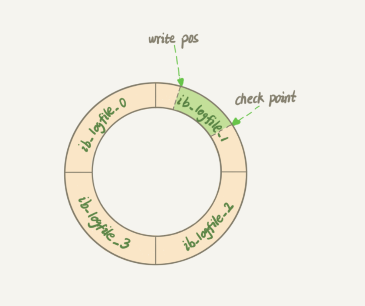

## 物理组成


上方是 MySQL 物理组成的简单示意图，MySQL 大致上可以分为日志文件和数据文件两大部分

日志文件包括二进制日志、InnoDB 在线 redo 日志、错误日志、慢查询日志、一般查询日志等。

数据文件主要指不同存储引擎的物理文件，不同数据文件的扩展名是不一样的，如 InnoDB 用 .ibd、MyISAM 用 .MYD。

除日志文件和数据文件外，还有配置文件 my.cnf、pid 文件 mysql.pid、socket 文件 mysql.sock。

## 日志文件

### 重要日志模块：二进制日志-binlog(归档日志)

二进制日志，其实就是我们平常所说的 binlog，它是 MySQL 重要的日志模块，在 Server 层实现。

binlog 以二进制形式，将所有修改数据的 query 记录到日志文件中，包括 query 语句、执行时间、相关事务信息等。

binlog 的开启，通过在配置文件 my.cnf 中，显式指定参数 log-bin=file_name。如果未指定 file_name，则会记录为 mysql-bin.******（* 代表 0~9 之间的某个数字，表示日志的序号）

```shell
log-bin = /mysql/log/mysql-bin # binlog的存储路径
```

下面为一条insert语句所生成的binlog内容：

```sql
root@localhost [tempdb]>insert into a values(1);
Query OK, 1 row affected (0.00 sec)
```

```sql
[root@mysql-test-1 log]# mysqlbinlog --base64-output=decode-rows -vv mysql-bin.000017
#200413  0:18:17 server id 1873306  end_log_pos 556 	Write_rows: table id 280 flags: STMT_END_F
### INSERT INTO `tempdb`.`a`
### SET
###   @1=1 /* INT meta=0 nullable=1 is_null=0 */
# at 556
#200413  0:18:17 server id 1873306  end_log_pos 583 	Xid = 4713735
COMMIT/*!*/;
```

### 重要日志模块：InnoDB redo log(重做日志)

redo log，是存储引擎 InnoDB 生成的日志，主要为了保证数据的可靠性。redo log 记录了 InnoDB 所做的所有物理变更和事务信息。

redo log 默认存放在数据目录下面，可以通过修改 innodb_log_file_size 和 innodb_log_files_in_group 来配置 redo log 的文件数量和每个日志文件的大小。

```shell
innodb_log_file_size = 1000M # 每个redo log文件的大小
innodb_log_files_in_group = 3 # redo log文件数量
```

在 MySQL 里.如果每一次的更新操作都需要写进磁盘，然后磁盘也要找到对应的那条记录，然后再更新，整个过程 IO 成本、查找成本都很高。

mysql 的解决方案就是 MySQL 里经常说到的 WAL 技术，WAL 的全称是 Write-Ahead Logging，它的关键点就是先写日志，再写磁盘。

具体来说，当有一条记录需要更新的时候，InnoDB 引擎就会先把记录写到 redo log 里面，并更新内存，这个时候更新就算完成了。同时，InnoDB 引擎会在适当的时候，将这个操作记录更新到磁盘里面，而这个更新往往是在系统比较空闲的时候做。

InnoDB 的 redo log 是固定大小的，比如可以配置为一组 4 个文件，每个文件的大小是 1GB，那么这块 redo log总共就可以记录 4GB 的操作。从头开始写，写到末尾就又回到开头循环写，如下面这个图所示。



- write pos 是当前记录的位置，一边写一边后移，写到第 3 号文件末尾后就回到 0 号文件开头。
- checkpoint 是当前要擦除的位置，也是往后推移并且循环的，擦除记录前要把记录更新到数据文件。
- write pos 和 checkpoint 之间的是redo log上还空着的部分，可以用来记录新的操作。
- write pos 追上 checkpoint，表示“粉板”满了，这时候不能再执行新的更新，得停下来先擦掉一些记录，把 checkpoint 推进一下。

有了 redo log，InnoDB 就可以保证即使数据库发生异常重启，之前提交的记录都不会丢失，这个能力称为**crash-safe**。

###　bin log 和 redo log 的异同

1. redo log 是 InnoDB 引擎特有的；binlog 是 MySQL 的 Server 层实现的，所有引擎都可以使用。
2. redo log 是物理日志，记录的是“在某个数据页上做了什么修改”；binlog 是逻辑日志，记录的是这个语句的原始逻辑，比如“给 ID=2 这一行的 c 字段加 1 ”。
3. redo log 是循环写的，空间固定会用完；binlog 是可以追加写入的。“追加写”是指 binlog 文件写到一定大小后会切换到下一个，并不会覆盖以前的日志。

## 其他日志

### 错误日志：error log

错误日志，记录 MySQL 每次启动关闭的详细信息，以及运行过程中比较严重的警告和错误信息。

错误日志默认是关闭的，可以通过配置参数 log-error 进行开启，以及指定存储路径。

```shell
log-error = /mysql/log/mysql-error.log # 错误日志的存储路径
```

### 慢查询日志：slow query log

慢查询日志，记录 MySQL 中执行时间较长的 query，包括执行时间、执行时长、执行用户、主机等信息。

慢查询日志默认是关闭的，可以通过配置 slow_query_log 进行开启。慢查询的阈值和存储路径，通过配置参数 long_query_time 和 slow_query_log_file 实现。

```shell
slow_query_log = 1 #开启慢查询
long_query_time = 1 #设置慢查询阈值为1s
slow_query_log_file = /mysql/log/mysql-slow.log #设置慢查询日志存储路径
```

### 一般查询日志：general query log

一般查询日志，记录 MySQL 中所有的 query。慢查询记录的是超过阈值的 query，而一般查询日志记录的是所有的 query。一般查询日志的开启需要慎重，因为开启后对 MySQL 的性能有比较大的影响。

一般查询日志默认是关闭的，可以通过配置参数 general_log 进行开启。存储路径可以通过配置参数 general_log_file 来实现

```shell
general_log = OFF #默认是关闭的
general_log_file = /mysql/data/mysql-general.log #设置查询日志存储路径
```

#  数据文件

## .frm文件

.frm 文件存放表相关的元数据，包括表结构信息等。

每张表都有一个对应的 .frm 文件，不管这张表使用哪种存储引擎

```shell
[root@mysql-test-1 tempdb]# ls -lrt *.frm
-rw-r----- 1 mysql mysql 8556 Apr 13 00:18 a.frm
```

# InnoDB 引擎

.ibd 文件和 ibdata 文件都是 InnoDB 引擎的数据文件

- 如果是独享表空间的存储方式，则使用.idb文件来存放数据，每张表都会有一个单独的 .ibd 文件。
- 如果是共享表空间的存储方式，则使用ibdata文件来存放数据，所有表共用一个 ibdata 文件。

 是否开启独享表空间，可以通过配置参数 innodb_file_per_table 来实现。

```shell
innodb_file_per_table = 1  #1 为开启独享表空间
```

下面为InnoDB表的创建语句，及相应的数据文件：

```sql
root@localhost [tempdb]>create table a (id int) ENGINE = InnoDB;
Query OK, 0 rows affected (0.11 sec)
```

```shell
[root@mysql-test-1 tempdb]# ls -lrt a.*
-rw-r----- 1 mysql mysql  8556 Apr 13 01:57 a.frm
-rw-r----- 1 mysql mysql 98304 Apr 13 01:57 a.ibd
```

# MyISAM引擎

MyISAM 引擎的数据文件包含 .MYD 文件和 .MYI 文件。

- .MYD 文件，存放 MyISAM 的数据，每张表都有一个单独的 .MYD 文件。
- .MYI 文件，存放 MyISAM 的索引相关信息，每张表都有一个单独的 .MYI 文件，与 .MYD 文件的存储路径一致。

下面为 MyISAM 表的创建语句，及相应的数据文件：

```sql
root@localhost [tempdb]>create table a (id int) ENGINE = MyISAM;
Query OK, 0 rows affected (0.01 sec)
```

```shell
[root@mysql-test-1 tempdb]# ls -lrt a.*
-rw-r----- 1 mysql mysql 8556 Apr 13 02:01 a.frm
-rw-r----- 1 mysql mysql 1024 Apr 13 02:01 a.MYI
-rw-r----- 1 mysql mysql    0 Apr 13 02:01 a.MYD
```

# 小结

本文，我们主要介绍了 MySQL 的物理组成：日志文件和数据文件。其中 binlog 和 redo log 是最为重要的日志模块.