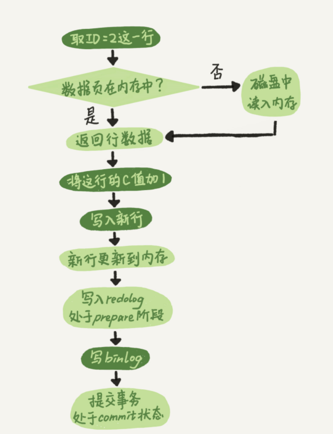

# MySQL 物理组成-一条更新语句是如何执行的

- binlog（归档日志）
- redo log（重做日志）

# 一条更新语句是如何执行的

相比查询语句的执行流程，更新语句的执行流程多了两个重要的日志模块： binlog（归档日志）和redo log（重做日志）

## binlog和redo log的区别

- binlog是逻辑日志，记录某个语句的基本逻辑，即SQL语句；redo log是物理日志，记录在某个数据页所做的修改；
- binlog是在MySQL的Server层实现，所有的存储引擎都可以使用binlog这个日志模块；redo log是InnoDB存储引擎特有的日志模块；
- binlog是追加写，在写满或重启之后，会生成新的binlog文件，之前的日志不会进行覆盖；redo log是循环写，空间大小是固定的；
- binlog 是在事务最终提交前写入的；redo log是在事务执行过程不断的写入；
- binlog可以应用于数据归档、主从搭建等场景；redo log作为异常宕机或者介质故障后的数据恢复使用；

## 为什么会有两份日志

刚开始MySQL自带的引擎是MyISAM，然而MyISAM并没有crash-safe的能力，而binlog只能用于数据归档。InnoDB引擎是另外一家公司开发的MySQL插件，同时开发了redo log来实现crash-safe能力。从5.5.5版本开始，InnoDB成为MySQL的默认存储引擎，也是当前最常用的存储引擎。

**Tips：**crash-safe指数据库发生故障重启，之前提交的数据不会丢失

# 一条更新语句的执行流程

update语句将id等于1这一行的value值加1

```sql
update a set value=value+1 where id=2;
```

表a拥有一个字段id和一个字段value

```sql
CREATE TABLE `a` (
  `id` int(11) DEFAULT NULL,
  `value` int(11) DEFAULT NULL
) ENGINE=InnoDB DEFAULT CHARSET=utf8
```

我们来看看这条update语句在MySQL内部是如何执行的？

1. 执行器通过引擎找到id=2这一行。如果id=2这一行的数据页在内存中，直接返回给执行器；如果不在，则要从磁盘读入内存，再返回给执行器；
2. 执行器拿到id=2这一行数据，把value值加1，产生一行新的数据，调用引擎接口写入这行新的数据；
3. 引擎将新的这行数据更新到内存中，同时将这个操作记录到redo log，此时redo log处于prepare状态；
4. 执行器生成更新操作的binlog，并写入磁盘；
5. 执行器调用引擎的事务提交接口，引擎将刚刚写入的redo log改成commit提交状态，更新完成。

## 执行总结



图中浅色框表示是在 InnoDB 内部执行的，深色框表示是在执行器中执行的。

1. 执行器先找引擎取 ID=2 这一行。ID 是主键，引擎直接用树搜索找到这一行。如果 ID=2 这一行所在的数据页本来就在内存中，就直接返回给执行器；否则，需要先从磁盘读入内存，然后再返回。
2. 执行器拿到引擎给的行数据，把这个值加上 1，比如原来是 N，现在就是 N+1，得到新的一行数据，再调用引擎接口写入这行新数据。
3. 引擎将这行新数据更新到内存中，同时将这个更新操作记录到 redo log 里面，此时 redo log 处于 prepare 状态。然后告知执行器执行完成了，随时可以提交事务。
4. 执行器生成这个操作的 binlog，并把 binlog 写入磁盘。
5. 执行器调用引擎的提交事务接口，引擎把刚刚写入的 redo log 改成提交（commit）状态，更新完成。

**将 redo log 的写入拆成了两个步骤：prepare 和 commit，这就是"两阶段提交"。**

# 两阶段提交

为什么必须有“两阶段提交”呢？这是为了让两份日志之间的逻辑一致。要说明这个问题，我们得从文章开头的那个问题说起：**怎样让数据库恢复到半个月内任意一秒的状态？**

前面我们说过了，binlog 会记录所有的逻辑操作，并且是采用“追加写”的形式。如果你的 DBA 承诺说半个月内可以恢复，那么备份系统中一定会保存最近半个月的所有 binlog，同时系统会定期做整库备份。这里的“定期”取决于系统的重要性，可以是一天一备，也可以是一周一备。

当需要恢复到指定的某一秒时，比如某天下午两点发现中午十二点有一次误删表，需要找回数据，那你可以这么做：

- 首先，找到最近的一次全量备份，如果你运气好，可能就是昨天晚上的一个备份，从这个备份恢复到临时库；
- 然后，从备份的时间点开始，将备份的 binlog 依次取出来，重放到中午误删表之前的那个时刻。

这样你的临时库就跟误删之前的线上库一样了，然后你可以把表数据从临时库取出来，按需要恢复到线上库去。

好了，说完了数据恢复过程，我们回来说说，为什么日志需要“两阶段提交”。这里不妨用反证法来进行解释。

由于 redo log 和 binlog 是两个独立的逻辑，如果不用两阶段提交，要么就是先写完 redo log 再写 binlog，或者采用反过来的顺序。我们看看这两种方式会有什么问题。

仍然用前面的 update 语句来做例子。假设当前 ID=2 的行，字段 c 的值是 0，再假设执行 update 语句过程中在写完第一个日志后，第二个日志还没有写完期间发生了 crash，会出现什么情况呢？

1. **先写 redo log 后写 binlog**。假设在 redo log 写完，binlog 还没有写完的时候，MySQL 进程异常重启。由于我们前面说过的，redo log 写完之后，系统即使崩溃，仍然能够把数据恢复回来，所以恢复后这一行 c 的值是 1。
   但是由于 binlog 没写完就 crash 了，这时候 binlog 里面就没有记录这个语句。因此，之后备份日志的时候，存起来的 binlog 里面就没有这条语句。
   然后你会发现，如果需要用这个 binlog 来恢复临时库的话，由于这个语句的 binlog 丢失，这个临时库就会少了这一次更新，恢复出来的这一行 c 的值就是 0，与原库的值不同。
2. **先写 binlog 后写 redo log**。如果在 binlog 写完之后 crash，由于 redo log 还没写，崩溃恢复以后这个事务无效，所以这一行 c 的值是 0。但是 binlog 里面已经记录了“把 c 从 0 改成 1”这个日志。所以，在之后用 binlog 来恢复的时候就多了一个事务出来，恢复出来的这一行 c 的值就是 1，与原库的值不同。

可以看到，如果不使用“两阶段提交”，那么数据库的状态就有可能和用它的日志恢复出来的库的状态不一致。

你可能会说，这个概率是不是很低，平时也没有什么动不动就需要恢复临时库的场景呀？

其实不是的，不只是误操作后需要用这个过程来恢复数据。当你需要扩容的时候，也就是需要再多搭建一些备库来增加系统的读能力的时候，现在常见的做法也是用全量备份加上应用 binlog 来实现的，这个“不一致”就会导致你的线上出现主从数据库不一致的情况。

简单说，redo log 和 binlog 都可以用于表示事务的提交状态，而两阶段提交就是让这两个状态保持逻辑上的一致。

# 小结

一条更新语句的执行过程，除了要经过连接池、查询缓存、解析器、优化器、执行器这几个模块之外，还涉及到两个非常重要的日志模块： binlog（归档日志）和redo log（重做日志）