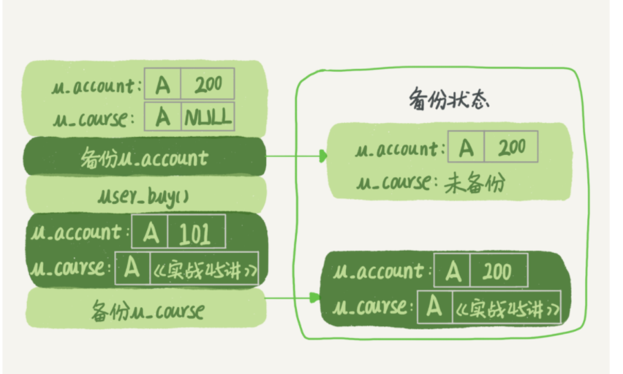
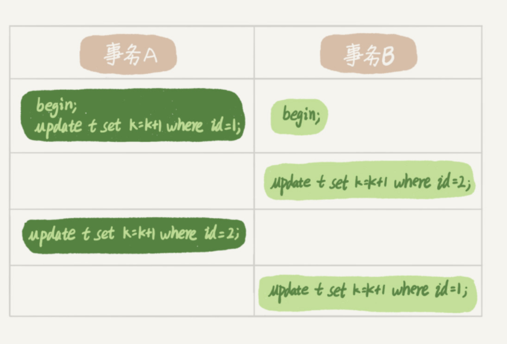

**根据加锁的范围，MySQL 里面的锁大致可以分成全局锁、表级锁和行锁三类**。

# 全局锁

全局锁就是对整个数据库实例加锁。MySQL 提供了一个加全局读锁的方法，命令是 Flush tables with read lock (FTWRL)。当你需要让整个库处于只读状态的时候，可以使用这个命令，之后其他线程的以下语句会被阻塞：

- 数据更新语句（数据的增删改）、
- 数据定义语句（包括建表、修改表结构等）
- 更新类事务的提交语句。

**全局锁的典型使用场景是，做全库逻辑备份**。也就是把整库每个表都 select 出来存成文本。

以前有一种做法，是通过 FTWRL 确保不会有其他线程对数据库做更新，然后对整个库做备份。

**TIPS**: 在备份过程中整个库完全处于只读状态。

但是让整库都只读，听上去就很危险：

- 如果你在主库上备份，那么在备份期间都不能执行更新，业务基本上就得停摆；
- 如果你在从库上备份，那么备份期间从库不能执行主库同步过来的 binlog，会导致主从延迟。

看来加全局锁不太好。但是细想一下，备份为什么要加锁呢？我们来看一下不加锁会有什么问题。

假设你现在要维护“极客时间”的购买系统，关注的是用户账户余额表和用户课程表。

现在发起一个逻辑备份。假设备份期间，有一个用户，他购买了一门课程，业务逻辑里就要扣掉他的余额，然后往已购课程里面加上一门课。

如果时间顺序上是先备份账户余额表 (u_account)，然后用户购买，然后备份用户课程表 (u_course)，会怎么样呢？你可以看一下这个图：



可以看到，这个备份结果里，用户 A 的数据状态是“账户余额没扣，但是用户课程表里面已经多了一门课”。如果后面用这个备份来恢复数据的话，用户 A 就发现，自己赚了。

作为用户可别觉得这样可真好啊，你可以试想一下：如果备份表的顺序反过来，先备份用户课程表再备份账户余额表，又可能会出现什么结果？

也就是说，不加锁的话，备份系统备份的得到的库不是一个逻辑时间点，这个视图是逻辑不一致的。

说到视图你肯定想起来了，我们在前面讲事务隔离的时候，其实是有一个方法能够拿到一致性视图的，对吧？

是的，就是在可重复读隔离级别下开启一个事务。

官方自带的逻辑备份工具是 mysqldump。当 mysqldump 使用参数–single-transaction 的时候，导数据之前就会启动一个事务，来确保拿到一致性视图。而由于 MVCC 的支持，这个过程中数据是可以正常更新的。

你一定在疑惑，有了这个功能，为什么还需要 FTWRL 呢？**一致性读是好，但前提是引擎要支持这个隔离级别。** 比如，对于 MyISAM 这种不支持事务的引擎，如果备份过程中有更新，总是只能取到最新的数据，那么就破坏了备份的一致性。这时，我们就需要使用 FTWRL 命令了。

所以，**single-transaction 方法只适用于所有的表使用事务引擎的库。**如果有的表使用了不支持事务的引擎，那么备份就只能通过 FTWRL 方法。这往往是 DBA 要求业务开发人员使用 InnoDB 替代 MyISAM 的原因之一。

你也许会问，**既然要全库只读，为什么不使用 set global readonly=true 的方式呢**？

确实 readonly 方式也可以让全库进入只读状态，但我还是会建议你用 FTWRL 方式，主要有两个原因：

- 一是，在有些系统中，readonly 的值会被用来做其他逻辑，比如用来判断一个库是主库还是备库。因此，修改 global 变量的方式影响面更大，我不建议你使用。
- 二是，在异常处理机制上有差异。如果执行 FTWRL 命令之后由于客户端发生异常断开，那么 MySQL 会自动释放这个全局锁，整个库回到可以正常更新的状态。而将整个库设置为 readonly 之后，如果客户端发生异常，则数据库就会一直保持 readonly 状态，这样会导致整个库长时间处于不可写状态，风险较高。

业务的更新不只是增删改数据（DML)，还有可能是加字段等修改表结构的操作（DDL）。不论是哪种方法，一个库被全局锁上以后，你要对里面任何一个表做加字段操作，都是会被锁住的。

但是，即使没有被全局锁住，加字段也不是就能一帆风顺的，因为你还会碰到接下来我们要介绍的表级锁。

# 表级锁

MySQL 里面表级别的锁有两种：

- 一种是表锁，
- 一种是元数据锁（meta data lock，MDL)。

**表锁的语法是 lock tables … read/write。**与 FTWRL 类似，可以用 unlock tables 主动释放锁，也可以在客户端断开的时候自动释放。需要注意，lock tables 语法除了会限制别的线程的读写外，也限定了本线程接下来的操作对象。

举个例子, 如果在某个线程 A 中执行 lock tables t1 read, t2 write; 这个语句，则其他线程写 t1、读写 t2 的语句都会被阻塞。同时，线程 A 在执行 unlock tables 之前，也只能执行读 t1、读写 t2 的操作。连写 t1 都不允许，自然也不能访问其他表。

在还没有出现更细粒度的锁的时候，表锁是最常用的处理并发的方式。而对于 InnoDB 这种支持行锁的引擎，一般不使用 lock tables 命令来控制并发，毕竟锁住整个表的影响面还是太大。

## 表级的锁是 MDL（metadata lock)

**另一类表级的锁是 MDL（metadata lock)。**MDL 不需要显式使用，在访问一个表的时候会被自动加上。MDL 的作用是，保证读写的正确性。

你可以想象一下，如果一个查询正在遍历一个表中的数据，而执行期间另一个线程对这个表结构做变更，删了一列，那么查询线程拿到的结果跟表结构对不上，肯定是不行的。

因此，在 MySQL 5.5 版本中引入了 MDL，当对一个表做增删改查操作的时候，加 MDL 读锁；当要对表做结构变更操作的时候，加 MDL 写锁。

- 读锁之间不互斥，因此你可以有多个线程同时对一张表增删改查。
- 读写锁之间、写锁之间是互斥的，用来保证变更表结构操作的安全性。因此，如果有两个线程要同时给一个表加字段，其中一个要等另一个执行完才能开始执行。

### 给一个小表加个字段，导致整个库挂了。

虽然 MDL 锁是系统默认会加的，但却是你不能忽略的一个机制。比如下面这个例子，我经常看到有人掉到这个坑里：给一个小表加个字段，导致整个库挂了。

你肯定知道，给一个表加字段，或者修改字段，或者加索引，需要扫描全表的数据。

在对大表操作的时候，你肯定会特别小心，以免对线上服务造成影响。而实际上，即使是小表，操作不慎也会出问题。我们来看一下下面的操作序列，假设表 t 是一个小表。


我们可以看到 session A 先启动，这时候会对表 t 加一个 MDL 读锁。由于 session B 需要的也是 MDL 读锁，因此可以正常执行。

之后 session C 会被 blocked，是因为 session A 的 MDL 读锁还没有释放，而 session C 需要 MDL 写锁，因此只能被阻塞。

如果只有 session C 自己被阻塞还没什么关系，但是之后所有要在表 t 上新申请 MDL 读锁的请求也会被 session C 阻塞。前面我们说了，所有对表的增删改查操作都需要先申请 MDL 读锁，就都被锁住，等于这个表现在完全不可读写了。

如果某个表上的查询语句频繁，而且客户端有重试机制，也就是说超时后会再起一个新 session 再请求的话，这个库的线程很快就会爆满。

你现在应该知道了，事务中的 MDL 锁，在语句执行开始时申请，但是语句结束后并不会马上释放，而会等到整个事务提交后再释放。

### **如何安全地给小表加字段？**

首先我们要解决长事务，事务不提交，就会一直占着 MDL 锁。在 MySQL 的 information_schema 库的 innodb_trx 表中，你可以查到当前执行中的事务。如果你要做 DDL 变更的表刚好有长事务在执行，要考虑先暂停 DDL，或者 kill 掉这个长事务。

但考虑一下这个场景。如果你要变更的表是一个热点表，虽然数据量不大，但是上面的请求很频繁，而你不得不加个字段，你该怎么做呢？

这时候 kill 可能未必管用，因为新的请求马上就来了。比较理想的机制是，在 alter table 语句里面设定等待时间，如果在这个指定的等待时间里面能够拿到 MDL 写锁最好，拿不到也不要阻塞后面的业务语句，先放弃。之后开发人员或者 DBA 再通过重试命令重复这个过程。

MariaDB 已经合并了 AliSQL 的这个功能，所以这两个开源分支目前都支持 DDL NOWAIT/WAIT n 这个语法。

```sql
ALTER TABLE tbl_name NOWAIT add column ...
ALTER TABLE tbl_name WAIT N add column ... 
```

# 小结

- 全局锁主要用在逻辑备份过程中。对于全部是 InnoDB 引擎的库，我建议你选择使用–single-transaction 参数，对应用会更友好。
- 表锁一般是在数据库引擎不支持行锁的时候才会被用到的。如果你发现你的应用程序里有 lock tables 这样的语句，你需要追查一下，比较可能的情况是：
  - 要么是你的系统现在还在用 MyISAM 这类不支持事务的引擎，那要安排升级换引擎；
  - 要么是你的引擎升级了，但是代码还没升级。我见过这样的情况，最后业务开发就是把 lock tables 和 unlock tables 改成 begin 和 commit，问题就解决了。
- MDL 会直到事务提交才释放，在做表结构变更的时候，你一定要小心不要导致锁住线上查询和更新。

# 行级锁

MySQL 的行锁是在引擎层由各个引擎自己实现的。但并不是所有的引擎都支持行锁，比如 MyISAM 引擎就不支持行锁。不支持行锁意味着并发控制只能使用表锁，对于这种引擎的表，同一张表上任何时刻只能有一个更新在执行，这就会影响到业务并发度。InnoDB 是支持行锁的，这也是 MyISAM 被 InnoDB 替代的重要原因之一。

## InnoDB 的行锁

行锁就是针对数据表中行记录的锁。这很好理解，比如事务 A 更新了一行，而这时候事务 B 也要更新同一行，则必须等事务 A 的操作完成后才能进行更新。

当然，数据库中还有一些没那么一目了然的概念和设计，这些概念如果理解和使用不当，容易导致程序出现非预期行为，比如两阶段锁。

## 从两阶段锁说起

举个例子。在下面的操作序列中，事务 B 的 update 语句执行时会是什么现象呢？假设字段 id 是表 t 的主键。


这个问题的结论取决于事务 A 在执行完两条 update 语句后，持有哪些锁，以及在什么时候释放。你可以验证一下：实际上事务 B 的 update 语句会被阻塞，直到事务 A 执行 commit 之后，事务 B 才能继续执行。

知道了这个答案，你一定知道了事务 A 持有的两个记录的行锁，都是在 commit 的时候才释放的。

TIPS: **在 InnoDB 事务中，行锁是在需要的时候才加上的，但并不是不需要了就立刻释放，而是要等到事务结束时才释放。这个就是两阶段锁协议。**

**如果你的事务中需要锁多个行，要把最可能造成锁冲突、最可能影响并发度的锁尽量往后放。**

### 实例

假设你负责实现一个电影票在线交易业务，顾客 A 要在影院 B 购买电影票。我们简化一点，这个业务需要涉及到以下操作：

1. 从顾客 A 账户余额中扣除电影票价；
2. 给影院 B 的账户余额增加这张电影票价；
3. 记录一条交易日志。

也就是说，要完成这个交易，我们需要 update 两条记录，并 insert 一条记录。当然，为了保证交易的原子性，我们要把这三个操作放在一个事务中。那么，你会怎样安排这三个语句在事务中的顺序呢？

试想如果同时有另外一个顾客 C 要在影院 B 买票，那么这两个事务冲突的部分就是语句 2 了。因为它们要更新同一个影院账户的余额，需要修改同一行数据。

根据两阶段锁协议，不论你怎样安排语句顺序，所有的操作需要的行锁都是在事务提交的时候才释放的。所以，如果你把语句 2 安排在最后，比如按照 3、1、2 这样的顺序，那么影院账户余额这一行的锁时间就最少。这就最大程度地减少了事务之间的锁等待，提升了并发度。

好了，现在由于你的正确设计，影院余额这一行的行锁在一个事务中不会停留很长时间。但是，这并没有完全解决你的困扰。

如果这个影院做活动，可以低价预售一年内所有的电影票，而且这个活动只做一天。于是在活动时间开始的时候，你的 MySQL 就挂了。你登上服务器一看，CPU 消耗接近 100%，但整个数据库每秒就执行不到 100 个事务。这是什么原因呢？

这里，我就要说到死锁和死锁检测了。

## 死锁和死锁检测

当并发系统中不同线程出现循环资源依赖，涉及的线程都在等待别的线程释放资源时，就会导致这几个线程都进入无限等待的状态，称为死锁。这里我用数据库中的行锁举个例子。



这时候，事务 A 在等待事务 B 释放 id=2 的行锁，而事务 B 在等待事务 A 释放 id=1 的行锁。 事务 A 和事务 B 在互相等待对方的资源释放，就是进入了死锁状态。当出现死锁以后，有两种策略：

- 一种策略是，直接进入等待，直到超时。这个超时时间可以通过参数 innodb_lock_wait_timeout 来设置。
- 另一种策略是，发起死锁检测，发现死锁后，主动回滚死锁链条中的某一个事务，让其他事务得以继续执行。将参数 innodb_deadlock_detect 设置为 on，表示开启这个逻辑。

在 InnoDB 中，innodb_lock_wait_timeout 的默认值是 50s，意味着如果采用第一个策略，当出现死锁以后，第一个被锁住的线程要过 50s 才会超时退出，然后其他线程才有可能继续执行。对于在线服务来说，这个等待时间往往是无法接受的。

但是，我们又不可能直接把这个时间设置成一个很小的值，比如 1s。这样当出现死锁的时候，确实很快就可以解开，但如果不是死锁，而是简单的锁等待呢？所以，超时时间设置太短的话，会出现很多误伤。

所以，正常情况下我们还是要采用第二种策略，即：主动死锁检测，而且 innodb_deadlock_detect 的默认值本身就是 on。主动死锁检测在发生死锁的时候，是能够快速发现并进行处理的，但是它也是有额外负担的。

你可以想象一下这个过程：每当一个事务被锁的时候，就要看看它所依赖的线程有没有被别人锁住，如此循环，最后判断是否出现了循环等待，也就是死锁。

那如果是我们上面说到的所有事务都要更新同一行的场景呢？

每个新来的被堵住的线程，都要判断会不会由于自己的加入导致了死锁，这是一个时间复杂度是 O(n) 的操作。假设有 1000 个并发线程要同时更新同一行，那么死锁检测操作就是 100 万这个量级的。虽然最终检测的结果是没有死锁，但是这期间要消耗大量的 CPU 资源。因此，你就会看到 CPU 利用率很高，但是每秒却执行不了几个事务。

## 怎么解决由这种热点行更新导致的性能问题呢？

- 问题的症结在于，死锁检测要耗费大量的 CPU 资源。

**一种头痛医头的方法，就是如果你能确保这个业务一定不会出现死锁，可以临时把死锁检测关掉。**但是这种操作本身带有一定的风险，因为业务设计的时候一般不会把死锁当做一个严重错误，毕竟出现死锁了，就回滚，然后通过业务重试一般就没问题了，这是业务无损的。而关掉死锁检测意味着可能会出现大量的超时，这是业务有损的。

**另一个思路是控制并发度。**根据上面的分析，你会发现如果并发能够控制住，比如同一行同时最多只有 10 个线程在更新，那么死锁检测的成本很低，就不会出现这个问题。一个直接的想法就是，在客户端做并发控制。但是，你会很快发现这个方法不太可行，因为客户端很多。我见过一个应用，有 600 个客户端，这样即使每个客户端控制到只有 5 个并发线程，汇总到数据库服务端以后，峰值并发数也可能要达到 3000。

**结论：**这个并发控制要做在数据库服务端。如果你有中间件，可以考虑在中间件实现；如果你的团队有能修改 MySQL 源码的人，也可以做在 MySQL 里面。基本思路就是，对于相同行的更新，在进入引擎之前排队。这样在 InnoDB 内部就不会有大量的死锁检测工作了。

**如果团队里暂时没有数据库方面的专家，不能实现这样的方案，能不能从设计上优化这个问题呢？** 

可以考虑通过将一行改成逻辑上的多行来减少锁冲突。还是以影院账户为例，可以考虑放在多条记录上，比如 10 个记录，影院的账户总额等于这 10 个记录的值的总和。这样每次要给影院账户加金额的时候，随机选其中一条记录来加。这样每次冲突概率变成原来的 1/10，可以减少锁等待个数，也就减少了死锁检测的 CPU 消耗。

这个方案看上去是无损的，但其实这类方案需要根据业务逻辑做详细设计。如果账户余额可能会减少，比如退票逻辑，那么这时候就需要考虑当一部分行记录变成 0 的时候，代码要有特殊处理。

## 小结

介绍了 MySQL 的行锁，涉及了两阶段锁协议、死锁和死锁检测这两大部分内容。

- 我以两阶段协议为起点，和你一起讨论了在开发的时候如何安排正确的事务语句。这里的原则 / 我给你的建议是：如果你的事务中需要锁多个行，要把最可能造成锁冲突、最可能影响并发度的锁的申请时机尽量往后放。
- 调整语句顺序并不能完全避免死锁。所以我们引入了死锁和死锁检测的概念，以及提供了三个方案，来减少死锁对数据库的影响。减少死锁的主要方向，就是控制访问相同资源的并发事务量。