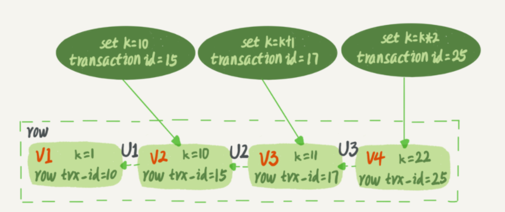
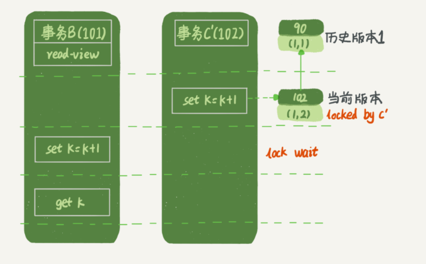

# “快照”在 MVCC 里是怎么工作的？

在可重复读隔离级别下，事务在启动的时候就“拍了个快照”。注意，这个快照是基于整库的。

这时，你会说这看上去不太现实啊。如果一个库有 100G，那么我启动一个事务，MySQL 就要拷贝 100G 的数据出来，这个过程得多慢啊。可是，我平时的事务执行起来很快啊。

实际上，我们并不需要拷贝出这 100G 的数据。我们先来看看这个快照是怎么实现的。

InnoDB 里面每个事务有一个唯一的事务 ID，叫作 transaction id。它是在事务开始的时候向 InnoDB 的事务系统申请的，是按申请顺序严格递增的。

而每行数据也都是有多个版本的。每次事务更新数据的时候，都会生成一个新的数据版本，并且把 transaction id 赋值给这个数据版本的事务 ID，记为 row trx_id。同时，旧的数据版本要保留，并且在新的数据版本中，能够有信息可以直接拿到它。

也就是说，数据表中的一行记录，其实可能有多个版本 (row)，每个版本有自己的 row trx_id。

如图所示：就是一个记录被多个事务连续更新后的状态。



图中虚线框里是同一行数据的 4 个版本，当前最新版本是 V4，k 的值是 22，它是被 transaction id 为 25 的事务更新的，因此它的 row trx_id 也是 25。

你可能会问，前面的文章不是说，语句更新会生成 undo log（回滚日志）吗？那么，**undo log 在哪呢？**

实际上，图 2 中的三个虚线箭头，就是 undo log；而 V1、V2、V3 并不是物理上真实存在的，而是每次需要的时候根据当前版本和 undo log 计算出来的。比如，需要 V2 的时候，就是通过 V4 依次执行 U3、U2 算出来。

明白了多版本和 row trx_id 的概念后，我们再来想一下，InnoDB 是怎么定义那个“100G”的快照的。

按照可重复读的定义，一个事务启动的时候，能够看到所有已经提交的事务结果。但是之后，这个事务执行期间，其他事务的更新对它不可见。

因此，一个事务只需要在启动的时候声明说，“以我启动的时刻为准，如果一个数据版本是在我启动之前生成的，就认；如果是我启动以后才生成的，我就不认，我必须要找到它的上一个版本”。

当然，如果“上一个版本”也不可见，那就得继续往前找。还有，如果是这个事务自己更新的数据，它自己还是要认的。

在实现上， InnoDB 为每个事务构造了一个数组，用来保存这个事务启动瞬间，当前正在“活跃”的所有事务 ID。“活跃”指的就是，启动了但还没提交。

数组里面事务 ID 的最小值记为低水位，当前系统里面已经创建过的事务 ID 的最大值加 1 记为高水位。

这个视图数组和高水位，就组成了当前事务的一致性视图（read-view）。

而数据版本的可见性规则，就是基于数据的 row trx_id 和这个一致性视图的对比结果得到的。

这个视图数组把所有的 row trx_id 分成了几种不同的情况。


这样，对于当前事务的启动瞬间来说，一个数据版本的 row trx_id，有以下几种可能：

1. 如果落在绿色部分，表示这个版本是已提交的事务或者是当前事务自己生成的，这个数据是可见的；
2. 如果落在红色部分，表示这个版本是由将来启动的事务生成的，是肯定不可见的；
3. 如果落在黄色部分，那就包括两种情况
   a. 若 row trx_id 在数组中，表示这个版本是由还没提交的事务生成的，不可见；
   b. 若 row trx_id 不在数组中，表示这个版本是已经提交了的事务生成的，可见。

比如，对于上图中的数据来说，如果有一个事务，它的低水位是 18，那么当它访问这一行数据时，就会从 V4 通过 U3 计算出 V3，所以在它看来，这一行的值是 11。

你看，有了这个声明后，系统里面随后发生的更新，是不是就跟这个事务看到的内容无关了呢？因为之后的更新，生成的版本一定属于上面的 2 或者 3(a) 的情况，而对它来说，这些新的数据版本是不存在的，所以这个事务的快照，就是“静态”的了。

所以你现在知道了，**InnoDB 利用了“所有数据都有多个版本”的这个特性，实现了“秒级创建快照”的能力。**

一个数据版本，对于一个事务视图来说，除了自己的更新总是可见以外，有三种情况：

1. 版本未提交，不可见；
2. 版本已提交，但是是在视图创建后提交的，不可见；
3. 版本已提交，而且是在视图创建前提交的，可见。

# 更新逻辑

**更新数据都是先读后写的，而这个读，只能读当前的值，称为“当前读”（current read）。**

你看下图 中，事务 B 的视图数组是先生成的，之后事务 C 才提交，不是应该看不见 (1,2) 吗，怎么能算出 (1,3) 来？


是的，如果事务 B 在更新之前查询一次数据，这个查询返回的 k 的值确实是 1。

但是，当它要去更新数据的时候，就不能再在历史版本上更新了，否则事务 C 的更新就丢失了。因此，事务 B 此时的 set k=k+1 是在（1,2）的基础上进行的操作。

所以，这里就用到了这样一条规则：**更新数据都是先读后写的，而这个读，只能读当前的值，称为“当前读”（current read）**


因此，在更新的时候，当前读拿到的数据是 (1,2)，更新后生成了新版本的数据 (1,3)，这个新版本的 row trx_id 是 101。

所以，在执行事务 B 查询语句的时候，一看自己的版本号是 101，最新数据的版本号也是 101，是自己的更新，可以直接使用，所以查询得到的 k 的值是 3。

这里我们提到了一个概念，叫作当前读。其实，除了 update 语句外，select 语句如果加锁，也是当前读。

所以，如果把事务 A 的查询语句 select * from t where id=1 修改一下，加上 lock in share mode 或 for update，也都可以读到版本号是 101 的数据，返回的 k 的值是 3。下面这两个 select 语句，就是分别加了读锁（S 锁，共享锁）和写锁（X 锁，排他锁）。

```sql
mysql> select k from t where id=1 lock in share mode;
mysql> select k from t where id=1 for update;
```

再往前一步，假设事务 C 不是马上提交的，而是变成了下面的事务 C’，会怎么样呢？


事务 C’的不同是，更新后并没有马上提交，在它提交前，事务 B 的更新语句先发起了。前面说过了，虽然事务 C’还没提交，但是 (1,2) 这个版本也已经生成了，并且是当前的最新版本。那么，事务 B 的更新语句会怎么处理呢？

这时候，我们在上一篇文章中提到的“两阶段锁协议”就要上场了。事务 C’没提交，也就是说 (1,2) 这个版本上的写锁还没释放。而事务 B 是当前读，必须要读最新版本，而且必须加锁，因此就被锁住了，必须等到事务 C’释放这个锁，才能继续它的当前读。



到这里，我们把一致性读、当前读和行锁就串起来了。


## **事务的可重复读的能力是怎么实现的？**

可重复读的核心就是一致性读（consistent read）；而事务更新数据的时候，只能用当前读。

如果当前的记录的行锁被其他事务占用的话，就需要进入锁等待。

而读提交的逻辑和可重复读的逻辑类似，它们最主要的区别是：

- 在可重复读隔离级别下，只需要在事务开始的时候创建一致性视图，之后事务里的其他查询都共用这个一致性视图；
- 在读提交隔离级别下，每一个语句执行前都会重新算出一个新的视图。

## 在读提交隔离级别下，事务 A 和事务 B 的查询语句查到的 k，分别应该是多少呢？

这里需要说明一下，“start transaction with consistent snapshot; ”的意思是从这个语句开始，创建一个持续整个事务的一致性快照。所以，在读提交隔离级别下，这个用法就没意义了，等效于普通的 start transaction。

# 小结

InnoDB 的行数据有多个版本，每个数据版本有自己的 row trx_id，每个事务或者语句有自己的一致性视图。普通查询语句是一致性读，一致性读会根据 row trx_id 和一致性视图确定数据版本的可见性。

- 对于可重复读，查询只承认在事务启动前就已经提交完成的数据；
- 对于读提交，查询只承认在语句启动前就已经提交完成的数据；

而当前读，总是读取已经提交完成的最新版本。

你也可以想一下，为什么表结构不支持“可重复读”？这是因为表结构没有对应的行数据，也没有 row trx_id，因此只能遵循当前读的逻辑。

当然，MySQL 8.0 已经可以把表结构放在 InnoDB 字典里了，也许以后会支持表结构的可重复读。