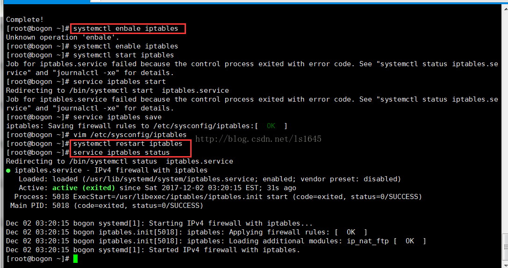
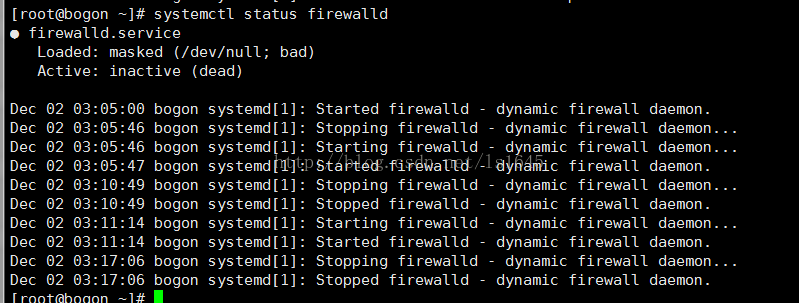

问题： 用iptables开启防火墙报错: Failed to start  IPv4 firewall with iptables. - `CentOS 7 ：Failed to start IPv4 firewall with iptables.`


- __错误原因__：因为centos7.0默认不是使用iptables方式管理，而是firewalld方式。CentOS6.0防火墙用iptables管理。
- __解决办法有两个__：使用firewalld方式。或者关闭firewalld,然后安装iptables。

<!--more-->

## 方法1: 关闭firewalld，安装iptables过程：
- 停止并屏蔽firewalld：
```shell
systemctl stop firewalld
systemctl mask firewalld
```
- 安装iptables-services：
```lunix
yum install iptables-services
```
- 设置开机启动： `systemctl enable iptables`
- 停止/启动/重启 防火墙：
```lunix
systemctl [stop|start|restart] iptables
#or
service iptables [stop|start|restart]
```
- 保存防火墙配置：
```lunix
service iptables save
#or
/usr/libexec/iptables/iptables.init save
```
- 成功界面


## 从iptables切换回firewalld
- 先看firewalld的状态：inactive

- 安装firewalld: `yum install firewalld`
- 切换到firewalld，切换过程与切换iptables一样
```shell
# 关闭 iptables
systemctl mask iptables
systemctl stop iptables
# 切换到 firewalld
systemctl unmask firewalld
# 启动firewalld
systemctl start firewalld
#状态  firewalld
systemctl status firewalld
```


## 说明:
### iptables 的一些命令

```shell
#查询防火墙状态:
[root@localhost ~]# service  iptables status
#停止防火墙:
[root@localhost ~]# service  iptables stop 
#启动防火墙:
[root@localhost ~]# service  iptables start 
#重启防火墙:
[root@localhost ~]# service  iptables restart 
#永久关闭防火墙:
[root@localhost ~]# chkconfig  iptables off 
#永久关闭后启用:
[root@localhost ~]# chkconfig  iptables on
#开启端口：
[root@localhost ~]# vim/etc/sysconfig/iptables
```


### firewalld的一些命令
```shell
#查看状态，看电脑上是否已经安装firewalld
systemctl statusfirewalld
# 安装firewalld防火墙
yum installfirewalld
# 开启防火墙
systemctl startfirewalld.service
# 关闭防火墙
systemctl stop firewalld.service
#设置开机自动启动
systemctl enable firewalld.service
# 设置关闭开机制动启动
systemctl disable firewalld.service
# 在不改变状态的条件下重新加载防火墙
firewall-cmd--reload
```


启用某个服务

```she
# 临时
firewall-cmd --zone=public --add-service=https
# 永久
firewall-cmd --permanent --zone=public --add-service=https
```


开启某个端口

```she
# 永久
firewall-cmd --permanent --zone=public --add-port=8080/tcp
#临时
firewall-cmd  --zone=public --add-port=8080-8081/tcp
```


查看开启的端口和服务

```she
# 服务空格隔开 例如 dhcpv6-client https ss
firewall-cmd--permanent --zone=public --list-services
# 端口空格隔开  例如 8080-8081/tcp 8388/tcp 80/tcp
firewall-cmd--permanent --zone=public --list-ports
#修改配置后需要重启服务使其生效
systemctl restartfirewalld.service
# 查看服务是否生效（例：添加的端口为8080）
firewall-cmd--zone=public --query-port=8080/tcp
```


### 下面是systemctl的一些命令
-   观察iptables和firewalld使用的两组命令，发现三个常用的命令：service、chkconfig、systemctl。那么它们分别是做什么的呢？（去网上搜索了一下给出了答案）
- systemctl命令是系统服务管理器指令，它实际上将 service 和 chkconfig 这两个命令组合到一起。

1. 使某服务自动启动
- 旧指令: `chkconfig --level 3 httpd on`

- 新指令: `systemctl enable httpd.service`

2. 使某服务不自动启动

- 旧指令: `chkconfig --level 3 httpd off`
- 新指令: `systemctl disable httpd.service`

3. 检查服务状态
- 旧指令: `service httpd status`

- 新指令:

  - `systemctl status httpd.service`（服务详细信息）

  - `systemctl is-active httpd.service`（仅显示是否 Active)

4. 显示所有已启动的服务
- 旧指令: `chkconfig --list`
- 新指令: `systemctl list-units --type=service`

5. 启动某服务
- 旧指令:`service httpd start`
- 新指令 `systemctl start httpd.service`


6. 停止某服务
- 旧指令: `service httpd stop`

- 新指令: `systemctl stop httpd.service`


7. 重启某服务
- 旧指令: `service httpd restart`
- 新指令: `systemctl restart httpd.service`

