# 概述

每个微服务通过 Docker 进行发布，随着业务的发展，系统中遍布着各种各样的容器。于是，容器的资源调度，部署运行，扩容缩容就是我们要面临的问题。

基于 Kubernetes 作为容器集群的管理平台被广泛应用。

# Kubernetes 架构概述

Kubernetes 是用来管理容器集群的平台。既然是管理集群，那么就存在被管理节点，针对每个 Kubernetes 集群都由一个 Master 负责管理和控制集群节点。

我们通过 Master 对每个节点 Node 发送命令。简单来说，Master 就是管理者，Node 就是被管理者。

Node 可以是一台机器或者一台虚拟机。在 Node 上面可以运行多个 Pod，Pod 是 Kubernetes 管理的最小单位，同时每个 Pod 可以包含多个容器（Docker）。

通过下面的 Kubernetes 架构简图可以看到 Master 和 Node 之间的关系：

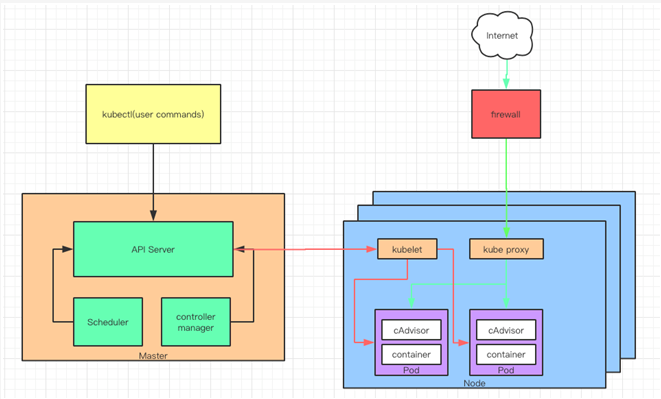

通常我们都是通过 kubectl 对 Kubernetes 下命令的，它通过 APIServer 去调用各个进程来完成对 Node 的部署和控制。

APIServer 的核心功能是对核心对象（例如：Pod，Service，RC）的增删改查操作，同时也是集群内模块之间数据交换的枢纽。

它包括了常用的 API，访问（权限）控制，注册，信息存储（etcd）等功能。在它的下面我们可以看到 Scheduler，它将待调度的 Pod 绑定到 Node 上，并将绑定信息写入 etcd 中。

etcd 包含在 APIServer 中，用来存储资源信息。接下来就是 Controller Manager 了，如果说 Kubernetes 是一个自动化运行的系统，那么就需要有一套管理规则来控制这套系统。

Controller Manager 就是这个管理者，或者说是控制者。它包括 8 个 Controller，分别对应着副本，节点，资源，命名空间，服务等等。

紧接着，Scheduler 会把 Pod 调度到 Node 上，调度完以后就由 kubelet 来管理 Node 了。

kubelet 用于处理 Master 下发到 Node 的任务（即 Scheduler 的调度任务），同时管理 Pod 及 Pod 中的容器。

在完成资源调度以后，kubelet 进程也会在 APIServer 上注册 Node 信息，定期向 Master 汇报 Node 信息，并通过 cAdvisor 监控容器和节点资源。

由于，微服务的部署都是分布式的，所以对应的 Pod 以及容器的部署也是。为了能够方便地找到这些 Pod 或者容器，引入了 Service（kube-proxy）进程，它来负责反向代理和负载均衡的实施。

上面就是 Kubernetes 架构的简易说明，涉及到了一些核心概念以及简单的信息流动。

将一些功能收录到了 APIServer 中，这个简图比官网的图显得简单一些，主要是方便大家记忆。

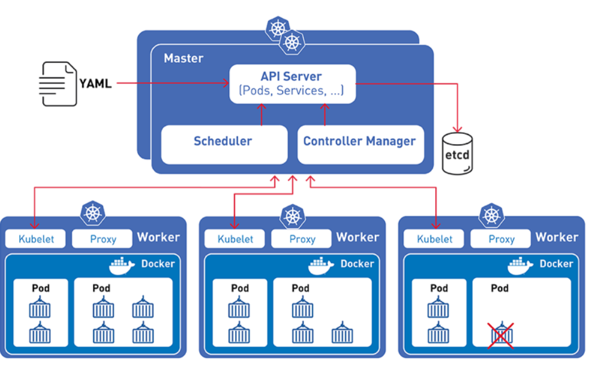

# 从一个例子开始

假设使用 Kubernetes 部署 Tomcat 和 MySQL 服务到两个 Node 上面。其中 Tomcat 服务生成两个实例也就是生成两个 Pod，用来对其做水平扩展。

MySQL 只部署一个实例，也就是一个 Pod。可以通过外网访问 Tomcat，而 Tomcat 可以在内网访问 MySQL。


这里我们假设 Kubernetes 和 Docker 的安装都已经完成，并且镜像文件都已经准备好了。重点看 Kubernetes 如何部署和管理容器。

## kubectl 和 APIServer

既然我们要完成上面的例子，接下来就要部署两个应用。

首先，根据要部署的应用建立 Replication Controller（RC）。RC 是用来声明应用副本的个数，也就是 Pod 的个数。

按照上面的例子，Tomcat 的 RC 就是 2，MySQL 的 RC 就是 1。

由于 kubectl 作为用户接口向 Kubernetes 下发指令，那么指令是通过“.yaml”的配置文件编写的。

定义 mysql-rc.yaml 的配置文件来描述 MySQL 的 RC：

```yaml
apiVersion: V1
kind: ReplicationController
metadata:
 name: mysql#RC的名称，全局唯一
spec:
 replicas:1 #Pod 副本的期待数量
selector :
app: mysql
 template: #Pod模版，用这个模版来创建Pod
metadata:
 labels:
app:mysql#Pod副本的标签
spec:
 containers:#容器定义部分
     -name:mysql
Image:mysql#容器对应的DockerImage
      Ports:
      -containerPort:3306#容器应用监听的端口号
      Env:#注入容器的环境变量
      -name:MYSQL_ROOT_PASSWORD
      Value:”123456”
```

从上面的配置文件可以看出，需要对这个 RC 定义一个名字，以及期望的副本数，以及容器中的镜像文件。然后通过 kubectl 作为客户端的 cli 工具，执行这个配置文件。


执行了上面的命令以后，Kubernetes 会帮助我们部署副本 MySQL 的 Pod 到 Node。

此时先不着急看结果，回到最开始的架构图，可以看到 kubectl 会向 Master 中的 APIServer 发起命令，看看 APIServer 的结构和信息的传递吧。

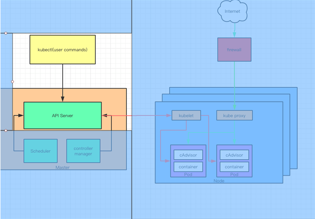

Kubernetes API Server 通过一个名为 kube-apiserver 的进程提供服务，该进程运行在 Master 上。

可以通过 Master 的 8080 端口访问 kube-apiserver 进程，它提供 REST 服务。

因此可以通过命令行工具 kubectl 来与 Kubernetes APIServer 交互，它们之间的接口是 RESTful API。

APIServer 的架构从上到下分为四层：

- **API 层：**主要以 REST 方式提供各种 API 接口，针对 Kubernetes 资源对象的 CRUD 和 Watch 等主要 API，还有健康检查、UI、日志、性能指标等运维监控相关的 API。
- **访问控制层：**负责身份鉴权，核准用户对资源的访问权限，设置访问逻辑（Admission Control）。
- **注册表层：**选择要访问的资源对象。PS：Kubernetes 把所有资源对象都保存在注册表（Registry）中，例如：Pod，Service，Deployment 等等。
- **etcd 数据库：**保存创建副本的信息。用来持久化 Kubernetes 资源对象的 Key-Value 数据库。

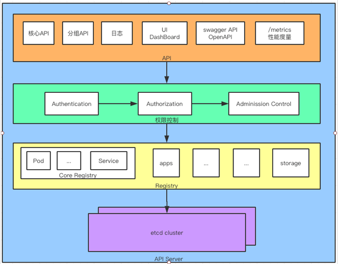

当 kubectl 用 Create 命令建立 Pod 时，是通过 APIServer 中的 API 层调用对应的 RESTAPI 方法。

之后会进入权限控制层，通过 Authentication 获取调用者身份，Authorization 获取权限信息。

AdmissionControl 中可配置权限认证插件，通过插件来检查请求约束。例如：启动容器之前需要下载镜像，或者检查具备某命名空间的资源。

还记得 mysql-rc.yaml 中配置需要生成的 Pod 的个数为 1。到了 Registry 层会从 CoreRegistry 资源中取出 1 个 Pod 作为要创建的 Kubernetes 资源对象。

然后将 Node，Pod 和 Container 信息保存在 etcd 中去。这里的 etcd 可以是一个集群，由于里面保存集群中各个 Node/Pod/Container 的信息，所以必要时需要备份，或者保证其可靠性。

## Controller Manager，Scheduler 和 kubelet

前面通过 kubectl 根据配置文件，向 APIServer 发送命令，在 Node 上面建立 Pod 和 Container。

在 APIServer，经过 API 调用，权限控制，调用资源和存储资源的过程。实际上还没有真正开始部署应用。

这里需要 Controller Manager，Scheduler 和 kubelet 的协助才能完成整个部署过程。

在介绍他们协同工作之前，要介绍一下在 Kubernetes 中的监听接口。从上面的操作知道，所有部署的信息都会写到 etcd 中保存。

实际上 etcd 在存储部署信息的时候，会发送 Create 事件给 APIServer，而 APIServer 会通过监听（Watch）etcd 发过来的事件。其他组件也会监听（Watch）APIServer 发出来的事件。

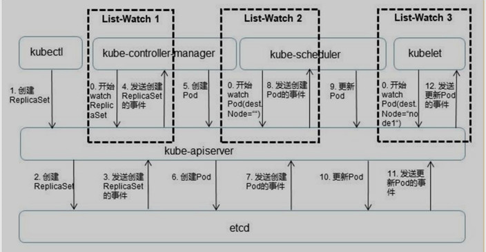

Kubernetes 就是用这种 List-Watch 的机制保持数据同步的，如上图：

- 这里有三个 List-Watch，分别是 kube-controller-manager（运行在Master），kube-scheduler（运行在 Master），kublete（运行在 Node）。他们在进程已启动就会监听（Watch）APIServer 发出来的事件。

- kubectl 通过命令行，在 APIServer 上建立一个 Pod 副本。

- 这个部署请求被记录到 etcd 中，存储起来。

- 当 etcd 接受创建 Pod 信息以后，会发送一个 Create 事件给 APIServer。

- 由于 Kubecontroller manager 一直在监听 APIServer 中的事件。此时 APIServer 接受到了 Create 事件，又会发送给 Kubecontroller manager。

- Kubecontroller manager 在接到 Create 事件以后，调用其中的 Replication Controller 来保证 Node 上面需要创建的副本数量。

  ​	（上面的例子 MySQL 应用是 1 个副本，Tomcat 应用是两个副本。一旦副本数量少于 RC 中定义的数量，Replication Controller 会自动创建副本。总之它是保证副本数量的 Controller。PS：扩容缩容的担当。）

- 在 Controller Manager 创建 Pod 副本以后，APIServer 会在 etcd 中记录这个 Pod 的详细信息。例如在 Pod 的副本数，Container 的内容是什么。
- 同样的 etcd 会将创建 Pod 的信息通过事件发送给 APIServer。
- 由于 Scheduler 在监听（Watch）APIServer，并且它在系统中起到了“承上启下”的作用，“承上”是指它负责接收创建的 Pod 事件，为其安排 Node；“启下”是指安置工作完成后，Node 上的 kubelet 服务进程接管后继工作，负责 Pod 生命周期中的“下半生”。（换句话说，Scheduler 的作用是将待调度的 Pod 按照调度算法和策略绑定到集群中 Node 上，并将绑定信息写入 etcd 中。）
- Scheduler 调度完毕以后会更新 Pod 的信息，此时的信息更加丰富了。除了知道 Pod 的副本数量，副本内容。还知道部署到哪个 Node 上面了。
- 同样，将上面的 Pod 信息更新到 etcd 中，保存起来。
- etcd 将更新成功的事件发送给 APIServer。
- 注意这里的 kubelet 是在 Node 上面运行的进程，它也通过 List-Watch 的方式监听（Watch）APIServer 发送的 Pod 更新的事件。实际上，在第 9 步的时候创建 Pod 的工作就已经完成了。

为什么 kubelete 还要一直监听呢？原因很简单，假设这个时候 kubectl 发命令，需要把原来的 MySQL 的 1 个 RC 副本扩充成 2 个。那么这个流程又会触发一遍。

作为 Node 的管理者 kubelet 也会根据最新的 Pod 的部署情况调整 Node 端的资源。

又或者 MySQL 应用的 RC 个数没有发生变化，但是其中的镜像文件升级了，kubelet 也会自动获取最新的镜像文件并且加载。

通过上面 List-Watch 的介绍大家发现了，除了之前引入的 kubectl 和 APIServer 以外又引入了 Controller Manager，Scheduler 和 kubelet。

## 介绍一下他们的作用和原理

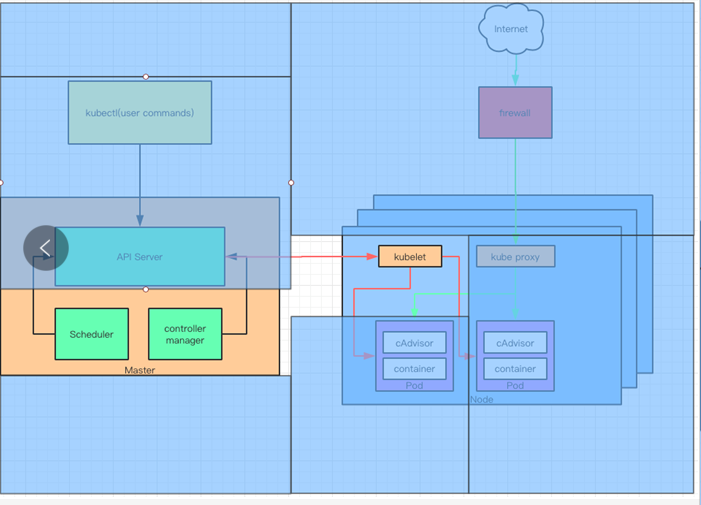

### Controller Manager

Kubernetes 需要管理集群中的不同资源，所以针对不同的资源要建立不同的 Controller。

每个 Controller 通过监听机制获取 APIServer 中的事件（消息），它们通过 API Server 提供的（List-Watch）接口监控集群中的资源，并且调整资源的状态。

可以把它想象成一个尽职的管理者，随时管理和调整资源。比如 MySQL 所在的 Node 意外宕机了，Controller Manager 中的 Node Controller 会及时发现故障，并执行修复流程。

在部署了成百上千微服务的系统中，这个功能极大地协助了运维人员。从此可以看出，Controller Manager 是 Kubernetes 资源的管理者，是运维自动化的核心。

它分为 8 个 Controller，上面我们介绍了 Replication Controller，这里我们把其他几个都列出来，就不展开描述了。

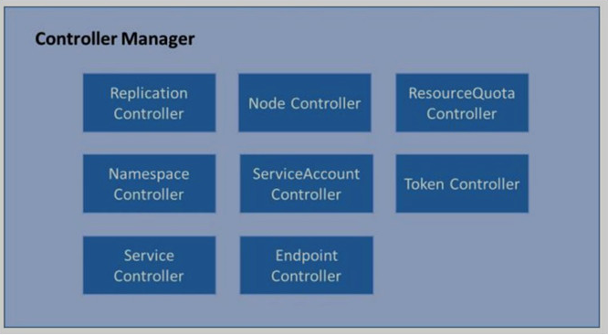

*Controller Manager 中不同的 Controller 负责对不同资源的监控和管理*

### Scheduler 与 kubelet

Scheduler 的作用是，将待调度的 Pod 按照算法和策略绑定到 Node 上，同时将信息保存在 etcd 中。

如果把 Scheduler 比作调度室，那么这三件事就是它需要关注的，待调度的 Pod、可用的 Node，调度算法和策略。

简单地说，就是通过调度算法/策略把 Pod 放到合适的 Node 中去。此时 Node 上的 kubelet 通过 APIServer 监听到 Scheduler 产生的 Pod 绑定事件，然后通过 Pod 的描述装载镜像文件，并且启动容器。

也就是说 Scheduler 负责思考，Pod 放在哪个 Node，然后将决策告诉 kubelet，kubelet 完成 Pod 在 Node 的加载工作。

说白了，Scheduler 是 boss，kubelet 是干活的工人，他们都通过 APIServer 进行信息交换。


*Scheduler 与 kubelet 协同工作图*

### Service 和 kubelet

经历上面一系列的过程，终于将 Pod 和容器部署到 Node 上了。

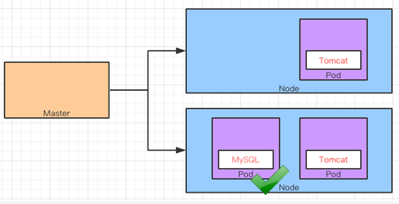

作为部署在 Kubernetes 中，Pod 如何访问其他的 Pod 呢？答案是通过 Kubernetes 的 Service 机制。

在 Kubernetes 中的 Service 定义了一个服务的访问入口地址（IP+Port）。Pod 中的应用通过这个地址访问一个或者一组 Pod 副本。

Service 与后端 Pod 副本集群之间是通过 Label Selector 来实现连接的。Service 所访问的这一组 Pod 都会有同样的 Label，通过这样的方法知道这些 Pod 属于同一个组。

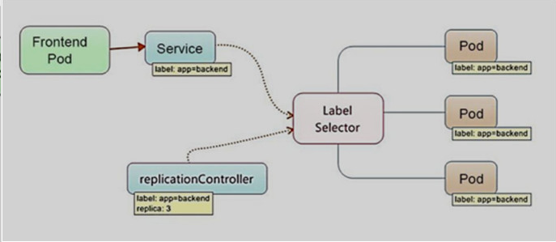

*Pod 通过 Service 访问其他 Pod*

写 MySQL 服务的配置文件（mysql-svc.yaml）如下：

```yaml
apiVersion : v1
kind: Service #说明创建资源对象的类型是Service
metadata:
 name: mysql#Service全局唯一名称
spec:
prots:
-port: 3306#Service的服务端口号
 selector:#Service对应的Pod标签，用来给Pod分类
   app: mysql
```

按照惯例运行 kubectl，创建 Service：


再用 getsvc 命令检查 Service 信息：


这里的 Cluster-IP 169.169.253.143 是由 Kubernetes 自动分配的。当一个 Pod 需要访问其他的 Pod 的时候就需要通过 Service 的 Cluster-IP 和 Port。

也就是说 Cluster-IP 和 Port 是 Kubernetes 集群的内部地址，是提供给集群内的 Pod 之间访问使用的，外部系统是无法通过这个 Cluster-IP 来访问 Kubernetes 中的应用的。

**上面提到的 Service 只是一个概念，而真正将 Service 落实的是 kube-proxy**。

只有理解了 kube-proxy 的原理和机制，我们才能真正理解 Service 背后的实现逻辑。

在 Kubernetes 集群的每个 Node 上都会运行一个 kube-proxy 服务进程，我们可以把这个进程看作 Service 的负载均衡器，其核心功能是将到 Service 的请求转发到后端的多个 Pod 上。

此外，Service 的 Cluster-IP 与 NodePort 是 kube-proxy 服务通过 iptables 的 NAT 转换实现的。kube-proxy 在运行过程中动态创建与 Service 相关的 iptables 规则。

由于 iptables 机制针对的是本地的 kube-proxy 端口，所以在每个 Node 上都要运行 kube-proxy 组件。

因此在 Kubernetes 集群内部，可以在任意 Node 上发起对 Service 的访问请求。

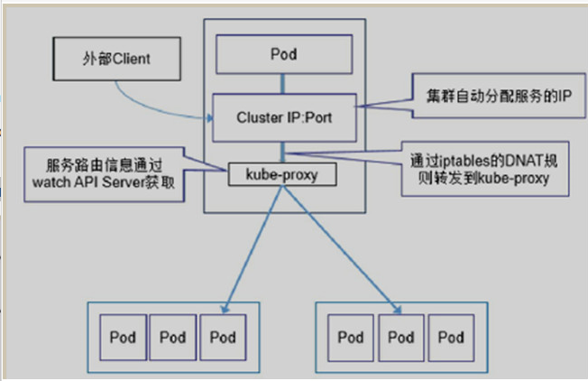

*集群内部通过 kube-proxy（Service）访问其他 Pod*

正如 MySQL 服务，可以被 Kubernetes 内部的 Tomcat 调用，那么 Tomcat 如何被 Kubernetes 外部调用？

先生成配置文件，myweb-rc.yaml 看看：

```yaml
apiVersion: V1
kind: ReplicationController
metadata:
 name: myweb #RC的名称，全局唯一
spec:
 replicas:2 #Pod 副本的期待数量，这里的数量是2，需要建立两个Tomcat的副本
selector :
app: myweb
 template: #Pod模版，用这个模版来创建Pod
metadata:
 labels:
app:myweb #Pod副本的标签
spec:
 containers: #容器定义部分
     -name:mysql
Image:kubeguide/tomcat-app:v1 #容器对应的DockerImage
      Ports:
      -containerPort:8080 #容器应用监听的端口号
```

在 kubectl 中使用 Create 建立 myweb 副本。


副本创建完毕以后，创建对应的服务配置文件 myweb-svc.yaml。

```yaml
piVersion : v1
kind: Service #说明创建资源对象的类型是Service
metadata:
 name: myweb #Service全局唯一名称
spec:
prots:
-port: 8080 #Service的服务端口号
nodePort: 30001 #这个就是外网访问Kubernetes内部应用的端口。
 selector: #Service对应的Pod标签，用来给Pod分类
   app: myweb
```

同样在 kubectl 中运行 Create 命令，建立 Service 资源。


从上面的配置文件可以看出，Tomcat 的 Service 中多了一个 nodePort 的配置，值为 30001。

也就是说外网通过 30001 这个端口加上 NodeIP 就可以访问 Tomcat 了。

运行命令之后，得到一个提示，大致意思是“如果你要将服务暴露给外网使用，你需要设置防火墙规则让 30001 端口能够通行。”

由于 Cluster-IP 是一个虚拟的 IP，仅供 Kubernetes 内部的 Pod 之间的通信。

Node 作为一个物理节点，因此需要使用 Node-IP 和 nodePort 的组合来从 Kubernetes 外面访问内部的应用。

如果按照上面的配置，部署了两个 Tomcat 应用，当外网访问时选择那个 Pod 呢？这里需要通过 Kubernetes 之外的负载均衡器来实现的。

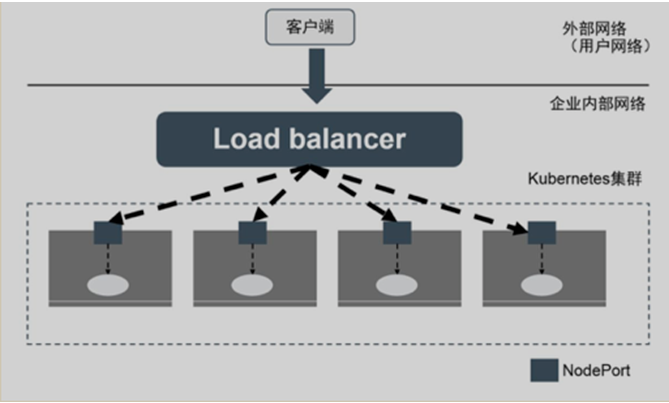

*Kubernetes 之外的负载均衡器*

可以通过 Kubernetes 的 LoadBlancerService 组件来协助实现。通过云平台申请创建负载均衡器，向外暴露服务。

目前 LoadBlancerService 组件支持的云平台比较完善，比如国外的 GCE、DigitalOcean，国内的阿里云，私有云 OpenStack 等等。

从用法上只要把 Service 的 type=NodePort 改为 type=LoadBalancer，Kubernetes 就会自动创建一个对应的 Load Balancer 实例并返回它的 IP 地址供外部客户端使用。

至此，MySQL（RC 1）和 Tomcat（RC 2）已经在 Kubernetes 部署了。并在 Kubernetes 内部 Pod 之间是可以互相访问的，在外网也可以访问到 Kubernetes 内部的 Pod。

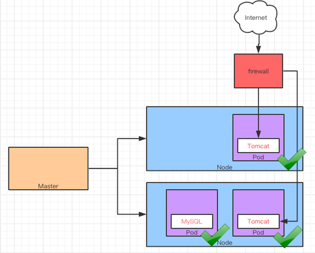

*Pod 在 Kubernetes 内互相访问，外网访问 Pod*

另外，作为资源监控 Kubernetes 在每个 Node 和容器上都运行了 cAdvisor。它是用来分析资源使用率和性能的工具，支持 Docker 容器。

kubelet 通过 cAdvisor 获取其所在 Node 及容器（Docker）的数据。cAdvisor 自动采集 CPU、内存、文件系统和网络使用的统计信息。

kubelet 作为 Node 的管理者，把 cAdvisor 采集上来的数据通过 RESTAPI 的形式暴露给 Kubernetes 的其他资源，让他们知道 Node/Pod 中的资源使用情况。

## 总结

由于微服务的迅猛发展，Kubernetes 作为微服务治理平台被广泛应用。由于其发展时间长，包含服务功能多我们无法一一列出。

因此，从一个简单的创建应用副本的例子入手，介绍了各个重要组件的概念和基本原理。

Kubernetes 是用来管理容器集群的，Master 作为管理者，包括 APIServer，Scheduler，Controller Manager。

Node作为副本部署的载体，包含多个 Pod，每个 Pod 又包含多个容器（container）。用户通过 kubectl 给 Master 中的 APIServer 下部署命令。

命令主体是以“.yaml”结尾的配置文件，包含副本的类型，副本个数，名称，端口，模版等信息。

APIServer 接受到请求以后，会分别进行以下操作：权限验证（包括特殊控制），取出需要创建的资源，保存副本信息到etcd。

APIServer 和 Controller Manager，Scheduler 以及 kubelete 之间通过 List-Watch 方式通信（事件发送与监听）。

Controller Manager 通过 etcd 获取需要创建资源的副本数，交由 Scheduler 进行策略分析。

最后 kubelet 负责最终的 Pod 创建和容器加载。部署好容器以后，通过 Service 进行访问，通过 cAdvisor 监控资源。