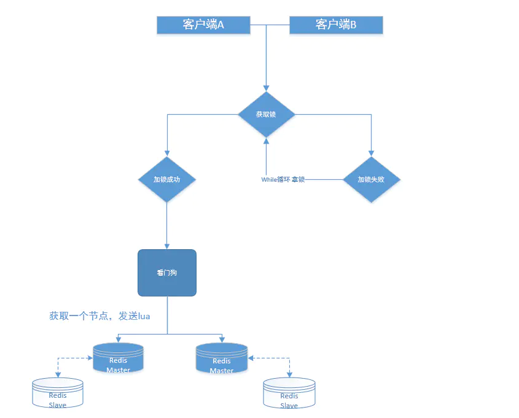
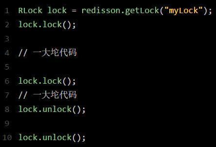

# 多路复用模型

## 常见的IO 模型(四种)

1. 同步阻塞IO（Blocking IO）：即传统的IO模型。
2. 同步非阻塞IO（Non-blocking IO）：默认创建的socket都是阻塞的，非阻塞IO要求socket被设置为NONBLOCK。
3. IO多路复用（IO Multiplexing）：也称为异步阻塞IO(经典的Reactor设计模式).Java中的Selector和Linux中的epoll都是这种模型。
4. 异步IO（Asynchronous IO）：即经典的Proactor设计模式，也称为异步非阻塞IO

# Redis 分布式锁的问题

- 锁未被释放（死锁问题）
- A 的锁被B 给释放了
- 数据库事物超时
- 锁过期了，业务还没执行完
- redis 主从复制的问题

# 理论知识

## 锁和分布式锁

### 锁

单线程程序中，存在多个线程同时操作一个公共变量。此时需要加锁对变量进行同步操作，保证多线程的操作线性执行，消除并发修改。**解决单进程（单体应用）的多线程并发问题**。

### 分布式锁

应用场景在集群模式的多个相同服务，可能部署在不同的机器之上，解决进程之间的安全问题。防止多个进程同时操作一个变量或者数据库。 **解决的是多个进程的并发问题**.

## redis 实现锁

在Redis2.6.12版本之前，使用setnx命令设置key-value、然后用expire命令设置key的过期时间获取分布式锁，使用del命令释放分布式锁，但是这种实现有如下一些问题：

### 锁未被释放（死锁问题）

setnx命令设置完key-value后，还没来得及使用expire命令设置过期时间，当前线程挂掉了，会导致当前线程设置的key一直有效，后续线程无法正常通过setnx获取锁，造成**死锁**；

**解决方案:**

问题原因：由于设置值和过期时间的添加非原子操作。

2.6.12之后的版本，set命令进行了增强 `SET key value [EX seconds] [PX milliseconds] [NX|XX]`

- `EX second` ：设置键的过期时间为 `second` 秒。 `SET key value EX second` 效果等同于 `SETEX key second value` 。
- `PX millisecond` ：设置键的过期时间为 `millisecond` 毫秒。 `SET key value PX millisecond` 效果等同于 `PSETEX key millisecond value` 。
- `NX` ：只在键不存在时，才对键进行设置操作。 `SET key value NX` 效果等同于 `SETNX key value` 。
- `XX` ：只在键已经存在时，才对键进行设置操作。

### B的锁被A 给释放了

在分布式环境下，进程A通过这种实现方式获取到了锁，但是在获取到锁之后，执行被阻塞，阻塞时间大于key超时时间导致该锁失效；之后进程B获取到该锁，之后进程A恢复执行，执行完成后释放该锁，将会把进程B的锁也释放掉。**也就是把他人的锁释放掉的问题，实际上还有另一个问题就是任务完成之前key失效的问题**；

**解决方案：**

这个问题也很好解决，只需要在value中存放一个**唯一标识符**，释放的时候判断是不是自己的标识符即可，如果是自己的，就可以释放


### redis 主从复制的问题

为了实现高可用，将会选择主从复制机制，但是主从复制机制是异步的，会出现**数据不同步**的问题，可能导致多个机器的多个线程获取到同一个锁。

**解决方案：**

使用官方推荐的 `redlock`，不采用主从复制

1. 获取当前Unix时间，以毫秒为单位
2. 依次尝试从N个实例，使用相同的key和随机值获取锁。当向Redis设置锁时，客户端应该设置一个网络连接和响应超时时间，这个超时时间应该小于锁的失效时间。例如你的锁自动失效时间为10秒，则超时时间应该在5-50毫秒之间。这样可以避免服务器端Redis已经挂掉的情况下，客户端还在死死地等待响应结果。如果服务器端没有在规定时间内响应，客户端应该尽快尝试另外一个Redis实例
3. 客户端使用当前时间减去开始获取锁时间（步骤1记录的时间）就得到获取锁使用的时间。当且仅当从大多数（这里是3个节点）的Redis节点都取到锁，并且使用的时间小于锁失效时间时，锁才算获取成功
4. 如果取到了锁，key的真正有效时间等于有效时间减去获取锁所使用的时间（步骤3计算的结果）
5. 如果因为某些原因，获取锁失败（没有在至少N/2+1个Redis实例取到锁或者取锁时间已经超过了有效时间），客户端应该在所有的Redis实例上进行解锁（即便某些Redis实例根本就没有加锁成功）。

# Redis 分布式锁的核心

一下操作，基于 jedis 包操作

## 加锁： 

`SET key value [EX seconds] [PX milliseconds] [NX|XX]`

代码实现：

```java
 public Boolean lock(String key,String value,Long timeOut){
     String var1 = jedis.set(key,value,"NX","EX",timeOut); //加锁，设置超时时间 原子性操作
     if(LOCK_SUCCESS.equals(var1)){
         return true;
     }
     return false;
 }
```

总的来说，执行上面的set()方法就只会导致两种结果：

1. 当前没有锁（key不存在），那么就进行加锁操作，并对锁设置个有效期，同时value表示加锁的客户端。
2. 已有锁存在，不做任何操作。

> 注：从2.6.12版本后, 就可以使用set来获取锁、Lua 脚本来释放锁。setnx是以前刚开始的实现方式，set命令nx、xx等参数,，就是为了实现 setnx 的功能。

## 释放锁

```java
public Boolean redisUnLock(String key, String value) {
    String luaScript = "if redis.call('get',KEYS[1]) == ARGV[1] then return redis.call('del',KEYS[1]) else  return 0 end";

    Object var2 = jedis.eval(luaScript, Collections.singletonList(key), Collections.singletonList(value));
    if (UNLOCK_SUCCESS == var2) {
        return true;
    }
    return false;
}
```

lua代码的意思：首先获取锁对应的value值，检查是否与输入的value相等，如果相等则删除锁（解锁）。

## Redission 分布式锁的原理

官方： Redisson是一个在Redis的基础上实现的Java驻内存数据网格。

就是在Redis的基础上封装了很多功能，以便于我们更方便的使用。

只需要三行代码：

```java
RLock lock = redisson.getLock("myLock");
lock.lock(); //加锁
lock.unlock(); //解锁
```

## 加锁机制

- 加锁流程



redisson的`lock()、tryLock()方法` 底层 其实是发送一段lua脚本到一台服务器：

因为一大坨复杂的业务逻辑，可以通过封装在lua脚本中发送给redis，保证这段复杂业务逻辑执行的**原子性**。

```shell
if (redis.call('exists' KEYS[1]) == 0) then  +  --  exists 判断key是否存在
       redis.call('hset' KEYS[1] ARGV[2] 1);  +   --如果不存在，hset存哈希表
       redis.call('pexpire' KEYS[1] ARGV[1]);  + --设置过期时间
       return nil;  +                            -- 返回null 就是加锁成功
          end;  +
          if (redis.call('hexists' KEYS[1] ARGV[2]) == 1) then  + -- 如果key存在，查看哈希表中是否存在(当前线程)
              redis.call('hincrby' KEYS[1] ARGV[2] 1);  + -- 给哈希中的key加1，代表重入1次，以此类推
              redis.call('pexpire' KEYS[1] ARGV[1]);  + -- 重设过期时间
              return nil;  +
          end;  +
          return redis.call('pttl' KEYS[1]); --如果前面的if都没进去，说明ARGV[2]的值不同，也就是不是同一线程的锁，这时候直接返回该锁的过期时间

```

参数解释：

**KEYS[1]：即加锁的key，**`RLock lock = redisson.getLock("myLock")`; 中的myLock

**ARGV[1]：即 TimeOut** 锁key的默认生存时间，默认30秒

**ARGV[2]：**代表的是加锁的客户端的ID，类似于这样的：`99ead457-bd16-4ec0-81b6-9b7c73546469:1`

这段lua脚本是什么意思呢？这里**KEYS[1]**代表的是你加锁的那个key，比如说：RLock lock = redisson.getLock("myLock");这里你自己设置了加锁的那个锁key就是“myLock”。

**ARGV[1]**代表的就是锁key的默认生存时间，默认30秒。**ARGV[2]**代表的是加锁的客户端的ID，类似于下面这样：8743c9c0-0795-4907-87fd-6c719a6b4586:1

给大家解释一下，第一段if判断语句，就是用“**exists myLock**”命令判断一下，如果你要加锁的那个锁key不存在的话，你就进行加锁。如何加锁呢？很简单，**用下面的命令**：hset myLock

8743c9c0-0795-4907-87fd-6c719a6b4586:1 1，通过这个命令设置一个hash数据结构，这行命令执行后，会出现一个类似下面的数据结构：


上述就代表“8743c9c0-0795-4907-87fd-6c719a6b4586:1”这个客户端对“myLock”这个锁key完成了加锁。接着会执行“**pexpire myLock 30000**”命令，设置myLock这个锁key的**生存时间是30秒**。好了，到此为止，ok，加锁完成了。

## 锁互斥

假如客户端A已经拿到了 `myLock`，现在 有一客户端（未知） 想进入：

1、第一个if判断会执行“`exists myLock`”，发现myLock这个锁key已经存在了。
 2、第二个if判断，判断一下，`myLock`锁key的hash数据结构中， 如果是客户端A重新请求，证明当前是同一个客户端同一个线程重新进入，所以可从入标志+1，重新刷新生存时间（可重入）； 否则进入下一个if。
 3、第三个if判断，客户端B 会获取到`pttl myLock`返回的一个数字，这个数字代表了`myLock`这个锁key的剩余生存时间。比如还剩15000毫秒的生存时间。

此时客户端B会进入一个while循环，不停的尝试加锁。

## watch dog自动延期机制

官方介绍：

> lockWatchdogTimeout（监控锁的看门狗超时，单位：毫秒）
>
> 默认值：30000
>
> 监控锁的看门狗超时时间单位为毫秒。该参数只适用于分布式锁的加锁请求中**未明确使用leaseTimeout参数的情况**。(如果设置了**leaseTimeout那就会自动失效了呀~**)

看门狗的时间可以自定义设置：


```java
config.setLockWatchdogTimeout(30000);
```

**看门狗有什么用呢？**

假如客户端A在超时时间内还没执行完毕怎么办呢？ redisson于是提供了这个看门狗，如果还没执行完毕，监听到这个客户端A的线程还持有锁，就去续期，默认是  LockWatchdogTimeout/ 3 即 10 秒监听一次，如果还持有，就不断的延长锁的有效期（重新给锁设置过期时间，30s）

可以在lock的参数里面指定：


```java
lock.lock(); //如果不设置，默认的生存时间是30s，启动看门狗 
lock.lock(10, TimeUnit.SECONDS);//10秒以后自动解锁，不启动看门狗，锁到期不续
```

如果是使用了可重入锁（  **leaseTimeout**）：


```java
lock.tryLock(); //如果不设置，默认的生存时间是30s，启动看门狗 
lock.tryLock(100, 10, TimeUnit.SECONDS);//尝试加锁最多等待100秒，上锁以后10秒自动解锁，不启动看门狗
```

> 这里的第二个参数**leaseTimeout** 设置为 10 就会覆盖 看门狗的设置（看门狗无效），在10秒后锁就自动失效，不会去续期；如果是 -1 ，就表示 使用看门狗的默认值。

## 可重入加锁机制

那如果客户端1都已经持有了这把锁了，结果可重入的加锁会怎么样呢？比如下面这种代码：



这时我们来分析一下上面那段lua脚本。**第一个if判断肯定不成立**，“exists myLock”会显示锁key已经存在了。**第二个if判断会成立**，因为myLock的hash数据结构中包含的那个ID，就是客户端1的那个ID，也就是“8743c9c0-0795-4907-87fd-6c719a6b4586:1”

此时就会执行可重入加锁的逻辑，他会用：

incrby myLock 8743c9c0-0795-4907-87fd-6c71a6b4586:1 1 ，通过这个命令，对客户端1的加锁次数，累加1。此时myLock数据结构变为下面这样：


大家看到了吧，那个myLock的hash数据结构中的那个客户端ID，就对应着加锁的次数

## 释放锁机制

lock.unlock()，就可以释放分布式锁。就是每次都对myLock数据结构中的那个加锁次数减1。

如果发现加锁次数是0了，说明这个客户端已经不再持有锁了，此时就会用：“`del myLock`”命令，从redis里删除这个key。

为了安全，会先校验是否持有锁再释放，防止

- 业务执行还没执行完，锁到期了。（此时没占用锁，再unlock就会报错）
- 主线程异常退出、或者假死

```java
finally {
    if (rLock.isLocked()) {
        if (rLock.isHeldByCurrentThread()) {
            rLock.unlock();
        }
    }
}
```

# 缺点

如果是 主从、哨兵模式，当客户端A 把 `myLock`这个锁 `key` 的`value`写入了 `master`，此时会异步复制给`slave`实例。

那么这个时候 `slave`还没来得及加锁，此时 客户端A的`myLock`的 值是没有的，客户端B在请求时，`myLock`却成功为自己加了锁。这时候分布式锁就失效了，就会导致数据有问题。

所以这个就是redis cluster，或者是redis master-slave架构的主从异步复制导致的redis分布式锁的最大缺陷：**在redis master实例宕机的时候，可能导致多个客户端同时完成加锁**。不过这种几率还是很小的。

# 参考

- https://www.jianshu.com/p/0f80fe21292d
- https://juejin.cn/post/6844903717641142285