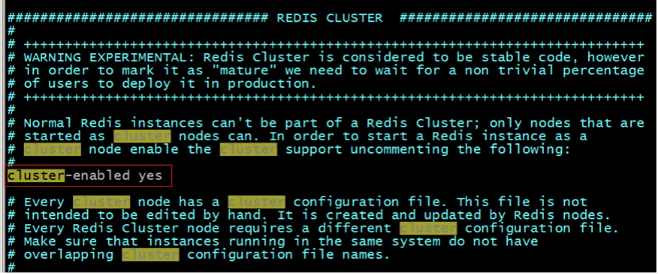
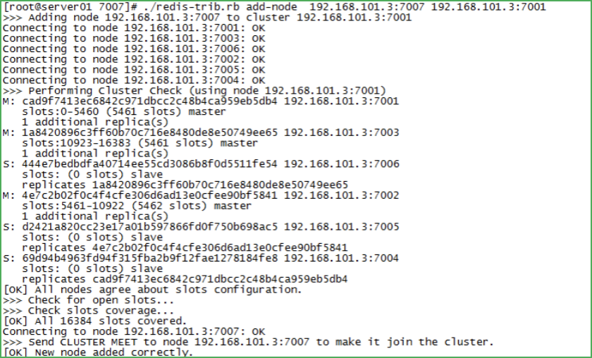
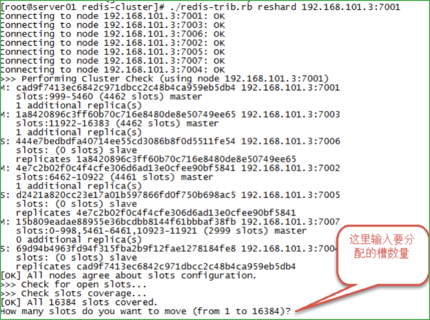
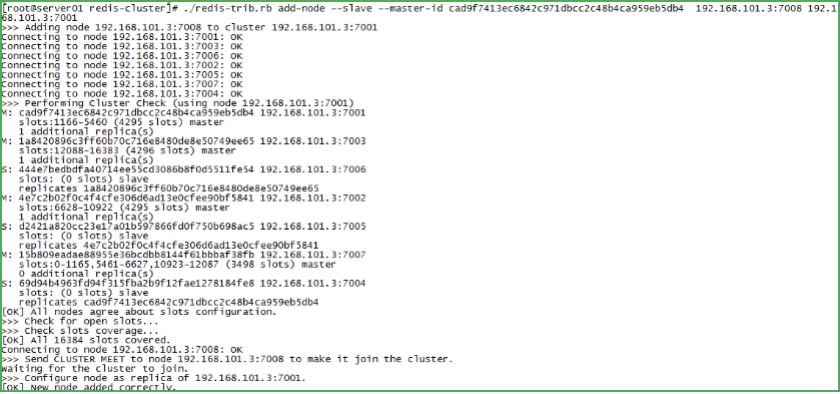

## 导读

　　redis集群需要使用**集群管理脚本redis-trib.rb**，它的执行相应依赖ruby环境。

## 安装

### 安装ruby

```
yum install ruby
yum install rubygems
```

### 将redis-3.2.9.gen拖近Linux系统

### 安装ruby和redis的接口程序redis-3.2.9.gem

```
gem install redis-3.2.9.gem
```

### 复制redis-3.2.9/src/redis-trib.rb 文件到/usr/local/redis目录

```
cp redis-3.2.9/src/redis-trib.rb /usr/local/redis/ -r
```

## 安装Redis集群(RedisCluster)

　　Redis集群最少需要三台主服务器,三台从服务器,端口号分别为7001~7006。

### 创建7001实例，并编辑redis.conf文件，修改port为7001。[#](https://www.cnblogs.com/chenyanbin/p/12073107.html#创建7001实例，并编辑redis.conf文件，修改port为7001。)

[

### 修改redis.conf配置文件，打开Cluster-enable yes

[

 

###  重复以上2个步骤，完成7002~7006实例的创建，注意端口修改

### 启动所有的实例

### 创建Redis集群

```
./redis-trib.rb create --replicas 1 192.168.242.129:7001 192.168.242.129:7002 192.168.242.129:7003 192.168.242.129:7004 192.168.242.129:7005  192.168.242.129:7006
>>> Creating cluster
Connecting to node 192.168.242.129:7001: OK
Connecting to node 192.168.242.129:7002: OK
Connecting to node 192.168.242.129:7003: OK
Connecting to node 192.168.242.129:7004: OK
Connecting to node 192.168.242.129:7005: OK
Connecting to node 192.168.242.129:7006: OK
>>> Performing hash slots allocation on 6 nodes...
Using 3 masters:
192.168.242.129:7001
192.168.242.129:7002
192.168.242.129:7003
Adding replica 192.168.242.129:7004 to 192.168.242.129:7001
Adding replica 192.168.242.129:7005 to 192.168.242.129:7002
Adding replica 192.168.242.129:7006 to 192.168.242.129:7003
M: d8f6a0e3192c905f0aad411946f3ef9305350420 192.168.242.129:7001
   slots:0-5460 (5461 slots) master
M: 7a12bc730ddc939c84a156f276c446c28acf798c 192.168.242.129:7002
   slots:5461-10922 (5462 slots) master
M: 93f73d2424a796657948c660928b71edd3db881f 192.168.242.129:7003
   slots:10923-16383 (5461 slots) master
S: f79802d3da6b58ef6f9f30c903db7b2f79664e61 192.168.242.129:7004
   replicates d8f6a0e3192c905f0aad411946f3ef9305350420
S: 0bc78702413eb88eb6d7982833a6e040c6af05be 192.168.242.129:7005
   replicates 7a12bc730ddc939c84a156f276c446c28acf798c
S: 4170a68ba6b7757e914056e2857bb84c5e10950e 192.168.242.129:7006
   replicates 93f73d2424a796657948c660928b71edd3db881f
Can I set the above configuration? (type 'yes' to accept): yes
>>> Nodes configuration updated
>>> Assign a different config epoch to each node
>>> Sending CLUSTER MEET messages to join the cluster
Waiting for the cluster to join....
>>> Performing Cluster Check (using node 192.168.242.129:7001)
M: d8f6a0e3192c905f0aad411946f3ef9305350420 192.168.242.129:7001
   slots:0-5460 (5461 slots) master
M: 7a12bc730ddc939c84a156f276c446c28acf798c 192.168.242.129:7002
   slots:5461-10922 (5462 slots) master
M: 93f73d2424a796657948c660928b71edd3db881f 192.168.242.129:7003
   slots:10923-16383 (5461 slots) master
M: f79802d3da6b58ef6f9f30c903db7b2f79664e61 192.168.242.129:7004
   slots: (0 slots) master
   replicates d8f6a0e3192c905f0aad411946f3ef9305350420
M: 0bc78702413eb88eb6d7982833a6e040c6af05be 192.168.242.129:7005
   slots: (0 slots) master
   replicates 7a12bc730ddc939c84a156f276c446c28acf798c
M: 4170a68ba6b7757e914056e2857bb84c5e10950e 192.168.242.129:7006
   slots: (0 slots) master
   replicates 93f73d2424a796657948c660928b71edd3db881f
[OK] All nodes agree about slots configuration.
>>> Check for open slots...
>>> Check slots coverage...
[OK] All 16384 slots covered.
[root@localhost-0723 redis]#
```

### 命令客户端连接集群

命令：

```
./redis-cli -h 127.0.0.1 -p 7001 -c


注：-c表示是以redis集群方式进行连接
./redis-cli -p 7006 -c
127.0.0.1:7006> set key1 123
-> Redirected to slot [9189] located at 127.0.0.1:7002
OK
127.0.0.1:7002>
```

### 查看集群的命令

#### 查看集群状态

```
127.0.0.1:7003> cluster info
cluster_state:ok
cluster_slots_assigned:16384
cluster_slots_ok:16384
cluster_slots_pfail:0
cluster_slots_fail:0
cluster_known_nodes:6
cluster_size:3
cluster_current_epoch:6
cluster_my_epoch:3
cluster_stats_messages_sent:926
cluster_stats_messages_received:926
```

#### 查看集群中的节点

```
127.0.0.1:7003> cluster nodes
7a12bc730ddc939c84a156f276c446c28acf798c 127.0.0.1:7002 master - 0 1443601739754 2 connected 5461-10922
93f73d2424a796657948c660928b71edd3db881f 127.0.0.1:7003 myself,master - 0 0 3 connected 10923-16383
d8f6a0e3192c905f0aad411946f3ef9305350420 127.0.0.1:7001 master - 0 1443601741267 1 connected 0-5460
4170a68ba6b7757e914056e2857bb84c5e10950e 127.0.0.1:7006 slave 93f73d2424a796657948c660928b71edd3db881f 0 1443601739250 6 connected
f79802d3da6b58ef6f9f30c903db7b2f79664e61 127.0.0.1:7004 slave d8f6a0e3192c905f0aad411946f3ef9305350420 0 1443601742277 4 connected
0bc78702413eb88eb6d7982833a6e040c6af05be 127.0.0.1:7005 slave 7a12bc730ddc939c84a156f276c446c28acf798c 0 1443601740259 5 connected
127.0.0.1:7003>
```

### 维护节点

　　**集群创建完成后可以继续向集群中添加节点**。

#### 添加主节点

##### 添加7007节点作为新节点

命令：**./redis-trib.rb add-node 127.0.0.1:7007 127.0.0.1:7001**

[

#### 查看集群节点发现7007已加到集群中 

[

 

###  hash槽重新分配[#](https://www.cnblogs.com/chenyanbin/p/12073107.html# hash槽重新分配)

　　**添加完主节点需要对主节点进行hash槽分配，这样该主节才可以存储数据**。

### 查看集群中槽占用情况[#](https://www.cnblogs.com/chenyanbin/p/12073107.html#查看集群中槽占用情况)

　　redis集群有16384个槽，集群中的每个节点分配自己槽，通过查看集群节点可以看到槽占用情况。

[

 

####  给刚添加的7007节点分配槽

第一步：连上集群(连接集群中任意一个可用节点都行)

```
./redis-trib.rb reshard 192.168.101.3:7001
```

第二步：输入要分配的槽数量

[](

 

 **输入500，表示要分配500个槽**

第三步：输入接收槽的节点id

[

 

输入：15b809eadae88955e36bcdbb8144f61bbbaf38fb

ps：这里准备给7007分配槽，通过cluster node查看7007节点id为：

15b809eadae88955e36bcdbb8144f61bbbaf38fb

第四步：输入源节点id

[

 

 输入：all

第五步：输入yes开始移动槽到目标节点id

[

 

 输入：yes

### 添加从节点

　　添加7008从节点，将7008作为7007的从节点

命令：

```
./redis-trib.rb add-node --slave --master-id  主节点id   新节点的ip和端口   旧节点ip和端口
```

执行如下命令：

```
./redis-trib.rb add-node --slave --master-id cad9f7413ec6842c971dbcc2c48b4ca959eb5db4  192.168.101.3:7008 192.168.101.3:7001
```

**cad9f7413ec6842c971dbcc2c48b4ca959eb5db4** 是7007结点的id，可通过cluster nodes查看。

#### nodes查看

[

 

注意：如果原来该节点在集群中的配置信息已经生成到cluster-config-file指定的配置文件中(如果cluster-config-file没有指定则默认为**nodes.conf**)，这时可能会报错 

```
[ERR] Node XXXXXX is not empty. Either the node already knows other nodes (check with CLUSTER NODES) or contains some key in database 0
```

**解决办法是删除生成的配置文件nodes.conf，删除后再执行./redis-trib.rb add-node指令**

### 查看集群中的节点，刚添加7008为7007的从节点

[

 

###  删除节点

命令：

```
./redis-trib.rb del-node 127.0.0.1:7005 4b45eb75c8b428fbd77ab979b85080146a9bc017
```

删除已经占用hash槽的节点会失败，报错如下

```
[ERR] Node 127.0.0.1:7005 is not empty! Reshard data away and try again.
```

需要将该节点占用的hash槽分配出去