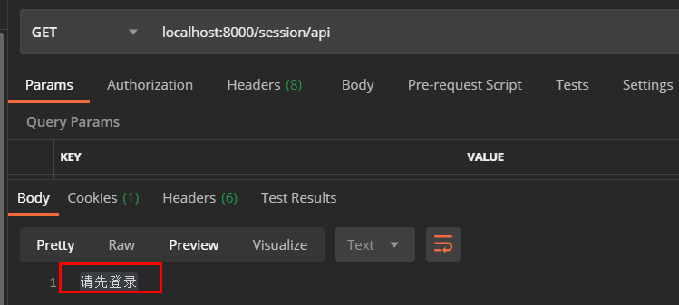
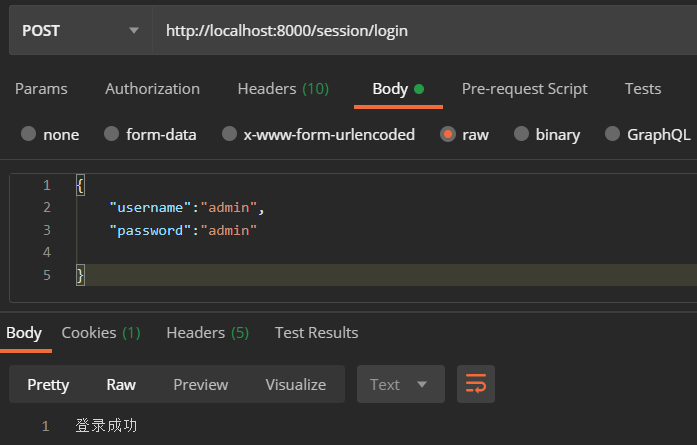
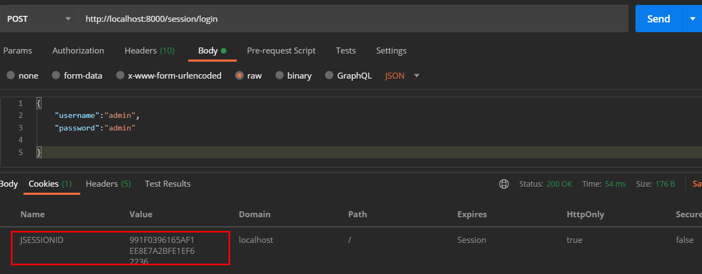
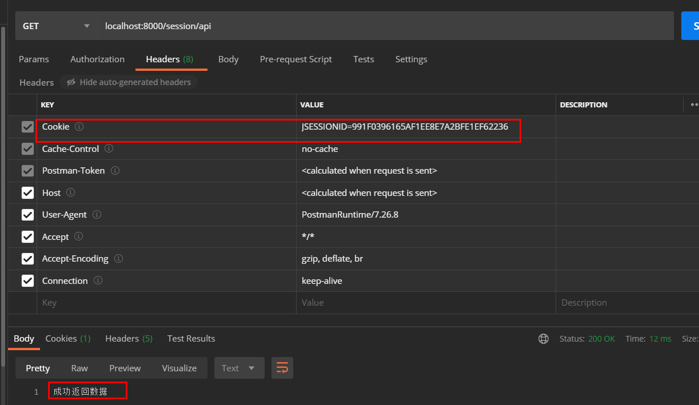
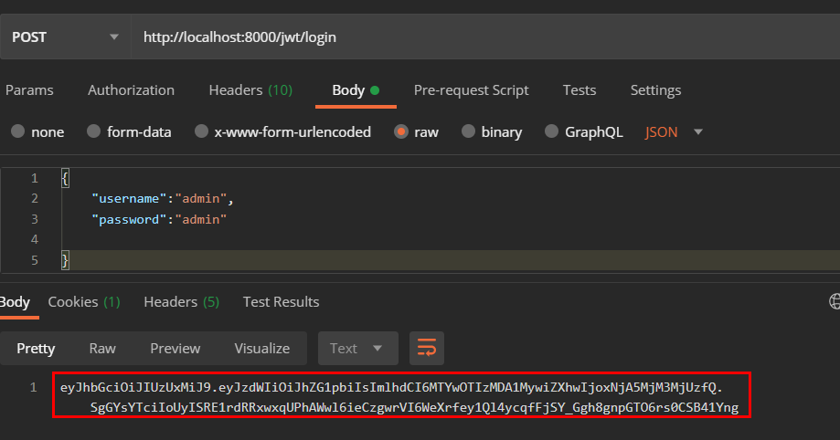
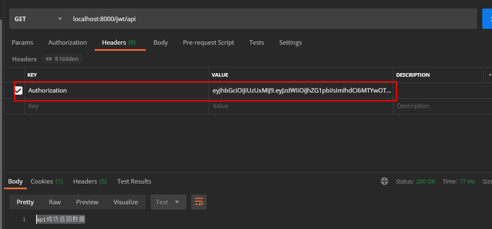

# 概述

- 登录认证： Authentication
- 权限授权：Authorization

## 概要

- 登录认证的原理
- 如何使用session 和jwt 分别完成权限校验
- 如何通过过滤器和拦截器分别完成对登录认证的统一处理
- 如何实现上下文对象

<!--more-->

# 基础知识

登录认证（Authentication）的概念

- web系统中有一个重要的概念就是：HTTP 请求是一个无状态的协议。浏览器每一次发送的请求都是独立的，对于服务器来说你每次的请求都是“新客”，它不记得你曾经有没有来过。
- 那怎样才能让服务器记住你的登录状态呢？那就是凭证！登录之后每一次请求都携带一个登录凭证来告诉服务器我是谁。

现在流行的登录认证方式：**Session** 和 **JWT**，无论是哪种方式其原理都是 Token 机制，即保存凭证：

1. 前端发起登录认证请求；
2. 后端登录验证通过，返回给前端一个**凭证**；
3. 前端发起新的请求时携带**凭证**。

# 代码实现

搭建springBoot 项目 `zbcn-authentication`

- 引入pom依赖

```xml
<dependency>
    <groupId>org.springframework.boot</groupId>
    <artifactId>spring-boot-starter-web</artifactId>
</dependency>
```

- 创建一个实体类来模拟用户

```java
@Data
public class User {
    private String username;
    private String password;
}
```

## Session

Session 是一种有状态的会话管理机制，其目的就是为了解决HTTP无状态请求带来的问题。当用户登录认证请求通过时，服务端会将用户的信息存储起来，并生成一个 Session Id 发送给前端，前端将这个 Session Id 保存起来（一般是保存在 Cookie 中）。之后前端再发送请求时都携带 Session Id，服务器端再根据这个 Session Id 来检查该用户有没有登录过：


### 基本功能

用代码来实现具体功能，非常简单，我们只需要在用户登录的时候将用户信息存在 HttpSession 中就完成了：

```java
@RestController
@RequestMapping("/session")
public class SessionController {

    @PostMapping("/login")
    public String login(@RequestBody User user, HttpSession httpSession){
        // 判断账号密码是否正确，这一步肯定是要读取数据库中的数据来进行校验的，这里为了模拟就省去了
        if("admin".equals(user.getUsername()) && "admin".equals(user.getPassword())){
            //正确的话，将用户信息存储到session中
            httpSession.setAttribute("user", user);
            return "登录成功";
        }
        return "用户名或者密码错误";
    }

    @GetMapping("/logout")
    public String logout(HttpSession session) {
        // 退出登录就是将用户信息删除
        session.removeAttribute("user");
        return "退出成功";
    }
}
```

在后续会话中，用户访问其他接口就可以检查用户是否已经登录认证：

```java
@RestController
@RequestMapping("/session")
public class BusiController {

    @GetMapping("/api")
    public String api(HttpSession session) {
        // 模拟各种api，访问之前都要检查有没有登录，没有登录就提示用户登录
        User user = (User) session.getAttribute("user");
        if (user == null) {
            return "请先登录";
        }
        // 如果有登录就调用业务层执行业务逻辑，然后返回数据
        return "成功返回数据";
    }

    @GetMapping("/api2")
    public String api2(HttpSession session) {
        // 模拟各种api，访问之前都要检查有没有登录，没有登录就提示用户登录
        User user = (User) session.getAttribute("user");
        if (user == null) {
            return "请先登录";
        }
        // 如果有登录就调用业务层执行业务逻辑，然后返回数据
        return "成功返回数据";
    }
}
```

### 测试

- 登录前，访问 接口 `localhost:8000/session/api`



- 访问登录接口 `http://localhost:8000/session/login`



注意返回值Cookie 中带了 JSESSIONID 信息：如果用户第一次访问某个服务器时，服务器响应数据时会在响应头的 Set-Cookie 标识里将 Session Id 返回给浏览器，浏览器就将标识中的数据存在 Cookie 中：



- 然后再访问接口 `localhost:8000/session/api` 都带了 cookie



### 过滤器

除了登录接口外，我们其他接口都要在 Controller 层里做登录判断，这太麻烦了。我们完全可以对每个接口过滤拦截一下，判断有没有登录，如果没有登录就直接结束请求，登录了才放行。这里我们通过过滤器来实现：

```java
@Component
public class LoginFilter extends OncePerRequestFilter {
    @Override
    protected void doFilterInternal(HttpServletRequest request, HttpServletResponse response, FilterChain filterChain) throws ServletException, IOException {
        // 简单的白名单，登录这个接口直接放行
        if ("/session/login".equals(request.getRequestURI())) {
            filterChain.doFilter(request, response);
            return;
        }

        // 已登录就放行
        User user = (User) request.getSession().getAttribute("user");
        if (user != null) {
            filterChain.doFilter(request, response);
            return;
        }

        // 走到这里就代表是其他接口，且没有登录
        // 设置响应数据类型为json（前后端分离）
        response.setContentType("application/json;charset=utf-8");
        PrintWriter out = response.getWriter();
        // 设置响应内容，结束请求
        out.write("请先登录");
        out.flush();
        out.close();
    }
}
```

 这时我们 Controller 层就可以去除多余的登录判断逻辑了：

```java
@RestController
@RequestMapping("/session")
public class BusiController {

    @GetMapping("/api")
    public String api() {
        // 如果有登录就调用业务层执行业务逻辑，然后返回数据
        return "成功返回数据";
    }

    @GetMapping("/api2")
    public String api2() {
        // 如果有登录就调用业务层执行业务逻辑，然后返回数据
        return "成功返回数据";
    }
}
```

经过测试，过滤器生效了。

## 上下文对象

有些情况，我们需要在业务中使用session 信息，如果 使用 `HttpSession session` 参数，未免太麻烦。我们可以通过 SpringMVC 提供的 RequestContextHolder 对象在程序任何地方获取到当前请求对象，从而获取我们保存在 HttpSession 中的用户对象。我们可以写一个上下文对象来实现该功能：

```java
public class RequestContext {

    public static HttpServletRequest getCurrentRequest(){
        // 通过`RequestContextHolder`获取当前request请求对象
        HttpServletRequest request = ((ServletRequestAttributes) RequestContextHolder.currentRequestAttributes()).getRequest();
        return request;
    }

    public static User getCurrentUser() {
        // 通过request对象获取session对象，再获取当前用户对象
        return (User)getCurrentRequest().getSession().getAttribute("user");
    }
}
```

获取用户信息的service

```java
@Service
public class BusiService {

    public void doSomeThing(){
        User currentUser = RequestContext.getCurrentUser();
        System.out.println("处理业务：" + JSONObject.toJSONString(currentUser));
    }
}
```

### 校验功能

略


## JWT（JSON WEB TOKEN）

除了 Session 之外，目前比较流行的做法就是使用 JWT（JSON Web Token）

- 可以将一段数据加密成一段字符串，也可以从这字符串解密回数据；
- 可以对这个字符串进行校验，比如有没有过期，有没有被篡改。

当用户登录成功的时候，服务器生成一个 JWT 字符串返回给浏览器，浏览器将JWT保存起来，在之后的请求中都携带上 JWT，服务器再对这个 JWT 进行校验，校验通过的话就代表这个用户登录了：


和 Session 一样，就是把 Session Id 换成了 JWT 字符串而已.

无论哪种方式其核心都是 Token 机制。但 Session 和 JWT 有一个重要的区别，就是 **Session 是有状态的，JWT 是无状态的**。

Session 在服务端保存了用户信息，而 JWT 在服务端没有保存任何信息。当前端携带 Session Id 到服务端时，服务端要检查其对应的 HttpSession 中有没有保存用户信息，保存了就代表登录了。当使用 JWT 时，服务端只需要对这个字符串进行校验，校验通过就代表登录了。

### 代码演示

要用到 JWT 先要导入一个依赖项，在pom.xml 中添加依赖

```xml
<dependency>
    <groupId>io.jsonwebtoken</groupId>
    <artifactId>jjwt</artifactId>
    <version>0.9.1</version>
</dependency>
```

- 编写jwt 工具类

```java

public final class JwtUtil {
    /**
     * 这个秘钥是防止JWT被篡改的关键，随便写什么都好，但决不能泄露
     */
    private final static String secretKey = "whatever";
    /**
     * 过期时间目前设置成2天，这个配置随业务需求而定
     */
    private final static Duration expiration = Duration.ofHours(2);

    /**
     * 生成JWT
     * @param userName 用户名
     * @return JWT
     */
    public static String generate(String userName) {
        // 过期时间
        Date expiryDate = new Date(System.currentTimeMillis() + expiration.toMillis());

        return Jwts.builder()
                .setSubject(userName) // 将userName放进JWT
                .setIssuedAt(new Date()) // 设置JWT签发时间
                .setExpiration(expiryDate)  // 设置过期时间
                .signWith(SignatureAlgorithm.HS512, secretKey) // 设置加密算法和秘钥
                .compact();
    }

    /**
     * 解析JWT
     * @param token JWT字符串
     * @return 解析成功返回Claims对象，解析失败返回null
     */
    public static Claims parse(String token) {
        // 如果是空字符串直接返回null
        if (StringUtils.isEmpty(token)) {
            return null;
        }
    
        // 这个Claims对象包含了许多属性，比如签发时间、过期时间以及存放的数据等
        Claims claims = null;
        // 解析失败了会抛出异常，所以我们要捕捉一下。token过期、token非法都会导致解析失败
        try {
            claims = Jwts.parser()
                    .setSigningKey(secretKey) // 设置秘钥
                    .parseClaimsJws(token)
                    .getBody();
        } catch (JwtException e) {
            // 这里应该用日志输出，为了演示方便就直接打印了
            System.err.println("解析失败！");
        }
        return claims;
    }
}
```

- 登陆入口 JwtController

```java
@RestController
@RequestMapping("/jwt")
public class JwtController {

    @PostMapping("/login")
    public String login(@RequestBody User user){
        // 判断账号密码是否正确，这一步肯定是要读取数据库中的数据来进行校验的，这里为了模拟就省去了
        if("admin".equals(user.getUsername()) && "admin".equals(user.getPassword())){
            // 如果正确的话就返回生成的token（注意哦，这里服务端是没有存储任何东西的）
            return JwtUtil.generate(user.getUsername());
        }
        return "用户名或者密码错误";
    }
}
```

用户访问其他接口时就可以校验 token 来判断其是否已经登录。前端将 token 一般会放在请求头的 Authorization 项传递过来，其格式一般为**类型 + token**。这个倒也不是一定得这么做，你放在自己自定义的请求头项也可以，只要和前端约定好就行。这里我们方便演示就将 token 直接放在 Authorization 项里了：

```java
@RestController
@RequestMapping("/jwt")
public class JwtBusiController {

    @GetMapping("/api")
    public String api(HttpServletRequest request) {
        // 从请求头中获取token字符串
        String jwt = request.getHeader("Authorization");
        // 解析失败就提示用户登录
        if (JwtUtil.parse(jwt) == null) {
            return "请先登录";
        }
        // 解析成功就执行业务逻辑返回数据
        return "api成功返回数据";
    }
}
```

#### 测试效果

先将之前的session 方式登陆认证的拦截器 注释掉，即注释掉 `com.zbcn.zbcnauthentication.session.filter.LoginFilter` 的 `@Component` 注解即可。

- 访问：`http://localhost:8000/jwt/api` . 提示先 登陆新信息
- 访问登陆页面，获取token信息 `http://localhost:8000/jwt/login`



- 我们将这个token设置到请求头中再调用其他接口看看效果：



### 拦截器

和之前一样，如果每个接口都要手动判断一下用户有没有登录太麻烦了，所以我们做一个统一处理，这里我们换个花样用拦截器来做：

```java
public class LoginInterceptor implements AsyncHandlerInterceptor {

    @Override
    public boolean preHandle(HttpServletRequest request, HttpServletResponse response, Object handler)
            throws Exception {
        // 简单的白名单，登录这个接口直接放行
        if ("/jwt/login".equals(request.getRequestURI())) {
            System.out.println("白名单，不需要拦截");
            return true;
        }
        // 从请求头中获取token字符串并解析
        Claims claims = JwtUtil.parse(request.getHeader("Authorization"));
        // 已登录就直接放行
        if (claims != null) {
            System.out.println("已经登陆，直接放行");
            return true;
        }
        System.out.println("未登陆，请重新登陆");
        // 走到这里就代表是其他接口，且没有登录
        // 设置响应数据类型为json（前后端分离）
        response.setContentType("application/json;charset=utf-8");
        PrintWriter out = response.getWriter();
        // 设置响应内容，结束请求
        out.write("请先登录");
        out.flush();
        out.close();
        return false;
    }
}
```

通过配置config 来添加拦截器

```java
@Configuration
public class InterceptionConfig implements WebMvcConfigurer {

    @Override
    public void addInterceptors(InterceptorRegistry registry) {
        registry.addInterceptor(new LoginInterceptor());
    }
}
```

业务接口简化

```java
@RestController
@RequestMapping("/jwt")
public class JwtBusiController {

    @GetMapping("/api")
    public String api(HttpServletRequest request) {
        // 解析成功就执行业务逻辑返回数据
        return "api成功返回数据";
    }

    @GetMapping("/api2")
    public String api2(HttpServletRequest request) {
        return "成功返回数据";
    }
}
```

### 全局对象

统一拦截做好之后接下来就是我们的上下文对象，JWT 不像 Session 把用户信息直接存储起来，所以 JWT 的上下文对象要靠我们自己来实现。

首先我们定义一个上下文类，这个类专门存储 JWT 解析出来的用户信息。我们要用到 ThreadLocal，以防止线程冲突：

```java
public final class UserContext {

    private static final ThreadLocal<String> user = new ThreadLocal<String>();

    public static void add(String userName) {
        user.set(userName);
    }

    public static void remove() {
        user.remove();
    }

    /**
     * @return 当前登录用户的用户名
     */
    public static String getCurrentUserName() {
        return user.get();
    }
}
```


在拦截器里做下处理：

```java
public class LoginInterceptor implements AsyncHandlerInterceptor {

    @Override
    public boolean preHandle(HttpServletRequest request, HttpServletResponse response, Object handler)
            throws Exception {
        // 简单的白名单，登录这个接口直接放行
        if ("/jwt/login".equals(request.getRequestURI())) {
            System.out.println("白名单，不需要拦截");
            return true;
        }
        // 从请求头中获取token字符串并解析
        Claims claims = JwtUtil.parse(request.getHeader("Authorization"));
        // 已登录就直接放行
        if (claims != null) {
            // 将我们之前放到token中的userName给存到上下文对象中
            UserContext.add(claims.getSubject());
            System.out.println("已经登陆，直接放行");
            return true;
        }
      ..... //省略其他代码
    }

    @Override
    public void afterCompletion(HttpServletRequest request, HttpServletResponse response, Object handler, Exception ex) throws Exception {
        // 请求结束后要从上下文对象删除数据，如果不删除则可能会导致内存泄露
        UserContext.remove();
    }
}
```

编写 jwtBusiService,使用全局对象

```java
@Service
public class JwtBusiService {

    public void doSomeThing(){
        String currentUserName = UserContext.getCurrentUserName();
        System.out.println("处理业务：" + currentUserName);
    }
}
```

业务接口中编写调用方法

```java
@RestController
@RequestMapping("/jwt")
public class JwtBusiController {

    @Autowired
    private JwtBusiService jwtBusiService;

    @GetMapping("/api")
    public String api(HttpServletRequest request) {
        // 解析成功就执行业务逻辑返回数据
        jwtBusiService.doSomeThing();
        return "api成功返回数据";
    }
}
```

### 测试

略

### 说明

本文只是讲解了基本的登录认证功能实现，还有很多很多细节没有提及，比如密码加密、防 XSS/CSRF 攻击等

演示的 JWT 是只存放了用户名，实际开发中你想存什么就存什么，不过**一定不要存敏感信息**（比如密码）！因为 JWT 只能防止被篡改，不能防止别人解密你这个字符串！

# Session 和 JWT 的优劣

## 优点：

### Session 的优点：

- 开箱即用，简单方便；
- 能够有效管理用户登录的状态：续期、销毁等（续期就是延长用户登录状态的时间，销毁就是清楚用户登录状态，比如退出登录）。

### JWT 的优点：

- 可直接解析出数据，服务端无需存储数据；
- 天然地易于水平扩展（ABC 三个系统，我同一个 Token 都可以登录认证，非常简单就完成了单点登录）。

## 缺点

Session 的缺点：较JWT而言，需要额外存储数据。

JWT 的缺点：

- JWT 签名的长度远比一个 Session Id长很多，增加额外网络开销；
- 无法销毁、续期登录状态；
- 秘钥或 Token 一旦泄露，攻击者便可以肆无忌惮操作我们的系统。

**以上的优缺点不是绝对的，都可以通过一些技术手段来解决，需要看取舍。**


# 项目位置

```shell
springBootDemon
└──com-boot-auth/zbcn-authentication
```


