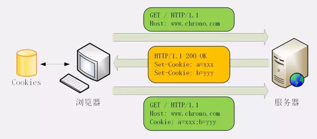
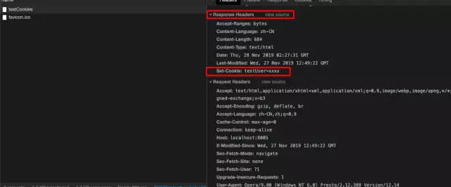
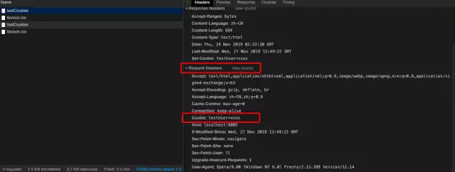
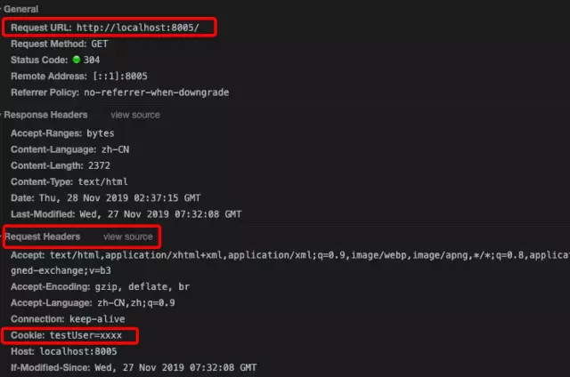
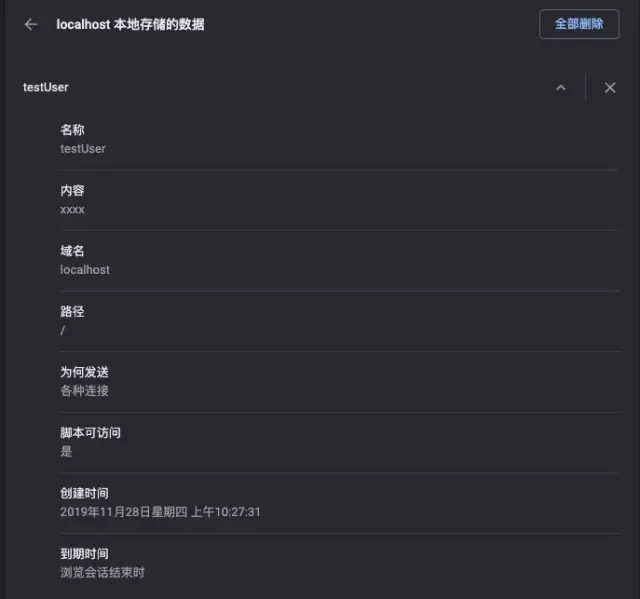
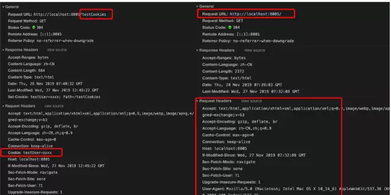
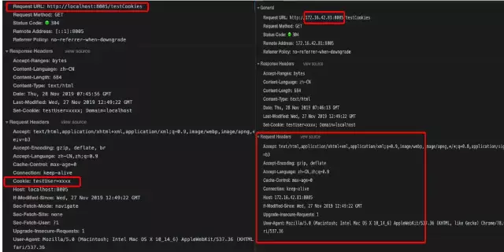
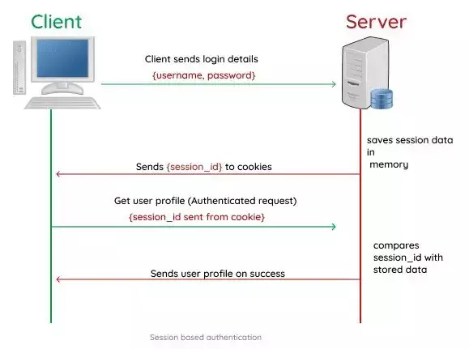
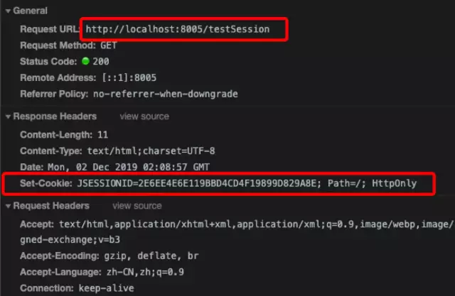
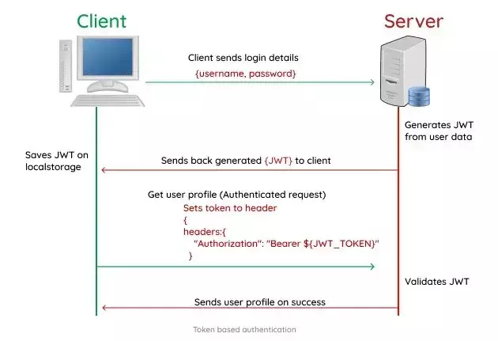

# Cookie、Session、Token

在了解这三个概念之前我们先要了解HTTP是无状态的Web服务器.

## Cookie

由于业务需求，我们需要让服务器记住一些信息。采用如下方式：

1. 浏览器第一次访问服务端时，服务器此时肯定不知道他的身份，所以创建一个独特的身份标识数据，格式为key=value，放入到Set-Cookie字段里，随着响应报文发给浏览器。
2. 浏览器看到有Set-Cookie字段以后就知道这是服务器给的身份标识，于是就保存起来，下次请求时会自动将此key=value值放入到Cookie字段中发给服务端。
3. 服务端收到请求报文后，发现Cookie字段中有值，就能根据此值识别用户的身份然后提供个性化的服务。



接下来我们用代码演示一下服务器是如何生成，我们自己搭建一个后台服务器，这里我用的是SpringBoot搭建的，并且写入SpringMVC的代码如下。

```java
@RequestMapping("/testCookies")
public String cookies(HttpServletResponse response){
    response.addCookie(new Cookie("testUser","xxxx"));
    return "cookies";
}
```

项目启动以后我们输入路径http://localhost:8005/testCookies，然后查看发的请求。可以看到下面那张图使我们首次访问服务器时发送的请求，可以看到服务器返回的响应中有Set-Cookie字段。而里面的key=value值正是我们服务器中设置的值。




接下来我们再次刷新这个页面可以看到在请求体中已经设置了Cookie字段，并且将我们的值也带过去了。这样服务器就能够根据Cookie中的值记住我们的信息了。



接下来我们换一个请求呢？是不是Cookie也会带过去呢？接下来我们输入路径http://localhost:8005请求。我们可以看到Cookie字段还是被带过去了。




那么浏览器的Cookie是存放在哪呢？如果是使用的是Chrome浏览器的话，那么可以按照下面步骤。

1. 在计算机打开Chrome
2. 在右上角，一次点击更多图标->设置
3. 在底部，点击高级
4. 在隐私设置和安全性下方，点击网站设置
5. 依次点击Cookie->查看所有Cookie和网站数据

然后可以根据域名进行搜索所管理的Cookie数据。所以是浏览器替你管理了Cookie的数据，如果此时你换成了Firefox等其他的浏览器，因为Cookie刚才是存储在Chrome里面的，所以服务器又蒙圈了，不知道你是谁，就会给Firefox再次贴上小纸条。




**Cookie中的参数设置**

说到这里，应该知道了Cookie就是服务器委托浏览器存储在客户端里的一些数据，而这些数据通常都会记录用户的关键识别信息。所以Cookie需要用一些其他的手段用来保护，防止外泄或者窃取，这些手段就是Cookie的属性。

| 参数名   | 作用                                                         | 后端设置方法               |
| :------- | :----------------------------------------------------------- | :------------------------- |
| Max-Age  | 设置cookie的过期时间，单位为秒                               | `cookie.setMaxAge(10)`     |
| Domain   | 指定了Cookie所属的域名                                       | `cookie.setDomain("")`     |
| Path     | 指定了Cookie所属的路径                                       | `cookie.setPath("");`      |
| HttpOnly | 告诉浏览器此Cookie只能靠浏览器Http协议传输,禁止其他方式访问  | `cookie.setHttpOnly(true)` |
| Secure   | 告诉浏览器此Cookie只能在Https安全协议中传输,如果是Http则禁止传输 | `cookie.setSecure(true)`   |

下面我就简单演示一下这几个参数的用法及现象。

### Path

设置为cookie.setPath("/testCookies")，接下来我们访问http://localhost:8005/testCookies，我们可以看到在左边和我们指定的路径是一样的，所以Cookie才在请求头中出现，接下来我们访问http://localhost:8005，我们发现没有Cookie字段了，这就是Path控制的路径。



### Domain

设置为cookie.setDomain("localhost")，接下来我们访问http://localhost:8005/testCookies我们发现下图中左边的是有Cookie的字段的，但是我们访问http://172.16.42.81:8005/testCookies，看下图的右边可以看到没有Cookie的字段了。这就是Domain控制的域名发送Cookie。



接下来的几个参数就不一一演示了，相信到这里大家应该对Cookie有一些了解了。

## Session

> Cookie是存储在客户端方，Session是存储在服务端方，客户端只存储SessionId

在上面我们了解了什么是Cookie，既然浏览器已经通过Cookie实现了有状态这一需求，那么为什么又来了一个Session呢？这里我们想象一下，如果将账户的一些信息都存入Cookie中的话，一旦信息被拦截，那么我们所有的账户信息都会丢失掉。所以就出现了Session，在一次会话中将重要信息保存在Session中，浏览器只记录SessionId一个SessionId对应一次会话请求。



```java
@RequestMapping("/testSession")
@ResponseBody
public String testSession(HttpSession session){
    session.setAttribute("testSession","this is my session");     return "testSession";
}
 
 
@RequestMapping("/testGetSession")
@ResponseBody
public String testGetSession(HttpSession session){
    Object testSession = session.getAttribute("testSession");
    return String.valueOf(testSession);
}
```

这里我们写一个新的方法来测试Session是如何产生的，我们在请求参数中加上HttpSession session，然后再浏览器中输入http://localhost:8005/testSession进行访问可以看到在服务器的返回头中在Cookie中生成了一个SessionId。然后浏览器记住此SessionId下次访问时可以带着此Id，然后就能根据此Id找到存储在服务端的信息了。





此时我们访问路径http://localhost:8005/testGetSession，发现得到了我们上面存储在Session中的信息。那么Session什么时候过期呢？

- 客户端：和Cookie过期一致，如果没设置，默认是关了浏览器就没了，即再打开浏览器的时候初次请求头中是没有SessionId了。
- 服务端：服务端的过期是真的过期，即服务器端的Session存储的数据结构多久不可用了，默认是30分钟。


既然我们知道了Session是在服务端进行管理的，那么或许你们看到这有几个疑问，Session是在在哪创建的？Session是存储在什么数据结构中？接下来带领大家一起看一下Session是如何被管理的。

Session的管理是在容器中被管理的，什么是容器呢？Tomcat、Jetty等都是容器。接下来我们拿最常用的Tomcat为例来看下Tomcat是如何管理Session的。在ManageBase的createSession是用来创建Session的。

```java
@Override
public Session createSession(String sessionId) {
    //首先判断Session数量是不是到了最大值，最大Session数可以通过参数设置       
 	//首先判断Session数量是不是到了最大值，最大Session数可以通过参数设置      
    if ((maxActiveSessions >= 0) &&
            (getActiveSessions() >= maxActiveSessions)) {        
        rejectedSessions++;         
        throw new TooManyActiveSessionsException(sm.getString("managerBase.createSession.ise"),                 			maxActiveSessions);
    }

    // 重用或者创建一个新的Session对象，请注意在Tomcat中就是StandardSession
    // 它是HttpSession的具体实现类，而HttpSession是Servlet规范中定义的接口    
    Session session = createEmptySession();
    // 初始化新Session的值
    session.setNew(true);
    session.setValid(true);
    session.setCreationTime(System.currentTimeMillis());
    // 设置Session过期时间是30分钟
    session.setMaxInactiveInterval(getContext().getSessionTimeout() * 60);
    String id = sessionId;
    if (id == null) {
        id = generateSessionId();
    }
    session.setId(id);// 这里会将Session添加到ConcurrentHashMap中    
    sessionCounter++;

    //将创建时间添加到LinkedList中，并且把最先添加的时间移除
    //主要还是方便清理过期Session
    SessionTiming timing = new SessionTiming(session.getCreationTime(), 0);
    synchronized (sessionCreationTiming) {
        sessionCreationTiming.add(timing);
        sessionCreationTiming.poll();
    }
    return session
}
```


到此我们明白了Session是如何创建出来的，创建出来后Session会被保存到一个ConcurrentHashMap中。可以看StandardSession类。

```
protected Map<String, Session> sessions = new ConcurrentHashMap<>();
```

到这里大家应该对Session有简单的了解了。

> Session是存储在Tomcat的容器中，所以如果后端机器是多台的话，因此多个机器间是无法共享Session的，此时可以使用Spring提供的分布式Session的解决方案，是将Session放在了Redis中。

## Token

Session是将要验证的信息存储在服务端，并以SessionId和数据进行对应，SessionId由客户端存储，在请求时将SessionId也带过去，因此实现了状态的对应。而Token是在服务端将用户信息经过Base64Url编码过后传给在客户端，每次用户请求的时候都会带上这一段信息，因此服务端拿到此信息进行解密后就知道此用户是谁了，这个方法叫做JWT(Json Web Token)。




> Token相比较于Session的优点在于，当后端系统有多台时，由于是客户端访问时直接带着数据，因此无需做共享数据的操作。

[jwt 的相关介绍](security-01jwt.md)  

[security-03在 Web 应用间安全地传递信息](security-04cookie_session_token.md)

Token的优点 

1. 简洁：可以通过URL,POST参数或者是在HTTP头参数发送，因为数据量小，传输速度也很快
2. 自包含：由于串包含了用户所需要的信息，避免了多次查询数据库
3. 因为Token是以Json的形式保存在客户端的，所以JWT是跨语言的
4. 不需要在服务端保存会话信息，特别适用于分布式微服务

# 总结

相信大家看到这应该对Cookie、Session、Token有一定的了解了，接下来再回顾一下重要的知识点

- Cookie是存储在客户端的
- Session是存储在服务端的，可以理解为一个状态列表。拥有一个唯一会话标识SessionId。可以根据SessionId在服务端查询到存储的信息。
- Session会引发一个问题，即后端多台机器时Session共享的问题，解决方案可以使用Spring提供的框架。
- Token类似一个令牌，无状态的，服务端所需的信息被Base64编码后放到Token中，服务器可以直接解码出其中的数据。

# 原文

- 