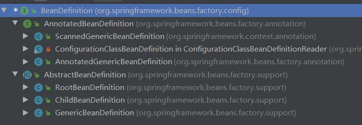

## 默认标签的解析

```java
//DefaultBeanDefinitionDocumentReader
private void parseDefaultElement(Element ele, BeanDefinitionParserDelegate delegate) {
		if (delegate.nodeNameEquals(ele, IMPORT_ELEMENT)) {
			//import 标签解析
			importBeanDefinitionResource(ele);
		}
		else if (delegate.nodeNameEquals(ele, ALIAS_ELEMENT)) {
			// alias 标签解析
			processAliasRegistration(ele);
		}
		else if (delegate.nodeNameEquals(ele, BEAN_ELEMENT)) {
			//bean 标签解析
			processBeanDefinition(ele, delegate);
		}
		else if (delegate.nodeNameEquals(ele, NESTED_BEANS_ELEMENT)) {
			// recurse
			// beans 标签的解析
			doRegisterBeanDefinitions(ele);
		}
	}
```

<!--more-->

### bean 标签的解析及注册
- import ， alias，bean， beans 标签中，bean标签的解析最为复杂，现在分析bean标签的解析。
```java
//DefaultBeanDefinitionDocumentReader
protected void processBeanDefinition(Element ele, BeanDefinitionParserDelegate delegate) {
	//bdholder 实例中包含了我们配置文件的各种属性了：class ，name， alias	
	BeanDefinitionHolder bdHolder = delegate.parseBeanDefinitionElement(ele);
	if (bdHolder != null) {
		// 若默认标签的子节点下再有自定义属性，还需要对自定义属性进行解析
		bdHolder = delegate.decorateBeanDefinitionIfRequired(ele, bdHolder);
		try {
			//BeanDefinitionHolder 中包含了beanName，和BeanDefinintion
			//注册beanDefintion 到BeanDefinitionRegistry中，key： beanname，value：BeanDefinition
			// Register the final decorated instance.
			BeanDefinitionReaderUtils.registerBeanDefinition(bdHolder, getReaderContext().getRegistry());
		}
		catch (BeanDefinitionStoreException ex) {
			getReaderContext().error("Failed to register bean definition with name '" +
					bdHolder.getBeanName() + "'", ele, ex);
		}
		//通知简体器bean已经加载完毕。
		// Send registration event.
		getReaderContext().fireComponentRegistered(new BeanComponentDefinition(bdHolder));
	}
}
```

### 解析BeanDefinition
- BeanDefinitionHolder 获取： `BeanDefinitionHolder bdHolder = delegate.parseBeanDefinitionElement(ele);`
```java
//BeanDefinitionParserDelegate
	@Nullable
	public BeanDefinitionHolder parseBeanDefinitionElement(Element ele, @Nullable BeanDefinition containingBean) {
		//解析id属性
		String id = ele.getAttribute(ID_ATTRIBUTE);
		// 解析name属性
		String nameAttr = ele.getAttribute(NAME_ATTRIBUTE);
		//别名，多个用 "," 分割
		List<String> aliases = new ArrayList<>();
		if (StringUtils.hasLength(nameAttr)) {
			String[] nameArr = StringUtils.tokenizeToStringArray(nameAttr, MULTI_VALUE_ATTRIBUTE_DELIMITERS);
			aliases.addAll(Arrays.asList(nameArr));
		}
		// 设置beanName，如果id为空，如果BeanName则取aliases的第一个值
		String beanName = id;
		if (!StringUtils.hasText(beanName) && !aliases.isEmpty()) {
			beanName = aliases.remove(0);
			if (logger.isDebugEnabled()) {
				logger.debug("No XML 'id' specified - using '" + beanName +
						"' as bean name and " + aliases + " as aliases");
			}
		}
		if (containingBean == null) {
			checkNameUniqueness(beanName, aliases, ele);
		}
		// 01 
		AbstractBeanDefinition beanDefinition = parseBeanDefinitionElement(ele, beanName, containingBean);
		if (beanDefinition != null) {
			if (!StringUtils.hasText(beanName)) {
				try {
					if (containingBean != null) {
						beanName = BeanDefinitionReaderUtils.generateBeanName(
								beanDefinition, this.readerContext.getRegistry(), true);
					}
					else {
						beanName = this.readerContext.generateBeanName(beanDefinition);
						// 如果不存在beanName 那么根据Spring 提供的命名规则为当前的bean生成对应的beanName
						// Register an alias for the plain bean class name, if still possible,
						// if the generator returned the class name plus a suffix.
						// This is expected for Spring 1.2/2.0 backwards compatibility.
						String beanClassName = beanDefinition.getBeanClassName();
						if (beanClassName != null &&
								beanName.startsWith(beanClassName) && beanName.length() > beanClassName.length() &&
								!this.readerContext.getRegistry().isBeanNameInUse(beanClassName)) {
							aliases.add(beanClassName);
						}
					}
					if (logger.isDebugEnabled()) {
						logger.debug("Neither XML 'id' nor 'name' specified - " +
								"using generated bean name [" + beanName + "]");
					}
				}
				catch (Exception ex) {
					error(ex.getMessage(), ele);
					return null;
				}
			}
			String[] aliasesArray = StringUtils.toStringArray(aliases);
			return new BeanDefinitionHolder(beanDefinition, beanName, aliasesArray);
		}
		return null;
	}
```

#### AbstractBeanDefinition 包含每个bean中都有的基础信息

- `AbstractBeanDefinition beanDefinition = parseBeanDefinitionElement(ele, beanName, containingBean);`
```java
////BeanDefinitionParserDelegate
	@Nullable
	public AbstractBeanDefinition parseBeanDefinitionElement(
			Element ele, String beanName, @Nullable BeanDefinition containingBean) {
		this.parseState.push(new BeanEntry(beanName));
		//解析class属性
		String className = null;
		if (ele.hasAttribute(CLASS_ATTRIBUTE)) {
			className = ele.getAttribute(CLASS_ATTRIBUTE).trim();
		}
		// 解析partent 属性
		String parent = null;
		if (ele.hasAttribute(PARENT_ATTRIBUTE)) {
			parent = ele.getAttribute(PARENT_ATTRIBUTE);
		}
		try {
			// 创建承载属性的GenericBeanDefinition（父类为AbstractBeanDefinition）
			AbstractBeanDefinition bd = createBeanDefinition(className, parent);
			//硬编码解析bean的各种属性
			parseBeanDefinitionAttributes(ele, beanName, containingBean, bd);
			//提取描述信息
			bd.setDescription(DomUtils.getChildElementValueByTagName(ele, DESCRIPTION_ELEMENT));
			// 解析 mata 元数据
			parseMetaElements(ele, bd);
			//解析Lookup—method 属性
			parseLookupOverrideSubElements(ele, bd.getMethodOverrides());
			//解析replaced-method 属性
			parseReplacedMethodSubElements(ele, bd.getMethodOverrides());
			// 解析 constructor-arg 属性
			parseConstructorArgElements(ele, bd);
			// 解析property 属性
			parsePropertyElements(ele, bd);
			//解析 qualifier 属性
			parseQualifierElements(ele, bd);
			bd.setResource(this.readerContext.getResource());
			bd.setSource(extractSource(ele));
			return bd;
		}
		catch (ClassNotFoundException ex) {
			error("Bean class [" + className + "] not found", ele, ex);
		}
		finally {
			this.parseState.pop();
		}
		return null;
	}
```

-  BeanDefinition （interface）继承关系


#### 各种标签
- mata标签
- lookup-method
- replaced-method
- constructor-arg
- property
- qualifier

#### AbstractBeanDefinition
- 定义了一些标签的配置信息和取值范围。

### 注册BeanDefinition
- `BeanDefinitionReaderUtils.registerBeanDefinition(bdHolder, getReaderContext().getRegistry());`
```java
//BeanDefinitionReaderUtils
public static void registerBeanDefinition(
			BeanDefinitionHolder definitionHolder, BeanDefinitionRegistry registry)
			throws BeanDefinitionStoreException {
		// Register bean definition under primary name.
		String beanName = definitionHolder.getBeanName();
		registry.registerBeanDefinition(beanName, definitionHolder.getBeanDefinition());

		// Register aliases for bean name, if any.
		String[] aliases = definitionHolder.getAliases();
		if (aliases != null) {
			for (String alias : aliases) {
				registry.registerAlias(beanName, alias);
			}
		}
	}
```

### 通知监听器解析及注册完成
```java
//通知简体器bean已经加载完毕。
// Send registration event.
getReaderContext().fireComponentRegistered(new BeanComponentDefinition(bdHolder));
```
该方法为空，项目中如果对bean 的加载需要监控，则需要拓展该方法，spring 自身没有对该方法做任何处理。

### alias 解析

### import 标签的解析

### 嵌入式bean标签的解析