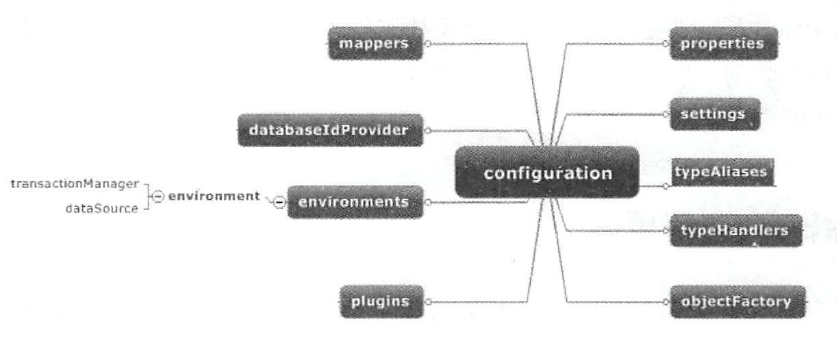
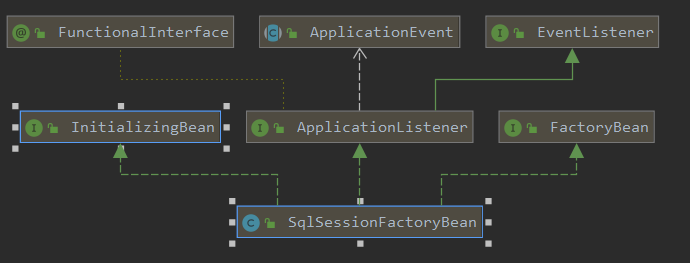
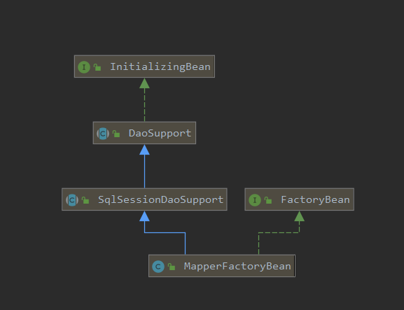
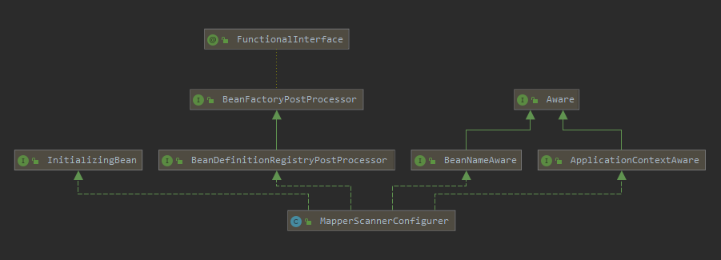

# spring myBatis
## MyBatis 独立使用
- mybatis 配置文件结构

- configuration 根元素
- properties 定义配置外在化
- settings 全局性的配置
- typeAliases 定义的类的别名
- typeHandles 自定义的类型处理,即数据库类型与java类型之间的数据转换
- ObjectFactory 用于指定结果集的对象的实例是如何创建的
- plugins myBatis 的插件，可以修改mybatis 内部的运行规则
- environments 运行环境
- transactionManager 事物管理器
- dataResource 数据源
- mappers 指定映射文件或者映射类

<!--more-->

### 配置文件
```xml
<configuration>
    <settings>
        < 1-- changes from the defaults for testing -->
        <setting name="cacheEnabled" value="false"/>
        <setting name="useGeneratedKeys " value="true "/>
        <setting name="defaultExecutorType" value="REUSE"/>
    </settings>
<typeAliases>
    <typeAlias alias = "User" type= "beanUser"/>
</typeAliases>
<environments default="development">
    <environment id="development ">
        <transactioηManager type="jdbc"/>
        <dataSource type="POOLED">
            <property name="driver " value="com.mysq.jdbc.Driver"/>
            <property name="url" value="jddbc:mysql//localhost/lexueba"/>
            <property name= "username" value="root" />
            <property name = "password" value = "123456"/>
        </dataSource>
    </environment>
</environments>
<mappers>
    <mapper resource= "resource/UserMapper.xml "/>
</mappers>
</configuration>
```
### 映射文件 UserMapper
```xml
<?xml version="1.0" encoding="UTF-8" ?>
<!DOCTYPE mapper
        PUBLIC "-//mybatis.org//DTD Mapper 3.0//EN"
        "http://mybatis.org/dtd/mybatis-3-mapper.dtd">
        
<mapper namespace=" mapper.UserMapper" >
    <!-- 这里namespace 必须是UserMapper 接口的路径，不然要运行的时候要报销“ is not known to the MapperRegistry" -->
    <insert id= "insertUser" parameterType= "User " >
    insert into user(name , age) values(#{name) , #{age))
    <!--这里sql 结尾不能力II分号， 否则报“ORA-00911 "的错误-->
    </insert>
    <!--这里的id 必须和IUserMapper 接口中的接口方法名相同，不然运行的时候也要报销-->
    <select id= "getUser" resultType="User" parameterType="java.lang.Integer">
        select * from user where id＝#{id}
    </select>
</mapper>
```

### spring 中使用Mybatis
- 通过 org.mybatis.Spring.SqlSessionFactoryBean引入了 Mybatis 的配置和数据源
- 通过 org.mybatis.Spring.mapper.MapperFactoryBean 集成了 sqlSessionFaction 和 MapperInterface 接口类之间的关系
- environments 中设置的dataSource 被转移到了Spring 的核心配置文件中管理。

## 源码分析

### SqlSessionFactory 的创建
- SqlSessionFactory 的创建是依赖于 SqlSessionFactoryBean
- SqlSessionFactoryBean 继承关系


- 实现 InitalizingBean 接口的bean 会在 初始化时调用 afterPropertiesSet 方法来进行bean 的初始化逻辑。
- 实现 FactoryBean 接口，获取 bean 时，其实是该bean 的getObject 方法获取的实例。

#### sqlSessionFactory 的初始化
```java
//SqlSessionFactoryBean implements InitalizingBean
 @Override
  public void afterPropertiesSet() throws Exception {
    notNull(dataSource, "Property 'dataSource' is required");
    notNull(sqlSessionFactoryBuilder, "Property 'sqlSessionFactoryBuilder' is required");
    state((configuration == null && configLocation == null) || !(configuration != null && configLocation != null),
        "Property 'configuration' and 'configLocation' can not specified with together");

    this.sqlSessionFactory = buildSqlSessionFactory();
  }
```
- sqlSessionFacotry 是myBatis 所有功能的基础
```java
//SqlSessionFactoryBean
  protected SqlSessionFactory buildSqlSessionFactory() throws Exception {

    final Configuration targetConfiguration;

    XMLConfigBuilder xmlConfigBuilder = null;
    if (this.configuration != null) {
      targetConfiguration = this.configuration;
      if (targetConfiguration.getVariables() == null) {
        targetConfiguration.setVariables(this.configurationProperties);
      } else if (this.configurationProperties != null) {
        targetConfiguration.getVariables().putAll(this.configurationProperties);
      }
    } else if (this.configLocation != null) {
      xmlConfigBuilder = new XMLConfigBuilder(this.configLocation.getInputStream(), null, this.configurationProperties);
      targetConfiguration = xmlConfigBuilder.getConfiguration();
    } else {
      LOGGER.debug(
          () -> "Property 'configuration' or 'configLocation' not specified, using default MyBatis Configuration");
      targetConfiguration = new Configuration();
      Optional.ofNullable(this.configurationProperties).ifPresent(targetConfiguration::setVariables);
    }

    Optional.ofNullable(this.objectFactory).ifPresent(targetConfiguration::setObjectFactory);
    Optional.ofNullable(this.objectWrapperFactory).ifPresent(targetConfiguration::setObjectWrapperFactory);
    Optional.ofNullable(this.vfs).ifPresent(targetConfiguration::setVfsImpl);

    if (hasLength(this.typeAliasesPackage)) {
      scanClasses(this.typeAliasesPackage, this.typeAliasesSuperType).stream()
          .filter(clazz -> !clazz.isAnonymousClass()).filter(clazz -> !clazz.isInterface())
          .filter(clazz -> !clazz.isMemberClass()).forEach(targetConfiguration.getTypeAliasRegistry()::registerAlias);
    }

    if (!isEmpty(this.typeAliases)) {
      Stream.of(this.typeAliases).forEach(typeAlias -> {
        targetConfiguration.getTypeAliasRegistry().registerAlias(typeAlias);
        LOGGER.debug(() -> "Registered type alias: '" + typeAlias + "'");
      });
    }

    if (!isEmpty(this.plugins)) {
      Stream.of(this.plugins).forEach(plugin -> {
        targetConfiguration.addInterceptor(plugin);
        LOGGER.debug(() -> "Registered plugin: '" + plugin + "'");
      });
    }

    if (hasLength(this.typeHandlersPackage)) {
      scanClasses(this.typeHandlersPackage, TypeHandler.class).stream().filter(clazz -> !clazz.isAnonymousClass())
          .filter(clazz -> !clazz.isInterface()).filter(clazz -> !Modifier.isAbstract(clazz.getModifiers()))
          .forEach(targetConfiguration.getTypeHandlerRegistry()::register);
    }

    if (!isEmpty(this.typeHandlers)) {
      Stream.of(this.typeHandlers).forEach(typeHandler -> {
        targetConfiguration.getTypeHandlerRegistry().register(typeHandler);
        LOGGER.debug(() -> "Registered type handler: '" + typeHandler + "'");
      });
    }

    if (!isEmpty(this.scriptingLanguageDrivers)) {
      Stream.of(this.scriptingLanguageDrivers).forEach(languageDriver -> {
        targetConfiguration.getLanguageRegistry().register(languageDriver);
        LOGGER.debug(() -> "Registered scripting language driver: '" + languageDriver + "'");
      });
    }
    Optional.ofNullable(this.defaultScriptingLanguageDriver)
        .ifPresent(targetConfiguration::setDefaultScriptingLanguage);

    if (this.databaseIdProvider != null) {// fix #64 set databaseId before parse mapper xmls
      try {
        targetConfiguration.setDatabaseId(this.databaseIdProvider.getDatabaseId(this.dataSource));
      } catch (SQLException e) {
        throw new NestedIOException("Failed getting a databaseId", e);
      }
    }

    Optional.ofNullable(this.cache).ifPresent(targetConfiguration::addCache);

    if (xmlConfigBuilder != null) {
      try {
        xmlConfigBuilder.parse();
        LOGGER.debug(() -> "Parsed configuration file: '" + this.configLocation + "'");
      } catch (Exception ex) {
        throw new NestedIOException("Failed to parse config resource: " + this.configLocation, ex);
      } finally {
        ErrorContext.instance().reset();
      }
    }

    targetConfiguration.setEnvironment(new Environment(this.environment,
        this.transactionFactory == null ? new SpringManagedTransactionFactory() : this.transactionFactory,
        this.dataSource));

    if (this.mapperLocations != null) {
      if (this.mapperLocations.length == 0) {
        LOGGER.warn(() -> "Property 'mapperLocations' was specified but matching resources are not found.");
      } else {
        for (Resource mapperLocation : this.mapperLocations) {
          if (mapperLocation == null) {
            continue;
          }
          try {
            XMLMapperBuilder xmlMapperBuilder = new XMLMapperBuilder(mapperLocation.getInputStream(),
                targetConfiguration, mapperLocation.toString(), targetConfiguration.getSqlFragments());
            xmlMapperBuilder.parse();
          } catch (Exception e) {
            throw new NestedIOException("Failed to parse mapping resource: '" + mapperLocation + "'", e);
          } finally {
            ErrorContext.instance().reset();
          }
          LOGGER.debug(() -> "Parsed mapper file: '" + mapperLocation + "'");
        }
      }
    } else {
      LOGGER.debug(() -> "Property 'mapperLocations' was not specified.");
    }

    return this.sqlSessionFactoryBuilder.build(targetConfiguration);
  }
```
从以上方法看出，我们也可以不使用mybatis 的配置文件，而将具体的属性直接配置在 `SqlSessionFactoryBean`中。其属性有：configLocation 、
objectFactory 、objectWrapperFactory 、typeAliasesPackage 、typeAliases 、typeHandlersPackage 、plugins 、typeHandlers 、transactionFactory 、databaseldProvider 、mapperLocations 。 

#### 获取 SqlSessionFactoryBean 实例
由于 SqlSessionFactoryBean 实现了FactoryBean 接口，所以使用getBean 方法时，获取的是该类的getObject() 方法返回的对象。也就是获取初始化后的sqlSessionFactory 属性。
```java
//SqlSessionFactoryBean implements FactoryBean
  public SqlSessionFactory getObject() throws Exception {
    if (this.sqlSessionFactory == null) {
      afterPropertiesSet();
    }

    return this.sqlSessionFactory;
  }
```

### MapperFactoryBean 的创建
mybatis 和spring 获取映射对象实例：
```java
//mybatis
UserMapper userMapper = sqlSession.getMapper(UserMapper.class );
//spring
UserMapper userMapper = (UserMapper)context.getBean("userMapper");
```
spring 在使用映射类（UserMapper.class）生成映射bean时，一定是使用了Mybatis 原生的方式.

- 查看mapperFactoryBean 的层次结构:

MapperFactoryBean 实现了 InitialingBean 和FactoryBean 接口.

#### MapperFactoryBean 的初始化
- 初始化逻辑在其父类DaoSupport 中实现的
```java
//DaoSupport 
    @Override
	public final void afterPropertiesSet() throws IllegalArgumentException, BeanInitializationException {
		// Let abstract subclasses check their configuration.
		checkDaoConfig();

		// Let concrete implementations initialize themselves.
		try {
            //模板方法,留给子类去实现
			initDao();
		}
		catch (Exception ex) {
			throw new BeanInitializationException("Initialization of DAO failed", ex);
		}
	}
```
- checkDaoConfig()
```java
//MapperFactoryBean
  @Override
  protected void checkDaoConfig() {
    super.checkDaoConfig();

    notNull(this.mapperInterface, "Property 'mapperInterface' is required");

    Configuration configuration = getSqlSession().getConfiguration();
    if (this.addToConfig && !configuration.hasMapper(this.mapperInterface)) {
      try {
        configuration.addMapper(this.mapperInterface);
      } catch (Exception e) {
        logger.error("Error while adding the mapper '" + this.mapperInterface + "' to configuration.", e);
        throw new IllegalArgumentException(e);
      } finally {
        ErrorContext.instance().reset();
      }
    }
  }
```
- 
```java super.checkDaoConfig() 验证 sqlSessionTemplate 不能为空
  //SqlSessionDaoSupport
  @Override
  protected void checkDaoConfig() {
    notNull(this.sqlSessionTemplate, "Property 'sqlSessionFactory' or 'sqlSessionTemplate' are required");
  }
```
sqlSessionTemplate 依据接口创建创建映射器代理的接触类一般不可能为空. 而sqlSessionTemplate的初始化是:
```java
//SqlSessionDaoSupport
public void setSqlSessionFactory(SqlSessionFactory sqlSessionFactory) {
    if (this.sqlSessionTemplate == null || sqlSessionFactory != this.sqlSessionTemplate.getSqlSessionFactory()) {
      this.sqlSessionTemplate = createSqlSessionTemplate(sqlSessionFactory);
    }
  }
  protected SqlSessionTemplate createSqlSessionTemplate(SqlSessionFactory sqlSessionFactory) {
    return new SqlSessionTemplate(sqlSessionFactory);
  }
```
从以上代码可以看出,如果sqlSessionFactory 的配置有问题,就可以在此处体现出来.
```xml
<bean id="userMapper" class="org.mybatis.Spring.mapper.MapperFactoryBean ">
<property name="mapperinterface" value="test.mybatis.dao.UserMapper"></property>
<property name ＝ "sqlSessionFactory" ref ＝ "sqlSessionFactory" ></property>
</bean>
```
- 映射接口的验证  
接口时映射的基础,sqlSession会依据接口创建代理类.映射接口必不可少.
- 验证文件的存在性
> 在MyBatis 实现过程中并没有于动调用configuration.addMapper 方法，而是在映射文件读取过程中一旦解析到如`<mapper namespace="mapper.UserMapper">`，便会自动进行类型映射的注册。在上面的函数中， configuration.addMapper(this.mapperInterface）其实就是将UserMapper 注册到映射类型中.，如果你可以保证这个接口一定存在对应的映射文件，那么其实这个验证并没有必要。但是，由于这个是我们自行决定的配置，无法保证这里配置的接口一定存在对应的映射文件，所以这里非常有必要进行验证。在执行此代码的时候， MyBatis 会检查嵌入的映射接口是否存在对应的映射文件，如果没有回抛出异常， Spring 正是在用这种方式来完成接口对应的映射文件存在性验证。

#### 获取 MapperFactoryBean
```java
//MapperFactoryBean implements  BeanFactory
@Override
  public T getObject() throws Exception {
    return getSqlSession().getMapper(this.mapperInterface);
  }
```
spring 通过封装 myBatis 获取 映射代理类的方式获取映射bean

### MapperScannerConfigurer
```xml
<bean class= "org.mybatis.Spring.mapper.MapperScannerConfigurer">
    <property name= "basePackage" value= " test.mybatis.dao"/>
</bean>
```
我们可以使用 MapperScannerConfigurer 来扫描指定包下的映射器接口,代替配置文件的方式,如下:
```xml
<beans xmlns="http://www.springframework.org/schema/beans"
       xmlns:xsi="http://www.w3.org/2001/XMLSchema-instance"
       xmlns:context="http://www.springframework.org/schema/context" xmlns:tx="http://www.springframework.org/schema/tx"
       xmlns:mybatis="http://mybatis.org/schema/mybatis-spring"
       xsi:schemaLocation="http://www.springframework.org/schema/beans
       http://www.springframework.org/schema/beans/spring-beans.xsd
       http://www.springframework.org/schema/context
       http://www.springframework.org/schema/context/spring-context.xsd http://www.springframework.org/schema/tx http://www.springframework.org/schema/tx/spring-tx.xsd http://mybatis.org/schema/mybatis-spring http://mybatis.org/schema/mybatis-spring.xsd">
</beans>
<bean id="dataSource" class = "org.apache.comrnons.dbcp.BasicDataSource">
    <property name= "driverClassNarne" value="com.mysql.jdbc.Driver"><property>
    <property name= "url" value="jdbc:mysql://localhost:3306/test?useUnicode=true&amp;characterEncoding=UTF8&amp;zeroDateTimeBehavior=convertToNull"></property>
    <property name="username " value="root "></property>
    <property name= "password" value="hao] ia042lxixi "></property>
    <property name="maxActive" value = "100"></property>
    <property name= "maxldle" value= "30"></property>
    <property name="maxWait" value="500"></property>
    <property name="defaultAutoCommit" value= "true"></property>
    </bean>
<bean id="sqlSessionFactory" class="org mybatis.Spring.SqlSessionFactoryBean">
    <property narne="configLocation" value="classpath : test/rnybatis/MyBatis-Configuration.xml"></property>
    <property name= "dataSource" ref= "dataSource"/>
    <property name="typeAliasesPackage" value ="aaaaa" />
</bean>

<!--注释掉原有代码
<bean id="userMapper" class = "org.mybatis.Spring.mapper.MapperFactoryBean">
    <property name="mapperInterface " value="test.mybatis.dao.UserMapper"></property>
    <property name= "sqlSessionFactory" ref="sqlSessionFactory"></property>
</bean>
-->
<bean class= "org.mybatis.Spring.mapper.MapperScannerConfigurer">
    <property name= "basePackage" value= " test.mybatis.dao"/>
</bean>
```
- 屏蔽掉了原始的代码（ userMapper 的创建）而增加了MapperScannerConfigurer 的配置， basePackage 属性是让你为映射器接口文件设置基本的包路径。可以使用分号或逗号作为分隔符设置多于一个的包路径。每个映射器将会在指定的包路径中递归地被搜索到。
- 被发现的映射器将会使用Spring 对自动侦测组件默认的命名策略来命名。也就是说，如果没有发现注解，它就会使用映射器的非大写的非完全限定类名。
- 但是如果发现了＠Component或JSR-330 @Named 注解，它会获取名称

#### MapperScannerConfigurer的类结构

- InitalizingBean#afterPropettiesSet 初始化逻辑未作任何处理,只做了basePackage简单的非空校验
- BeanFactoryPostProcessor#postProcessBeanFactory 没有任何逻辑
- BeanDefinitionRegistryPostProcessor#postProcessBeanDefinitionRegistry 核心逻辑所在地
```java
    //MapperScannerConfigurer implements BeanDefinitionRegistryPostProcessor
    @Override
  public void postProcessBeanDefinitionRegistry(BeanDefinitionRegistry registry) {
    if (this.processPropertyPlaceHolders) {
      //配置属性的处理
      processPropertyPlaceHolders();
    }

    ClassPathMapperScanner scanner = new ClassPathMapperScanner(registry);
    scanner.setAddToConfig(this.addToConfig);
    scanner.setAnnotationClass(this.annotationClass);
    scanner.setMarkerInterface(this.markerInterface);
    scanner.setSqlSessionFactory(this.sqlSessionFactory);
    scanner.setSqlSessionTemplate(this.sqlSessionTemplate);
    scanner.setSqlSessionFactoryBeanName(this.sqlSessionFactoryBeanName);
    scanner.setSqlSessionTemplateBeanName(this.sqlSessionTemplateBeanName);
    scanner.setResourceLoader(this.applicationContext);
    scanner.setBeanNameGenerator(this.nameGenerator);
    scanner.setMapperFactoryBeanClass(this.mapperFactoryBeanClass);
    if (StringUtils.hasText(lazyInitialization)) {
      scanner.setLazyInitialization(Boolean.valueOf(lazyInitialization));
    }
    //注册过滤器
    scanner.registerFilters();
    //java 文件扫描
    scanner.scan(
        StringUtils.tokenizeToStringArray(this.basePackage, ConfigurableApplicationContext.CONFIG_LOCATION_DELIMITERS));
  }
```
#####  processPropertyPlaceHolders(); 属性处理
- BeanDefinitionRegistries 会在应用启动的时候调用，并且会早于BeanFactoryPostProcessors 的调用,这就意味着PropertyResourceConfigurers 还没有被加载所有对于属性文件的引用将会失效.为避免此种情况发生，此方法手动地找出定义的PropertyResourceConfigurers 并进行提前调用以保证对于属性的引用可以正常工作。
```java
//BeanDefinitionRegistryPostProcessor
private void processPropertyPlaceHolders() {
    Map<String, PropertyResourceConfigurer> prcs = applicationContext.getBeansOfType(PropertyResourceConfigurer.class);

    if (!prcs.isEmpty() && applicationContext instanceof ConfigurableApplicationContext) {
      BeanDefinition mapperScannerBean = ((ConfigurableApplicationContext) applicationContext).getBeanFactory()
          .getBeanDefinition(beanName);

      // PropertyResourceConfigurer does not expose any methods to explicitly perform
      // property placeholder substitution. Instead, create a BeanFactory that just
      // contains this mapper scanner and post process the factory.
      DefaultListableBeanFactory factory = new DefaultListableBeanFactory();
      factory.registerBeanDefinition(beanName, mapperScannerBean);

      for (PropertyResourceConfigurer prc : prcs.values()) {
        prc.postProcessBeanFactory(factory);
      }

      PropertyValues values = mapperScannerBean.getPropertyValues();

      this.basePackage = updatePropertyValue("basePackage", values);
      this.sqlSessionFactoryBeanName = updatePropertyValue("sqlSessionFactoryBeanName", values);
      this.sqlSessionTemplateBeanName = updatePropertyValue("sqlSessionTemplateBeanName", values);
      this.lazyInitialization = updatePropertyValue("lazyInitialization", values);
    }
    this.basePackage = Optional.ofNullable(this.basePackage).map(getEnvironment()::resolvePlaceholders).orElse(null);
    this.sqlSessionFactoryBeanName = Optional.ofNullable(this.sqlSessionFactoryBeanName)
        .map(getEnvironment()::resolvePlaceholders).orElse(null);
    this.sqlSessionTemplateBeanName = Optional.ofNullable(this.sqlSessionTemplateBeanName)
        .map(getEnvironment()::resolvePlaceholders).orElse(null);
    this.lazyInitialization = Optional.ofNullable(this.lazyInitialization).map(getEnvironment()::resolvePlaceholders)
        .orElse(null);
  }
```
1. 找到所有已经注册的PropertyResourceConfigurer 类型的bean
2. 模拟Spring 中的环境来用处理器。这里通过使用new DefaultListableBeanFactory()来模拟Spring 中的环境（完成处理器的调用后便失效），将映射的bean,也就是MapperScannerConfigurer 类型bean 注册到环境中来进行后理器的调用,处理器PropertyPlaceholderConfigurer调用完成的功能，再将模拟bean 中相关的属性提取出来应用在真实的bean 中。

#### 根据配置属性生成过滤器 scanner.registerFilters();
```java
//ClassPathMapperScanner
  public void registerFilters() {
    boolean acceptAllInterfaces = true;

    // if specified, use the given annotation and / or marker interface
    if (this.annotationClass != null) {
      addIncludeFilter(new AnnotationTypeFilter(this.annotationClass));
      acceptAllInterfaces = false;
    }

    // override AssignableTypeFilter to ignore matches on the actual marker interface
    if (this.markerInterface != null) {
      addIncludeFilter(new AssignableTypeFilter(this.markerInterface) {
        @Override
        protected boolean matchClassName(String className) {
          return false;
        }
      });
      acceptAllInterfaces = false;
    }

    if (acceptAllInterfaces) {
      // default include filter that accepts all classes
      addIncludeFilter((metadataReader, metadataReaderFactory) -> true);
    }

    // exclude package-info.java
    addExcludeFilter((metadataReader, metadataReaderFactory) -> {
      String className = metadataReader.getClassMetadata().getClassName();
      return className.endsWith("package-info");
    });
  }
```
1. annotationClass 属性处理
> 如果annotationClass 不为空，表示用户设置了此属性，那么就要根据此属性生成过滤器以保证达到用户想要的效果，而封装此属性的过滤器就是AnnotationTypeFilter. AnnotationTypeFilter 保证在扫描对应Java 文件时只接受标记有注解为annotationClass 的接口.

2. markerlnterface 属性处理
> 如果markerInterface 不为空，表示用户设置了此属性，那么就要根据此属性生成过滤器以保证达到用户想要的效果，而封装此属性的过滤器就是实现AssignableTypeFilter 接口的局部类。表示扫描过程中只有实现markerInterface 接口的接口才会被接受。

3. 全局默认处理。
> 在上面两个属性中如果存在其中任何属性， acceptAllinterfaces 的值将会变改变，但是如果用户没有设定以上两个属性，那么， Spring 会为我们增加一个默认的过滤器实现TypeFilter 接口的局部类，旨在接受所有接口文件。

4. package-info.java 处理。
> 对于命名以package-info 结尾的Java 文件，默认不作为逻辑实现接口，将其排除掉，使用TypeFilter 接口的局部类实现match 方法。

#### 扫描java 文件
```java
//ClassPathBeanDefinitionScanner
public int scan(String... basePackages) {
		int beanCountAtScanStart = this.registry.getBeanDefinitionCount();

		doScan(basePackages);

		// Register annotation config processors, if necessary.
		if (this.includeAnnotationConfig) {
			AnnotationConfigUtils.registerAnnotationConfigProcessors(this.registry);
		}

		return (this.registry.getBeanDefinitionCount() - beanCountAtScanStart);
	}

//ClassPathMapperScanner
  public Set<BeanDefinitionHolder> doScan(String... basePackages) {
    Set<BeanDefinitionHolder> beanDefinitions = super.doScan(basePackages);

    if (beanDefinitions.isEmpty()) {
      LOGGER.warn(() -> "No MyBatis mapper was found in '" + Arrays.toString(basePackages)
          + "' package. Please check your configuration.");
    } else {
      processBeanDefinitions(beanDefinitions);
    }

    return beanDefinitions;
  }
//ClassPathBeanDefinitionScanner
  protected Set<BeanDefinitionHolder> doScan(String... basePackages) {
		Assert.notEmpty(basePackages, "At least one base package must be specified");
		Set<BeanDefinitionHolder> beanDefinitions = new LinkedHashSet<>();
		for (String basePackage : basePackages) {
      //扫描basePackage 路径下面的Java文件
			Set<BeanDefinition> candidates = findCandidateComponents(basePackage);
			for (BeanDefinition candidate : candidates) {
				ScopeMetadata scopeMetadata = this.scopeMetadataResolver.resolveScopeMetadata(candidate);
				candidate.setScope(scopeMetadata.getScopeName());
				String beanName = this.beanNameGenerator.generateBeanName(candidate, this.registry);
				if (candidate instanceof AbstractBeanDefinition) {
					postProcessBeanDefinition((AbstractBeanDefinition) candidate, beanName);
				}
				if (candidate instanceof AnnotatedBeanDefinition) {
					AnnotationConfigUtils.processCommonDefinitionAnnotations((AnnotatedBeanDefinition) candidate);
				}
				if (checkCandidate(beanName, candidate)) {
					BeanDefinitionHolder definitionHolder = new BeanDefinitionHolder(candidate, beanName);
					definitionHolder =
							AnnotationConfigUtils.applyScopedProxyMode(scopeMetadata, definitionHolder, this.registry);
					beanDefinitions.add(definitionHolder);
					registerBeanDefinition(definitionHolder, this.registry);
				}
			}
		}
		return beanDefinitions;
	}
  public Set<BeanDefinition> findCandidateComponents(String basePackage) {
		if (this.componentsIndex != null && indexSupportsIncludeFilters()) {
			return addCandidateComponentsFromIndex(this.componentsIndex, basePackage);
		}
		else {
			return scanCandidateComponents(basePackage);
		}
	}

  private Set<BeanDefinition> scanCandidateComponents(String basePackage) {
		Set<BeanDefinition> candidates = new LinkedHashSet<>();
		try {
			String packageSearchPath = ResourcePatternResolver.CLASSPATH_ALL_URL_PREFIX +
					resolveBasePackage(basePackage) + '/' + this.resourcePattern;
			Resource[] resources = getResourcePatternResolver().getResources(packageSearchPath);
			boolean traceEnabled = logger.isTraceEnabled();
			boolean debugEnabled = logger.isDebugEnabled();
			for (Resource resource : resources) {
				if (traceEnabled) {
					logger.trace("Scanning " + resource);
				}
				if (resource.isReadable()) {
					try {
						MetadataReader metadataReader = getMetadataReaderFactory().getMetadataReader(resource);
						if (isCandidateComponent(metadataReader)) {
							ScannedGenericBeanDefinition sbd = new ScannedGenericBeanDefinition(metadataReader);
							sbd.setResource(resource);
							sbd.setSource(resource);
							if (isCandidateComponent(sbd)) {
							
								candidates.add(sbd);
							}
						}
						
					}catch (Throwable ex) {
						throw new BeanDefinitionStoreException(
								"Failed to read candidate component class: " + resource, ex);
					}
				}
			}
		}
		catch (IOException ex) {
			throw new BeanDefinitionStoreException("I/O failure during classpath scanning", ex);
		}
		return candidates;
	}
  //ClassPathScanningCandidateComponentProvider
  // 使用到了之前注册的过滤器
  protected boolean isCandidateComponent(MetadataReader metadataReader) throws IOException {
		for (TypeFilter tf : this.excludeFilters) {
			if (tf.match(metadataReader, getMetadataReaderFactory())) {
				return false;
			}
		}
		for (TypeFilter tf : this.includeFilters) {
			if (tf.match(metadataReader, getMetadataReaderFactory())) {
				return isConditionMatch(metadataReader);
			}
		}
		return false;
	}
```


