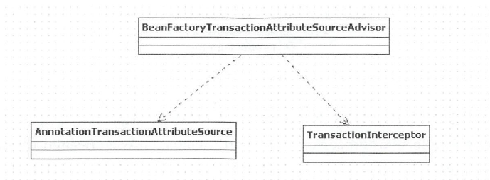
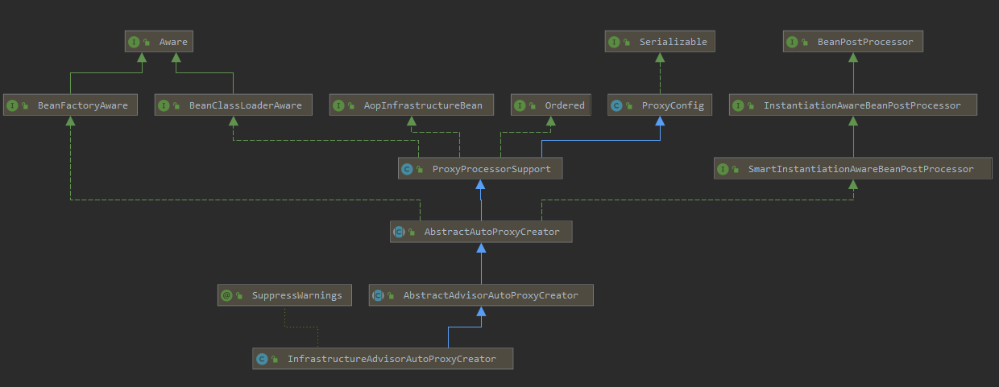

## spring 事务
### 使用
```xml
<!--事物管理类-->
    <bean id="dataSourceTransactionManager" class="org.springframework.jdbc.datasource.DataSourceTransactionManager">
        <property name="dataSource" ref="dataSource"/>
    </bean>
<!--开启注解模式-->
 <!-- 基于注解的事务管理:事务开启的入口 -->
    <tx:annotation-driven transaction-manager="dataSourceTransactionManager"/>
<!--<tx:jta-transaction-manager/>-->
```
<!--more-->

### 事物自定义标签
` <tx:annotation-driven/>` 事物配置的开关，全局搜索，发现在 类 TxNamespaceHandler#init 方法中找打了初始化的方法。
```java
//TxNamespaceHandler
    @Override
	public void init() {
		registerBeanDefinitionParser("advice", new TxAdviceBeanDefinitionParser());
		registerBeanDefinitionParser("annotation-driven", new AnnotationDrivenBeanDefinitionParser());
		registerBeanDefinitionParser("jta-transaction-manager", new JtaTransactionManagerBeanDefinitionParser());
	}
```
由以上代码可知，spring 会使用 AnnotationDrivenBeanDefinitionParser 去解析 annotation-driver
```java
//AnnotationDrivenBeanDefinitionParser
public BeanDefinition parse(Element element, ParserContext parserContext) {
		registerTransactionalEventListenerFactory(parserContext);
		String mode = element.getAttribute("mode");
		if ("aspectj".equals(mode)) {
			// mode="aspectj"
			registerTransactionAspect(element, parserContext);
		}
		else {
			// mode="proxy"
			AopAutoProxyConfigurer.configureAutoProxyCreator(element, parserContext);
		}
		return null;
	}
```
解析中存在对于mode 属性的判断，所以，在spring 事物切入上，我们可以使用如下事物切入方式的配置
```xml
 <tx:annotation-driven transaction-manager="dataSourceTransactionManager" modle="aspectj"/>〉
```
### 注册InfrastructureAdvisorAutoProxyCreator
```java
public static void configureAutoProxyCreator(Element element, ParserContext parserContext) {
			AopNamespaceUtils.registerAutoProxyCreatorIfNecessary(parserContext, element);

			String txAdvisorBeanName = TransactionManagementConfigUtils.TRANSACTION_ADVISOR_BEAN_NAME;
			if (!parserContext.getRegistry().containsBeanDefinition(txAdvisorBeanName)) {
				Object eleSource = parserContext.extractSource(element);

				// Create the TransactionAttributeSource definition.
				RootBeanDefinition sourceDef = new RootBeanDefinition(
						"org.springframework.transaction.annotation.AnnotationTransactionAttributeSource");
				sourceDef.setSource(eleSource);
				sourceDef.setRole(BeanDefinition.ROLE_INFRASTRUCTURE);
				String sourceName = parserContext.getReaderContext().registerWithGeneratedName(sourceDef);

				// Create the TransactionInterceptor definition.
				RootBeanDefinition interceptorDef = new RootBeanDefinition(TransactionInterceptor.class);
				interceptorDef.setSource(eleSource);
				interceptorDef.setRole(BeanDefinition.ROLE_INFRASTRUCTURE);
				registerTransactionManager(element, interceptorDef);
				interceptorDef.getPropertyValues().add("transactionAttributeSource", new RuntimeBeanReference(sourceName));
				String interceptorName = parserContext.getReaderContext().registerWithGeneratedName(interceptorDef);

				// Create the TransactionAttributeSourceAdvisor definition.
				RootBeanDefinition advisorDef = new RootBeanDefinition(BeanFactoryTransactionAttributeSourceAdvisor.class);
				advisorDef.setSource(eleSource);
				advisorDef.setRole(BeanDefinition.ROLE_INFRASTRUCTURE);
				advisorDef.getPropertyValues().add("transactionAttributeSource", new RuntimeBeanReference(sourceName));
				advisorDef.getPropertyValues().add("adviceBeanName", interceptorName);
				if (element.hasAttribute("order")) {
					advisorDef.getPropertyValues().add("order", element.getAttribute("order"));
				}
				parserContext.getRegistry().registerBeanDefinition(txAdvisorBeanName, advisorDef);

				CompositeComponentDefinition compositeDef = new CompositeComponentDefinition(element.getTagName(), eleSource);
				compositeDef.addNestedComponent(new BeanComponentDefinition(sourceDef, sourceName));
				compositeDef.addNestedComponent(new BeanComponentDefinition(interceptorDef, interceptorName));
				compositeDef.addNestedComponent(new BeanComponentDefinition(advisorDef, txAdvisorBeanName));
				parserContext.registerComponent(compositeDef);
			}
```
- 上述代码中我们看到注册了代理类 及三个bean
 
`AnnotationDrivenBeanDefinitionParser，TransactionInterceptor,BeanFactoryTransactionAttributeSourceAdvisor,` 这三个bean 支撑了 spring 的整个事物。

### AopNamespaceUtils.registerAutoProxyCreatorIfNecessary(parserContext, element); 分析
- InfrastructureAdvisorAutoProxyCreator 类结构

InfrastructureAdvisorAutoProxyCreator 间接实现了
SmartlnstantiationAwareBeanPostProcessor ，而SmartlnstantiationAwareBeanPostProcessm 又继承InstantiationAwareBeanPostProcessor。，也就是说在Spring 中，所有bean 实例化时Spring 都会保证调用其postProcessAfterInitialization 方法。其实现是在父类AbstractAutoProxyCreator 类中实现。
```java
    //AbstractAutoProxyCreator
    @Override
	public Object postProcessAfterInitialization(Object bean, String beanName) throws BeansException {
		if (bean != null) {
			Object cacheKey = getCacheKey(bean.getClass(), beanName);
			if (!this.earlyProxyReferences.contains(cacheKey)) {
				return wrapIfNecessary(bean, beanName, cacheKey);
			}
		}
		return bean;
	}
    //对指定的bean 进行封装
    protected Object wrapIfNecessary(Object bean, String beanName, Object cacheKey) {
		if (beanName != null && this.targetSourcedBeans.contains(beanName)) {
			return bean;
		}
		if (Boolean.FALSE.equals(this.advisedBeans.get(cacheKey))) {
			return bean;
		}
        //基础设施类和指定不需要代理的类则跳过包装
		if (isInfrastructureClass(bean.getClass()) || shouldSkip(bean.getClass(), beanName)) {
			this.advisedBeans.put(cacheKey, Boolean.FALSE);
			return bean;
		}
        // 获取类的增强器
		// Create proxy if we have advice.
		Object[] specificInterceptors = getAdvicesAndAdvisorsForBean(bean.getClass(), beanName, null);
		if (specificInterceptors != DO_NOT_PROXY) {
			this.advisedBeans.put(cacheKey, Boolean.TRUE);
            //创建代理
			Object proxy = createProxy(
					bean.getClass(), beanName, specificInterceptors, new SingletonTargetSource(bean));
			this.proxyTypes.put(cacheKey, proxy.getClass());
			return proxy;
		}

		this.advisedBeans.put(cacheKey, Boolean.FALSE);
		return bean;
	}
```
- 以上方法目标：
    > 1. 找出指定类对应的增强器  
    > 2. 依据增强器创建代理

#### 获取对应class/method 增强器
- 功能：找出增强器，判断是否满足要求
```java
    //AbstractAdvisorAutoProxyCreator
    @Override
	protected Object[] getAdvicesAndAdvisorsForBean(Class<?> beanClass, String beanName, TargetSource targetSource) {
		List<Advisor> advisors = findEligibleAdvisors(beanClass, beanName);
		if (advisors.isEmpty()) {
			return DO_NOT_PROXY;
		}
		return advisors.toArray();
	}
    //获取所有符合要求的代理
    protected List<Advisor> findEligibleAdvisors(Class<?> beanClass, String beanName) {
        //寻找候选增强器
		List<Advisor> candidateAdvisors = findCandidateAdvisors();
        //候选增强器中找到匹配项
		List<Advisor> eligibleAdvisors = findAdvisorsThatCanApply(candidateAdvisors, beanClass, beanName);
		extendAdvisors(eligibleAdvisors);
		if (!eligibleAdvisors.isEmpty()) {
			eligibleAdvisors = sortAdvisors(eligibleAdvisors);
		}
		return eligibleAdvisors;
	}
```

对于事务属性的获取规则相信大家都已经很清楚，如果方法中存在事务属性，则使用方法上的属性，否则使用方法所在的类上的属性，如果方法所在类的属性上还是没有搜寻到对应的事务属性，那么再搜寻接口中的方法，再没有的话，最后尝试搜寻接口的类上面的声明。

#### 总结
当判断某个bean 适用于事物增强时，也就是适用于增强器BeanFactoryTransactionA忧ributeSourceAdvisor ，所以说，在自
定义标签解析时，注入的类成为了整个事务功能的基础。

BeanFactoryTransactionAttributeSourceAdvisor 作为Advisor 的实现类，自然要遵从Advisor的处理方式，代理被调用时会调用这个类的增强方法，也就是此bean 的Advise ， 又因为在解析事务定义标签时我们把Transactionlnterceptor 类型的bean 注入到了BeanFactoryTransactionAttributeSourceAdvisor 中，所以，在调用事务增强器增强的代理类时会首先执行
Transactionlnterceptor 进行增强，也就是在Transactionlnterceptor 类中的invoke 方法中完成了整个事务的逻辑。

### 事务增强器

- TransactionInterceptor 继承自 MethodINterceptor， 支撑着事物的整个逻辑。
```java
//TransactionInterceptor
@Override
	public Object invoke(final MethodInvocation invocation) throws Throwable {
		// Work out the target class: may be {@code null}.
		// The TransactionAttributeSource should be passed the target class
		// as well as the method, which may be from an interface.
		Class<?> targetClass = (invocation.getThis() != null ? AopUtils.getTargetClass(invocation.getThis()) : null);

		// Adapt to TransactionAspectSupport's invokeWithinTransaction...
		return invokeWithinTransaction(invocation.getMethod(), targetClass, new InvocationCallback() {
			@Override
			public Object proceedWithInvocation() throws Throwable {
				return invocation.proceed();
			}
		});
	}

	//TransactionAspectSupport
	protected Object invokeWithinTransaction(Method method, Class<?> targetClass, final InvocationCallback invocation)
			throws Throwable {

		// If the transaction attribute is null, the method is non-transactional.
		//获取事物对应的属性
		final TransactionAttribute txAttr = getTransactionAttributeSource().getTransactionAttribute(method, targetClass);
		//获取beanFactory 中的TransactionManager
		final PlatformTransactionManager tm = determineTransactionManager(txAttr);
		//获取方法的唯一标识，(类.方法，如service.UserServicelmpl.save)
		final String joinpointIdentification = methodIdentification(method, targetClass, txAttr);
		// 声明式事物处理
		if (txAttr == null || !(tm instanceof CallbackPreferringPlatformTransactionManager)) {
			// Standard transaction demarcation with getTransaction and commit/rollback calls.
			// 创建 transactionInfo
			TransactionInfo txInfo = createTransactionIfNecessary(tm, txAttr, joinpointIdentification);
			Object retVal = null;
			try {
				//执行被增强方法
				// This is an around advice: Invoke the next interceptor in the chain.
				// This will normally result in a target object being invoked.
				retVal = invocation.proceedWithInvocation();
			}
			catch (Throwable ex) {
				//异常回滚
				// target invocation exception
				completeTransactionAfterThrowing(txInfo, ex);
				throw ex;
			}
			finally {
				//清除信息
				cleanupTransactionInfo(txInfo);
			}
			// 提交事物
			commitTransactionAfterReturning(txInfo);
			return retVal;
		}

		else {//编程式事物处理
			final ThrowableHolder throwableHolder = new ThrowableHolder();

			// It's a CallbackPreferringPlatformTransactionManager: pass a TransactionCallback in.
			try {
				Object result = ((CallbackPreferringPlatformTransactionManager) tm).execute(txAttr,
						new TransactionCallback<Object>() {
							@Override
							public Object doInTransaction(TransactionStatus status) {
								TransactionInfo txInfo = prepareTransactionInfo(tm, txAttr, joinpointIdentification, status);
								try {
									return invocation.proceedWithInvocation();
								}
								catch (Throwable ex) {
									if (txAttr.rollbackOn(ex)) {
										// A RuntimeException: will lead to a rollback.
										if (ex instanceof RuntimeException) {
											throw (RuntimeException) ex;
										}
										else {
											throw new ThrowableHolderException(ex);
										}
									}
									else {
										// A normal return value: will lead to a commit.
										throwableHolder.throwable = ex;
										return null;
									}
								}
								finally {
									cleanupTransactionInfo(txInfo);
								}
							}
						});

				// Check result state: It might indicate a Throwable to rethrow.
				if (throwableHolder.throwable != null) {
					throw throwableHolder.throwable;
				}
				return result;
			}
			catch (Exception ex) {
				// .....
			}
	}
```
通过以上代码可知，事物的处理方式分为两种：
- 声明式事物
- 编程式事物

事物处理的步骤:
1. 获取事物的属性 - 事物的属性是事物处理的基石，
2. 加载配置中的TransactionManager
3. 不同的事物处理方式采用不同的逻辑
	- 事物属性： 声明式事物需要有事物属性，编程式事物不需要事物属性
	- TransactionManager： CallbackPreferringPlatformTransactionManager 实现 PlatformTransactionManager接口，暴露一个方法用于处理事物的回调。
4. 在目标方法执行前获取事物并且收集事物信息。
5. 执行目标方法
6. 一旦出现异常，处理异常信息 （__spring 默认只回滚 RunTimeException__）
7. 事物提交前的事物信息处理
8. 事物提交

#### 事务创建
```java
//TransactionAspectSupport
protected TransactionInfo createTransactionIfNecessary(
			PlatformTransactionManager tm, TransactionAttribute txAttr, final String joinpointIdentification) {
		//如果没有指定名称,则使用方法唯一标识,并用 DelegatingTransactionAttribute 封装属性
		// If no name specified, apply method identification as transaction name.
		if (txAttr != null && txAttr.getName() == null) {
			txAttr = new DelegatingTransactionAttribute(txAttr) {
				@Override
				public String getName() {
					return joinpointIdentification;
				}
			};
		}

		TransactionStatus status = null;
		if (txAttr != null) {
			if (tm != null) {
				//获取transactionStatus
				status = tm.getTransaction(txAttr);
			}
			else {
				if (logger.isDebugEnabled()) {
					logger.debug("Skipping transactional joinpoint [" + joinpointIdentification +
							"] because no transaction manager has been configured");
				}
			}
		}
		//依据属性与status 准备一个TransactionInfo
		return prepareTransactionInfo(tm, txAttr, joinpointIdentification, status);
	}
```
#### 事物的传播规则
- PROPAGATION_REQUEST_NEW 表示当前方法必须在他自己的事物里面执行，方法执行前，必须创建新的事物，而如果之前有事物正在执行，则挂起之前的事物，从而执行当前的事物。当前的事物完成后，再将之前的事物还原。
- PROPAGATION_NESTED 表示当前有事物正在执行，在方法执行前，必须创建一个 ` PROPAGATION_NESTED` 类型的事物，它是已经存在事务的一个真正的子事务. 潜套事务开始执行时,  它将取得一个 savepoint. 如果这个嵌套事务失败, 我们将回滚到此 savepoint. 嵌套事务是外部事务的一部分, 只有外部事务结束后它才会被提交.：
	+ spring 中允许套嵌事物时，则首先设置保存点的方式作为异常处理的回滚，
	+ 对于其他方式，比如JTA 无法使用保存点的方式，那么处理方式与PROPAGATION_REQUIRES NEW 相同， 而一旦出现异常， 则由Spring 的事务异常处理机制去完成后续操作。

- _区别_：  
	+ PROPAGATION_REQUIRES_NEW 启动一个新的, 不依赖于环境的 "内部" 事务. 这个事务将被完全 commited 或 rolled back 而不依赖于外部事务, 它拥有自己的隔离范围, 自己的锁, 等等. 当内部事务开始执行时, 外部事务将被挂起, 内务事务结束时, 外部事务将继续执行.
	+ PROPAGATION_NESTED 开始一个 "嵌套的" 事务,  它是已经存在事务的一个真正的子事务. 潜套事务开始执行时,  它将取得一个 savepoint. 如果这个嵌套事务失败, 我们将回滚到此 savepoint. 嵌套事务是外部事务的一部分, 只有外部事务结束后它才会被提交. 
	+ 由此可见, PROPAGATION_REQUIRES_NEW 和 PROPAGATION_NESTED 的最大区别在于, PROPAGATION_REQUIRES_NEW 完全是一个新的事务, 而 PROPAGATION_NESTED 则是外部事务的子事务, 如果外部事务 commit, 潜套事务也会被 commit, 这个规则同样适用于 roll back. 

#### 事务回滚
- 当程序没有按照预期情况执行，那么会出现特定的错误，当出现错误的时候，spring 会出现回滚。具体执行如下：
```java
//TransactionAspectSupport
protected void completeTransactionAfterThrowing(TransactionInfo txInfo, Throwable ex) {
		if (txInfo != null && txInfo.hasTransaction()) {
			if (logger.isTraceEnabled()) {
				logger.trace("Completing transaction for [" + txInfo.getJoinpointIdentification() +
						"] after exception: " + ex);
			}
			//判断是否回滚： 默认的依据是抛出的异常是否是RunTimeException或者是error 类型
			if (txInfo.transactionAttribute.rollbackOn(ex)) {
				try {
					//依据事物状态进行判断
					txInfo.getTransactionManager().rollback(txInfo.getTransactionStatus());
				}
				catch (TransactionSystemException ex2) {
					logger.error("Application exception overridden by rollback exception", ex);
					ex2.initApplicationException(ex);
					throw ex2;
				}
				catch (RuntimeException ex2) {
					logger.error("Application exception overridden by rollback exception", ex);
					throw ex2;
				}
				catch (Error err) {
					logger.error("Application exception overridden by rollback error", ex);
					throw err;
				}
			}
			else {
				//如果不满足回滚条件，即使抛出异常也会提交事物
				// We don't roll back on this exception.
				// Will still roll back if TransactionStatus.isRollbackOnly() is true.
				try {
					txInfo.getTransactionManager().commit(txInfo.getTransactionStatus());
				}
				catch (TransactionSystemException ex2) {
					logger.error("Application exception overridden by commit exception", ex);
					ex2.initApplicationException(ex);
					throw ex2;
				}
				catch (RuntimeException ex2) {
					logger.error("Application exception overridden by commit exception", ex);
					throw ex2;
				}
				catch (Error err) {
					logger.error("Application exception overridden by commit error", ex);
					throw err;
				}
			}
		}
	}
```
在对目标方法进行处理时，一旦出现Throwable 异常就会进入此方法，但并不是对所有的Throwable异常进行回滚，如，默认情况下， Exception 是不会被处理。

##### 回滚条件
- 关键的地方就是在txlnfo.transactionAttribute.rollbackOn(ex）这个函数
```java
// DefaultTransactionAttribute implements TransactionAttribute
public boolean rollbackOn(Throwable ex) {
		return (ex instanceof RuntimeException || ex instanceof Error);
}
```
默认情况下Spring 中的事务异常处理机制只对RuntimeException 和Error 两种类型的异常进行处理。当然，我们也可以扩展来改变。 常用的方式是使用事物提供的属性设置，用注解的方式，如：
```java
@Transactional(propagation=Propagation.REQUIRED , rollbackFor=Exception.class)
```
##### 回滚处理
```java
//AbstractPlatformTransactionManager implents PlatformTransactionManager
public final void rollback(TransactionStatus status) throws TransactionException {
		//如果事物已经完成，再次回滚会抛出异常
		if (status.isCompleted()) {
			throw new IllegalTransactionStateException(
					"Transaction is already completed - do not call commit or rollback more than once per transaction");
		}

		DefaultTransactionStatus defStatus = (DefaultTransactionStatus) status;
		processRollback(defStatus);
	}
//具体的回滚代码
private void processRollback(DefaultTransactionStatus status) {
	try {
		try {
			// 激活所有的 TransactionSynchronization 中的方法
			triggerBeforeCompletion(status);
			if (status.hasSavepoint()) {
				if (status.isDebug()) {
					logger.debug("Rolling back transaction to savepoint");
				}
				//如果有保存点，也就是当前事务为单独的线程则会退到保存点
				status.rollbackToHeldSavepoint();
			}
			else if (status.isNewTransaction()) {
				if (status.isDebug()) {
					logger.debug("Initiating transaction rollback");
				}
				//如果当前事务为独立的新事务，则直接回退
				doRollback(status);
			}
			else if (status.hasTransaction()) {
				if (status.isLocalRollbackOnly() || isGlobalRollbackOnParticipationFailure()) {
					if (status.isDebug()) {
						logger.debug("Participating transaction failed - marking existing transaction as rollback-only");
					}
					//／／ 如果当前事务不是独立的事务，那么只能标记状态， 等事物链链执行完毕后统一回滚
					doSetRollbackOnly(status);
				}
				else {
					if (status.isDebug()) {
						logger.debug("Participating transaction failed - letting transaction originator decide on rollback");
					}
				}
			}
			else {
				logger.debug("Should roll back transaction but cannot - no transaction available");
			}
		}
		catch (RuntimeException ex) {
			triggerAfterCompletion(status, TransactionSynchronization.STATUS_UNKNOWN);
			throw ex;
		}
		catch (Error err) {
			triggerAfterCompletion(status, TransactionSynchronization.STATUS_UNKNOWN);
			throw err;
		}
		／／激活所有TransactionSynchronization 中对应的方法
		triggerAfterCompletion(status, TransactionSynchronization.STATUS_ROLLED_BACK);
	}
	finally {
		／／清空记求的资源并将挂起的资源恢复
		cleanupAfterCompletion(status);
	}
}
```
spring 在处理复杂逻辑的过程，首先会给出一个整体的处理脉络，把细节委托给其他函数去处理。

1. 自定义触发器的调用，包括在回滚前、完成回滚后的调用，当然完成回滚包括正常回滚与回滚过程中出现异常，向定义的触发器会根据这些信息作进一步处理，而对于触发器的注册，常见是在回调过程中通过TransactionSynchronizationManager 类中的静态方法直接注册：
`public static void registerSynchronization(TransactionSynchronization synchronization)`
2. 除了触发监听逻辑外，真正的就是回滚逻辑处理了
	- 当之前已经保存的事务信息中有保存点信息的时候，使用保存点信息进行回滚。常用于嵌入式事务，对于嵌入式的事务的处理，内嵌的事务异常并不会引起外部事务的回滚。
	- 当之前已经保存的事务信息中的事务为新事务，那么直接回滚。常用于单独事务的处理对于没有保存点的回滚， Spring 同样是使用底层数据库连接提供的API 来操作的。由于我们使用的是DataSourceTransactionManager ，那么doRollback 函数会使用此类中的实现：
	- 当前事务信息中表明是存在事务的，又不属于以上两种情况，多数用于JTA ，只做回滚标识，等到提交的时候统一不才是交。
3. 回滚后的信息清除
```java
//AbstractPlatformTransactionManager
private void cleanupAfterCompletion(DefaultTransactionStatus status) {
		status.setCompleted();
		if (status.isNewSynchronization()) {
			TransactionSynchronizationManager.clear();
		}
		if (status.isNewTransaction()) {
			doCleanupAfterCompletion(status.getTransaction());
		}
		if (status.getSuspendedResources() != null) {
			if (status.isDebug()) {
				logger.debug("Resuming suspended transaction after completion of inner transaction");
			}
			resume(status.getTransaction(), (SuspendedResourcesHolder) status.getSuspendedResources());
		}
	}
```
- 设置状态是对事务信息作完成标识以避免重复调用。
- 如果当前事务是新的同步状态，需要将绑定到当前线程的事务信息清除。
- 如果是新事务需要做些清除资源的工作。
- 如果在事务执行前有事务挂起，那么当前事务执行结束后需要将挂起事务恢复。
#### 重置 TransactionInfo 中的 ThreadLocal 信息
- 略
#### 事务提交
spring 的事物在执行过程中没有出现任何异常，则进行事物提交
```java
//TransactionAspectSupport
protected void commitTransactionAfterReturning(TransactionInfo txInfo) {
		if (txInfo != null && txInfo.hasTransaction()) {
			if (logger.isTraceEnabled()) {
				logger.trace("Completing transaction for [" + txInfo.getJoinpointIdentification() + "]");
			}
			txInfo.getTransactionManager().commit(txInfo.getTransactionStatus());
		}
	}
```
- 在真正的数据提交之前， 还需要做个判断,在我们分析事务异常处理规则的时候，当某个事务既没有保存点又不是新事务，Spring 对它的处理方式只是设置一个回滚标识。这个回滚标识在这里就会派上用场了，主要的应用场景如下。
	- 某个事务是另一个事务的嵌入事务，但是， 这些事务又不在Spring 的管理范围内， 或者无法设置保存点，那么Spring 会通过设置回滚标识的方式来禁止提交,首先当某个嵌入事务发生回滚的时候会设置回滚标识，而等到外部事务提交时，一旦判断出当前事务流被设置了回滚标识， 则由外部事务来统一进行整体事务的回滚。
- 当事务没有被异常捕获的时候也并不意味着一定会执行提交的过程。
```java
//AbstractPlatformTransactionManager
public final void commit(TransactionStatus status) throws TransactionException {
		if (status.isCompleted()) {
			throw new IllegalTransactionStateException(
					"Transaction is already completed - do not call commit or rollback more than once per transaction");
		}

		DefaultTransactionStatus defStatus = (DefaultTransactionStatus) status;
		//如果事物在事物链中已经被标记为回滚，则直接回滚
		if (defStatus.isLocalRollbackOnly()) {
			if (defStatus.isDebug()) {
				logger.debug("Transactional code has requested rollback");
			}
			processRollback(defStatus);
			return;
		}
		if (!shouldCommitOnGlobalRollbackOnly() && defStatus.isGlobalRollbackOnly()) {
			if (defStatus.isDebug()) {
				logger.debug("Global transaction is marked as rollback-only but transactional code requested commit");
			}
			processRollback(defStatus);
			// Throw UnexpectedRollbackException only at outermost transaction boundary
			// or if explicitly asked to.
			if (status.isNewTransaction() || isFailEarlyOnGlobalRollbackOnly()) {
				throw new UnexpectedRollbackException(
						"Transaction rolled back because it has been marked as rollback-only");
			}
			return;
		}
		//提交事物处理
		processCommit(defStatus);
	}

//实际体i骄傲方法
private void processCommit(DefaultTransactionStatus status) throws TransactionException {
		try {
			boolean beforeCompletionInvoked = false;
			try {
				//预留
				prepareForCommit(status);
				//添加的TransactionSynchronization 中对应方法的调用
				triggerBeforeCommit(status);
				//
				triggerBeforeCompletion(status);
				beforeCompletionInvoked = true;
				boolean globalRollbackOnly = false;
				if (status.isNewTransaction() || isFailEarlyOnGlobalRollbackOnly()) {
					globalRollbackOnly = status.isGlobalRollbackOnly();
				}
				if (status.hasSavepoint()) {
					if (status.isDebug()) {
						logger.debug("Releasing transaction savepoint");
					}
					//如果存在保存点，则清除保存点
					status.releaseHeldSavepoint();
				}
				else if (status.isNewTransaction()) {
					if (status.isDebug()) {
						logger.debug("Initiating transaction commit");
					}
					//如果是独立的 事物，则直接提交
					doCommit(status);
				}
				// Throw UnexpectedRollbackException if we have a global rollback-only
				// marker but still didn't get a corresponding exception from commit.
				if (globalRollbackOnly) {
					throw new UnexpectedRollbackException(
							"Transaction silently rolled back because it has been marked as rollback-only");
				}
			}
			catch (UnexpectedRollbackException ex) {
				// can only be caused by doCommit
				triggerAfterCompletion(status, TransactionSynchronization.STATUS_ROLLED_BACK);
				throw ex;
			}
			catch (TransactionException ex) {
				// can only be caused by doCommit
				if (isRollbackOnCommitFailure()) {
					doRollbackOnCommitException(status, ex);
				}
				else {
					triggerAfterCompletion(status, TransactionSynchronization.STATUS_UNKNOWN);
				}
				throw ex;
			}
			catch (RuntimeException ex) {
				if (!beforeCompletionInvoked) {
					triggerBeforeCompletion(status);
				}
				doRollbackOnCommitException(status, ex);
				throw ex;
			}
			catch (Error err) {
				if (!beforeCompletionInvoked) {
					triggerBeforeCompletion(status);
				}
				doRollbackOnCommitException(status, err);
				throw err;
			}

			// Trigger afterCommit callbacks, with an exception thrown there
			// propagated to callers but the transaction still considered as committed.
			try {
				triggerAfterCommit(status);
			}
			finally {
				triggerAfterCompletion(status, TransactionSynchronization.STATUS_COMMITTED);
			}

		}
		finally {
			cleanupAfterCompletion(status);
		}
	}
```
说明：  
1. 当事务状态中有保存点信息的话俊不会去才是交事务。
2. 当事务非新事务的时候也不会去执行提交事务操作。
> 此条件主要考虑内嵌事务的情况，对于内嵌事务，在Spring 中正常的处理方式是将内嵌事务开始之前设置保存点， 一旦内嵌事务出现异常便根据保存点信息进行回滚，但是如果没有出现异常，内嵌事务并不会单独提交， 而是根据事务流由最外层事务负责提交，所以如果当前存在保存点信息便不是最外层事务， 不做保存操作，对于是否是新事务的判断也是基于此考虑。