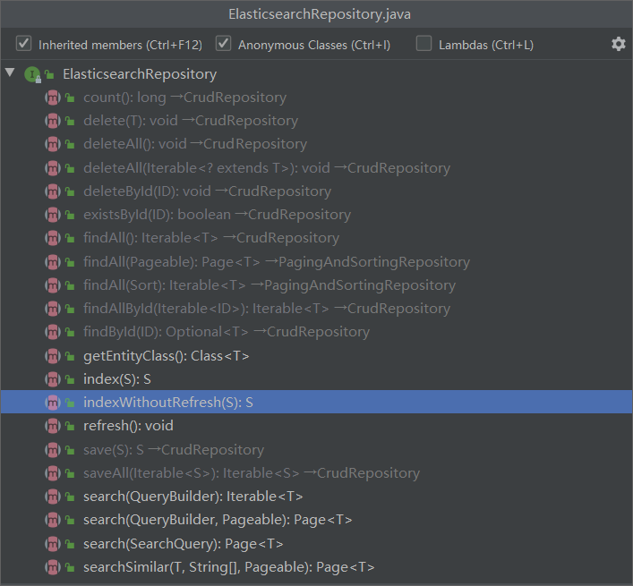
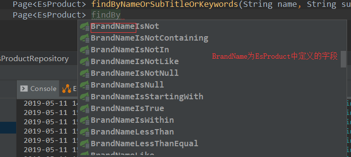

# SpringBoot 整合 ElasticSearch

## ElasticSearch 和 Kinaba 安装

docker安装： study_notes\docker\docker_04es安装和kibana 集成.md

### elasticSearch 安装

略

### Kinaba 安装

略

# Spring Data Elasticsearch

> Spring Data Elasticsearch是Spring提供的一种以Spring Data风格来操作数据存储的方式，它可以避免编写大量的样板代码。

<!--starter-->

## 常用注解

### `@Document`

```java
//标示映射到Elasticsearch文档上的领域对象
public @interface Document {
  //索引库名字，mysql中数据库的概念
    String indexName();
  //文档类型，mysql中表的概念
    String type() default "";
  //默认分片数
    short shards() default 5;
  //默认副本数量
    short replicas() default 1;
}
```

### `@Id`

```java
//表示是文档的id，文档可以认为是mysql中表行的概念
public @interface Id {
}
```

### `@Field`

```java
public @interface Field {
  //文档中字段的类型
    FieldType type() default FieldType.Auto;
  //是否建立倒排索引
    boolean index() default true;
  //是否进行存储
    boolean store() default false;
  //分词器名字
    String analyzer() default "";
}

//为文档自动指定元数据类型
public enum FieldType {
    Text,//会进行分词并建了索引的字符类型
    Integer,
    Long,
    Date,
    Float,
    Double,
    Boolean,
    Object,
    Auto,//自动判断字段类型
    Nested,//嵌套对象类型
    Ip,
    Attachment,
    Keyword//不会进行分词建立索引的类型
}

```

## Sping Data方式的数据操作

### 继承ElasticsearchRepository接口可以获得常用的数据操作方法



### 可以使用衍生查询

> 在接口中直接指定查询方法名称便可查询，无需进行实现，如商品表中有商品名称、标题和关键字，直接定义以下查询，就可以对这三个字段进行全文搜索。

```java
    /**
     * 搜索查询
     *
     * @param name              商品名称
     * @param subTitle          商品标题
     * @param keywords          商品关键字
     * @param page              分页信息
     * @return
     */
    Page<EsProduct> findByNameOrSubTitleOrKeywords(String name, String subTitle, String keywords, Pageable page);
```

- 在idea中直接会提示对应字段



### 使用@Query注解可以用Elasticsearch的DSL语句进行查询

```java
@Query("{"bool" : {"must" : {"field" : {"name" : "?0"}}}}")
Page<EsProduct> findByName(String name,Pageable pageable);
```

## 项目使用表说明

- `pms_product`：商品信息表
- `pms_product_attribute`：商品属性参数表
- `pms_product_attribute_value`：存储产品参数值的表

## 整合Elasticsearch实现商品搜索

- 在pom中引入相关依赖

```xml
<!--Elasticsearch相关依赖-->
<dependency>
    <groupId>org.springframework.boot</groupId>
    <artifactId>spring-boot-starter-data-elasticsearch<artifactId>
</dependency>
```

- 修改SpringBoot配置文件

> 修改application.yml文件，在spring节点下添加Elasticsearch相关配置。

```yaml
data:
  elasticsearch:
    repositories:
      enabled: true
    cluster-nodes: 127.0.0.1:9300 # es的连接地址及端口号
    cluster-name: elasticsearch # es集群的名称
```

