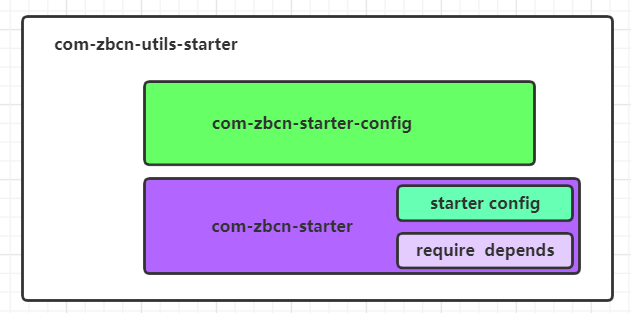

# SpringBoot Starter 的约定

- groupId不要用官方的org.springframework.boot 而要用你自己独特的
- 对于artifactId的命名，Spring Boot官方建议非官方的Starter命名格式遵循 xxxx-spring-boot-starter，例如 mybatis-spring-boot-starter 。官方starter会遵循spring-boot-starter-xxxx

# SpringBoot Starter 加载原理

## Spring Boot对Spring Boot Starter的Jar包是如何加载的？

SpringBoot 在启动时会去依赖的 starter 包中寻找 /META-INF/spring.factories 文件，然后根据文件中配置的 Jar 包去扫描项目所依赖的 Jar 包，这类似于 Java 的 SPI 机制。

细节上可以使用@Conditional 系列注解实现更加精确的配置加载Bean的条件。

> JavaSPI 实际上是“基于接口的编程＋策略模式＋配置文件”组合实现的动态加载机制。

# SpringBoot 自定义Starter

省略了samples和test模块模版。




## com-zbcn-utils-starter

`com-zbcn-starter`  作用是依赖管理。所以创建一个maven 父项目。用来管理 `com-zbcn-autoConfig` 和 `com-redis-util-starter`.

## com-zbcn-starter-config

该模块主要用来定义配置参数、以及自动配置对外暴露的功能（一般是抽象的接口Spring Bean）。

###  com-zbcn-starter-config 基本项目搭建

- pom 中 引入依赖包

```xml
<!--元数据生成依赖-->
<dependency>
    <groupId>org.springframework.boot</groupId>
    <artifactId>spring-boot-configuration-processor</artifactId>
    <optional>true</optional>
</dependency>
<!--starter 配置依赖-->
<dependency>
    <groupId>org.springframework.boot</groupId>
    <artifactId>spring-boot-autoconfigure</artifactId>
    <optional>true</optional>
</dependency>
</dependencies>
```

- pom中删除 builder 中的 springboot 相关特性
- pom中增加 对父项目的依赖

```xml
<dependencyManagement>
    <dependencies>
        <dependency>
            <groupId>com.zbcn</groupId>
            <artifactId>com-zbcn-utils-starter</artifactId>
            <version>1.0-SNAPSHOT</version>
            <type>pom</type>
            <scope>import</scope>
        </dependency>
    </dependencies>
</dependencyManagement>
```


### 配置参数


### 配置自动暴露功能接口


### 主动生效和被动生效

 

## com-zbcn-starter

一个空jar。唯一目的是提供必要的依赖项来使用starter。可以认为它就是集成该starter功能的唯一入口。

不要对添加启动器的项目做出假设。如果自动配置的依赖库通常需要其他启动器，请同时提及它们。如果可选依赖项的数量很高，则提供一组适当的默认依赖项可能很难，因为我们应该避免包含对典型库的使用不必要的依赖项。换句话说，我们不应该包含可选的依赖项。

无论哪种方式，我们的starter必须直接或间接引用核心Spring Boot启动器（spring-boot-starter）（如果我们的启动器依赖于另一个启动器，则无需添加它）。如果只使用自定义启动器创建项目，则Spring Boot的核心功能将通过核心启动器的存在来实现。

1.  创建 springBoot 项目 `com-zbcn-starter`
2. 添加pom.xml 依赖

```xml

<dependency>
    <groupId>org.springframework.boot</groupId>
    <artifactId>spring-boot-starter</artifactId>
</dependency>

<!--增加springboot 的自动配置包-->
<dependency>
    <groupId>org.springframework.boot</groupId>
    <artifactId>spring-boot-autoconfigure</artifactId>
</dependency>
```

到此为止，我们的整个短信Starter就开发完成了。

# 总结

自定义starter对于我们项目组件化、模块化是有很大帮助的。同时也是Spring Boot一大特色。

