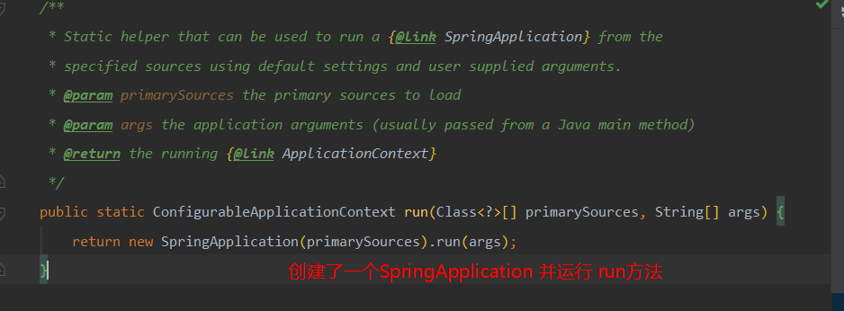
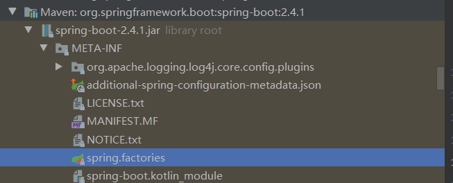
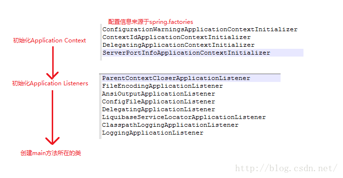
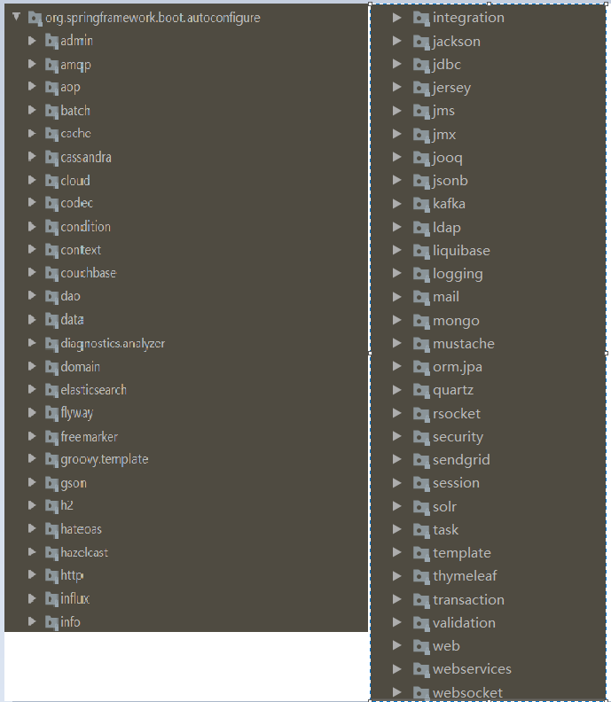
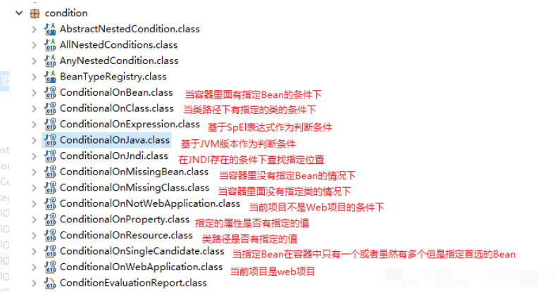

# SpringBoot AutoConfig 自动配置

##　SpringBoot 的启动流程

### `SpringApplication.run(App.class, args);` 启动流程



### 进一步查看 SpringApplication 的创建方法:

```java
//SpringApplication 
public SpringApplication(ResourceLoader resourceLoader, Class<?>... primarySources) {
    this.resourceLoader = resourceLoader;
    Assert.notNull(primarySources, "PrimarySources must not be null");
    this.primarySources = new LinkedHashSet<>(Arrays.asList(primarySources));
    // 通过classpath 判断是否是web 应用
    this.webApplicationType = WebApplicationType.deduceFromClasspath();
    this.bootstrappers = new ArrayList<>(getSpringFactoriesInstances(Bootstrapper.class));
    //ApplicationContextInitializer 是一个回调接口，用来初始化 ApplicationContext
    setInitializers((Collection) getSpringFactoriesInstances(ApplicationContextInitializer.class));
    // 注册listener 到 ApplicationContext
    setListeners((Collection) getSpringFactoriesInstances(ApplicationListener.class));
    // 通过当前调用栈，找到 main 方法所在类，赋值
    this.mainApplicationClass = deduceMainApplicationClass();
}
```

<!--starter-->


**在创建SpringApplication的时候初始化了一些ApplicationContext和ApplicationListener**

#### 通过getSpringFactoriesInstances方法来实现

```java
private <T> Collection<T> getSpringFactoriesInstances(Class<T> type) {
		return getSpringFactoriesInstances(type, new Class<?>[] {});
	}

private <T> Collection<T> getSpringFactoriesInstances(Class<T> type, Class<?>[] parameterTypes, Object... args) {
    ClassLoader classLoader = getClassLoader();
    // Use names and ensure unique to protect against duplicates
    // SpringFactoriesLoader.loadFactoryNames(type, classLoader) 扫描具有 META-INF/Spring.factories文件的jar包，获取所有的 Spring Factories 名字
    Set<String> names = new LinkedHashSet<>(SpringFactoriesLoader.loadFactoryNames(type, classLoader));
    // 通过上面获取到的names来创建对象
    List<T> instances = createSpringFactoriesInstances(type, parameterTypes, classLoader, args, names);
    //排序
    AnnotationAwareOrderComparator.sort(instances);
    return instances;
}
```

#### SpringFactoriesLoader.loadFactoryNames 方法解析

```java
public static List<String> loadFactoryNames(Class<?> factoryType, @Nullable ClassLoader classLoader) {
    ClassLoader classLoaderToUse = classLoader;
    if (classLoaderToUse == null) {
        classLoaderToUse = SpringFactoriesLoader.class.getClassLoader();
    }
    String factoryTypeName = factoryType.getName();
    return loadSpringFactories(classLoaderToUse).getOrDefault(factoryTypeName, Collections.emptyList());
}

//加载的核心方法
private static Map<String, List<String>> loadSpringFactories(ClassLoader classLoader) {
    Map<String, List<String>> result = cache.get(classLoader);
    if (result != null) {
        return result;
    }

    result = new HashMap<>();
    try {
        Enumeration<URL> urls = classLoader.getResources(FACTORIES_RESOURCE_LOCATION);
        while (urls.hasMoreElements()) {
            URL url = urls.nextElement();//加载 spring.factories 文件
            UrlResource resource = new UrlResource(url);
            Properties properties = PropertiesLoaderUtils.loadProperties(resource);// 依据全限定性名称获取里面的内容
            for (Map.Entry<?, ?> entry : properties.entrySet()) {//处理内容
                String factoryTypeName = ((String) entry.getKey()).trim();
                String[] factoryImplementationNames =
                    StringUtils.commaDelimitedListToStringArray((String) entry.getValue());
                for (String factoryImplementationName : factoryImplementationNames) {
                    result.computeIfAbsent(factoryTypeName, key -> new ArrayList<>())
                        .add(factoryImplementationName.trim());
                }
            }
        }

        // Replace all lists with unmodifiable lists containing unique elements
        result.replaceAll((factoryType, implementations) -> implementations.stream().distinct()
                          .collect(Collectors.collectingAndThen(Collectors.toList(), Collections::unmodifiableList)));
        cache.put(classLoader, result);
    }
    catch (IOException ex) {
        throw new IllegalArgumentException("Unable to load factories from location [" +
                                           FACTORIES_RESOURCE_LOCATION + "]", ex);
    }
    return result;
}
```


## spring.factories 文件

springBoot 相关的 jar包中都




spring-boot 的 spring.factories 里面的部分内容

```properties
# Application Context Initializers
org.springframework.context.ApplicationContextInitializer=\
org.springframework.boot.context.ConfigurationWarningsApplicationContextInitializer,\
org.springframework.boot.context.ContextIdApplicationContextInitializer,\
org.springframework.boot.context.config.DelegatingApplicationContextInitializer,\
org.springframework.boot.rsocket.context.RSocketPortInfoApplicationContextInitializer,\
org.springframework.boot.web.context.ServerPortInfoApplicationContextInitializer

# Application Listeners
org.springframework.context.ApplicationListener=\
org.springframework.boot.ClearCachesApplicationListener,\
org.springframework.boot.builder.ParentContextCloserApplicationListener,\
org.springframework.boot.context.FileEncodingApplicationListener,\
org.springframework.boot.context.config.AnsiOutputApplicationListener,\
org.springframework.boot.context.config.DelegatingApplicationListener,\
org.springframework.boot.context.logging.LoggingApplicationListener,\
org.springframework.boot.env.EnvironmentPostProcessorApplicationListener,\
org.springframework.boot.liquibase.LiquibaseServiceLocatorApplicationListener

```

当SpringApplication创建,初始化了上述的 **Application Context**和**Application Listeners**



通过**spring.factories**文件拿到一系列的Context和Listener之后 执行**run**方法

**run**方法会从**spring.factories**文件中获取到**run listener**,然后在spirng boot 执行到**各个阶段**时执行Listener事件和**Context**事件

**所以，所谓的SpringApplicationRunListeners实际上就是在SpringApplication对象的run方法执行的不同阶段，去执行一些操作，并且这些操作是可配置的。**

Spring boot总共有这些事件类型


## ApplicationContext 的run核心方法

```java
public ConfigurableApplicationContext run(String... args) {
    StopWatch stopWatch = new StopWatch();
    //记录运行开始时间
    stopWatch.start();
    DefaultBootstrapContext bootstrapContext = createBootstrapContext();
    ConfigurableApplicationContext context = null;
    //设置系统属性：java.awt.headers
    configureHeadlessProperty();
    //读取 spring.factories 文件 加载listener
    SpringApplicationRunListeners listeners = getRunListeners(args);
    //ApplicationStartedEvent 执行相关的SpringApplicationListener事件
    listeners.starting(bootstrapContext, this.mainApplicationClass);
    try {
        // main 方法传进来的 args 当作Properties 来解析
        ApplicationArguments applicationArguments = new DefaultApplicationArguments(args);
        //获取环境变量： 命令行参数中的环境变量，application 配置文件中的 active 和include 配置的信息
        //以及ConfigFileApplicationListener读取spring.factories里面的EvironmentPostProcessor
        ConfigurableEnvironment environment = prepareEnvironment(listeners, bootstrapContext, applicationArguments);
        configureIgnoreBeanInfo(environment);
        Banner printedBanner = printBanner(environment);
        // 创建 applicationContext
        context = createApplicationContext();
        context.setApplicationStartup(this.applicationStartup);
        prepareContext(bootstrapContext, context, environment, listeners, applicationArguments, printedBanner);
        //刷新context：会执行 ApplicationEnvironmentPreparedEvent ，ApplicationPreparedEvent，
        // ConextRefreshedEvent 和 EmbeddedServletContainerInitializedEvent 事件，等等，spring 的原生refresh 逻辑
        refreshContext(context);
        // 一些扫尾工作：如ApplicationReadyEvent 事件
        afterRefresh(context, applicationArguments);
        stopWatch.stop();
        if (this.logStartupInfo) {
            new StartupInfoLogger(this.mainApplicationClass).logStarted(getApplicationLog(), stopWatch);
        }
        listeners.started(context);
        callRunners(context, applicationArguments);
    }
    catch (Throwable ex) {
        handleRunFailure(context, ex, listeners);
        throw new IllegalStateException(ex);
    }

    try {
        listeners.running(context);
    }
    catch (Throwable ex) {
        handleRunFailure(context, ex, null);
        throw new IllegalStateException(ex);
    }
    return context;
}
```


## 自动配置

Spring Boot关于自动配置的源码在spring-boot-autoconfigure中.



上面的这些东西主要是靠condition包下面的注解来根据不同的条件自动创建Bean的



这些注解都是组合了@Conditional元注解,只是使用了不同的条件

我们可以查看下@ConditionalOnWebApplication这个注解

```java
@Order(Ordered.HIGHEST_PRECEDENCE + 20)
class OnWebApplicationCondition extends SpringBootCondition {
 
	private static final String WEB_CONTEXT_CLASS = "org.springframework.web.context."
			+ "support.GenericWebApplicationContext";
 
	@Override
	public ConditionOutcome getMatchOutcome(ConditionContext context,
			AnnotatedTypeMetadata metadata) {
		boolean webApplicationRequired = metadata
				.isAnnotated(ConditionalOnWebApplication.class.getName());
           //判断是否是web环境,并获取结果
		ConditionOutcome webApplication = isWebApplication(context, metadata);
           
		if (webApplicationRequired && !webApplication.isMatch()) {
			return ConditionOutcome.noMatch(webApplication.getMessage());
		}
 
		if (!webApplicationRequired && webApplication.isMatch()) {
			return ConditionOutcome.noMatch(webApplication.getMessage());
		}
 
		return ConditionOutcome.match(webApplication.getMessage());
	}
 
	private ConditionOutcome isWebApplication(ConditionContext context,
			AnnotatedTypeMetadata metadata) {
           //判断GenericWebApplicationContext是否在类路径中
		if (!ClassUtils.isPresent(WEB_CONTEXT_CLASS, context.getClassLoader())) {
			return ConditionOutcome.noMatch("web application classes not found");
		}
          //容器中是否有名为session的scope
		if (context.getBeanFactory() != null) {
			String[] scopes = context.getBeanFactory().getRegisteredScopeNames();
			if (ObjectUtils.containsElement(scopes, "session")) {
				return ConditionOutcome.match("found web application 'session' scope");
			}
		}
          //当前容器的enviroment是否为StandardServletEnviroment
		if (context.getEnvironment() instanceof StandardServletEnvironment) {
			return ConditionOutcome
					.match("found web application StandardServletEnvironment");
		}
          //当前容器的resourceLoader是否是WebApplicationContext
		if (context.getResourceLoader() instanceof WebApplicationContext) {
			return ConditionOutcome.match("found web application WebApplicationContext");
		}
 
		return ConditionOutcome.noMatch("not a web application");
	}
 
}
```

