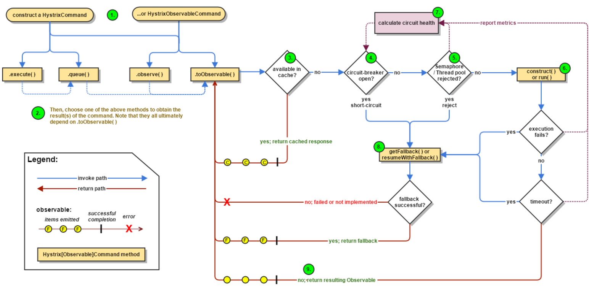

# 概述

在微服务架构中，存在着多个服务单元，若一个单元出现故障，因为多个单元之间的依赖关系，引发故障的蔓延。最终可能导致整个系统的瘫痪。 为了解决以上问题，产生了断路器等一系列的保护机制。

`springCloud Hystrx` 实现了断路器，线程隔离等一系列的服务保护机制。它也是基于Netfix 开源框架 Hystrix

 实现的。

目的是：**通过控制那些远程访问系统、服务和第三方库的节点，从而对延迟和故障提供更强大的容错能力。**

Hystrix 具备的功能：

- 服务降级
- 服务熔断
- 线程和信号隔离
- 请求缓存
- 请求合并
- 服务监控
- 等。。。。

# 快速入门

## 示例工程

- eureka-server 服务注册中心
- hello-service 服务单元（可以为多个）
- ribbon-consume ribbon 实现的服务消费者

## 引入 Hystrix 熔断器的方式

- 在Ribbon-consume 的pom 文件中引入 Hystrix 依赖

```xml
<dependency>
  <groupId>org.springframework.cloud</groupId>
  <artifactId>spring-cloud-starter-hystrix</artifactId>
  <version>xxx</version>
</dependency>
```

- 在Ribbon-consume 的启动类中添加 `@EnableCircuitBreaker` 注解，开启断路器功能

**注：** 也可以使用 `@SpringCloudApplication` 来修饰主类。因为该注解包含了`@EnableCircuitBreaker`的功能。

```java
@Target(ElementType.TYPE)
@Retention(RetentionPolicy.RUNTIME)
@Documented
@Inherited
@SpringBootApplication
@EnableDiscoveryClient
@EnableCircuitBreaker
public @interface SpringCloudApplication {
}
```

- 改造服务消费方式

```java
/**
 * Feign是一个声明式Web Service客户端
 *
 * @author Administrator
 * @date 2018/10/25 22:09
 */
@FeignClient(name= "spring-cloud-producer",fallback = HelloRemoteHystrix.class)
public interface HelloRemote {

    @RequestMapping(value = "/hello")
    public String hello(@RequestParam(value = "name") String name);
}


//方式2
/**
 * 使用RestTemplate 的方式
 */
@Service
public class HelloService {
    @Autowired
    private RestTemplate restTemplate;

    @HystrixCommand(fallbackMethod = "helloFallback")
    public String helloService(){
        return restTemplate.getForEntity("http://HELLO_SERVICE/hello",String.class).getBody();
    }

    public String helloFallback(){
        return "error request";
    }
} 
```

至此，客户端的Hystrix 熔断器功能已经集成。

## 注意

1. Hystrix 的默认超时时间为 200 ms。
2. 我们可以自定义 超时时间


# 原理分析

## 工作流程



### 创建 HystrixCommand 和HystrixObservableCommand 对象

通过命名我们可以判断其采用了 __命令模式__。主要作用是实现了**行为请求者**和**行为实现者**解耦。

### 命令的执行

一共4种命令的执行方式。启动 HystrixCommand 2种，HystrixObservableCommand 2种。

#### HystrixCommand 2种

- execute():同步执行:从依赖的服务返回一个单一的结果对象，或者在出现异常时抛出异常。
- queue()：异步执行。返回一个Feature 对象。其中包含了服务执行结束时，要返回的单一结果对象。

#### HystrixObservableCommand 实现了两种

- observe(): 返回observable 对象。它代表了操作的多个结果。是一个hotObservable
- toObservable() : 同样会返回一个 Observable 对象。它代表了操作的多个结果。 但它代表的是一个coldObservable。

Hystrix 底层大量的使用了RxJava 的观察订阅者模式。


##### RxJava

具体示例代码：JavaBase ->JavaDesignPattern ->  ` com.zbcn.test.observer`包下。

```java
import com.zbcn.test.observer.Observable;
import com.zbcn.test.observer.Subscriber;

/**
 * 观察者模式测试：RxJava
 */
public class ObserverTest {
    /**
     * 事件源：用来向 订阅者发布事件。
     */
    static Observable<String> observable = Observable.create(new Observable.OnSubscribe<String>() {
        @Override
        public void call(Subscriber<String> subscriber){
            subscriber.onNext("hello RxJava");
            subscriber.onNext("我来测试 观察者模式");
            subscriber.onCompleted();

        }
    });

    /**
     * 创建订阅者：订阅者接受到事件源发布的事件进行处理
     */
    static Subscriber<String> subscriber = new Subscriber<String>() {
        @Override
        public void onCompleted() {

        }

        @Override
        public void onError(Throwable e) {

        }
        @Override
        public void onNext(String s) {
            System.out.println("正规的示例展示：" + s);
        }
    };
    /**
     * HOT observable：
     * @param args
     */
    public static void main(String[] args) {
        observable.setSubscriber(subscriber);
    }
}
```


##### Hot Observable 和 Clod Observable

- Hot Observable 不论“事件源” 是否有“订阅者”，在创建后，都会对事件进行发布。所以 Hot Observable 的每一个订阅者都有可能是从数据源的中途开始的，并可能只看到了整个操作的局部过程。(RxJava)
- Clod Observable 在没有“订阅者”的时候是不会发布事件的，而是进行等待。直到有订阅者才发布事件。所以对于Clod Observable的订阅者，可以保证从一开始看到真个操作的全过程。

### 结果是否缓存

若当前命令请求的缓存功能是被开启的，并且该命令缓存命中，那么缓存的结果会立即以Observable 对象的形式返回。

### 断路器是否打开

### 线程池/请求队列/信号量是否占满

- Hystrix 判断的线程池并非容器的线程池，而是每个依赖服务的专有线程池。Hystrix 为了保证不会因为某个依赖服务的问题而影响到依赖的其他服务，而采用了舱壁模式（Bulkhead Pattern） 来隔离每个依赖的服务。

### HystrixObservableCommand.construct() 或者 HystrixCommand.run()

Hystrix 会依据我们编写的代码来判断采用什么样的方式去请求依赖服务。

- HystrixCommand.run() 返回单一的结果，或者抛出异常
- HystrixObservableCommand.construct() 返回一个Observable 对象来发送多个结果，或者通过onError 来发送错误通知

#### 如果 run() 或者 construct()的执行时间超过了命令设置的超时阈值

当前线程会抛出一个TimeOutException。然后Hystrix 会转向 fallBack执行。

### 计算断路器的健康度

Hystrix 会将 成功，失败，拒绝，超时 等信息报告给断路器，而断路器会维护一组计数器来统计这些数据。

断路器会使用这些统计数据来决定是否要将断路器打开，对于某个依赖服务的请求进行“熔断/断路”，直到恢复期结束。若恢复期结束后，统计数据还是未达到健康指标，就在再次 “熔断/断路”。

### fallBack 处理

“服务降级”。

在服务降级逻辑中，我们通常要实现一个通用的响应结果，并且该结果的处理逻辑应当是从缓存或者一些静态逻辑来获取，而不是依赖网络请求。

#### 服务降级失败的时候处理策略

- execute() 抛出异常
- queue() 返回正常的Feature对象。但是当调用get时，获取结果时会抛出异常
- observe() 正常返回Observable对象，当订阅它的时候，将立即通过调用订阅者的OnError 方法来通知终止请求
- toObservable（）正常返回Observable对象，当订阅它的时候，将通过订阅者的OnError 方法来终止请求。

### 返回成功响应


# 断路器原理


