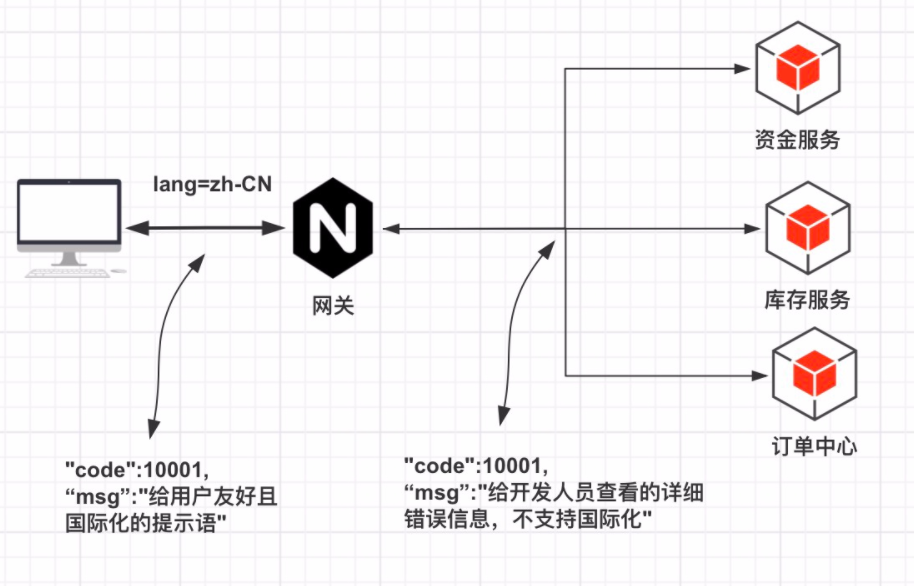
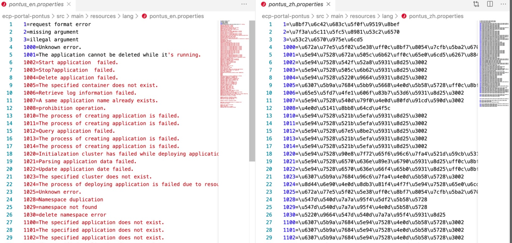
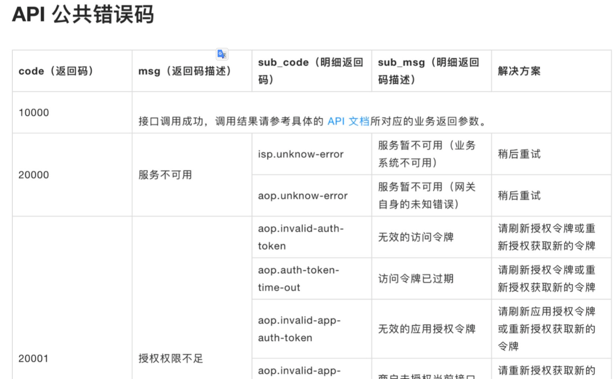
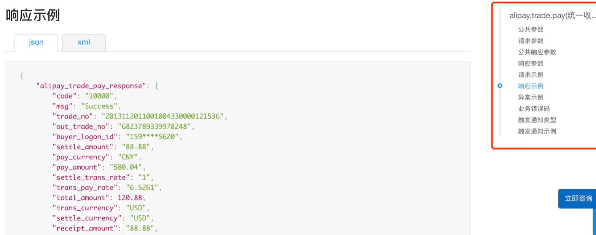
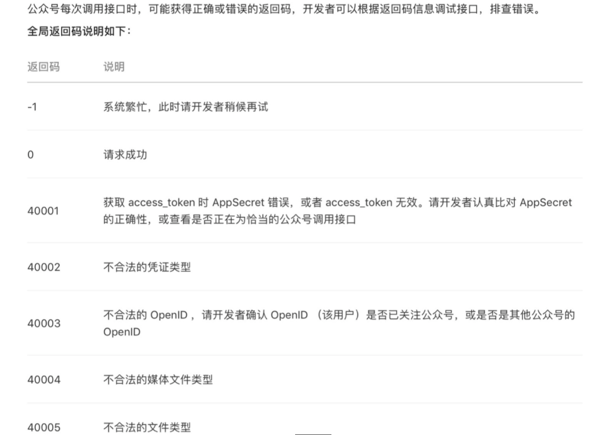
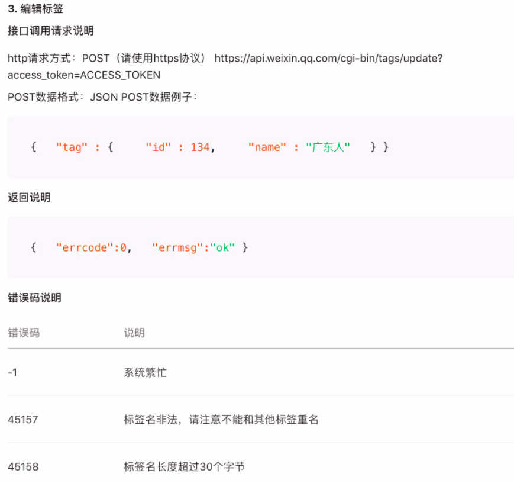

# HTTP 的业务错误码

Http 定义了 5大类别的错误码，这些错误码是通用的，其中只有 `5XX` 是表示后台服务的错误。各个系统的后端服务的用途/业务相差甚远，为数不多 `5XX` 远远不够用来表示可能出现的各种情况。于是，后端系统需要根据自己的业务制定**业务级别的错误码**，而 Http 的错误码，我们称其为**协议级别的错误码**。

# 业务码格式

业务码不属于 `Http` 协议的成员，是实践中的产物。它是定义在返回的消息实体中的，并没有固定的格式，但无非就是下面3种模块。

```shell
【错误级别（可选）】-【功能模块（必要）】-【具体错误编号（必要）】
```

错误码一般由 5～6 位整数组成，例子如下：

| 模块 | 模块编码 | 错误编码 | 描述       |
| :--- | :------- | :------- | :--------- |
| 库存 | 100      | 01       | 库存不足   |
| 库存 | 100      | 02       | 盘盈       |
| 库存 | 100      | 02       | 盘亏       |
| 资金 | 200      | 01       | 参数不正确 |

# 出参格式

出参的格式主要有2种

1. 不管成功失败都是固定的字段。
2. 成功了只返回业务实体对象，失败了只返回错误信息。

## 固定出参

### 成功

```http
{
	"code":0,	# 0 表示成功
	"msg":"success"	# success
	"data":{
		“name”:"鞋子"，
		"inventory":1000
	}
}
```

### 失败

```http
{
	"code":10001,	# 错误码
	"msg":"库存不足"	# 错误描述信息
	"data":{}		# 业务实体
}
```

## 不固定出参

### 成功

```http
{
	“name”:"鞋子"，
	"inventory":1000
}
```

### 失败

```http
{
	"code":10001,	# 错误码
	"msg":"库存不足"	# 错误描述信息
}
```

我本人是比较推崇第二种格式，因为大部分情况下都是成功，每次又要带上 `code`，`msg` 没有实质性的作用，还占用带宽。另一个是接口文档的书写方面，每个接口把 `code`，`msg` 带上会觉得很麻烦，不带上又怕不熟悉的人看了出错。一个比较友好规范的接口文档，我认为应该是由成功和失败2个独立的部分组成，正常的业务出入参放成功展示，失败的有专门的错误码表查询。

# 国际化

国际化的功能离不开错误码的支持，客户端指定语言到服务端去请求，当出错了服务端会根据错误码和语言找到对应的国际化提示语。



从上面图中我们发现，错误码不仅仅是客户端与服务端的交互，后台各个服务间的交互也需要约定的一套错误码。

1. 一般一个系统的错误码 `code` 都是唯一确定的。
2. `msg` 不同场景下可能不一样，提供给用户的肯定是需要友好且不能暴露底层细节，给开发人员看的就要详细专业的错误内容。
3. 网关服务上面维护着多套不同语言的错误码提示语，响应的时候会根据客户端带的 Lang 信息进行国际化转译。

| 模块 | 模块编码 | 错误编码 | 底层描述           | 中文提示语 | 英文提示语        |
| :--- | :------- | :------- | :----------------- | :--------- | :---------------- |
| 库存 | 100      | 01       | 商品规格表关联有误 | 商品不存在 | goods don’t exist |

一般国际化的系统中会有多份 `xxx_lang.properties`文件，每一份代表一种语言的消息提示语。中文一般会转为 Unicode 编码进行存储（这个过程一般开发工具可以设置自动转），这样的处理可以规避不同开发环境下不同编码导致中文乱码。



# 行业案例

接口有的是写给小组内部开发人员交流使用的，有的是对外开放给第三方调用的，接口文档是程序之间交互的桥梁。支付宝 / 微信 的接口是开发人员使用度比较广的第三方接口，我们经常会去调用他们的支付，小程序相关的接口，下面着重看看他们的错误码是如何定义的。


## 支付宝

**在独立的页面维护了** [公共错误码](https://opendocs.alipay.com/open/common/105806)

- code 是 5 位整数。
- 明细的错误码 sub_code 是用字母表示的，他这边 code 相当于一个大类，大类下面又有明细的小类。
- 解决方案是给用户的提示语。



## **业务接口详细列举了成功和错误的参数** [业务接口](https://opendocs.alipay.com/apis#异常示例)

- 所有出入参都有详细说明，包括示例。
- 成功和失败都有固定返回 `code` `msg` 字段。




## 微信

### **独立的页面维护了全局** [错误码](https://developers.weixin.qq.com/doc/offiaccount/Getting_Started/Global_Return_Code.html)

- 错误码由5位整数构成



**每个接口一个独立的** [参数说明页面](https://developers.weixin.qq.com/doc/offiaccount/User_Management/User_Tag_Management.html)

- 正常情况下出参只返回业务实体
- 异常情况才有 `errCode` `errMsg`
- 每个接口下也可能有自己的业务错误码



# 小结

错误码是接口文档中很重要的一部分，它是 Http 协议码的补充，错误码并没有固定的格式要求，但是一般由 **业务模块+模块下的详细错误信息** 组成。此外，还需要根据场景定义错误场景下的消息提示符，可以根据客户端的语言返回相应语言的提示符。给用户的错误信息中也尽量避免过多展示底层实现细节，减小系统风险暴露。