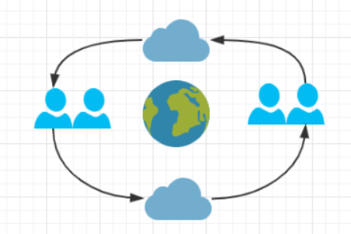

# HTTP 简介

# http 历史背景

- HTTP（hypertext transport protocol）： 超文本传输协议

## web 网络

- www(world wide web) 顾名思义就是全世界都在一个网络
- Web 网络方便了我们的信息传递，背后依托的就是 Http 这项协议。

## http 协议

hypertext transport protocol： 超文本传输协议。它制定了浏览器客户端和 Web 服务端信息传递的规则，所有的浏览器厂商和所有的 Web 后台服务都是遵从这个规则来实现信息的传递的。Web 服务的信息传递从最早期单一的文字，到后来有了图片，音频视频。

HTTP 协议随着传递信息的变化也经历了以下几个版本的变化：

- **HTTP/0.9**：于 1990 年问世，用于简单文字的交换；
- **HTTP/1.0**：被正式列为 www 传输的标准，纳入 RFC1945；
- **HTTP/1.1**：在 1.0 的基础上新增了连接方式的规约；
- **HTTP/2.0**：随着网络的应用越来越广，内容也越来越丰富。HTTP2.0 在安全，性能，交互场景都有了很大的改进。

目前市场上主流的还是 HTTP/1.1 ，随便打开一个浏览器 F12 查看下网络，基本上都可以看到 `版本:HTTP/1.1`。但是 HTTP/2.0 作为下一代的网络协议，前景可期。因为我们现在的网络都在追求加速，在硬件不断叠加，程序不断优化，CDN资源加速，之后如果继续优化的话那就只有 HTTP 协议本身了。2.0 因为有了多路复用，协议压缩等功能，所以性能上面是要比 1.1 高出不少的，普及只是时间问题。

## 实现 TCP/IP 协议

Http 和 TCP/IP 都是协议，它们的不同之处在于：**HTTP 是浏览器和后台服务之间的语言，而 TCP/IP是电脑之间的语言（相同的语言才能互相理解双方要表达的意思）**。Http 本身只是约定了传输的时候文字要是什么格式，具体文字如何转成物理的高低电平穿越电脑实现传输的过程它是不知道的。

所以它需要借助专业的人士 TCP/IP 来处理。TCP/IP 是专门解决主机之间信息传输的，它不局限于为 Http 服务，像发送邮件也有自己的邮件协议（SMTP），它的底层也需要借助 TCP/IP 来实现。（**TCP/IP是整套完整的网络传输框架模型，HTTP 也是属于它里面的应用层**）。

## 为什么要学习http协议

Http 协议是前后端 API 接口交互的桥梁，不管你是前端开发，移动端开发，后端开发，它都是你工作必不可少的部分。

- 为什么我资源更新了，界面还是旧的，可能是 Http 缓存了；
- 请求的参数该放路径还是 Body 中；
- 接口报错了，返回的状态码看不懂；
- 接口文档如何编写才是规范的；
- 让 Http 协议规范自己的软件开发；
- 虽然 Http 工具封装得很好用，但我必须搞懂它，要做工具的主人而不是奴隶，必要的时候自己造工具。

## 小结

Http 并不单单应用在 Web 网站中，桌面软件/移动应用这些客户端要想与服务器交互数据，也同样可以借助 Http 协议。它是一种轻量级，跨语言，使用范围很广的传输协议。