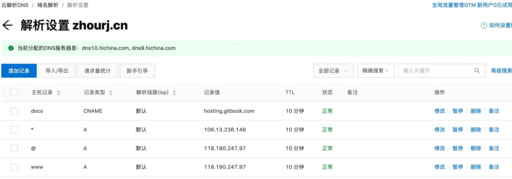

# 域名系统 DNS

我们知道网络中每台机器都有自己的 IP 地址，才能与外面的网络相互通信，传统的 IP 是由 4 个 8 位的字节组成的数字，这样的标识是不利于记忆的，所以延伸出域名的概念，每个域名可以映射成一个 IP。像 `www.taobao.com`；`www.baidu.com`；这种域名我们一看就知道是淘宝和百度。于是有了 DNS（Domain Name System）域名系统，**它的职责就是将人们便于记忆的域名转成计算机所需要的 IP 地址**。

# DNS 结构

DNS 是一个记录满了 IP 和域名映射的账本，这个账本非常的大，涉及到了全世界的域名信息，所以它的底层结构是分层和分布式的一个数据库。

## 语法结构

### 常见的顶级域名有：

- .com 代表工商企业域名；
- .cn 代表中国的域名；
- .net 网络提供商域名；
- .org 非盈利组织域名；
- .gov 政府域名；
- .edu 教育类的域名。

## 域名服务器分布

域名是分层的，每种域名服务器也都是分布式部署的，而不是只有单台。因为只要一种域名服务器提供不了服务，全世界对应种类的域名都会受到影响。

### 根域名服务器

最高层和最重要的的域名服务器，任何一个域名服务器只要自己解析不了，就会交给根服务器。全世界共用 13 台域名服务器，其中 10 台在美国，剩下的 3 台分别在日本，英国，瑞典。

### 顶级域名服务器

管理所有注册在它上面的二级域名服务器。

## 域名服务器类型

1. 权威域名服务器：能够决定域名和 IP 的关系。
2. 本地域名服务器：一般由本地运营商提供，不能解析域名，通常是缓存域名解析和帮用户到权威域名服务器查询解析结果。
3. 公共域名服务器：跟本地域名服务器类似，只是它不是某个运营商提供的，是全网公用的。

## 解析过程

1. 机器访问本地 LDNS 查询；
2. LDNS 检查本地缓存，没有的话就向 13 台根服务器的其中一台发起查询请求；
3. 根域名服务器根据解析的域名结构找到对应的顶级域名服务器信息给 LDNS；
4. LDNS 向顶级域名服务器发起查询；
5. 顶级域名服务器根据域名结构查找到对应的二级域名服务器；
6. 根据这样的迭代最终查找到域名和 IP 的对应关系。

## DNS 解析对应的常见记录类型

### A 记录

将域名直接解析成某个具体的服务器 IP。

### CNAME 记录

给域名起了一个 cname 的别名，访问这个别名与访问原域名效果是一样的。

### NS 记录

域名解析服务器记录，通常用来指定不同子域名对应不同的解析服务器。

### MX 记录

建立电子邮箱服务，将指向邮件服务器地址，需要设置MX记录。建立邮箱时，一般会根据邮箱服务商提供的 MX 记录填写此记录。

下图是笔者在阿里云上面购买的一个域名 `zhourj.cn`，这个域名目前设置了如下列表的解析规则

- **CNAME 记录** ：对应了记录值 `hosting.gitbook.com`，意思是访问了我的域名 `docs.zhourj.com` 会转发到 `hosting.gitbook.com`这个域名上。
- **A 记录**：还有几个 A 记录的规则，* 就代表所有的 `*.zhourj.cn` 的域名都解析到对应 IP 。假如主机记录是 www 就代表着 `wwww.zhourj.cn` 解析到对应的某个记录值上面的 IP ，**所以一个域名是可以解析到许多不同 IP 上面的。**

# 小结

DNS 简单着说就是域名解析成 IP 的过程，但是这个小小的域名也隐藏着很多的知识点。它有组织之分：`.com .cn .gov` 。服务于全球的域名解析系统它是一种分布式的架构，一般都由最近的域名解析服务器完成解析，解析不成功才往上级去请求。域名有记录类型的概念，其实就是它的解析规则，一个简单的域名，我们可以根据自己的业务拆解成不同的子域名，并解析到不同服务器去。