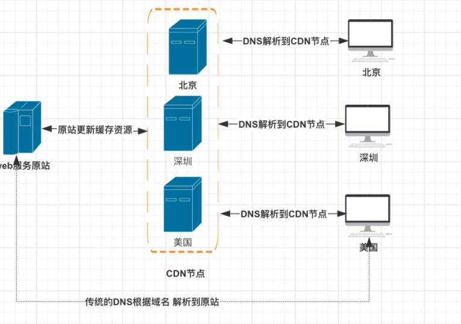

# CDN 加速原理

CDN 全称 Content Delivery Network 即内容分发网络，它就类似京东的物流配送体系，通过智能分配算法，让用户最近最快速的获取到他们想要访问的资源。

# 基础原理

八秒定律是在互联网领域存在的一个定律，即指用户访问一个网站时，如果等待网页打开的时间超过八秒，会有超过 70% 的用户放弃等待。而网络环境越来越复杂，传输数据越来越丰富，对网站的访问响应时间带来了一个比较大的挑战，CDN 就是诞生在这样一个环境中，通过负载均衡算法，为请求提供最靠近的响应资源，达到网站的内容加速。

# 系统架构



CDN 节点主要是分布在各省各城市的运营商机房里面，详细的实现过程如下：

1. 用户请求一个域名地址；
2. 浏览器对域名进行解析；
3. 由于域名被 CDN 接管了，对域名的解析后只能获取到 CNAME，CDN 就是借助 CNAME 将访问的地址代理到对应的 CDN 服务器，而不是域名对应的原站；
4. 浏览器通过 CNAME 获取到最近的 CDN 服务器的 Ip 地址，然后直接访问 CDN 缓存服务器；
5. CDN 缓存服务器根据策略判断请求的资源缓存里面有没有，需不需要回原站更新，并将资源返回给用户。

# dig 命令

`dig` 是一个查询 DNS 解析详情的命令工具（在 window 的 cmd 终端或者Linux Shell 命令中执行），网宿科技是国内最大的 CDN 厂商，下面我们 `dig` 下网宿的官网看下解析详情。

```shell
adeMacBook-Pro:~ zhourj$ dig www.wangsu.com

; <<>> DiG 9.10.6 <<>> www.wangsu.com
;; global options: +cmd
;; Got answer:
;; ->>HEADER<<- opcode: QUERY, status: NOERROR, id: 27326
;; flags: qr rd ra; QUERY: 1, ANSWER: 2, AUTHORITY: 0, ADDITIONAL: 0

;; QUESTION SECTION:
;www.wangsu.com.			IN	A

;; ANSWER SECTION:
www.wangsu.com.		2988	IN	CNAME	www.wangsu.com.wscdns.com.
www.wangsu.com.wscdns.com. 30	IN	A	112.5.63.200

;; Query time: 20 msec
;; SERVER: 192.168.1.1#53(192.168.1.1)
;; WHEN: Wed Apr 01 10:15:00 CST 2020
;; MSG SIZE  rcvd: 84
```

- 通过 dig 命令我们查询到 `www.wangsu.com` 对应的 cname 是 `www.wangsu.com.wscdns.com`；
- cname 对应的 A 记录即 Ip 地址是 `112.5.63.200`；
- 所以最终是 `112.5.63.200` 这台缓存服务器给我们提供了服务，它不止起到缓存加速的作用，还保护了原站的真实 Ip。

# CDN 应用场景

## 网页加速

网页加速是最早期也是最普遍的 CDN 应用，主要 **缓存（加速）** 了静态 Html，Js，Css 或者图片等不变的资源。

## 流媒体加速

4G 的到来带火了短视频，流媒体这种资源对带宽要求也是很高的，所以将一部分的媒体资源提前放置在 CDN 服务器也是很有必要的。

## 文件下载加速

冠状病毒迫使企业和学生在家办公和学习，钉钉的下载量暴增，我们能够顺利的从各个 APP 商店下载到，也是归功于 CDN 的加速。提前把对应的安装包放到了各个地方的近端的 CND 服务器。

## 边缘计算

CDN 的发展不断在变更，从早期的静态内容，到后面的支持动态内容的加速，再到后面有了边缘计算的概念（CDN 和边缘计算是一种很好的结合，但是边缘计算的概念不限于此）。
早期可能是简单的把视频内容缓存到 CDN 服务器，如借助边缘计算可以实现在近端对视频的压缩和解压缩等操作，就可以进一步降低传输到网络带宽，达到加速的目的。

## 网格化计算

通过智能的优化网络传输路径，达到加速。优化的方式主要有：

1. 智能选择最优传输路线；
2. 借助 CDN 厂商的服务器资源，开辟私有的专线路线。

# 小结

CDN 是一种提升网站响应速度的技术，主要是用了缓存的原理，将原站中的资源提前放置到了各个城市靠近当地用户的某些节点服务器上面。实现上是借助了 DNS 的 Cname 技术，将原本要访问的某个原站域名，重定向到另一个靠近的 CDN 节点上面。