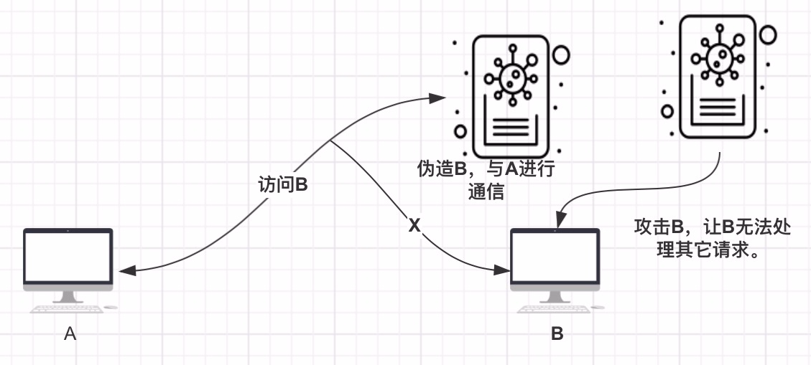
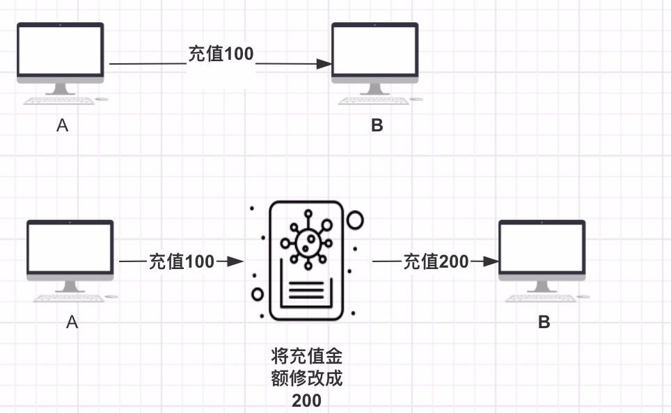
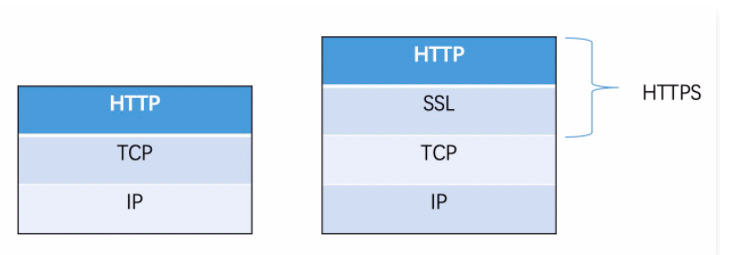

# HTTP 协议和 HTTPS 协议的对比

在前面的章节中我们对 Http 已经有了一个很全面的了解，Http 在满足通信的基本功能外，也提供了很多丰富的交互功能，但是在安全性方面，Http 还有很多不足的地方，Https 就是为了解决这个问题而诞生。目前 google / 苹果 / 腾讯的小程序接口都强制要求使用 Https 安全协议。以后的网站全面采用 Https 协议已经是一个可以遇见的趋势了。

## HTTP 不足

### 明文传输

Http 的整个报文信息，从客户端到服务端到都是明文传输到。信息从我们的电脑发出去，中间需要经历哪些设备才能被另一台电脑接收，我们是不好确定也很难评估的。有可能跨越多个运营商机房，有可能通过海底光缆横跨大洋，有可能穿过 某某学校 / 某某厂房 / 某某集团 的内部 路由器/ 交换机 / 集线器 等。中间这么多节点我们都是控制不到的，所以只要别人有心，我们就很难保证我们的信息不被泄漏。


### 没有验证通信方身份

通信双方无法确认对方的身份是否正确。

#### 案例1:

本地电脑有木马，路由表被踹改，[www.baidu.com](http://www.baidu.com/) 的域名被解析到另一台虚假的服务器，此时你在浏览器访问的百度就是黑客的另一个钓鱼网站，然后给你推送了很多虚假消息，此时客户端很难知情。

#### 案例2:

路由表没问题，但是目标服务器被人黑了，处理不了请求，此时有其它服务冒充提供服务。



#### 案例3:

某个资源只有特定用户有查询的权限，黑客通过伪造该客户端一样的请求来查询，服务端只是简单的根据入参判断，并无法知道对应客户端的真实性，于是消息很容易泄漏。

### 无法保证数据完整性



1. 客户端 A 像服务端 B 充值 100。
2. A 的网络报文被黑客窃取了，修改了中间的金额，后面继续把报文传向 B，此时就造成了严重的金额损失。

上面的例子如果没有做数据完整性校验就很容易被攻陷。当然很多系统即使用 Http 协议，也可以自己在业务层参数中定义签名信息，实现自己的签名算法保障数据的完整性。

```shell
signature = MD5(privateKey + MD5（ 参数1 + 参数2 + 参数2 +...）)
```

签名算法有很多种，系统的签名算法是机密性的信息，不能对外透漏。例如上面的算法中，将请求的所有参数依次相加然后做 MD5 运算，取得的值再与约定的一个私密 key 再进行一次 MD5，最后生成一个签名 signature。这个算法客户端和服务端都是知道的，所以服务端接收到请求后，就拿着获取到的参数做执行一遍通用的算法，然后将生成的签名与客户端传过来的签名做比较，相同的话就证明请求数据没有被人改动过。

但是这边有个问题，浏览器上面的 Js 代码能容易被查看到，即使加密也很容易破解，我们的算法和私钥都很容易泄漏。如果是安卓或者IOS程序，亦或是2个后台服务的通信，这种情况算法用户是看不到，但是软件开发是一个团队协作的工作，一般负责的开发人员都知道，可靠性就没办法太高。相比，Https 的签名算法是公开的，他生成的签名算法还会用公钥去加密。同样，如果 Http 也要整这么麻烦也是可以的，只是需要在自己的业务逻辑中去实现，而 Https 借助的是**安全套接字层**，对应用层完全透明，我们的应用不需要多做什么就可以实现可靠性传输了。

## HTTPS

Https 是一种通过计算机网络进行安全通信的传输协议，经由 Http 进行通信，利用 SSL/TLS 建立安全信道，加密数据包。Https 使用的主要目的是提供对网站服务器的身份认证，同时保护交换数据的隐私与完整性。Http 服务的默认端口是 80，Https 服务的默认端口是 443。

TIPS: `HTTP + SSL = HTTPS = HTTP + 身份认证 + 数据私密 + 数据完整性`

### SSL

Https 并不是新的一种协议，它是 Http 协议的基础上面封装了一层 SSL(Secure Socket Layer)，Https 底层跟 Http 一样是经由 TCP 通信的。



SSL 并不是 Http 特有的，所有应用层协议都可以使用 SSL 进行安全通信.

###  加密算法

#### 对称加密算法

加密和解密的秘钥使用的是同一个

**优点**
加密速度快，计算量小。
**缺点**
通信前双方需要协商好密钥，密钥在网络中传输不安全。

### 非对称加密算法

公开密钥与私有密钥是一对，如果用公开密钥对数据进行加密，只有用对应的私有密钥才能解密；如果用私有密钥对数据进行加密，那么只有用对应的公开密钥才能解密。

**优点**：私钥不对外公开，公钥可以提前告知对方，密钥不需要在协商中传输，安全性高。
**缺点**：加密算法复杂，效率低。

### Https 混合加密算法

Https 结合了上面两种加密算法的优点，前期通过非对称加密协商好对称加密所需的密钥（保障了密钥的安全性），后面通信的时候就拿着这个密钥采用对称加密进行通信（保障了计算效率）。

## 身份认证

SSL 不仅提供加密处理，而且还使用了一种用于身份认证的证书。证书是由第三方权威的认证机构颁发和维护。服务端和客户端通过证书可以证明自己的身份。证书跟域名一样是需要购买的，因为机构不仅仅要颁发证书给你，还要提供证书的认证查询服务。（有少部分免费的存在）

大部分的 Web 网站都只要认证服务端即可，当我们访问 `https:xxx` 开头的网站，浏览器会去 CA 机构校验对方的身份，不符合的就会弹出警告提示，开发环境中经常证书是自己生成的，所以浏览器经常会提示警告，我们如果执意通过继续访问也是可以的。

少部分的场景需要客户端和服务端双向认证，比如一些银行的网站，我们需要事先插入一个 **U盾** 之类的东西，往我们的浏览器客户端安装对应的证书。

### 证书申请流程

证书的获得可以通过购买，也可以自己生成，当然如果是购买的需要提供域名，营业执照等信息。自己生成同样需要这些信息，只是自己生成用的信息可以随意输入，浏览器检查到信息不符时就是多个安全提醒，你依旧可以选择直接访问。我们这边不太多去讲解 SSL 的证书细节，**避免因为细节的困惑而迷失全局**。

自签名证书可以借助 SSL 密码工具 **OpenSSL** 来生成。

#### 生成 RSA 私钥和自签名证书

```shell
openssl req -newkey rsa:2048 -nodes -keyout rsa_private.key -x509 -days 365 -out cert.crt
```

req 是证书请求的子命令，-newkey rsa:2048 -keyout private_key.pem 表示生成私钥(PKCS8格式)，-nodes 表示私钥不加密，若不带参数将提示输入密码；
-x509表示输出证书，-days365 为有效期，此后根据提示输入证书拥有者信息；

#### 使用 已有RSA 私钥生成自签名证书

```shell
openssl req -new -x509 -days 365 -key rsa_private.key -out cert.crt
```

-new 指生成证书请求，加上-x509 表示直接输出证书，-key 指定私钥文件，其余选项与上述命令相同

### 服务端认证


12306 的网站就是一个服务端认证的应用，大致的认证流程如下：

1. 浏览器向服务器发请求 https://www.12306.cn/index
2. 服务器将证书和申请证书流程中生成的一对秘钥中的公钥发给浏览器
3. 浏览器收到 证书 文件进行分析，然后验证签名。
4. 签名验证成功接下来浏览器校验证书申请者的身份。
5. 一旦服务器校验成功，接下来就是进行秘钥协商，用非对称方法协商出对称加密所需的私钥，然后用对称算法加密通信。

### 客户端认证

SSL 客户端认证不会仅依靠证书完成认证，一般会 和基于表单认证组合形成一种双因素认证(Two-factor authentication)来使用。所谓双因素认证就是指，认证过程中不仅需要 密码这一个因素，还需要申请认证者提供其他持有信息，从而作为另一 个因素，与其组合使用的认证方式。比如网银插入USB网盾后还需要输入密码。大概了解下就好，不深入了。

## 小结

Http 直接跟 TCP 传输层交互，而 Https 多了一层 SSL 协议，正式这个协议让 Https 有了数据加密、身份认证的证书和数据完整性保护这些功能。SSL 是独立于 HTTP 的协议，所以不光是 HTTP 协议，其他运行在应用层的 SMTP 和 Telnet 等协议均可配合 SSL 协议使用。可以说 SSL 是当今世界上应用最为广泛的网络安全术。